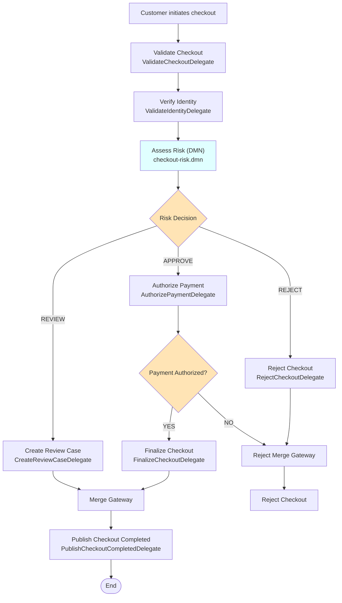
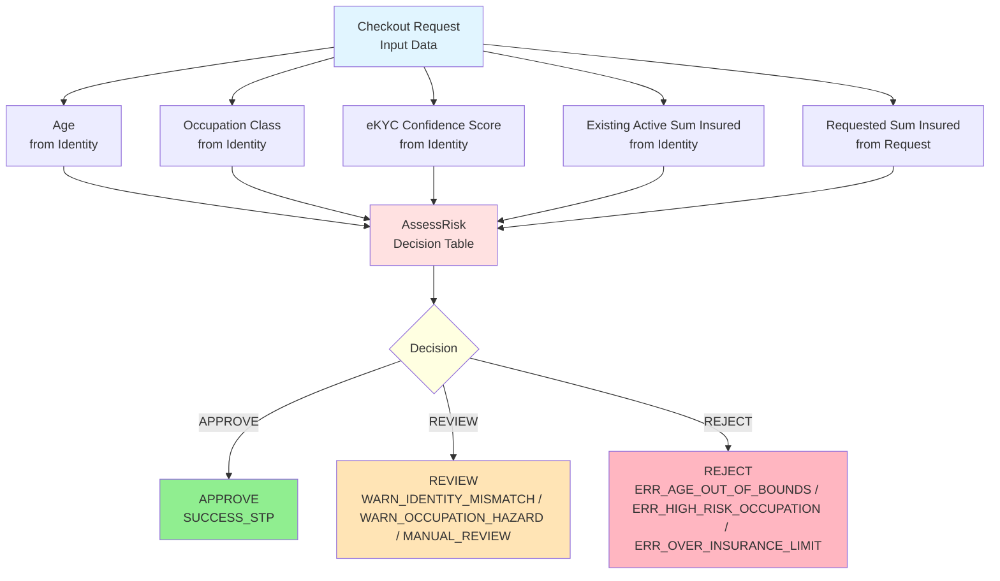
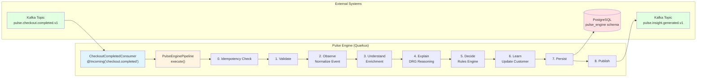
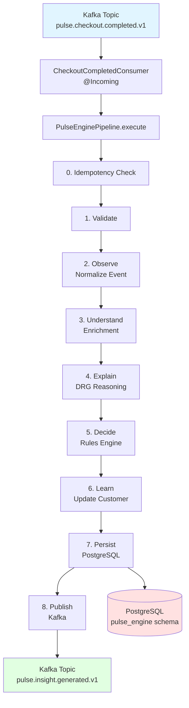
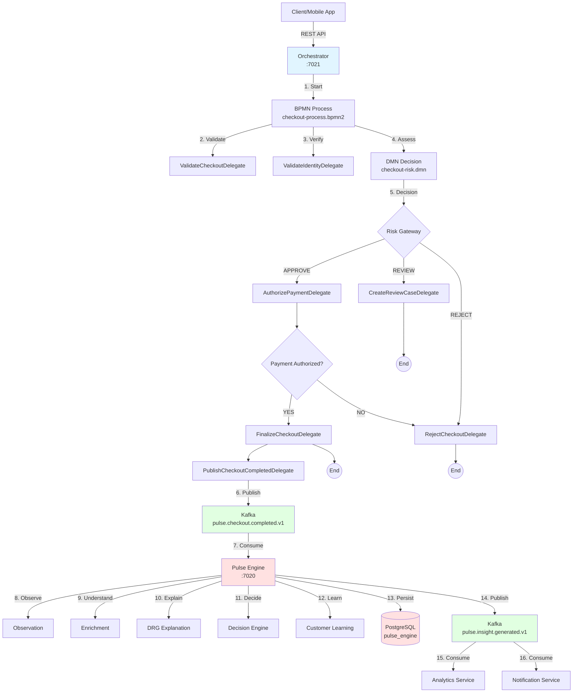

# Pulse Engine - Platform Otomasi Bisnis

**Pulse Engine adalah Platform Otomasi Bisnis untuk underwriting asuransi yang mengorkestrasi proses bisnis, mengevaluasi keputusan, dan menyediakan kemampuan intelijen.**

Pulse Engine terdiri dari dua layanan utama yang berkomunikasi melalui Kafka:

- **Orchestrator (Kogito BPMN + DMN)**: Mengorkestrasi alur checkout asuransi sebagai proses bisnis yang dapat dieksekusi
- **Engine (Quarkus)**: Mengimplementasikan kemampuan teknis (Observe, Understand, Explain, Learn, Persist, Publish)

---

## Orchestrator - Proses Checkout Asuransi BPMN

### Deskripsi Bisnis

Proses checkout asuransi adalah alur bisnis yang kompleks, melibatkan validasi, verifikasi identitas, penilaian risiko underwriting, dan otorisasi pembayaran. Dengan menggunakan **Kogito BPMN** dan **DMN**, proses ini menjadi proses bisnis yang dapat dieksekusi dan dapat diubah tanpa deployment kode.

### Arsitektur Bisnis



### Rincian Tech Stack

#### 1. Bahasa Pemrograman: Java 17

- **Framework**: Quarkus dengan Kogito (BPMN + DMN)
- **Fitur yang digunakan**: Records, Pattern Matching, CDI
- **Domain**: Personal Accident Insurance Underwriting

#### 2. Framework: Kogito + Quarkus

- **Core**: Jakarta EE + CDI (Contexts and Dependency Injection)
- **BPMN**: Kogito untuk orkestrasi workflow
- **DMN**: Kogito Decisions untuk aturan underwriting
- **Messaging**: SmallRye Reactive Messaging (Kafka connector)
- **Resilience**: Resilience4j (Circuit Breaker, Timeout, Bulkhead)
- **Health**: SmallRye Health
- **Metrics**: Micrometer (Prometheus)

#### 3. Dataset: Checkout Request

Format event yang diterima:

```json
{
  "requestId": "uuid-123",
  "traceId": "trace-456",
  "customerId": "CUST-001",
  "nik": "3201234567890001",
  "fullName": "John Doe",
  "dateOfBirth": "1990-01-01",
  "occupation": "EMPLOYEE",
  "merchantId": "MERCH-001",
  "orderId": "ORD-001",
  "amount": 250000,
  "sumInsured": 100000000,
  "currency": "IDR",
  "paymentMethod": "VA",
  "productId": "PROD-001",
  "ipAddress": "192.168.1.1",
  "deviceId": "device-123",
  "channel": "MOBILE"
}
```

### Decision Requirements Graph (DRG) DMN



### Tabel Keputusan DMN

File: `apps/orchestrator/src/main/resources/decisions/checkout-risk.dmn`

Decision: `AssessRisk`

**Inputs:**
- Age (number)
- Occupation Class (string: CLASS_1, CLASS_2, CLASS_3, CLASS_4)
- eKYC Confidence Score (number: 0-100)
- Existing Active Sum Insured (number)
- Requested Sum Insured (number)

**Outputs:**
- Decision (string: APPROVE, REVIEW, REJECT)
- Reason Code (string)
- Risk Level (string: LOW, MEDIUM, HIGH)

**Rules:**
1. Age < 18 or > 65 → REJECT (ERR_AGE_OUT_OF_BOUNDS, HIGH)
2. Occupation CLASS_4 → REJECT (ERR_HIGH_RISK_OCCUPATION, HIGH)
3. Total Active Sum Insured >= 1,000,000,000 → REJECT (ERR_OVER_INSURANCE_LIMIT, HIGH)
4. Confidence Score < 80 → REVIEW (WARN_IDENTITY_MISMATCH, MEDIUM)
5. Occupation CLASS_3 → REVIEW (WARN_OCCUPATION_HAZARD, MEDIUM)
6. Age 18-65, CLASS_1/2, Confidence >= 80, Total < 1B → APPROVE (SUCCESS_STP, LOW)
7. Default → REVIEW (MANUAL_REVIEW, MEDIUM)

### Event yang Diterbitkan

Setelah proses BPMN selesai (semua path: APPROVE, REVIEW, REJECT), orchestrator menerbitkan event:

**Topic**: `pulse.checkout.completed.v1`

```json
{
  "header": {
    "eventId": "uuid-123",
    "eventType": "CHECKOUT_COMPLETED",
    "correlationId": "correlation-456",
    "traceId": "trace-789",
    "producer": "orchestrator",
    "createdAt": "2024-01-01T00:00:00Z",
    "version": 1
  },
  "processId": "process-001",
  "businessKey": "BK-001",
  "checkoutId": "checkout-001",
  "customerId": "CUST-001",
  "amount": 250000,
  "paymentMethod": "VA",
  "decision": "APPROVE",
  "riskLevel": "LOW",
  "reviewRequired": false,
  "priority": "P1",
  "reasonCode": "SUCCESS_STP",
  "confidenceScore": 85,
  "processingTimeMs": 1200,
  "decisionTimestamp": "2024-01-01T00:00:00Z"
}
```

### Integrasi Kafka

#### Producer (Output)

**Channel**: `checkout-completed-out`

**Konfigurasi**:
```properties
mp.messaging.outgoing.checkout-completed-out.topic=pulse.checkout.completed.v1
mp.messaging.outgoing.checkout-completed-out.value.serializer=org.apache.kafka.common.serialization.StringSerializer
mp.messaging.outgoing.checkout-completed-out.enable.idempotence=true
mp.messaging.outgoing.checkout-completed-out.acks=all
mp.messaging.outgoing.checkout-completed-out.retries=3
mp.messaging.outgoing.checkout-completed-out.compression.type=snappy
```

#### Consumer (Input)

**Channel**: `checkout-completed`

**Konfigurasi**:
```properties
mp.messaging.incoming.checkout-completed.topic=pulse.checkout.completed.v1
mp.messaging.incoming.checkout-completed.group.id=orchestrator-event-handler
mp.messaging.incoming.checkout-completed.value.deserializer=org.apache.kafka.common.serialization.StringDeserializer
mp.messaging.incoming.checkout-completed.auto.offset.reset=earliest
mp.messaging.incoming.checkout-completed.enable.auto.commit=false
```

### External Service Integrations

Orchestrator mengintegrasikan dengan layanan eksternal melalui REST:

| Service | Port | Purpose |
|---------|------|---------|
| Customer Service | 7010 | Customer profile lookup |
| Dukcapil Service | 7011 | Identity verification (e-KYC) |
| Velocity Service | 7012 | Transaction velocity check |
| Fraud Service | 7013 | Fraud detection |
| Checkout Service | 7014 | Checkout state management |
| Payment Service | 7015 | Payment authorization |
| KYC Service | 7016 | KYC verification |
| Inventory Service | 7017 | Inventory reservation/release |
| Liveness Service | 7018 | Liveness check |
| Policy Service | 7019 | Policy creation |
| Merchant Service | 7020 | Merchant validation |
| Product Service | 7022 | Product validation |

Semua service calls menggunakan **Resilience4j** (Circuit Breaker, Timeout, Bulkhead) untuk fault tolerance.

### REST API

**Port**: 7021

| Method | Endpoint | Fungsi |
|--------|----------|--------|
| POST | `/api/v1/checkouts` | Membuat checkout baru |

### Monitoring & Observability

```bash
# Health check
curl http://localhost:7021/q/health

# Process instances
curl http://localhost:7021/api/v1/processes

# Metrics
curl http://localhost:7021/q/metrics

# OpenAPI docs
open http://localhost:7021/q/swagger-ui
```

---

## Engine - Layanan Pemrosesan Event Kafka

### Deskripsi Teknis

Layanan Pulse Engine dibangun menggunakan **Java 17** dan framework **Quarkus** untuk menciptakan layanan yang menerima data dari topic Kafka, melakukan manipulasi data, dan menulisnya kembali ke Kafka atau menyimpannya ke database.

### Arsitektur Teknis



### Rincian Tech Stack

#### 1. Bahasa Pemrograman: Java 17

- **Fitur yang digunakan**: Records, Pattern Matching, Sealed Classes
- **Keuntungan**: Type safety, sintaks ringkas, dukungan konkurensi modern
- **Contoh penggunaan**: Record `CheckoutCompletedEvent` untuk payload event

#### 2. Framework: Quarkus

- **Core**: Jakarta EE + CDI (Contexts and Dependency Injection)
- **Messaging**: SmallRye Reactive Messaging (Kafka connector)
- **Persistence**: Hibernate ORM with Panache (Active Record pattern)
- **Database Migration**: Flyway
- **Health**: SmallRye Health (indikator Kafka + Database)
- **Metrics**: Micrometer (Prometheus)
- **OpenAPI**: SmallRye OpenAPI

#### 3. Dataset: Checkout Events

Format event yang diterima dari orchestrator:

```json
{
  "header": {
    "eventId": "uuid-123",
    "eventType": "CHECKOUT_COMPLETED",
    "producer": "orchestrator",
    "createdAt": "2024-01-01T00:00:00Z",
    "version": 1
  },
  "processId": "process-001",
  "businessKey": "BK-001",
  "checkoutId": "checkout-001",
  "customerId": "CUST-001",
  "orderId": "ORD-001",
  "amount": 250000,
  "paymentMethod": "VA",
  "decision": "APPROVE",
  "riskLevel": "LOW",
  "reasonCode": "SUCCESS_STP",
  "priority": "P1",
  "confidenceScore": 85,
  "identityStatus": "MATCH",
  "dukcapilStatus": "VALID",
  "kycStatus": "PASSED",
  "identityRisk": "LOW",
  "transactionRisk": "LOW",
  "overallRisk": "LOW",
  "velocityRisk": 25,
  "fraudScore": 10
}
```

#### 4. Database: PostgreSQL

- **Schema**: `pulse_engine` (terpisah dari orchestrator)
- **Flyway Migration**: `V1__init_pulse_schema.sql`, `V2__seed.sql`, `V3__add_insight_types.sql`
- **Tabel**:
  - `checkout_insight` - Hasil keputusan akhir
  - `checkout_timeline` - Audit trail capabilities
  - `checkout_explanation` - Penjelasan keputusan
  - `customer_learning` - Pola perilaku customer

### 7 Capabilities (Pipeline Processing)

Layanan ini mengimplementasikan 7 capabilities sesuai dengan arsitektur Pulse Engine:

#### 1. Observe

```java
// Validasi dan normalisasi event masuk
ObservationContext ctx = new ObservationContext(event);
// - Validasi mandatory fields (eventId, processId, orderId, dll)
// - Generate correlation ID dan trace ID
// - Normalisasi format data
```

#### 2. Understand

```java
// Enrichment dan pembangunan konteks
UnderstandingContext context = understandingService.understand(event);
// - Klasifikasi segmen customer
// - Penilaian risiko identitas (Dukcapil/KYC)
// - Perhitungan risiko transaksi
// - Analisis risiko velocity
// - Agregasi risiko keseluruhan
```

#### 3. Explain

```java
// Generate penjelasan untuk setiap keputusan
ExplanationContext explanation = explanationService.explain(event, context);
// - Decision reasoning (berbasis DRG)
// - Bukti pendukung
// - Tingkat keyakinan (confidence level)
// - Kebijakan yang diterapkan
```

#### 4. Decide

```java
// Evaluasi aturan bisnis
String decision = decisionService.decide(context);
// - RiskLevelRule: Berdasarkan risk level dari orchestrator
// - AmountRule: Berdasarkan nilai amount
// - CustomerRule: Validasi profil customer
// - ReviewRule: Review required flag
// Output: APPROVED / REVIEW / REJECTED + skor keyakinan
```

#### 5. Learn

```java
// Perbarui pola pembelajaran customer
customerLearningRepository.persist(learning);
// - Increment jumlah pembelian
// - Perbarui checkout berhasil/ditolak
// - Perbarui segmen customer
// - Lacak amount tertinggi
// - Metode pembayaran yang disukai
```

#### 6. Persist & Publish

```java
// Simpan ke database
checkoutInsightRepository.persist(insight);
checkoutTimelineRepository.persist(timeline);
checkoutExplanationRepository.persist(explanation);

// Publikasi ke Kafka
emitter.send(event); // ke topic insight.generated
```

### Integrasi Kafka

#### Consumer (Input)

```java
@ApplicationScoped
public class CheckoutCompletedConsumer {
    
    @Incoming("checkout.completed")
    public void process(CheckoutCompletedEvent event) {
        pipeline.execute(event);
    }
}
```

**Konfigurasi**:

```properties
mp.messaging.incoming.checkout.completed.topic=pulse.checkout.completed.v1
mp.messaging.incoming.checkout.completed.group.id=pulse-engine
mp.messaging.incoming.checkout.completed.auto.offset.reset=earliest
mp.messaging.incoming.checkout.completed.retry-attempts=3
mp.messaging.incoming.checkout.completed.enable-dlq=true
mp.messaging.incoming.checkout.completed.dlq-topic=pulse.checkout.completed.dlq
```

#### Producer (Output)

```java
@ApplicationScoped
public class InsightGeneratedProducer {
    
    @Inject
    @Channel("insight.generated")
    Emitter<CheckoutCompletedEvent> emitter;
    
    public void publish(CheckoutCompletedEvent event) {
        emitter.send(event);
    }
}
```

**Konfigurasi**:

```properties
mp.messaging.outgoing.insight.generated.topic=pulse.insight.generated.v1
mp.messaging.outgoing.insight.generated.value.serializer=io.quarkus.kafka.client.serialization.ObjectMapperSerializer
```

### Skema Database

```sql
-- Schema: pulse_engine

CREATE TABLE pulse_engine.checkout_insight (
    checkout_id VARCHAR(100) PRIMARY KEY,
    process_id VARCHAR(100) NOT NULL,
    customer_id VARCHAR(100) NOT NULL,
    order_id VARCHAR(100) NOT NULL,
    decision VARCHAR(20) NOT NULL,  -- APPROVED/REVIEW/REJECTED
    confidence VARCHAR(20) NOT NULL,
    risk_level VARCHAR(20) NOT NULL,  -- LOW/MEDIUM/HIGH
    explainability_score NUMERIC(5,2),
    total_amount NUMERIC(18,2),
    insight_type VARCHAR(50),  -- HIGH_FRAUD_RISK, HIGH_AMOUNT, dll
    processed_at TIMESTAMP NOT NULL,
    created_at TIMESTAMP NOT NULL DEFAULT CURRENT_TIMESTAMP,
    updated_at TIMESTAMP NOT NULL DEFAULT CURRENT_TIMESTAMP
);

CREATE TABLE pulse_engine.checkout_timeline (
    id BIGSERIAL PRIMARY KEY,
    checkout_id VARCHAR(100) NOT NULL,
    capability VARCHAR(50) NOT NULL,  -- OBSERVED, UNDERSTOOD, dll
    status VARCHAR(20) NOT NULL,
    message VARCHAR(500),
    processing_time_ms INTEGER,
    event_time TIMESTAMP NOT NULL,
    created_at TIMESTAMP NOT NULL DEFAULT CURRENT_TIMESTAMP
);

CREATE TABLE pulse_engine.checkout_explanation (
    id BIGSERIAL PRIMARY KEY,
    checkout_id VARCHAR(100) NOT NULL,
    explanation_type VARCHAR(50) NOT NULL,
    explanation TEXT NOT NULL,
    created_at TIMESTAMP NOT NULL DEFAULT CURRENT_TIMESTAMP
);

CREATE TABLE pulse_engine.customer_learning (
    customer_id VARCHAR(100) PRIMARY KEY,
    purchase_count INTEGER NOT NULL,
    successful_checkout INTEGER NOT NULL,
    rejected_checkout INTEGER NOT NULL,
    average_amount NUMERIC(18,2),
    highest_amount NUMERIC(18,2),
    preferred_payment_method VARCHAR(50),
    customer_segment VARCHAR(30),
    last_checkout_time TIMESTAMP,
    learning_version INTEGER NOT NULL DEFAULT 1,
    created_at TIMESTAMP NOT NULL DEFAULT CURRENT_TIMESTAMP,
    updated_at TIMESTAMP NOT NULL DEFAULT CURRENT_TIMESTAMP
);
```

### Alur Data Lengkap



### Nilai Bisnis

1. **Transparansi**: Setiap keputusan memiliki penjelasan yang dapat dipahami manusia
2. **Traceability**: Audit trail lengkap untuk kepatuhan (compliance)
3. **Perbaikan Berkelanjutan**: Sistem belajar dari setiap transaksi
4. **Pemrosesan Real-time**: Keputusan dalam hitungan milidetik
5. **Skalabilitas**: Arsitektur event-driven dengan Kafka

---

## Ringkasan Arsitektur Keseluruhan



### Poin-Poin Utama

1. **Separation of Concerns**:
   - Orchestrator: Proses bisnis & keputusan underwriting (DMN)
   - Engine: Intelijen & analitik

2. **Keselarasan Teknologi**:
   - BPMN/DMN untuk logika bisnis (Kogito)
   - Quarkus untuk kemampuan teknis (Event-driven)

3. **Arsitektur Event-Driven**:
   - Kafka sebagai backbone komunikasi
   - Decoupling antar layanan

4. **Alur Data**:
   - Input: REST API → BPMN → DMN → Kafka
   - Processing: Pipeline engine (7 capabilities)
   - Output: Kafka → Analytics/Notification + PostgreSQL

5. **Nilai Bisnis**:
   - Pengambilan keputusan underwriting real-time
   - Audit trail lengkap
   - Pembelajaran berkelanjutan
   - AI yang dapat dijelaskan (Explainable AI)

---

## Quick Start

### 1. Start Infrastructure

```bash
docker compose up -d
```

Menjalankan: Kafka (:7000), PostgreSQL (:7002), Redis (:7001), Kafdrop UI (:9000).

### 2. Build

```bash
mvn clean install -DskipTests
```

### 3. Run Orchestrator (Process + Decision Services)

```bash
cd apps/orchestrator && mvn quarkus:dev
```

### 4. Run Engine (Intelligence Service)

```bash
cd apps/engine && mvn quarkus:dev
```

### 5. Trigger Checkout

```bash
curl -X POST http://localhost:7021/api/v1/checkouts \
  -H "Content-Type: application/json" \
  -d '{
    "customerId":"CUST-001",
    "nik":"3201234567890001",
    "fullName":"John Doe",
    "dateOfBirth":"1990-01-01",
    "occupation":"EMPLOYEE",
    "merchantId":"MERCH-001",
    "orderId":"ORD-001",
    "amount":250000,
    "sumInsured":100000000,
    "currency":"IDR",
    "paymentMethod":"VA",
    "productId":"PROD-001",
    "ipAddress":"192.168.1.1",
    "deviceId":"device-123",
    "channel":"MOBILE"
  }'
```

### 6. Get Insight Result

```bash
curl http://localhost:7020/api/v1/insights/ORD-001
```

Response berisi keputusan, confidence, penjelasan, faktor, dan pola pembelajaran.

## Modules

| Module              | Path              | Port  | Tanggung Jawab                              |
|---------------------|-------------------|-------|----------------------------------------------|
| `shared/model`      | `shared/model`     | —     | Kontrak bersama (DTO, Events, Enums, VOs)   |
| `apps/orchestrator` | `apps/orchestrator`| 7021  | Orkestrasi BPMN + layanan keputusan DMN + publish `checkout.completed` |
| `apps/engine`       | `apps/engine`      | 7020  | Kemampuan intelijen (Observe, Understand, Explain, Decide, Learn, Persist, Publish) |

## Prerequisites

- **Java 17+**
- **Maven 3.9+**
- **Docker** (untuk Kafka + PostgreSQL + Redis)
- **Docker Compose**

## Run Project

### 1. Start Infrastructure

```bash
docker compose up -d
```

Menjalankan: Kafka (:7000), PostgreSQL (:7002), Redis (:7001), Kafdrop UI (:9000), pgAdmin (:5050).

### 2. Build

```bash
mvn clean install -DskipTests
```

### 3. Run Engine

```bash
cd apps/engine && mvn quarkus:dev
# atau dengan profile
cd apps/engine && mvn quarkus:dev -Dquarkus.profile=dev
```

### 4. Run Orchestrator

```bash
cd apps/orchestrator && mvn quarkus:dev
```

### 5. Trigger Checkout

```bash
curl -X POST http://localhost:7021/api/v1/checkouts \
  -H "Content-Type: application/json" \
  -d '{
    "customerId":"CUST-001",
    "nik":"3201234567890001",
    "fullName":"John Doe",
    "dateOfBirth":"1990-01-01",
    "occupation":"EMPLOYEE",
    "merchantId":"MERCH-001",
    "orderId":"ORD-001",
    "amount":250000,
    "sumInsured":100000000,
    "currency":"IDR",
    "paymentMethod":"VA",
    "productId":"PROD-001",
    "ipAddress":"192.168.1.1",
    "deviceId":"device-123",
    "channel":"MOBILE"
  }'
```

### 6. Get Insight

```bash
curl http://localhost:7020/api/v1/insights/ORD-001
```

## Kafka Topics

| Topic                         | Partitions | Producer     | Consumer        | Retention | Capability |
|-------------------------------|:----------:|--------------|-----------------|:---------:|------------|
| `pulse.checkout.completed.v1`   | 6 | Orchestrator | Engine          | 7d  | Process + Decision |
| `pulse.checkout.completed.retry` | 6 | Engine       | Engine          | 1d  | Retry Queue |
| `pulse.checkout.completed.dlq`   | 1 | Engine       | Operations      | 30d | Dead Letter Queue |
| `pulse.insight.generated.v1`     | 3 | Engine       | Analytics       | 30d | Intelligence |
| `pulse.insight.generated.dlq`    | 1 | Engine       | Operations      | 30d | Dead Letter Queue |

## Database (Flyway)

### Orchestrator Schema (`orchestrator`)

| Migration | Isi |
|-----------|-----|
| `V1__init_orchestrator_schema.sql` | Schema untuk proses orchestrator |
| `V2__fix_orchestrator_schema.sql` | Perbaikan schema |

### Engine Schema (`pulse_engine`)

| Migration | Isi |
|-----------|-----|
| `V1__init_pulse_schema.sql` | 4 tabel: `checkout_insight`, `checkout_timeline`, `checkout_explanation`, `customer_learning` |
| `V2__seed.sql` | Sample data untuk testing |
| `V3__add_insight_types.sql` | Tambahan tipe insight |

## Engine REST API

| Method | Endpoint | Fungsi |
|--------|----------|--------|
| GET | `/api/v1/insights/{checkoutId}` | Mendapatkan insight untuk sebuah checkout |
| GET | `/api/v1/insights/{checkoutId}/timeline` | Mendapatkan timeline event |
| GET | `/api/v1/insights/{checkoutId}/explanation` | Mendapatkan penjelasan keputusan |
| GET | `/api/v1/customers/{customerId}/learning` | Mendapatkan data pembelajaran customer |
| POST | `/api/v1/insights/search` | Mencari insight |
| GET | `/api/v1/dashboard` | Statistik dashboard |
| GET | `/api/v1/capabilities` | Kesehatan capabilities |
| GET | `/q/health` | Health (termasuk Kafka, DB) |
| GET | `/q/metrics` | Metrics (Prometheus) |
| GET | `/q/swagger-ui` | Dokumentasi OpenAPI |

## Testing

```bash
mvn test
```

Unit tests: `ValidationServiceTest`, `DecisionEngineTest`.

Integration tests: `CheckoutProcessingIntegrationTest` (Engine), `CheckoutWorkflowTest` (Orchestrator).

## Docs

Lihat `docs/` untuk dokumentasi lengkap:

- `00-Vision.md` - Visi produk dan identitas inti
- `01-Capabilities.md` - Tujuh capabilities (Observe, Understand, Explain, Decide, Learn, Persist, Publish)
- `02-Experience.md` - Pengalaman pengguna dan contoh API
- `03-Architecture.md` - Arsitektur teknis
- `04-BPMN.md` - Orkestrasi workflow
- `05-Kafka.md` - Topologi event
- `06-Decision-Engine.md` - Detail capability Decide
- `07-Database.md` - Lapisan persistence
- `08-Runbook.md` - Panduan operasional
- `09-Tradeoffs.md` - Keputusan desain
- `10-Future-Improvements.md` - Roadmap

## Future Improvement

- Mock layanan eksternal (Inventory/Payment/KYC) sebagai aplikasi Quarkus
- Integrasi test Kafka + Repository
- BPMN test (`CheckoutWorkflowTest`)
- Koleksi Postman/Bruno