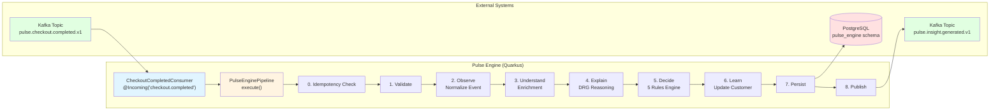
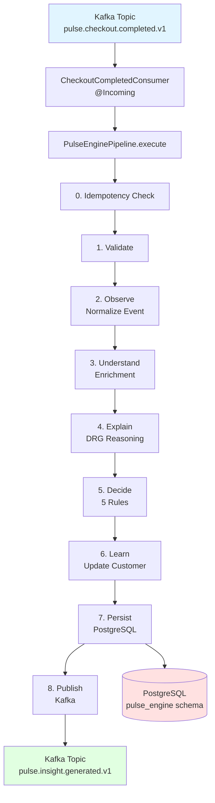
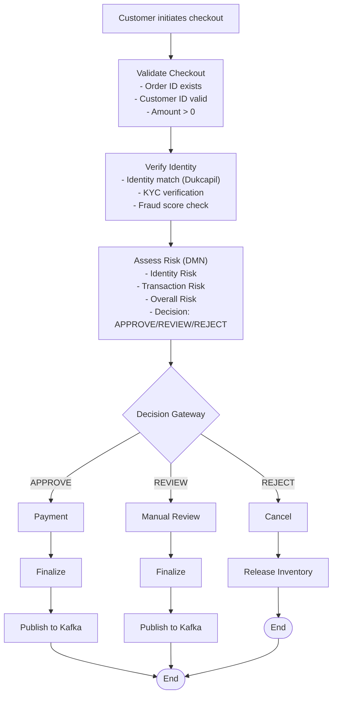
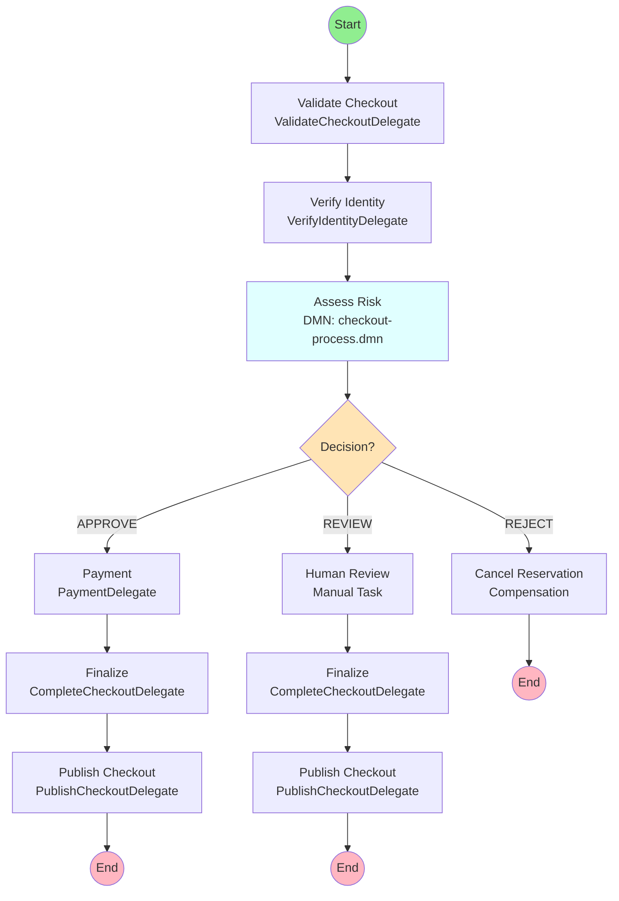
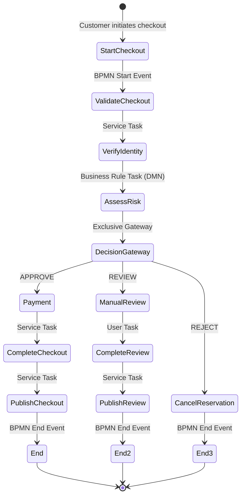
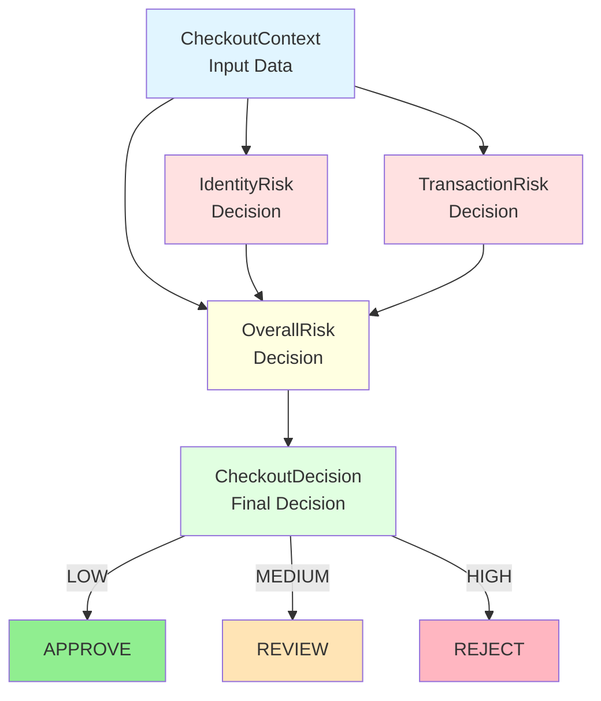
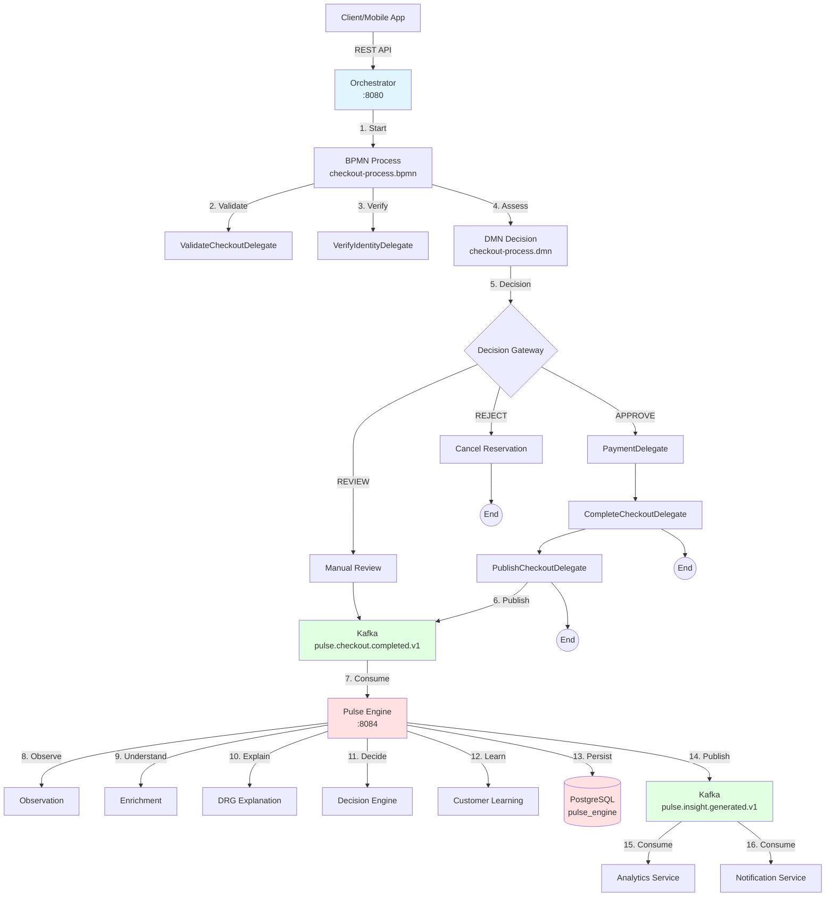

# Pulse Engine - Platform Otomasi Bisnis

**Pulse Engine adalah Platform Otomasi Bisnis yang mengorkestrasi proses bisnis, mengevaluasi keputusan, dan menyediakan kemampuan intelijen.**

Pulse Engine bertransformasi dari mesin keputusan monolitik menjadi Platform Otomasi Bisnis yang selaras dengan filosofi Kogito. Platform ini terdiri dari tiga layanan terpisah:

- **Process Service (Kogito BPMN)**: Mengorkestrasi alur checkout sebagai proses bisnis yang dapat dieksekusi
- **Decision Service (Kogito DMN)**: Berisi aturan bisnis (APPROVE/REVIEW/REJECT) yang dapat diubah tanpa deployment kode
- **Intelligence Service (Quarkus)**: Mengimplementasikan kemampuan teknis (Observe, Understand, Explain, Learn, Persist, Publish)

---

## Engine - Layanan Pemrosesan Event Kafka

### Deskripsi Teknis

Layanan Pulse Engine dibangun menggunakan **Java 17** dan framework **Quarkus** untuk menciptakan layanan yang menerima data dari topic Kafka, melakukan manipulasi data, dan menulisnya kembali ke Kafka atau menyimpannya ke database.

### Arsitektur Teknis



### Rincian Tech Stack

#### 1. Bahasa Pemrograman: Java 17

- **Fitur yang digunakan**: Records, Pattern Matching, Sealed Classes
- **Keuntungan**: Type safety, sintaks ringkas, dukungan konkurensi modern
- **Contoh penggunaan**: Record `CheckoutCompletedEvent` untuk payload event

#### 2. Framework: Quarkus

- **Core**: Jakarta EE + CDI (Contexts and Dependency Injection)
- **Messaging**: SmallRye Reactive Messaging (Kafka connector)
- **Persistence**: Hibernate ORM with Panache (Active Record pattern)
- **Database Migration**: Flyway
- **Health**: SmallRye Health (indikator Kafka + Database)
- **Metrics**: Micrometer (Prometheus)
- **OpenAPI**: SmallRye OpenAPI

#### 3. Dataset: Bebas (Checkout Events)

Format event yang diterima:

```json
{
  "header": {
    "eventId": "uuid-123",
    "eventType": "checkout.completed",
    "producer": "pulse-orchestrator",
    "createdAt": "2024-01-01T00:00:00Z",
    "version": 1
  },
  "processId": "process-001",
  "businessKey": "ORD-001",
  "customerId": "CUST-001",
  "orderId": "ORD-001",
  "amount": 250000,
  "paymentMethod": "CREDIT_CARD",
  "decision": "APPROVE",
  "riskLevel": "LOW",
  "identityStatus": "MATCH",
  "dukcapilStatus": "VALID",
  "kycStatus": "PASSED",
  "identityRisk": "LOW",
  "transactionRisk": "LOW",
  "overallRisk": "LOW",
  "velocityRisk": 25,
  "fraudScore": 10
}
```

#### 4. Database: PostgreSQL

- **Schema**: `pulse_engine` (terpisah dari orchestrator)
- **Flyway Migration**: `V1__init_pulse_schema.sql`, `V2__seed.sql`, `V3__add_insight_types.sql`
- **Tabel**:
  - `checkout_insight` - Hasil keputusan akhir
  - `checkout_timeline` - Audit trail capabilities
  - `checkout_explanation` - Penjelasan keputusan
  - `customer_learning` - Pola perilaku customer

### 6 Capabilities (Pipeline Processing)

Layanan ini mengimplementasikan 6 capabilities sesuai dengan arsitektur Pulse Engine:

#### 1. Observe

```java
// Validasi dan normalisasi event masuk
ObservationContext ctx = new ObservationContext(event);
// - Validasi mandatory fields (eventId, processId, orderId, dll)
// - Generate correlation ID dan trace ID
// - Normalisasi format data
```

#### 2. Understand

```java
// Enrichment dan pembangunan konteks
UnderstandingContext context = understandingService.understand(event);
// - Klasifikasi segmen customer
// - Penilaian risiko identitas (Dukcapil/KYC)
// - Perhitungan risiko transaksi
// - Analisis risiko velocity
// - Agregasi risiko keseluruhan
```

#### 3. Explain

```java
// Generate penjelasan untuk setiap keputusan
ExplanationContext explanation = explanationService.explain(event, context);
// - Decision reasoning (berbasis DRG)
// - Bukti pendukung
// - Tingkat keyakinan (confidence level)
// - Kebijakan yang diterapkan
```

#### 4. Decide

```java
// Evaluasi 5 aturan bisnis
String decision = decisionService.decide(context);
// - AmountRule: Berdasarkan nilai amount
// - CustomerRule: Validasi profil customer
// - PaymentRule: Metode pembayaran
// - VelocityRule: Deteksi anomali frekuensi
// - RiskRule: Kombinasi faktor risiko
// Output: APPROVED / REVIEW / REJECTED + skor keyakinan
```

#### 5. Learn

```java
// Perbarui pola pembelajaran customer
customerLearningRepository.persist(learning);
// - Increment jumlah pembelian
// - Perbarui checkout berhasil/ditolak
// - Perbarui segmen customer
// - Lacak amount tertinggi
// - Metode pembayaran yang disukai
```

#### 6. Persist & Publish

```java
// Simpan ke database
checkoutInsightRepository.persist(insight);
checkoutTimelineRepository.persist(timeline);
checkoutExplanationRepository.persist(explanation);

// Publikasi ke Kafka
emitter.send(event); // ke topic insight.generated
```

### Integrasi Kafka

#### Consumer (Input)

```java
@ApplicationScoped
public class CheckoutCompletedConsumer {
    
    @Incoming("checkout.completed")
    @Blocking
    public void process(CheckoutCompletedEvent event) {
        pipeline.execute(event);
    }
}
```

**Konfigurasi**:

```properties
mp.messaging.incoming.checkout.completed.topic=pulse.checkout.completed.v1
mp.messaging.incoming.checkout.completed.group.id=pulse-engine
mp.messaging.incoming.checkout.completed.auto.offset.reset=earliest
mp.messaging.incoming.checkout.completed.retry-attempts=3
mp.messaging.incoming.checkout.completed.enable-dlq=true
mp.messaging.incoming.checkout.completed.dlq-topic=pulse.checkout.completed.v1.dlq
```

#### Producer (Output)

```java
@ApplicationScoped
public class InsightGeneratedProducer {
    
    @Inject
    @Channel("insight.generated")
    Emitter<CheckoutCompletedEvent> emitter;
    
    public void publish(CheckoutCompletedEvent event) {
        emitter.send(event);
    }
}
```

**Konfigurasi**:

```properties
mp.messaging.outgoing.insight.generated.topic=pulse.insight.generated.v1
mp.messaging.outgoing.insight.generated.value.serializer=io.quarkus.kafka.client.serialization.ObjectMapperSerializer
```

### Skema Database

```sql
-- Schema: pulse_engine

CREATE TABLE pulse_engine.checkout_insight (
    checkout_id VARCHAR(100) PRIMARY KEY,
    process_id VARCHAR(100) NOT NULL,
    customer_id VARCHAR(100) NOT NULL,
    order_id VARCHAR(100) NOT NULL,
    decision VARCHAR(20) NOT NULL,  -- APPROVED/REVIEW/REJECTED
    confidence VARCHAR(20) NOT NULL,
    risk_level VARCHAR(20) NOT NULL,  -- LOW/MEDIUM/HIGH
    explainability_score NUMERIC(5,2),
    total_amount NUMERIC(18,2),
    insight_type VARCHAR(50),  -- HIGH_FRAUD_RISK, HIGH_AMOUNT, dll
    processed_at TIMESTAMP NOT NULL,
    created_at TIMESTAMP NOT NULL DEFAULT CURRENT_TIMESTAMP,
    updated_at TIMESTAMP NOT NULL DEFAULT CURRENT_TIMESTAMP
);

CREATE TABLE pulse_engine.checkout_timeline (
    id BIGSERIAL PRIMARY KEY,
    checkout_id VARCHAR(100) NOT NULL,
    capability VARCHAR(50) NOT NULL,  -- OBSERVED, UNDERSTOOD, dll
    status VARCHAR(20) NOT NULL,
    message VARCHAR(500),
    processing_time_ms INTEGER,
    event_time TIMESTAMP NOT NULL,
    created_at TIMESTAMP NOT NULL DEFAULT CURRENT_TIMESTAMP
);

CREATE TABLE pulse_engine.checkout_explanation (
    id BIGSERIAL PRIMARY KEY,
    checkout_id VARCHAR(100) NOT NULL,
    explanation_type VARCHAR(50) NOT NULL,
    explanation TEXT NOT NULL,
    created_at TIMESTAMP NOT NULL DEFAULT CURRENT_TIMESTAMP
);

CREATE TABLE pulse_engine.customer_learning (
    customer_id VARCHAR(100) PRIMARY KEY,
    purchase_count INTEGER NOT NULL,
    successful_checkout INTEGER NOT NULL,
    rejected_checkout INTEGER NOT NULL,
    average_amount NUMERIC(18,2),
    highest_amount NUMERIC(18,2),
    preferred_payment_method VARCHAR(50),
    customer_segment VARCHAR(30),
    last_checkout_time TIMESTAMP,
    learning_version INTEGER NOT NULL DEFAULT 1,
    created_at TIMESTAMP NOT NULL DEFAULT CURRENT_TIMESTAMP,
    updated_at TIMESTAMP NOT NULL DEFAULT CURRENT_TIMESTAMP
);
```

### Alur Data Lengkap



### Nilai Bisnis

1. **Transparansi**: Setiap keputusan memiliki penjelasan yang dapat dipahami manusia
2. **Traceability**: Audit trail lengkap untuk kepatuhan (compliance)
3. **Perbaikan Berkelanjutan**: Sistem belajar dari setiap transaksi
4. **Pemrosesan Real-time**: Keputusan dalam hitungan milidetik
5. **Skalabilitas**: Arsitektur event-driven dengan Kafka

---

## Orchestrator - Proses Checkout BPMN

### Deskripsi Bisnis

Proses checkout di marketplace adalah alur bisnis yang kompleks, melibatkan validasi, verifikasi identitas, otorisasi pembayaran, dan penilaian risiko. Dengan menggunakan **Kogito BPMN** dan **DMN**, proses ini menjadi proses bisnis yang dapat dieksekusi dan dapat diubah tanpa deployment kode.

### Arsitektur Bisnis



### Diagram BPMN (MermaidJS)



### Ilustrasi BPMN dalam Kogito

Proses BPMN diimplementasikan menggunakan **Kogito**, yaitu platform untuk otomasi bisnis cloud-native. Kogito memungkinkan BPMN dan DMN di-deploy sebagai layanan yang dapat dieksekusi.

#### 1. Definisi Proses BPMN

File: `apps/orchestrator/src/main/resources/processes/checkout-process.bpmn`

```xml
<bpmn:process id="checkout-process" name="Checkout Process" isExecutable="true">
  <!-- Start Event -->
  <bpmn:startEvent id="start" name="Start Checkout">
    <bpmn:outgoing>flow_start_validate</bpmn:outgoing>
  </bpmn:startEvent>
  
  <!-- Service Tasks (Business Logic) -->
  <bpmn:serviceTask id="validateCheckout" name="Validate Checkout" 
                    drools:taskName="ValidateCheckoutDelegate">
    <bpmn:incoming>flow_start_validate</bpmn:incoming>
    <bpmn:outgoing>flow_validate_identity</bpmn:outgoing>
  </bpmn:serviceTask>
  
  <bpmn:serviceTask id="verifyIdentity" name="Verify Identity" 
                    drools:taskName="VerifyIdentityDelegate">
    <bpmn:incoming>flow_validate_identity</bpmn:incoming>
    <bpmn:outgoing>flow_identity_assess</bpmn:outgoing>
  </bpmn:serviceTask>
  
  <!-- Business Rule Task (DMN Decision) -->
  <bpmn:businessRuleTask id="assessRisk" name="Assess Risk" 
                         drools:dmnRef="checkout-process.dmn" 
                         drools:dmnVersion="1.2">
    <bpmn:extensionElements>
      <drools:dmnResultVariable name="decision" drools:dmnOutputRef="decision" />
      <drools:dmnResultVariable name="identityRisk" drools:dmnOutputRef="identityRisk" />
      <drools:dmnResultVariable name="transactionRisk" drools:dmnOutputRef="transactionRisk" />
      <drools:dmnResultVariable name="overallRisk" drools:dmnOutputRef="overallRisk" />
    </bpmn:extensionElements>
    <bpmn:incoming>flow_identity_assess</bpmn:incoming>
    <bpmn:outgoing>flow_assess_gateway</bpmn:outgoing>
  </bpmn:businessRuleTask>
  
  <!-- Gateway (Decision Branching) -->
  <bpmn:exclusiveGateway id="decisionGateway" name="Decision?" 
                         default="flow_gateway_review">
    <bpmn:incoming>flow_assess_gateway</bpmn:incoming>
    <bpmn:outgoing>flow_gateway_approve</bpmn:outgoing>
    <bpmn:outgoing>flow_gateway_review</bpmn:outgoing>
  </bpmn:exclusiveGateway>
  
  <!-- Sequence Flows (Conditions) -->
  <bpmn:sequenceFlow id="flow_gateway_approve" name="APPROVE" 
                     sourceRef="decisionGateway" targetRef="authorizePayment">
    <bpmn:conditionExpression xsi:type="bpmn:tFormalExpression">
      ${decision == 'APPROVE'}
    </bpmn:conditionExpression>
  </bpmn:sequenceFlow>
  
  <bpmn:sequenceFlow id="flow_gateway_review" name="REVIEW" 
                     sourceRef="decisionGateway" targetRef="manualReview">
    <bpmn:conditionExpression xsi:type="bpmn:tFormalExpression">
      ${decision == 'REVIEW'}
    </bpmn:conditionExpression>
  </bpmn:sequenceFlow>
  
  <!-- End Event -->
  <bpmn:endEvent id="endSuccess" name="End">
    <bpmn:incoming>flow_publish_end</bpmn:incoming>
  </bpmn:endEvent>
</bpmn:process>
```

#### 2. Tabel Keputusan DMN

File: `apps/orchestrator/src/main/resources/decisions/checkout-process.dmn`

```xml
<dmn:decision id="Decision_CheckoutDecision" name="CheckoutDecision">
  <dmn:description>Makes final checkout decision based on overall risk assessment</dmn:description>
  <dmn:variable id="Variable_CheckoutDecision" name="CheckoutDecision" 
                typeRef="tns:tCheckoutDecision"/>
  <dmn:informationRequirement id="InfoReq_CheckoutDecision_OverallRisk">
    <dmn:requiredDecision href="#Decision_OverallRisk"/>
  </dmn:informationRequirement>
  <dmn:decisionTable id="DecisionTable_CheckoutDecision" 
                     hitPolicy="UNIQUE" 
                     preferredOrientation="Rule-as-Row">
    <dmn:input id="Input_OverallRisk">
      <dmn:inputExpression id="InputExpr_OverallRisk" typeRef="string">
        <dmn:text>OverallRisk.overallRisk</dmn:text>
      </dmn:inputExpression>
    </dmn:input>
    <dmn:output id="Output_Decision" name="decision"/>
    
    <!-- Rules -->
    <dmn:rule id="Rule_Checkout_Low">
      <dmn:inputEntry><dmn:text>"LOW"</dmn:text></dmn:inputEntry>
      <dmn:outputEntry><dmn:text>"APPROVE"</dmn:text></dmn:outputEntry>
    </dmn:rule>
    
    <dmn:rule id="Rule_Checkout_Medium">
      <dmn:inputEntry><dmn:text>"MEDIUM"</dmn:text></dmn:inputEntry>
      <dmn:outputEntry><dmn:text>"REVIEW"</dmn:text></dmn:outputEntry>
    </dmn:rule>
    
    <dmn:rule id="Rule_Checkout_High">
      <dmn:inputEntry><dmn:text>"HIGH"</dmn:text></dmn:inputEntry>
      <dmn:outputEntry><dmn:text>"REJECT"</dmn:text></dmn:outputEntry>
    </dmn:rule>
  </dmn:decisionTable>
</dmn:decision>
```

### Layanan yang Digunakan

#### 1. ValidateCheckoutDelegate

```java
@Component
public class ValidateCheckoutDelegate {
    
    public void execute(CheckoutProcessModel model) {
        // Validasi aturan bisnis:
        // - Order ID tidak null/empty
        // - Customer ID valid
        // - Amount > 0
        // - Metode pembayaran valid
        
        if (model.getOrderId() == null || model.getOrderId().isEmpty()) {
            throw new IllegalArgumentException("Order ID is required");
        }
        
        if (model.getAmount() <= 0) {
            throw new IllegalArgumentException("Amount must be greater than 0");
        }
    }
}
```

#### 2. VerifyIdentityDelegate

```java
@Component
public class VerifyIdentityDelegate {
    
    public void execute(CheckoutProcessModel model) {
        // Integrasi dengan layanan eksternal:
        // - Dukcapil (verifikasi identitas)
        // - KYC (Know Your Customer)
        // - Deteksi fraud
        
        // Memanggil microservices lain melalui REST
        // Mengisi field status di model
        
        model.setIdentityStatus(identityResponse.getStatus());
        model.setDukcapilStatus(dukcapilResponse.getStatus());
        model.setKycStatus(kycResponse.getStatus());
    }
}
```

#### 3. PaymentDelegate

```java
@Component
public class PaymentDelegate {
    
    public void execute(CheckoutProcessModel model) {
        // Proses pembayaran:
        // - Authorize pembayaran dengan payment gateway
        // - Capture/Reserve dana
        // - Perbarui status pembayaran
        
        PaymentResponse response = paymentService.authorize(
            model.getOrderId(), 
            model.getAmount(), 
            model.getPaymentMethod()
        );
        
        model.setPaymentStatus(response.getStatus());
    }
}
```

#### 4. CompleteCheckoutDelegate

```java
@Component
public class CompleteCheckoutDelegate {
    
    public void execute(ProcessInstanceEntity entity) {
        // Finalisasi checkout:
        // - Perbarui inventory
        // - Generate invoice
        // - Kirim konfirmasi
        // - Publikasi event ke Kafka
        
        CheckoutCompletedEvent event = CheckoutCompletedEvent.builder()
            .eventId(UUID.randomUUID())
            .processId(entity.getProcessId())
            .businessKey(entity.getBusinessKey())
            .orderId(entity.getOrderId())
            .customerId(entity.getCustomerId())
            .amount(entity.getAmount())
            .paymentMethod(entity.getPaymentMethod())
            .decision(entity.getDecision())
            .riskLevel(entity.getRiskLevel())
            .build();
        
        // Publikasi ke Kafka
        kafkaTemplate.send("pulse.checkout.completed.v1", event);
    }
}
```

#### 5. PublishCheckoutDelegate

```java
@Component
public class PublishCheckoutDelegate {
    
    public void execute(CheckoutProcessModel model) {
        // Publikasi event ke Kafka setelah proses BPMN selesai
        // Event ini akan dikonsumsi oleh Pulse Engine
        
        CheckoutCompletedEvent event = buildEvent(model);
        kafkaTemplate.send(KafkaTopics.CHECKOUT_COMPLETED, event);
    }
}
```

### Kode Test dengan Kogito

#### Contoh Integration Test

```java
@QuarkusTest
public class CheckoutWorkflowTest {
    
    @Inject
    CheckoutProcess checkoutProcess;
    
    @Test
    public void testCheckoutApprovedFlow() {
        // 1. Mulai proses BPMN
        CheckoutProcessModel model = new CheckoutProcessModel();
        model.setOrderId("ORD-001");
        model.setCustomerId("CUST-001");
        model.setAmount(250000);
        model.setPaymentMethod("CREDIT_CARD");
        
        ProcessInstance instance = checkoutProcess.startProcess(model);
        
        // 2. Verifikasi proses dimulai
        assertEquals(ProcessInstance.STATE_ACTIVE, instance.status());
        
        // 3. Selesaikan service tasks (simulasi)
        // - ValidateCheckoutDelegate
        // - VerifyIdentityDelegate
        // - AssessRisk (evaluasi DMN)
        
        // 4. Verifikasi keputusan DMN
        assertEquals("APPROVE", model.getDecision());
        
        // 5. Selesaikan proses
        checkoutProcess.complete(instance.id());
        
        // 6. Verifikasi status akhir
        ProcessInstance finalInstance = checkoutProcess.processInstance(instance.id());
        assertEquals(ProcessInstance.STATE_COMPLETED, finalInstance.status());
    }
    
    @Test
    public void testCheckoutReviewFlow() {
        // Test skenario REVIEW
        CheckoutProcessModel model = new CheckoutProcessModel();
        model.setOrderId("ORD-002");
        model.setCustomerId("CUST-002");
        model.setAmount(75000000);  // Amount tinggi
        model.setPaymentMethod("VA");
        
        ProcessInstance instance = checkoutProcess.startProcess(model);
        
        // Simulasi evaluasi DMN
        // IdentityRisk: HIGH
        // TransactionRisk: MEDIUM
        // OverallRisk: MEDIUM
        // Decision: REVIEW
        
        assertEquals("REVIEW", model.getDecision());
    }
}
```

### Visualisasi BPMN & DMN

#### Alur Proses BPMN (Representasi SVG)

Karena konversi XML ke SVG memerlukan tool khusus seperti **bpmn.io**, berikut adalah representasi MermaidJS dari alur BPMN:



#### Decision Requirements Graph (DRG) DMN



### Nilai Bisnis

1. **Agility**: Aturan bisnis dapat diubah tanpa deploy kode (DMN)
2. **Visibility**: Alur proses terlihat jelas dalam diagram BPMN
3. **Traceability**: Setiap langkah dalam proses tercatat di database
4. **Flexibility**: Proses dapat diubah tanpa mengubah layanan
5. **Governance**: Business analysts dapat mengelola aturan dan proses

### Keunggulan Menggunakan Kogito

1. **Executable BPMN 2.0**: Model proses langsung dijalankan
2. **DMN Integration**: Tabel keputusan terintegrasi dengan proses
3. **Spring Boot Native**: Tidak memerlukan application server
4. **Cloud Ready**: Dioptimalkan untuk Kubernetes/OpenShift
5. **Hot Deployment**: Perubahan BPMN/DMN langsung berlaku tanpa restart

### Cara Menjalankan

```bash
# 1. Start infrastructure
docker compose up -d

# 2. Run Orchestrator
cd apps/orchestrator && mvn quarkus:dev

# 3. Trigger checkout via REST
curl -X POST http://localhost:8080/api/v1/checkouts \
  -H "Content-Type: application/json" \
  -d '{"orderId":"ORD-001","customerId":"CUST-001","amount":250000,"paymentMethod":"CREDIT_CARD"}'

# 4. Monitor process via Kafdrop
open http://localhost:9000
```

### Monitoring & Observability

```bash
# Health check
curl http://localhost:8080/q/health

# Process instances
curl http://localhost:8080/api/v1/processes

# Metrics
curl http://localhost:8080/q/metrics

# OpenAPI docs
open http://localhost:8080/q/swagger-ui
```

---

## Ringkasan Arsitektur Keseluruhan



### Poin-Poin Utama

1. **Separation of Concerns**:
   - Orchestrator: Proses bisnis & keputusan
   - Engine: Intelijen & analitik

2. **Keselarasan Teknologi**:
   - BPMN/DMN untuk logika bisnis (Kogito)
   - Quarkus untuk kemampuan teknis (Event-driven)

3. **Arsitektur Event-Driven**:
   - Kafka sebagai backbone komunikasi
   - Decoupling antar layanan

4. **Alur Data**:
   - Input: REST API → BPMN → Kafka
   - Processing: Pipeline engine (6 capabilities)
   - Output: Kafka → Analytics/Notification + PostgreSQL

5. **Nilai Bisnis**:
   - Pengambilan keputusan real-time
   - Audit trail lengkap
   - Pembelajaran berkelanjutan
   - AI yang dapat dijelaskan (Explainable AI)

---

## Quick Start

### 1. Start Infrastructure

```bash
docker compose up -d
```

Menjalankan: Kafka (:9092), Kafdrop UI (:9000), PostgreSQL (:5432), pgAdmin (:5050).

### 2. Build

```bash
mvn clean install -DskipTests
```

### 3. Run Orchestrator (Process + Decision Services)

```bash
cd apps/orchestrator && mvn quarkus:dev
```

### 4. Run Engine (Intelligence Service)

```bash
cd apps/engine && mvn quarkus:dev
```

### 5. Trigger Checkout

```bash
curl -X POST http://localhost:8080/api/v1/checkouts \
  -H "Content-Type: application/json" \
  -d '{"orderId":"ORD-001","customerId":"CUST-001","amount":250000,"paymentMethod":"CREDIT_CARD"}'
```

### 6. Get Insight Result

```bash
curl http://localhost:8084/api/v1/insights/ORD-001
```

Response berisi keputusan, confidence, penjelasan, faktor, dan pola pembelajaran.

## Modules

| Module              | Path              | Port  | Tanggung Jawab                              |
|---------------------|-------------------|-------|----------------------------------------------|
| `shared/model`      | `shared/model`     | —     | Kontrak bersama (DTO, Events, Enums, VOs)   |
| `apps/orchestrator` | `apps/orchestrator`| 8080  | Orkestrasi BPMN + layanan keputusan DMN + publish `checkout.completed` |
| `apps/engine`       | `apps/engine`      | 8084  | Kemampuan intelijen (Observe, Understand, Explain, Learn, Persist, Publish) |

## Prerequisites

- **Java 17+**
- **Maven 3.9+**
- **Docker** (untuk Kafka + PostgreSQL)
- **Docker Compose**

## Run Project

### 1. Start Infrastructure

```bash
docker compose up -d
```

Menjalankan: Kafka (:9092), Kafdrop UI (:9000), PostgreSQL (:5432), pgAdmin (:5050).

### 2. Build

```bash
mvn clean install -DskipTests
```

### 3. Run Engine

```bash
cd apps/engine && mvn quarkus:dev
# atau dengan profile
cd apps/engine && mvn quarkus:dev -Dquarkus.profile=dev
```

### 4. Run Orchestrator

```bash
cd apps/orchestrator && mvn quarkus:dev
```

### 5. Trigger Checkout

```bash
curl -X POST http://localhost:8080/api/v1/checkouts \
  -H "Content-Type: application/json" \
  -d '{"orderId":"ORD-001","customerId":"CUST-001","amount":250000,"paymentMethod":"CREDIT_CARD"}'
```

### 6. Get Insight

```bash
curl http://localhost:8084/api/v1/insights/ORD-001
```

## Kafka Topics

| Topic                    | Partitions | Producer     | Consumer   | Retention | Capability |
|--------------------------|:----------:|--------------|------------|:---------:|------------|
| `checkout.completed`      | 6 | Orchestrator | Engine | 7d  | Process + Decision |
| `decision.completed`      | 6 | Engine       | Analytics/Notification | 30d | Intelligence |
| `insight.generated`       | 3 | Engine       | Analytics  | 30d | Intelligence |
| `checkout.completed.dlq`   | 1 | Engine       | Operations | 30d | - |

## Database (Flyway)

| Migration | Isi |
|-----------|-----|
| `V1__init_pulse_schema.sql` | 7 tabel: `checkout_request`, `decision_result`, `insight`, `event_store`, `process_audit`, `rule_execution`, `processing_error` |
| `V2__seed.sql` | 5 checkout sample (2 APPROVED, 2 REVIEW, 1 REJECTED) |

## Engine REST API

| Method | Endpoint | Fungsi |
| -------- | ----------------------------------- | ------------------------------ |
| GET | `/api/v1/insights/{checkoutId}` | Mendapatkan insight untuk sebuah checkout |
| GET | `/api/v1/insights/{checkoutId}/timeline` | Mendapatkan timeline event |
| GET | `/api/v1/insights/{checkoutId}/explanation` | Mendapatkan penjelasan keputusan |
| GET | `/api/v1/customers/{customerId}/learning` | Mendapatkan data pembelajaran customer |
| POST | `/api/v1/insights/search` | Mencari insight |
| GET | `/api/v1/dashboard` | Statistik dashboard |
| GET | `/api/v1/capabilities` | Kesehatan capabilities |
| GET | `/q/health` | Health (termasuk Kafka, DB) |
| GET | `/q/metrics` | Metrics (Prometheus) |
| GET | `/q/swagger-ui` | Dokumentasi OpenAPI |

## Testing

```bash
mvn test
```

Unit tests: `ValidationServiceTest`, `DecisionEngineTest`.

Integration tests: `CheckoutProcessingIntegrationTest` (Engine), `CheckoutWorkflowTest` (Orchestrator).

## Docs

Lihat `docs/` untuk dokumentasi lengkap:

- `00-Vision.md` - Visi produk dan identitas inti
- `01-Capabilities.md` - Lima capabilities (Observe, Understand, Decide, Explain, Learn)
- `02-Experience.md` - Pengalaman pengguna dan contoh API
- `03-Architecture.md` - Arsitektur teknis
- `04-BPMN.md` - Orkestrasi workflow
- `05-Kafka.md` - Topologi event
- `06-Decision-Engine.md` - Detail capability Decide
- `07-Database.md` - Lapisan persistence
- `08-Runbook.md` - Panduan operasional
- `09-Tradeoffs.md` - Keputusan desain
- `10-Future-Improvements.md` - Roadmap

## Future Improvement

- Mock layanan eksternal (Inventory/Payment/KYC) sebagai aplikasi Quarkus
- Integrasi test Kafka + Repository
- BPMN test (`CheckoutWorkflowTest`)
- Koleksi Postman/Bruno