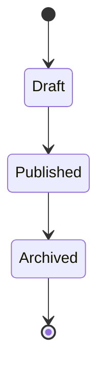
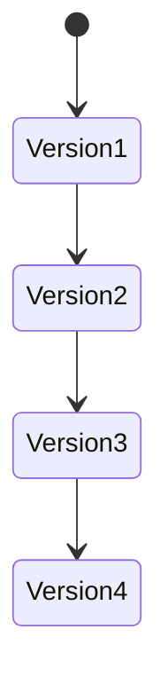
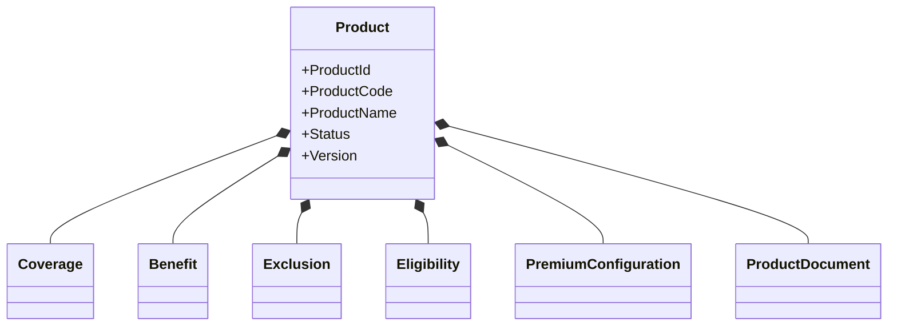
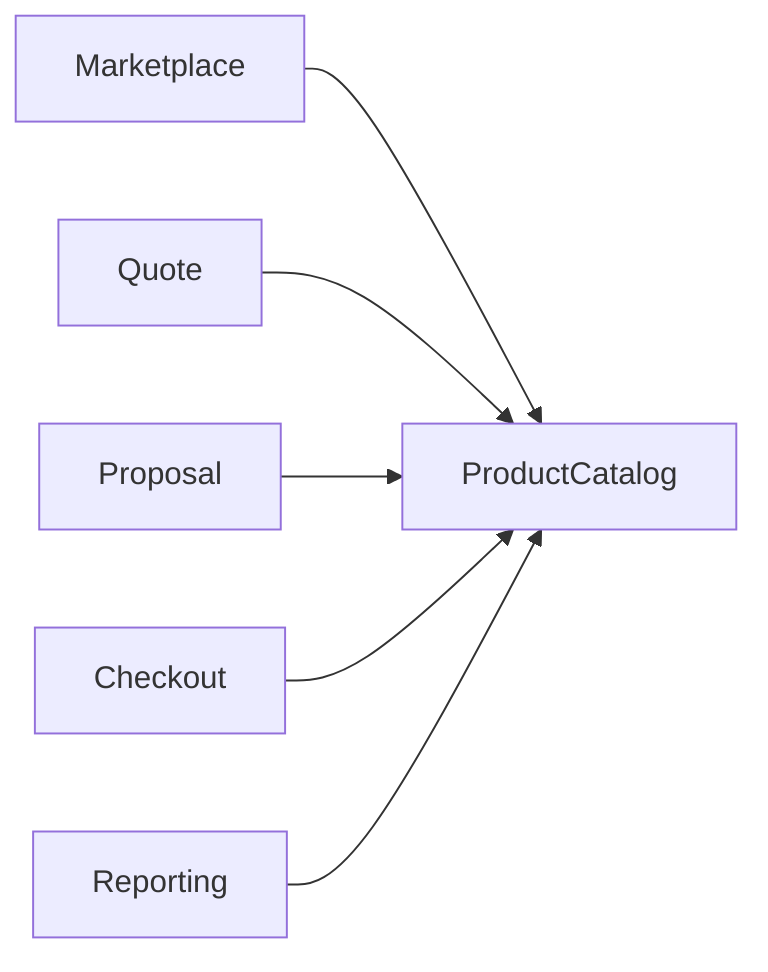
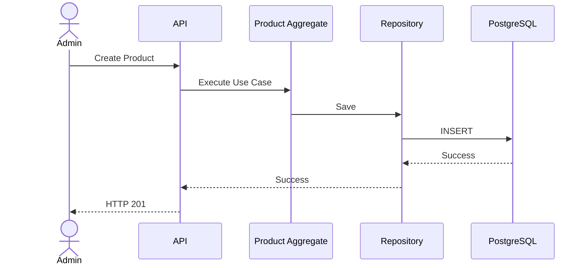

# APPENDIX.md

> **Appendix**  
> **Project:** Pulse Engine – Product Catalog Service  
> **Version:** 1.0  
> **Status:** Draft

---

# Appendix A. REST API Summary

## Insurance Company

| Method | URI | Description |
| ---------- | ------------------------------- | ---------------------------- |
| POST | /api/v1/companies | Create Company |
| PUT | /api/v1/companies/{id} | Update Company |
| POST | /api/v1/companies/{id}/activate | Activate Company |
| POST | /api/v1/companies/{id}/deactivate | Deactivate Company |
| GET | /api/v1/companies | Search Company |
| GET | /api/v1/companies/{id} | Company Detail |

---

## Product

| Method | URI | Description |
| ---------- | ----------------------------------------------- | ------------------------- |
| POST | /api/v1/products | Create Product |
| PUT | /api/v1/products/{id} | Update Draft Product |
| POST | /api/v1/products/{id}/publish | Publish Product |
| POST | /api/v1/products/{id}/archive | Archive Product |
| GET | /api/v1/products | Search Product |
| GET | /api/v1/products/{id} | Product Detail |

---

## Product Configuration

| Method | URI |
| ---------- | -------------------------------- |
| PUT | /products/{id}/coverage |
| PUT | /products/{id}/benefits |
| PUT | /products/{id}/exclusions |
| PUT | /products/{id}/eligibility |
| PUT | /products/{id}/premium |
| PUT | /products/{id}/documents |

---

## Version

| Method | URI |
| ---------- | ------------------------------------------ |
| GET | /products/{id}/versions |
| GET | /products/{id}/versions/{version} |

---

## Audit

| Method | URI |
| ---------- | ------------------------------- |
| GET | /products/{id}/audit |
| GET | /audit/{auditId} |

---

# Appendix B. API Response Format

## Success Response

```json
{
  "success": true,
  "data": {},
  "timestamp": "2026-08-01T10:00:00Z"
}
```

---

## Error Response

```json
{
  "success": false,
  "code": "VALIDATION_ERROR",
  "message": "Validation failed.",
  "errors": []
}
```

---

## Pagination Response

```json
{
  "content": [],
  "page": 0,
  "size": 20,
  "totalElements": 120,
  "totalPages": 6
}
```

---

# Appendix C. JSON Examples

## Create Company

```json
{
  "companyCode": "PRU",
  "companyName": "Prudential Indonesia"
}
```

---

## Create Product

```json
{
  "companyId": "UUID",
  "productCode": "PA001",
  "productName": "Personal Accident Basic"
}
```

---

## Coverage

```json
[
  {
    "code": "ACCIDENT_DEATH",
    "name": "Accidental Death"
  }
]
```

---

## Benefit

```json
[
  {
    "code": "BEN001",
    "description": "Santunan Meninggal Dunia"
  }
]
```

---

## Eligibility Configuration

```json
{
  "minimumAge": 18,
  "maximumAge": 65
}
```

---

## Premium Configuration

```json
{
  "premiumCode": "STD"
}
```

---

# Appendix D. Product Lifecycle



---

# Appendix E. Product Version Lifecycle



Published Version bersifat immutable.

---

# Appendix F. Product Aggregate



---

# Appendix G. Context Map



---

# Appendix H. CRUD Matrix

| Module | Create | Read | Update | Delete |
| ---------- | :------: | :----: | :------: | :------: |
| Company | ✔ | ✔ | ✔ | ✖ |
| Product | ✔ | ✔ | ✔* | ✖ |
| Coverage | ✔ | ✔ | ✔ | ✖ |
| Benefit | ✔ | ✔ | ✔ | ✖ |
| Exclusion | ✔ | ✔ | ✔ | ✖ |
| Eligibility | ✔ | ✔ | ✔ | ✖ |
| Premium Configuration | ✔ | ✔ | ✔ | ✖ |
| Product Document | ✔ | ✔ | ✔ | ✖ |
| Product Version | ✖ | ✔ | ✖ | ✖ |
| Audit History | ✖ | ✔ | ✖ | ✖ |

\* Hanya Draft Product yang dapat diubah.

---

# Appendix I. Status Transition Matrix

| Current | Next | Allowed |
| ---------- | ------ | ---------- |
| Draft | Published | ✔ |
| Draft | Archived | ✖ |
| Published | Draft | ✖* |
| Published | Archived | ✔ |
| Archived | Draft | ✖ |
| Archived | Published | ✖ |

\* Perubahan Published Product menghasilkan **Draft Version baru**, bukan mengubah status versi yang sudah dipublikasikan.

---

# Appendix J. Error Code

| Error Code | HTTP | Description |
| ------------ | ------ | ------------- |
| VALIDATION_ERROR | 400 | Request tidak valid |
| INVALID_STATUS | 400 | Status tidak valid |
| INVALID_TRANSITION | 400 | Status transition tidak valid |
| PRODUCT_NOT_READY | 400 | Product belum siap dipublish |
| COMPANY_NOT_FOUND | 404 | Company tidak ditemukan |
| PRODUCT_NOT_FOUND | 404 | Product tidak ditemukan |
| VERSION_NOT_FOUND | 404 | Product Version tidak ditemukan |
| DUPLICATE_COMPANY_CODE | 409 | Company Code sudah digunakan |
| DUPLICATE_PRODUCT_CODE | 409 | Product Code sudah digunakan |
| CONCURRENT_MODIFICATION | 409 | Optimistic Locking gagal |
| UNAUTHORIZED | 401 | JWT tidak valid |
| FORBIDDEN | 403 | Hak akses ditolak |
| INTERNAL_SERVER_ERROR | 500 | Kesalahan sistem |

---

# Appendix K. Business Status

## Company Status

| Status | Description |
| ---------- | ------------- |
| ACTIVE | Company aktif |
| INACTIVE | Company tidak aktif |

---

## Product Status

| Status | Description |
| ---------- | ------------- |
| DRAFT | Belum dipublish |
| PUBLISHED | Aktif digunakan consumer |
| ARCHIVED | Tidak aktif tetapi histori tetap tersedia |

---

# Appendix L. Role Matrix

| Feature | Product Admin | Business User | Read Only | Marketplace |
| ---------- | :-------------: | :-------------: | :---------: | :-----------: |
| Company Management | ✔ | ✖ | ✖ | ✖ |
| Product Management | ✔ | ✖ | ✖ | ✖ |
| Publish Product | ✔ | ✖ | ✖ | ✖ |
| Archive Product | ✔ | ✖ | ✖ | ✖ |
| View Product | ✔ | ✔ | ✔ | ✔ |
| View Version | ✔ | ✔ | ✔ | Published Only |
| View Audit | ✔ | ✔* | ✖ | ✖ |

\* Mengikuti kebijakan akses yang disetujui Business Owner.

---

# Appendix M. Sequence Overview



---

# Appendix N. Folder Structure

```text
product-catalog/

├── api
│   ├── company
│   ├── product
│   ├── version
│   └── audit
│
├── application
│   ├── command
│   ├── query
│   ├── service
│   └── mapper
│
├── domain
│   ├── company
│   ├── product
│   ├── version
│   ├── audit
│   └── shared
│
├── infrastructure
│   ├── persistence
│   ├── rest
│   ├── security
│   ├── cache
│   └── flyway
│
└── test
```

---

# Appendix O. Database Tables

| Table | Purpose |
| --------- | ---------------------------- |
| insurance_company | Company Master |
| product | Product Aggregate Root |
| product_version | Product Snapshot |
| coverage | Coverage Configuration |
| benefit | Benefit Configuration |
| exclusion | Exclusion Configuration |
| eligibility_configuration | Eligibility Metadata |
| premium_configuration | Premium Metadata |
| product_document | Document Metadata |
| audit_history | Audit Trail |

---

# Appendix P. Domain Events

| Domain Event | Trigger |
| -------------- | --------- |
| CompanyCreated | Company dibuat |
| CompanyUpdated | Company diperbarui |
| CompanyActivated | Company diaktifkan |
| CompanyDeactivated | Company dinonaktifkan |
| ProductCreated | Product dibuat |
| ProductUpdated | Draft Product diperbarui |
| ProductPublished | Product dipublish |
| ProductArchived | Product diarsipkan |
| ProductVersionCreated | Versi baru dibuat |
| ProductConfigurationUpdated | Konfigurasi berubah |

Catatan: Event di atas merupakan **Domain Events** internal pada Product Catalog. BRD tidak mendefinisikan event publishing ke message broker (Kafka/Event Bus), sehingga dokumen ini tidak mengasumsikan adanya integrasi asynchronous.

---

# Appendix Q. Business Invariants

Seluruh Product Aggregate harus memenuhi invariant berikut:

1. Product selalu dimiliki tepat satu Insurance Company.
2. Product Code unik dalam satu Insurance Company.
3. Published Product tidak dapat dimodifikasi.
4. Perubahan Published Product menghasilkan Product Version baru.
5. Product Version bersifat immutable.
6. Audit History bersifat append-only.
7. Soft Delete tidak menghapus histori data.
8. Consumer hanya membaca Product melalui REST API.
9. Tidak ada database sharing antar service.
10. Product Catalog hanya mengelola metadata produk dan tidak melakukan Premium Calculation, Eligibility Validation, Quote, Checkout, Payment, Policy Issuance, maupun Underwriting.

---

# Appendix R. Glossary

| Term | Definition |
| ------ | ------------ |
| Insurance Company | Perusahaan asuransi pemilik produk |
| Product | Produk Personal Accident Insurance |
| Coverage | Risiko yang ditanggung produk |
| Benefit | Manfaat yang diberikan kepada nasabah |
| Exclusion | Kondisi yang tidak ditanggung |
| Eligibility | Konfigurasi syarat kelayakan produk |
| Premium Configuration | Metadata konfigurasi premi yang digunakan oleh Premium Engine |
| Product Version | Snapshot immutable dari suatu versi produk |
| Product Catalog | Single Source of Truth metadata produk |
| Audit Trail | Riwayat seluruh perubahan produk |
| Consumer | Service yang menggunakan Product Catalog melalui API |
