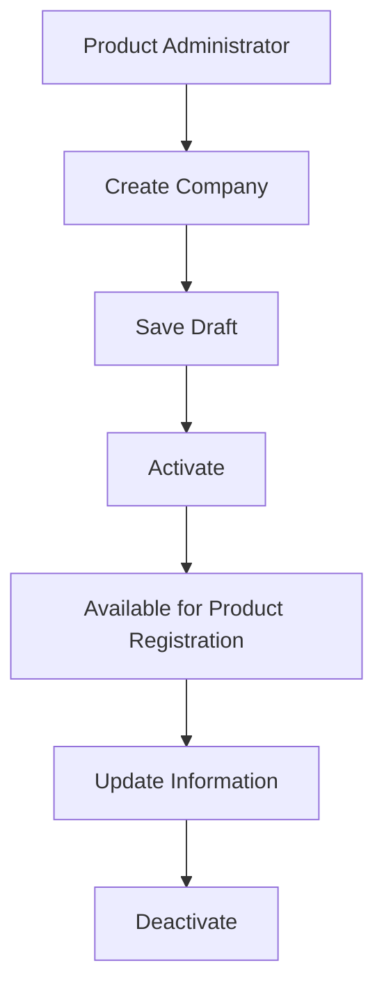
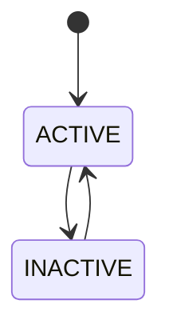
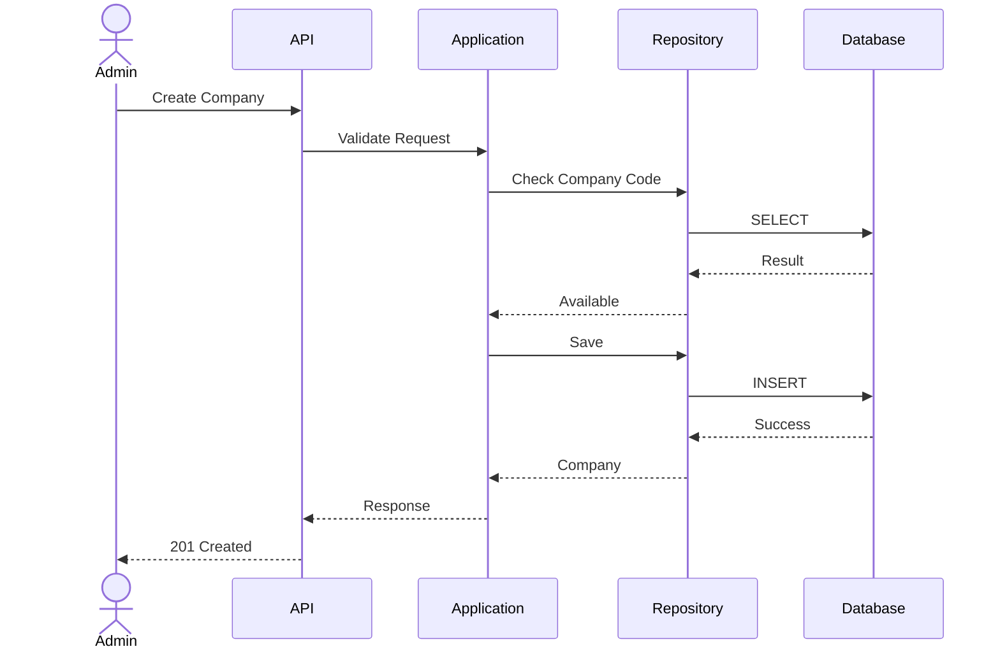

# FSD_01_INSURANCE_COMPANY_MANAGEMENT.md

> **Functional Specification Document (FSD)**
> **Module:** Insurance Company Management
> **Project:** Pulse Engine – Product Catalog Service
> **Version:** 1.0
> **Status:** Draft
> **Reference:** BRD-PC-001 - BR-01

---

# 1. Purpose

Dokumen ini menjelaskan spesifikasi fungsional modul **Insurance Company Management** yang bertanggung jawab mengelola master data perusahaan asuransi sebagai pemilik produk pada Product Catalog.

Modul ini merupakan fondasi seluruh Product Catalog karena setiap produk harus dimiliki oleh tepat satu perusahaan asuransi sesuai Business Rule BR-006 dan satu perusahaan dapat memiliki banyak produk sesuai BR-007.

---

# 2. Objective

Modul ini memungkinkan Product Administrator untuk:

* mendaftarkan perusahaan asuransi baru
* memperbarui informasi perusahaan
* mengaktifkan perusahaan
* menonaktifkan perusahaan

Modul ini **tidak** mengelola kontrak kerja sama, legal agreement, ataupun settlement.

---

# 3. Business Scope

## In Scope

* Create Insurance Company
* Update Insurance Company
* Activate Insurance Company
* Deactivate Insurance Company
* Search Insurance Company
* Get Company Detail

## Out of Scope

* Product Management
* User Management
* Partner Agreement
* Commission
* Financial Settlement
* Billing
* Authentication

---

# 4. Actor

| Actor                 | Description               |
| --------------------- | ------------------------- |
| Product Administrator | Mengelola data perusahaan |
| Product Owner         | Melihat data perusahaan   |
| Marketplace           | Read Only                 |
| Quote Service         | Read Only                 |
| Proposal Service      | Read Only                 |
| Checkout Service      | Read Only                 |

---

# 5. Business Process



---

# 6. Functional Requirement

## FR-01

Create Insurance Company

---

### Description

Administrator dapat menambahkan perusahaan asuransi baru ke Product Catalog.

---

### Preconditions

Administrator telah login.

---

### Trigger

Administrator memilih menu

```
Create Insurance Company
```

---

### Main Flow

1 Administrator membuka halaman Company.

2 Administrator memilih Create.

3 Administrator mengisi seluruh informasi perusahaan.

4 Sistem melakukan validasi.

5 Sistem menyimpan data.

6 Sistem membuat audit log.

7 Sistem menampilkan data perusahaan.

---

### Alternative Flow

Jika Company Code telah digunakan maka sistem menolak penyimpanan.

---

### Exception Flow

Apabila database gagal menyimpan data maka transaksi dibatalkan.

---

### Post Condition

Perusahaan berhasil tersimpan.

Status awal perusahaan adalah **ACTIVE** (lihat BD-01).

---

# 7. Update Insurance Company

---

## Description

Administrator dapat memperbarui informasi perusahaan.

---

### Editable Field

* Company Name
* Logo
* Contact Information

---

### Not Editable

* Company Code

Company Code merupakan **Business Key** yang diinput manual dan bersifat immutable (lihat BD-02).

---

### Main Flow

Administrator

↓

Open Company

↓

Edit

↓

Validation

↓

Save

↓

Audit

---

# 8. Activate Company

---

## Description

Mengaktifkan perusahaan sehingga dapat digunakan untuk pembuatan produk baru.

---

### Validation

Perusahaan belum aktif.

---

### Result

Status menjadi

```
ACTIVE
```

---

# 9. Deactivate Company

---

## Description

Menonaktifkan perusahaan.

---

### Validation

Perusahaan masih ada.

---

### Result

Status menjadi

```
INACTIVE
```

---

### Important Notes

Company hanya boleh di-Deactivate apabila **tidak memiliki Product berstatus Published** (lihat BD-03).

Jika masih memiliki Product Published, sistem mengembalikan:

```
409 CONFLICT
COMPANY_HAS_ACTIVE_PRODUCTS
```

---

# 10. Business Rules

| Rule   | Description                            |
| ------ | -------------------------------------- |
| BR-006 | Satu produk dimiliki satu perusahaan   |
| BR-007 | Satu perusahaan memiliki banyak produk |

Tidak ada business rule lain mengenai Insurance Company pada BRD.

---

# 11. Validation Rules

| Field               | Validation                      |
| ------------------- | ------------------------------- |
| Company Code        | Mandatory                       |
| Company Code        | Unique                          |
| Company Name        | Mandatory                       |
| Logo                | Optional (lihat BD-04)          |
| Contact Information | Metadata (lihat BD-05)          |
| Status              | Mandatory                       |

Field mengikuti Business Data Requirements. BRD tidak mendefinisikan panjang field maupun format data.

---

# 12. Data Model

## Insurance Company

| Field              | Type      |
| ------------------ | --------- |
| companyId          | UUID      |
| companyCode        | VARCHAR   |
| companyName        | VARCHAR   |
| logoUrl            | TEXT      |
| contactInformation | JSONB     |
| status             | ENUM      |
| createdAt          | TIMESTAMP |
| createdBy          | VARCHAR   |
| updatedAt          | TIMESTAMP |
| updatedBy          | VARCHAR   |
| version            | BIGINT    |
| deleted            | BOOLEAN   |

---

# 13. State Machine



**Catatan:** BRD hanya menyebut Aktivasi dan Nonaktifkan perusahaan, sehingga state machine dibatasi pada dua status tersebut.

---

# 14. REST API

## Create Company

```
POST /api/v1/companies
```

---

## Update Company

```
PUT /api/v1/companies/{companyId}
```

---

## Activate

```
PATCH /api/v1/companies/{companyId}/activate
```

---

## Deactivate

```
PATCH /api/v1/companies/{companyId}/deactivate
```

---

## Search

```
GET /api/v1/companies
```

---

## Detail

```
GET /api/v1/companies/{companyId}
```

---

# 15. API Request

```json
{
  "companyCode": "PRU",
  "companyName": "Prudential Indonesia",
  "logoUrl": "https://logo.example/pru.png",
  "contactInformation": {
    "email": "partner@prudential.co.id",
    "phone": "+62-21-000000"
  }
}
```

---

# 16. API Response

```json
{
  "companyId": "UUID",
  "companyCode": "PRU",
  "companyName": "Prudential Indonesia",
  "status": "ACTIVE"
}
```

---

# 17. Error Response

```json
{
  "timestamp": "2026-08-03T09:00:00Z",
  "code": "COMPANY_ALREADY_EXISTS",
  "message": "Company Code already exists."
}
```

---

# 18. Audit Trail

Setiap perubahan menghasilkan audit record:

* Action
* Entity
* Entity Id
* Before
* After
* User
* Timestamp
* Reason

Audit Trail merupakan kebutuhan nonfungsional wajib pada BRD.

---

# 19. Sequence Diagram



---

# 20. Acceptance Criteria

| ID    | Scenario               | Expected Result    |
| ----- | ---------------------- | ------------------ |
| AC-01 | Create Company         | Data tersimpan     |
| AC-02 | Duplicate Company Code | Ditolak            |
| AC-03 | Update Company         | Data berubah       |
| AC-04 | Activate Company       | Status ACTIVE      |
| AC-05 | Deactivate Company     | Status INACTIVE    |
| AC-06 | Search Company         | Data ditemukan     |
| AC-07 | Detail Company         | Detail ditampilkan |

---

# 21. Requirement Traceability Matrix

| BRD   | Functional Requirement |
| ----- | ---------------------- |
| BR-01 | Create Company         |
| BR-01 | Update Company         |
| BR-01 | Activate Company       |
| BR-01 | Deactivate Company     |

---

# 22. Business Decisions

Selama penyusunan FSD dilakukan beberapa keputusan desain untuk menghilangkan ambiguitas yang tidak bertentangan dengan BRD.

| ID    | Decision                                                                                                                       | Status   |
| ----- | ------------------------------------------------------------------------------------------------------------------------------ | -------- |
| BD-01 | Status awal Company adalah **ACTIVE**                                                                                          | Approved |
| BD-02 | Company Code merupakan **Business Key** yang diinput manual dan harus unik                                                     | Approved |
| BD-03 | Company tidak dapat dinonaktifkan apabila masih memiliki Product berstatus **Published**                                       | Approved |
| BD-04 | Logo Company bersifat **opsional** dan tidak mempengaruhi proses bisnis                                                        | Approved |
| BD-05 | Contact Information berada di **luar ruang lingkup** Product Catalog dan memerlukan requirement terpisah apabila diimplementasikan | Approved |

## Catatan Arsitektur

Dari kelima item tersebut, **hanya BD-05 yang benar-benar tidak dapat disimpulkan dari BRD**. Empat item lainnya adalah keputusan desain yang diperlukan agar implementasi dapat berjalan dan **tidak menambah ruang lingkup bisnis**.

Dengan mengganti istilah **"Open Items / Business Clarification"** menjadi **"Business Decisions"**, FSD menjadi baseline yang siap diimplementasikan oleh tim engineering tanpa menyisakan pertanyaan terbuka.
