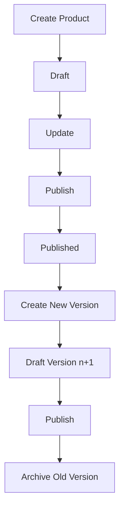
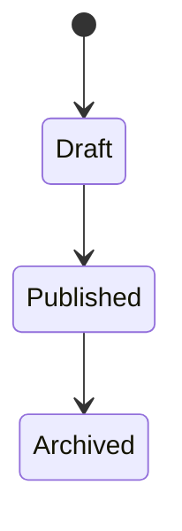
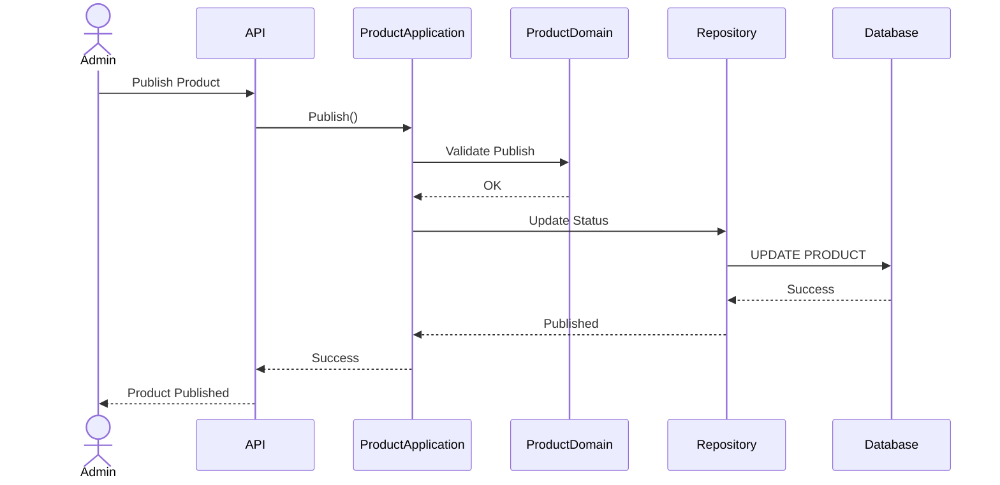

# FSD_02_PRODUCT_MANAGEMENT.md

> **Functional Specification Document (FSD)**
> **Module:** Product Management
> **Project:** Pulse Engine – Product Catalog Service
> **Version:** 1.0
> **Status:** Draft
> **Reference:** BRD-PC-001 (BR-02, BR-03, BR-04, BR-05, BR-13, BR-14)  

---

# 1. Purpose

Dokumen ini mendefinisikan spesifikasi fungsional **Product Management** yang bertanggung jawab mengelola siklus hidup (lifecycle) produk Personal Accident Insurance mulai dari pembuatan hingga penghentian (archive).

Modul ini tidak mengelola konfigurasi Benefit, Coverage, Eligibility, Premium Configuration, Exclusion maupun Product Document karena modul tersebut dibahas pada **FSD_03_PRODUCT_CONFIGURATION.md**.

---

# 2. Objective

Modul Product Management bertujuan untuk:

* membuat produk baru
* memperbarui informasi produk
* mempublikasikan produk
* mengarsipkan produk
* mengelola versioning produk
* menyediakan histori versi produk

---

# 3. Business Scope

## In Scope

* Create Product
* Update Product
* Publish Product
* Archive Product
* Product Version
* Version History
* Product Detail
* Product Status

## Out of Scope

* Coverage
* Benefit
* Exclusion
* Eligibility
* Premium Configuration
* Premium Calculation
* Underwriting
* Quote
* Checkout
* Policy Issuance

---

# 4. Actor

| Actor                 | Responsibility         |
| --------------------- | ---------------------- |
| Product Administrator | Mengelola produk       |
| Product Owner         | Review produk          |
| Marketplace           | Read Published Product |
| Quote Service         | Read Published Product |
| Proposal Service      | Read Product Snapshot  |
| Checkout Service      | Read Product Reference |

---

# 5. Business Process

Diagram di atas mencerminkan lifecycle dasar produk berdasarkan BRD, dengan penambahan langkah "Create New Version" sebagai implementasi langsung dari aturan bahwa setiap perubahan menghasilkan versi baru.  

---

# 6. Functional Requirement

## FR-02-01 Create Product

### Description

Administrator membuat produk baru untuk perusahaan asuransi.

---

### Preconditions

* User telah login.
* Insurance Company telah tersedia.

---

### Main Flow

1. Administrator memilih Company.
2. Administrator memilih **Create Product**.
3. Administrator mengisi informasi dasar produk.
4. Sistem melakukan validasi.
5. Sistem membuat Product Version = 1.
6. Sistem menyimpan status **Draft**.
7. Sistem membuat Audit Trail.

---

### Alternative Flow

Jika Product Code telah digunakan pada perusahaan yang sama maka penyimpanan ditolak.

**Assumption:** BRD tidak mendefinisikan apakah Product Code bersifat unik secara global atau per perusahaan. FSD ini mengasumsikan unik per perusahaan dan perlu dikonfirmasi.

---

### Post Condition

Product berhasil dibuat dengan status **Draft**.

---

# 7. FR-02-02 Update Product

## Description

Administrator memperbarui informasi dasar produk.

---

### Editable Field

* Product Name
* Product Category
* Effective Date
* Expiry Date

---

### Not Editable

* Product Code
* Company

**Assumption:** BRD tidak menjelaskan apakah perpindahan kepemilikan produk antar perusahaan diperbolehkan. FSD menganggap tidak diperbolehkan karena BR-006 menyatakan satu produk dimiliki oleh satu perusahaan.

---

### Validation

Produk dengan status **Published** tidak boleh diubah langsung.

Implementasi perubahan dilakukan melalui pembuatan versi baru sesuai BR-004 dan BR-005.

---

# 8. FR-02-03 Publish Product

## Description

Administrator mempublikasikan produk sehingga dapat digunakan oleh Marketplace dan consumer lainnya.

---

### Preconditions

Sebelum Publish, sistem harus memastikan:

* Product memiliki minimal satu Benefit.
* Product memiliki minimal satu Coverage.
* Eligibility telah dikonfigurasi.
* Premium Configuration telah dikonfigurasi.

Persyaratan ini berasal langsung dari Business Rules BR-008 sampai BR-011.

---

### Main Flow

1. Administrator memilih Publish.
2. Sistem melakukan seluruh validasi.
3. Sistem mengubah status menjadi Published.
4. Sistem mencatat Publish History.
5. Sistem mencatat Audit Trail.

---

### Exception Flow

Apabila validasi gagal maka Publish ditolak dan produk tetap berstatus Draft.

---

### Post Condition

Produk tersedia bagi seluruh consumer.

---

# 9. FR-02-04 Archive Product

## Description

Administrator menghentikan penggunaan produk tanpa menghapus histori.

Hal ini memenuhi BR-05.

---

### Main Flow

1. Administrator memilih Archive.
2. Sistem mengubah status menjadi Archived.
3. Data historis tetap tersedia.
4. Audit Trail dibuat.

---

### Validation

Produk yang telah diarsipkan tidak dapat dipublikasikan kembali.

**Assumption:** BRD tidak mendefinisikan transisi dari Archived ke Published. FSD ini memilih status Archived sebagai terminal state dan keputusan ini perlu divalidasi dengan Business Owner.

---

# 10. Product Lifecycle

State machine ini hanya menggunakan status yang secara eksplisit didukung BRD: Draft, Published, dan Archive. Tidak ditambahkan status seperti Pending Approval karena BRD hanya menunjukkan langkah "Submit for Approval" pada proses bisnis tanpa mendefinisikannya sebagai status sistem.

---

# 11. Business Rules

| Rule   | Description                                      |
| ------ | ------------------------------------------------ |
| BR-001 | Hanya Published yang dapat digunakan Marketplace |
| BR-002 | Draft tidak terlihat oleh customer               |
| BR-003 | Inactive tidak digunakan untuk Quote baru        |
| BR-004 | Published tidak boleh diubah langsung            |
| BR-005 | Perubahan menghasilkan versi baru                |
| BR-006 | Product dimiliki satu Company                    |
| BR-008 | Minimal satu Benefit                             |
| BR-009 | Minimal satu Coverage                            |
| BR-010 | Eligibility wajib sebelum Publish                |
| BR-011 | Premium Configuration wajib sebelum Publish      |
| BR-012 | Quote menggunakan versi saat Quote dibuat        |

Seluruh aturan di atas berasal dari Business Rules pada BRD.

---

# 12. Data Model

## Product

| Field                 | Type      |
| --------------------- | --------- |
| productId             | UUID      |
| companyId             | UUID      |
| productCode           | VARCHAR   |
| productName           | VARCHAR   |
| category              | VARCHAR   |
| version               | INTEGER   |
| status                | ENUM      |
| effectiveDate         | DATE      |
| expiryDate            | DATE      |
| createdAt             | TIMESTAMP |
| updatedAt             | TIMESTAMP |
| createdBy             | VARCHAR   |
| updatedBy             | VARCHAR   |
| deleted               | BOOLEAN   |
| optimisticLockVersion | BIGINT    |

---

# 13. REST API

| Method | URI                              | Description     |
| ------ | -------------------------------- | --------------- |
| POST   | `/api/v1/products`               | Create Product  |
| PUT    | `/api/v1/products/{id}`          | Update Product  |
| POST   | `/api/v1/products/{id}/publish`  | Publish Product |
| POST   | `/api/v1/products/{id}/archive`  | Archive Product |
| GET    | `/api/v1/products/{id}`          | Product Detail  |
| GET    | `/api/v1/products`               | Product Search  |
| GET    | `/api/v1/products/{id}/versions` | Version History |

---

# 14. Sequence Diagram

---

# 15. Acceptance Criteria

| ID    | Scenario                            | Expected Result           |
| ----- | ----------------------------------- | ------------------------- |
| AC-01 | Create Product                      | Draft berhasil dibuat     |
| AC-02 | Duplicate Product Code              | Ditolak                   |
| AC-03 | Update Draft                        | Berhasil                  |
| AC-04 | Update Published                    | Ditolak                   |
| AC-05 | Publish tanpa Benefit               | Ditolak                   |
| AC-06 | Publish tanpa Coverage              | Ditolak                   |
| AC-07 | Publish tanpa Eligibility           | Ditolak                   |
| AC-08 | Publish tanpa Premium Configuration | Ditolak                   |
| AC-09 | Publish lengkap                     | Berhasil                  |
| AC-10 | Archive Product                     | Status Archived           |
| AC-11 | Version History                     | Seluruh versi ditampilkan |

---

# 16. Open Items / Business Clarification

| ID    | Pertanyaan                                                                                                                                                             |
| ----- | ---------------------------------------------------------------------------------------------------------------------------------------------------------------------- |
| OI-01 | Apakah Product Code unik secara global atau per perusahaan?                                                                                                            |
| OI-02 | Apakah Effective Date boleh lebih kecil dari tanggal Publish?                                                                                                          |
| OI-03 | Apakah Expiry Date wajib diisi atau dapat kosong?                                                                                                                      |
| OI-04 | Apakah produk Archived dapat dibuatkan versi baru?                                                                                                                     |
| OI-05 | Apakah proses "Submit for Approval" melibatkan workflow persetujuan atau hanya langkah operasional? BRD belum mendefinisikan aktor approval maupun aturan transisinya. |

### Catatan Arsitektur

Pada implementasi DDD nantinya, **Product** akan menjadi **Aggregate Root**. Seluruh operasi Create, Update, Publish, Archive, dan Create New Version harus dieksekusi melalui aggregate ini untuk memastikan seluruh Business Rules (BR-001 s.d. BR-012) tervalidasi di satu tempat tanpa duplikasi logika.
