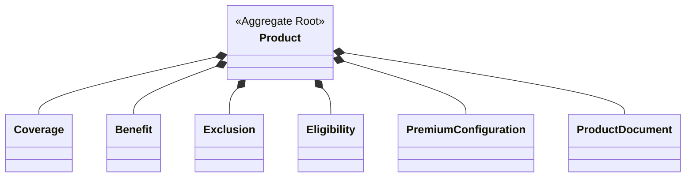

# FSD_03_PRODUCT_CONFIGURATION.md

> **Functional Specification Document (FSD)**
> **Module:** Product Configuration
> **Project:** Pulse Engine – Product Catalog Service
> **Version:** 1.0
> **Status:** Draft
> **Reference:** BRD-PC-001 (BR-06 s.d BR-10)

---

# 1. Purpose

Dokumen ini menjelaskan spesifikasi fungsional **Product Configuration** yang bertanggung jawab mengelola seluruh konfigurasi produk Personal Accident Insurance.

Konfigurasi ini merupakan bagian dari **Product Aggregate** dan tidak dapat berdiri sendiri.

Setiap perubahan konfigurasi akan menghasilkan **versi Product baru**.

---

# 2. Objective

Modul ini memungkinkan administrator mengelola:

* Coverage
* Benefit
* Exclusion
* Eligibility
* Premium Configuration
* Product Document

Modul ini **tidak melakukan**:

* Premium Calculation
* Eligibility Validation
* Underwriting
* Quote Calculation

Product Catalog hanya menyimpan metadata konfigurasi sesuai batasan BRD.

---

# 3. Aggregate Relationship



## Aggregate Boundary

Aggregate Root

* Product

Child Entity

* Coverage
* Benefit
* Exclusion
* Eligibility
* Premium Configuration
* Product Document

Tidak ada child entity yang boleh diubah secara langsung tanpa melalui Product Aggregate.

---

# 4. Functional Module

```text
Product Configuration

├── Coverage

├── Benefit

├── Exclusion

├── Eligibility

├── Premium Configuration

└── Product Document
```

---

# 5. Coverage Management

## Description

Coverage menjelaskan nilai pertanggungan yang diberikan oleh suatu produk.

BRD mendefinisikan Coverage memiliki:

* Coverage Amount
* Currency

---

## Functional Requirement

### Add Coverage

Administrator dapat menambahkan Coverage.

---

### Update Coverage

Administrator dapat memperbarui Coverage selama Product masih Draft.

---

### Delete Coverage

Coverage dapat dihapus selama Product belum Published.

---

## Validation

Minimal terdapat satu Coverage sebelum Publish.

Business Rule BR-009.

---

## Data Model

| Field            | Type    |
| ---------------- | ------- |
| coverageId       | UUID    |
| productVersionId | UUID    |
| coverageAmount   | DECIMAL |
| currency         | VARCHAR |

---

# 6. Benefit Management

## Description

Benefit mendefinisikan manfaat produk.

Field yang didefinisikan BRD:

* Benefit Name
* Description
* Maximum Limit

---

## Functional Requirement

* Add Benefit
* Update Benefit
* Delete Benefit

---

## Validation

Minimal terdapat satu Benefit.

Business Rule BR-008.

---

## Data Model

| Field            | Type    |
| ---------------- | ------- |
| benefitId        | UUID    |
| productVersionId | UUID    |
| benefitName      | VARCHAR |
| description      | TEXT    |
| maximumLimit     | DECIMAL |

---

# 7. Exclusion Management

## Description

Administrator mengelola daftar pengecualian polis.

BRD hanya mendefinisikan:

* Exclusion Description

---

## Functional Requirement

* Add Exclusion
* Update Exclusion
* Delete Exclusion

---

## Validation

Tidak terdapat Business Rule mengenai jumlah minimum Exclusion.

FSD tidak menambahkan aturan tambahan.

---

## Data Model

| Field            | Type |
| ---------------- | ---- |
| exclusionId      | UUID |
| productVersionId | UUID |
| description      | TEXT |

---

# 8. Eligibility Configuration

## Description

Product Catalog hanya menyimpan konfigurasi Eligibility.

Engine lain akan melakukan validasi saat Quote.

---

## Data

BRD mendefinisikan:

* Minimum Age
* Maximum Age
* Occupation Class
* Nationality
* Residency

---

## Functional Requirement

* Configure Eligibility
* Update Eligibility

---

## Validation

Eligibility wajib tersedia sebelum Publish.

Business Rule BR-010.

---

## Data Model

| Field            | Type    |
| ---------------- | ------- |
| eligibilityId    | UUID    |
| productVersionId | UUID    |
| minimumAge       | INTEGER |
| maximumAge       | INTEGER |
| occupationClass  | VARCHAR |
| nationality      | VARCHAR |
| residency        | VARCHAR |

---

# 9. Premium Configuration

## Description

Product Catalog hanya menyimpan konfigurasi premium.

Perhitungan dilakukan Premium Engine.

---

## Data

* Coverage Band
* Age Band
* Occupation Class
* Base Premium

---

## Functional Requirement

* Add Premium Configuration
* Update Premium Configuration
* Delete Premium Configuration

---

## Validation

Premium Configuration wajib tersedia sebelum Publish.

Business Rule BR-011.

---

## Data Model

| Field                  | Type    |
| ---------------------- | ------- |
| premiumConfigurationId | UUID    |
| productVersionId       | UUID    |
| coverageBand           | VARCHAR |
| ageBand                | VARCHAR |
| occupationClass        | VARCHAR |
| basePremium            | DECIMAL |

---

# 10. Product Document

## Description

Administrator mengelola dokumen pendukung produk.

Business Context menyebutkan Product memiliki Product Document sebagai metadata yang dikelola Product Catalog.

---

## Functional Requirement

* Upload Product Document
* Replace Product Document
* Delete Product Document
* Download Product Document Metadata

---

## Assumption

BRD tidak menjelaskan:

* jenis dokumen
* ukuran maksimum
* media penyimpanan
* format file
* jumlah maksimum dokumen

Oleh karena itu FSD **tidak** mendefinisikan batasan teknis tersebut.

---

## Data Model

| Field            | Type    |
| ---------------- | ------- |
| documentId       | UUID    |
| productVersionId | UUID    |
| documentName     | VARCHAR |
| documentType     | VARCHAR |
| storageReference | VARCHAR |

---

# 11. REST API

## Coverage

| Method | URI                                     |
| ------ | --------------------------------------- |
| POST   | `/products/{id}/coverages`              |
| PUT    | `/products/{id}/coverages/{coverageId}` |
| DELETE | `/products/{id}/coverages/{coverageId}` |

---

## Benefit

| Method | URI                                   |
| ------ | ------------------------------------- |
| POST   | `/products/{id}/benefits`             |
| PUT    | `/products/{id}/benefits/{benefitId}` |
| DELETE | `/products/{id}/benefits/{benefitId}` |

---

## Exclusion

| Method | URI                                       |
| ------ | ----------------------------------------- |
| POST   | `/products/{id}/exclusions`               |
| PUT    | `/products/{id}/exclusions/{exclusionId}` |
| DELETE | `/products/{id}/exclusions/{exclusionId}` |

---

## Eligibility

| Method | URI                          |
| ------ | ---------------------------- |
| PUT    | `/products/{id}/eligibility` |
| GET    | `/products/{id}/eligibility` |

---

## Premium Configuration

| Method | URI                                                       |
| ------ | --------------------------------------------------------- |
| POST   | `/products/{id}/premium-configurations`                   |
| PUT    | `/products/{id}/premium-configurations/{configurationId}` |
| DELETE | `/products/{id}/premium-configurations/{configurationId}` |

---

## Product Document

| Method | URI                                     |
| ------ | --------------------------------------- |
| POST   | `/products/{id}/documents`              |
| DELETE | `/products/{id}/documents/{documentId}` |
| GET    | `/products/{id}/documents`              |

---

# 12. Validation Matrix

| Configuration         | Publish Validation        |
| --------------------- | ------------------------- |
| Coverage              | Minimal 1                 |
| Benefit               | Minimal 1                 |
| Exclusion             | Tidak diwajibkan          |
| Eligibility           | Wajib tersedia            |
| Premium Configuration | Wajib tersedia            |
| Product Document      | Tidak diwajibkan oleh BRD |

---

# 13. Sequence Diagram

```mermaid
sequenceDiagram

actor Admin

participant API

participant Product Aggregate

participant Repository

database DB

Admin->>API: Add Benefit

API->>Product Aggregate: addBenefit()

Product Aggregate->>Product Aggregate: Validate Draft Status

Product Aggregate->>Repository: Save

Repository->>DB: INSERT BENEFIT

DB-->>Repository: OK

Repository-->>Product Aggregate: Benefit Saved

Product Aggregate-->>API: Success

API-->>Admin: 201 Created
```

---

# 14. Acceptance Criteria

| ID    | Scenario                               | Expected Result                                          |
| ----- | -------------------------------------- | -------------------------------------------------------- |
| AC-01 | Add Coverage                           | Berhasil                                                 |
| AC-02 | Update Coverage Draft                  | Berhasil                                                 |
| AC-03 | Delete Coverage Draft                  | Berhasil                                                 |
| AC-04 | Publish tanpa Coverage                 | Ditolak                                                  |
| AC-05 | Publish tanpa Benefit                  | Ditolak                                                  |
| AC-06 | Publish tanpa Eligibility              | Ditolak                                                  |
| AC-07 | Publish tanpa Premium Configuration    | Ditolak                                                  |
| AC-08 | Upload Product Document                | Metadata tersimpan                                       |
| AC-09 | Update Published Product Configuration | Ditolak dan harus melalui pembuatan Product Version baru |

---

# 15. Open Items / Business Clarification

| ID    | Pertanyaan                                                                                                                                                                                                              |
| ----- | ----------------------------------------------------------------------------------------------------------------------------------------------------------------------------------------------------------------------- |
| OI-01 | Apakah satu produk boleh memiliki lebih dari satu Eligibility Configuration atau hanya satu konfigurasi per versi?                                                                                                      |
| OI-02 | Apakah Premium Configuration dapat memiliki banyak kombinasi Coverage Band × Age Band × Occupation Class? BRD hanya mendefinisikan atribut, bukan kardinalitas.                                                         |
| OI-03 | Apakah Product Document bersifat wajib sebelum Publish? BRD tidak menetapkannya sebagai Business Rule.                                                                                                                  |
| OI-04 | Apakah terdapat batas maksimum jumlah Coverage, Benefit, Exclusion, atau Product Document per Product Version?                                                                                                          |
| OI-05 | Apakah penghapusan (Delete) benar-benar menghapus data konfigurasi atau menggunakan Soft Delete? BRD hanya mewajibkan Soft Delete pada tingkat nonfungsional, tetapi tidak menjelaskan penerapannya pada child entity.  |

### Catatan Arsitektur

Seluruh konfigurasi pada dokumen ini merupakan **bagian dari Product Aggregate**. Setiap perubahan terhadap Coverage, Benefit, Exclusion, Eligibility, Premium Configuration, atau Product Document harus diproses melalui **Product Aggregate Root**, sehingga aturan bisnis seperti *Published product cannot be modified directly* dan *every change creates a new version* tetap terjaga secara konsisten tanpa duplikasi logika domain.
