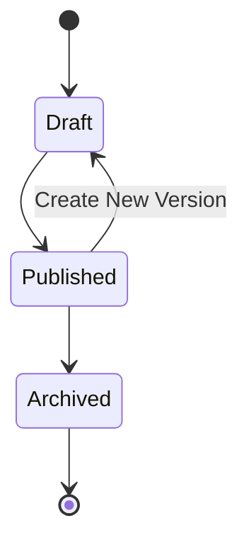

# FSD_05_VERSIONING_AND_AUDIT.md

> **Functional Specification Document (FSD)**  
> **Module:** Product Versioning & Audit Trail  
> **Project:** Pulse Engine – Product Catalog Service  
> **Version:** 1.0  
> **Status:** Draft  
> **Reference:** BRD-PC-001 (BR-13, BR-14, BR-15, Business Rules BR-004, BR-005, BR-012, NFR Audit Trail & Versioning) :contentReference[oaicite:0]{index=0} :contentReference[oaicite:1]{index=1} :contentReference[oaicite:2]{index=2}

---

# 1. Purpose

Dokumen ini mendefinisikan spesifikasi fungsional untuk mekanisme **Product Versioning** dan **Audit Trail** pada Product Catalog Service.

Modul ini memastikan bahwa:

- seluruh perubahan produk dapat ditelusuri,
- histori produk tidak pernah hilang,
- consumer selalu dapat mereferensikan versi produk yang benar,
- seluruh aktivitas administrator terdokumentasi.

Versioning dan Audit Trail merupakan kebutuhan wajib sesuai BRD.

---

# 2. Objective

Modul ini bertujuan untuk:

- menjaga histori perubahan produk
- menjaga konsistensi referensi produk
- mendukung rollback informasi historis
- memenuhi kebutuhan audit regulator
- mendukung snapshot pada Proposal dan Checkout
- menjaga integritas data selama lifecycle produk

---

# 3. Business Scope

## In Scope

- Product Version
- Product History
- Product Snapshot
- Audit Trail
- Publish History
- User Activity
- Version Comparison

## Out of Scope

- Database Backup
- Git Version
- Source Code Versioning
- Infrastructure Audit

---

# 4. Business Requirement Mapping

| BR | Description |
| ---- | ------------- |
| BR-13 | Setiap perubahan produk menghasilkan versi baru |
| BR-14 | Sistem menyediakan histori perubahan produk |
| BR-15 | Product Catalog menjadi sumber data resmi |
| BR-004 | Published Product tidak boleh diubah langsung |
| BR-005 | Perubahan menghasilkan versi baru |
| BR-012 | Quote menggunakan Product Version saat Quote dibuat |

:contentReference[oaicite:3]{index=3} :contentReference[oaicite:4]{index=4}

---

# 5. Versioning Overview

Product Version bersifat **immutable**.

Artinya:

- Published Version tidak boleh berubah.
- Tidak ada UPDATE terhadap Published Version.
- Seluruh perubahan menghasilkan Product Version baru.
- Seluruh versi lama tetap disimpan.

---

# 6. Product Lifecycle



Keterangan:

- Draft dapat diubah.
- Published tidak dapat diubah.
- Perubahan Published menghasilkan Draft Version baru.
- Archived hanya sebagai histori.

---

# 7. Version Lifecycle

Contoh lifecycle produk:

| Version | Status |
| ---------- | -------- |
| V1 | Published |
| V2 | Archived |
| V3 | Published |
| V4 | Draft |

Hanya terdapat satu Published Version dalam satu waktu.

**Assumption:** BRD tidak menyatakan apakah beberapa versi dapat Published secara bersamaan. FSD ini mengasumsikan hanya satu Published Version aktif untuk menjaga konsistensi consumer dan perlu dikonfirmasi dengan Business Owner.

---

# 8. Version Numbering

Version menggunakan integer incremental.

Contoh

```
Version 1
Version 2
Version 3
Version 4
```

Version tidak pernah di-reset.

Version tidak boleh dihapus.

---

# 9. Version Creation

Version baru dibuat ketika terdapat perubahan pada:

- Product Information
- Coverage
- Benefit
- Exclusion
- Eligibility
- Premium Configuration
- Product Document

Tidak ada perubahan lain yang menghasilkan version baru berdasarkan BRD.

---

# 10. Version Snapshot

Setiap Product Version menyimpan snapshot lengkap.

Snapshot meliputi:

- Product
- Coverage
- Benefit
- Exclusion
- Eligibility
- Premium Configuration
- Product Document

Dengan demikian consumer tidak perlu melakukan rekonstruksi data historis.

---

# 11. Publish Flow

```mermaid
sequenceDiagram

actor Admin

participant Product

participant Version

participant Repository

database DB

Admin->>Product: Publish

Product->>Product: Validate

Product->>Version: Freeze Snapshot

Version->>Repository: Save Version

Repository->>DB: INSERT PRODUCT VERSION

DB-->>Repository: Success

Repository-->>Version: OK

Version-->>Product: Published

Product-->>Admin: Success
```

---

# 12. Business Rules

| Rule | Description |
| ------ | ------------- |
| Published Product immutable |
| Published Product tidak boleh UPDATE |
| Draft dapat diubah |
| Archive tidak menghapus histori |
| Version selalu bertambah |
| Version lama tetap tersedia |
| Quote menggunakan Version saat Quote dibuat |
| Proposal menggunakan Snapshot Version |
| Checkout menggunakan referensi Version |

---

# 13. Audit Trail Overview

Audit Trail mencatat seluruh aktivitas administrator.

Audit Trail tidak boleh dihapus.

Audit Trail bersifat append-only.

---

# 14. Audit Event

Audit dibuat ketika terjadi:

- Create Company
- Update Company
- Activate Company
- Deactivate Company
- Create Product
- Update Product
- Publish Product
- Archive Product
- Create Version
- Update Configuration
- Upload Product Document

---

# 15. Audit Information

Audit minimal menyimpan:

- Audit Id
- Entity
- Entity Id
- Action
- Version
- Before
- After
- User
- Timestamp
- Reason
- Correlation Id

---

# 16. Audit Action

| Action |
| ---------- |
| CREATE |
| UPDATE |
| PUBLISH |
| ARCHIVE |
| ACTIVATE |
| DEACTIVATE |
| VERSION_CREATED |
| DOCUMENT_UPLOAD |
| DOCUMENT_DELETE |

---

# 17. Data Model

## Product Version

| Field | Type |
| -------- | ------ |
| productVersionId | UUID |
| productId | UUID |
| version | INTEGER |
| status | ENUM |
| effectiveDate | DATE |
| publishedDate | TIMESTAMP |
| createdAt | TIMESTAMP |
| createdBy | VARCHAR |

---

## Audit History

| Field | Type |
| -------- | ------ |
| auditId | UUID |
| entityName | VARCHAR |
| entityId | UUID |
| action | VARCHAR |
| version | INTEGER |
| beforeData | JSONB |
| afterData | JSONB |
| reason | VARCHAR |
| correlationId | UUID |
| createdBy | VARCHAR |
| createdAt | TIMESTAMP |

---

# 18. REST API

## Version History

```
GET /api/v1/products/{productId}/versions
```

---

## Version Detail

```
GET /api/v1/products/{productId}/versions/{version}
```

---

## Compare Version

```
GET /api/v1/products/{productId}/versions/compare?v1=1&v2=2
```

**Assumption:** Endpoint Compare Version merupakan fitur pendukung Audit History. BRD tidak menyebutkannya secara eksplisit sehingga implementasinya perlu dikonfirmasi apabila dianggap di luar ruang lingkup.

---

## Audit History

```
GET /api/v1/products/{productId}/audit
```

---

## Audit Detail

```
GET /api/v1/audit/{auditId}
```

---

# 19. Version Response

```json
{
  "productId": "UUID",
  "version": 3,
  "status": "PUBLISHED",
  "publishedDate": "2026-08-01T09:30:00Z",
  "createdBy": "admin"
}
```

---

# 20. Audit Response

```json
{
  "auditId": "UUID",
  "entity": "PRODUCT",
  "entityId": "UUID",
  "action": "PUBLISH",
  "version": 3,
  "createdBy": "admin",
  "createdAt": "2026-08-01T09:30:00Z"
}
```

---

# 21. Sequence Diagram

## Create New Version

```mermaid
sequenceDiagram

actor Admin

participant API

participant Product Aggregate

participant Repository

database DB

Admin->>API: Update Published Product

API->>Product Aggregate: Create New Version

Product Aggregate->>Repository: Copy Current Version

Repository->>DB: INSERT Product Version

DB-->>Repository: Success

Repository-->>Product Aggregate: Version Created

Product Aggregate-->>API: Draft Version

API-->>Admin: Success
```

---

## Audit Creation

```mermaid
sequenceDiagram

participant Product Aggregate

participant Audit Service

participant Audit Repository

database DB

Product Aggregate->>Audit Service: Audit Event

Audit Service->>Audit Repository: Save

Audit Repository->>DB: INSERT Audit

DB-->>Audit Repository: Success
```

---

# 22. Acceptance Criteria

| ID | Scenario | Expected Result |
| ---- | ---------- | ---------------- |
| AC-01 | Update Draft | Tidak membuat versi baru |
| AC-02 | Update Published | Membuat Draft Version baru |
| AC-03 | Publish Draft Version | Menjadi Published |
| AC-04 | Archive Product | Histori tetap tersedia |
| AC-05 | Version History | Semua versi ditampilkan |
| AC-06 | Audit History | Semua aktivitas tercatat |
| AC-07 | Quote membaca Version Lama | Berhasil |
| AC-08 | Proposal membaca Snapshot | Berhasil |
| AC-09 | Audit tidak dapat dihapus | Berhasil |
| AC-10 | Published Product diubah langsung | Ditolak |

---

# 23. Requirement Traceability Matrix

| BRD | Functional Requirement |
| ------ | ------------------------ |
| BR-13 | Product Version |
| BR-14 | Version History |
| BR-14 | Audit History |
| BR-15 | Historical Query |
| BR-004 | Immutable Published Product |
| BR-005 | Create New Version |
| BR-012 | Product Snapshot |

---

# 24. Open Items / Business Clarification

| ID | Question |
| ---- | ---------- |
| OI-01 | Apakah Audit History hanya dapat diakses Product Administrator atau juga Business User? |
| OI-02 | Apakah alasan perubahan (`reason`) wajib diisi saat Publish atau setiap perubahan? |
| OI-03 | Berapa lama histori Audit dan Product Version harus disimpan untuk memenuhi kebutuhan regulasi? BRD tidak mendefinisikan retention period. |
| OI-04 | Apakah Archived Product dapat memiliki Draft Version baru? |
| OI-05 | Apakah Compare Version merupakan kebutuhan bisnis atau hanya kebutuhan operasional administrator? |

---

# 25. Architecture Notes

## Aggregate Ownership

Seluruh mekanisme Versioning berada di dalam **Product Aggregate**.

Aggregate Root bertanggung jawab untuk:

- memvalidasi perubahan,
- membuat Product Version baru,
- menjaga immutability Published Version,
- menghasilkan Domain Event,
- membuat Audit Event.

Audit Trail **bukan Aggregate Root**.

Audit Trail merupakan **append-only record** yang dihasilkan oleh perubahan Aggregate dan tidak memiliki business lifecycle sendiri.

Pendekatan ini menjaga konsistensi dengan prinsip DDD, di mana seluruh Business Rule mengenai perubahan Product dipusatkan pada Product Aggregate tanpa menduplikasi logika pada layer aplikasi atau infrastruktur.
