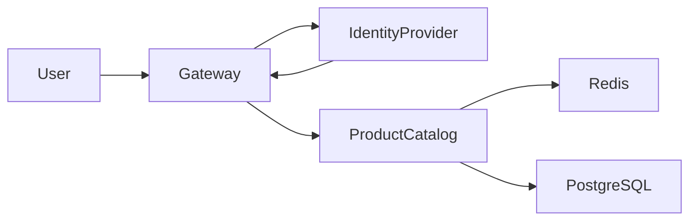
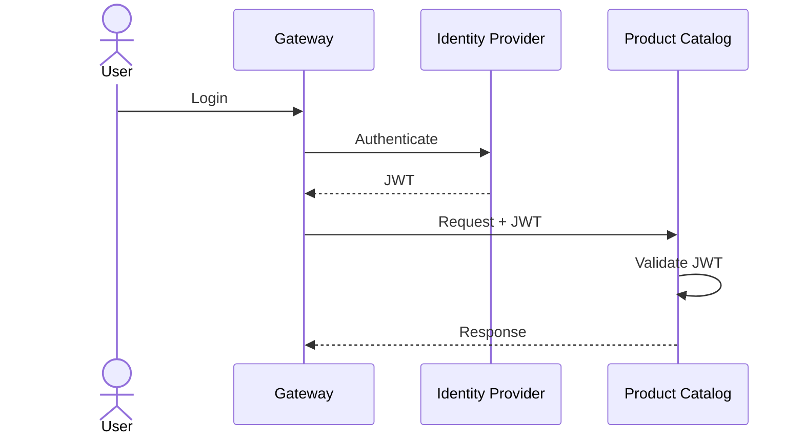
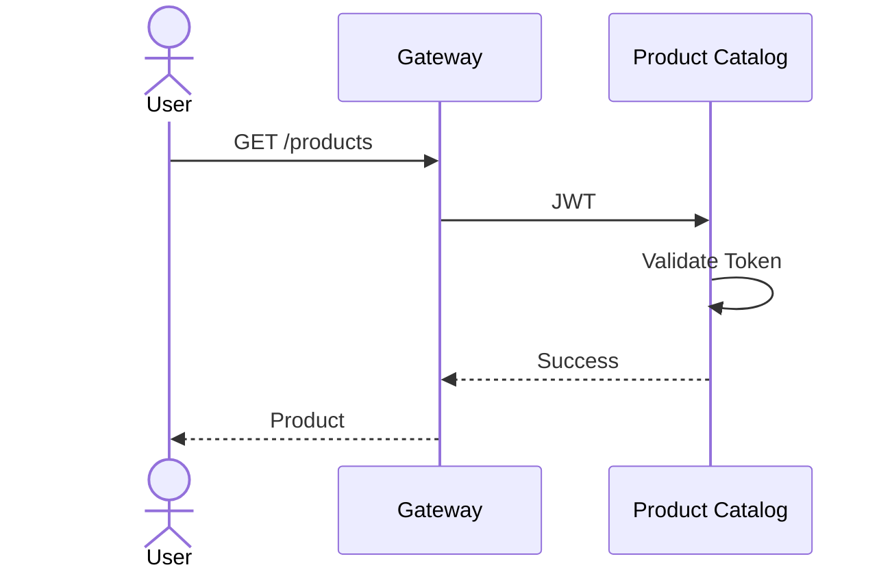
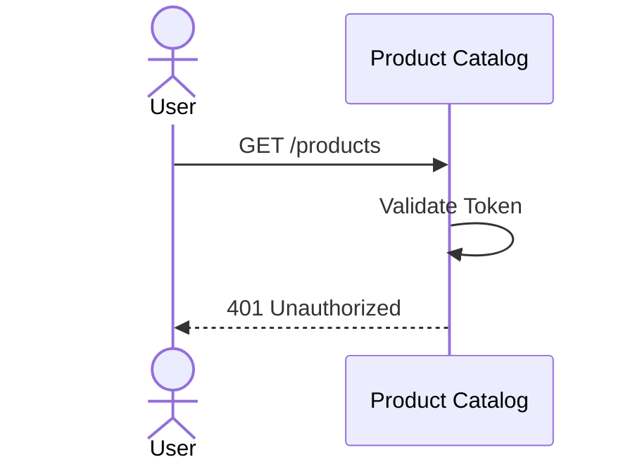

# FSD_06_SECURITY.md

> **Functional Specification Document (FSD)**  
> **Module:** Security  
> **Project:** Pulse Engine – Product Catalog Service  
> **Version:** 1.0  
> **Status:** Draft  
> **Reference:** BRD-PC-001 (Non Functional Requirements - Security, Audit Trail, OAuth2/JWT) :contentReference[oaicite:0]{index=0}

---

# 1. Purpose

Dokumen ini mendefinisikan spesifikasi keamanan (Security Specification) untuk Product Catalog Service.

Security bertujuan memastikan bahwa:

- hanya pengguna yang berwenang dapat mengakses sistem;
- seluruh perubahan data dapat diaudit;
- komunikasi antar service aman;
- akses consumer sesuai hak akses masing-masing;
- Product Catalog memenuhi standar keamanan enterprise.

---

# 2. Objective

Security Module bertujuan untuk:

- Authentication
- Authorization
- API Security
- Service-to-Service Security
- Audit Security
- Secret Management
- Data Protection

---

# 3. Scope

## In Scope

- OAuth2
- JWT
- RBAC (Role Based Access Control)
- API Authorization
- Service Authentication
- HTTPS / TLS
- Audit User
- API Scope
- Token Validation

## Out of Scope

- IAM Management
- User Registration
- Password Management
- MFA
- Identity Lifecycle
- User Provisioning

---

# 4. Security Architecture



Authentication dilakukan oleh Identity Provider.

Product Catalog hanya melakukan:

- Token Validation
- Authorization
- Role Validation

---

# 5. Authentication

Product Catalog menggunakan OAuth2 + JWT.

Sistem **tidak melakukan login**.

Authentication dilakukan oleh Identity Provider.

Contoh:

- Keycloak
- Auth0
- Azure AD

**Catatan:** BRD hanya menyebut OAuth2/JWT dan tidak menentukan Identity Provider tertentu. Product Catalog bersifat **vendor-agnostic** (lihat Security Principle di bawah).

---

# 6. Authentication Flow



---

# 7. JWT Validation

Product Catalog melakukan validasi terhadap:

- Signature
- Expiration
- Issuer
- Audience
- Subject
- Scope
- Role

Jika salah satu validasi gagal maka request ditolak.

---

# 8. Authorization

Authorization menggunakan Role Based Access Control (RBAC).

---

# 9. Roles

## Product Administrator

Hak akses:

- Create Company
- Update Company
- Activate Company
- Deactivate Company

- Create Product
- Update Product
- Publish Product
- Archive Product

- Configure Coverage
- Configure Benefit
- Configure Exclusion
- Configure Eligibility
- Configure Premium

- Upload Product Document

- Read Audit

---

## Business User

Hak akses:

- View Company
- View Product
- View Product Version
- View Audit

Tidak dapat melakukan perubahan.

---

## Read Only User

Hak akses:

- Read Product
- Read Version

---

## Marketplace Consumer

Hak akses:

- Read Published Product

Tidak dapat mengakses Draft maupun Audit.

---

# 10. Permission Matrix

| Feature | Product Admin | Business User | Read Only | Marketplace |
| ---------- | --------------- | --------------- | ----------- | ------------- |
| Create Company | ✔ | ✖ | ✖ | ✖ |
| Update Company | ✔ | ✖ | ✖ | ✖ |
| Activate Company | ✔ | ✖ | ✖ | ✖ |
| Deactivate Company | ✔ | ✖ | ✖ | ✖ |
| Create Product | ✔ | ✖ | ✖ | ✖ |
| Update Product | ✔ | ✖ | ✖ | ✖ |
| Publish Product | ✔ | ✖ | ✖ | ✖ |
| Archive Product | ✔ | ✖ | ✖ | ✖ |
| Search Product | ✔ | ✔ | ✔ | ✔ |
| Product Detail | ✔ | ✔ | ✔ | ✔ |
| Product Version | ✔ | ✔ | ✔ | ✔* |
| Audit History | ✔ | ✔ | ✖ | ✖ |

\* Marketplace hanya dapat mengakses versi Published.

---

# 11. API Security

Seluruh REST API wajib menggunakan:

```
Authorization: Bearer <JWT Token>
```

Request tanpa JWT ditolak.

---

# 12. OAuth Scope

Contoh scope:

```
product.read
```

```
product.write
```

```
product.publish
```

```
audit.read
```

**Catatan:** BRD tidak mendefinisikan struktur OAuth Scope. Scope di atas merupakan rekomendasi implementasi dan perlu disesuaikan dengan standar IAM perusahaan.

---

# 13. HTTP Response

## 401 Unauthorized

```json
{
  "code": "UNAUTHORIZED",
  "message": "Authentication required."
}
```

---

## 403 Forbidden

```json
{
  "code": "FORBIDDEN",
  "message": "Access denied."
}
```

---

## 400 Invalid Token

```json
{
  "code": "INVALID_TOKEN",
  "message": "JWT validation failed."
}
```

---

# 14. Data Protection

Product Catalog menyimpan metadata produk.

Seluruh komunikasi wajib menggunakan:

- HTTPS
- TLS 1.3

sesuai NFR BRD. :contentReference[oaicite:2]{index=2}

---

# 15. Secret Management

Secret yang digunakan:

- Database Password
- Redis Password
- OAuth Public Key
- OAuth Client Secret

Secret tidak boleh disimpan pada source code.

Secret harus berasal dari environment atau secret manager.

---

# 16. Audit Security

Audit mencatat:

- User
- Timestamp
- Action
- Entity
- Before
- After
- Correlation Id

Audit tidak boleh dimodifikasi melalui API.

Audit hanya dapat dibaca.

---

# 17. Service-to-Service Security

Seluruh komunikasi antar service menggunakan JWT.

Consumer:

- Marketplace
- Quote Service
- Proposal Service
- Checkout Service
- Reporting

menggunakan Access Token masing-masing.

Tidak diperbolehkan menggunakan shared credential.

---

# 18. Logging Policy

Log wajib mencatat:

- Request Id
- Correlation Id
- User
- Endpoint
- Status Code
- Response Time

Log **tidak boleh** mencatat:

- JWT
- Password
- Secret
- Access Token

---

# 19. Security Event

Security Event yang dicatat:

- Authentication Failed
- Authorization Failed
- Invalid Token
- Access Denied
- Publish Product
- Archive Product
- Company Update
- Product Update

---

# 20. Sequence Diagram

## Authorized Request



---

## Unauthorized Request



---

# 21. Security Requirements

| Requirement | Description |
| ------------ | ------------- |
| Authentication | OAuth2 |
| Authorization | JWT |
| Encryption | TLS 1.3 |
| Audit | Mandatory |
| Soft Delete | Mandatory |
| Versioning | Mandatory |
| HTTPS | Mandatory |

Requirement mengikuti NFR BRD. :contentReference[oaicite:3]{index=3}

---

# 22. Acceptance Criteria

| ID | Scenario | Expected Result |
| ---- | ---------- | ---------------- |
| AC-01 | Request tanpa JWT | HTTP 401 |
| AC-02 | JWT tidak valid | HTTP 401 |
| AC-03 | JWT expired | HTTP 401 |
| AC-04 | Role tidak sesuai | HTTP 403 |
| AC-05 | Marketplace meminta Draft Product | Ditolak |
| AC-06 | Product Administrator Publish Product | Berhasil |
| AC-07 | Business User Update Product | Ditolak |
| AC-08 | Audit History | Hanya role yang berwenang |
| AC-09 | HTTPS | Seluruh endpoint menggunakan HTTPS |
| AC-10 | Secret | Tidak tersimpan di source code |

---

# 23. Requirement Traceability Matrix

| BRD | Security Requirement |
| ------ | ---------------------- |
| NFR Security | OAuth2 |
| NFR Security | JWT |
| NFR Encryption | TLS 1.3 |
| NFR Audit Trail | Audit Security |
| NFR Versioning | Immutable Product |
| NFR Soft Delete | Data Protection |

---

# 24. Security Decisions & Functional Clarification

Selama penyusunan FSD dilakukan beberapa keputusan desain keamanan untuk memastikan Product Catalog memenuhi standar enterprise tanpa bergantung pada implementasi platform tertentu.

## 24.1 Security Decisions

| ID    | Decision                                                                                                                       | Status   |
| ----- | ------------------------------------------------------------------------------------------------------------------------------ | -------- |
| SD-01 | Marketplace dan service consumer menggunakan **OAuth2 Client Credentials (Service Account)** untuk komunikasi machine-to-machine | Approved |
| SD-02 | Audit History dapat diakses oleh **Product Administrator** dan **Business User** sesuai RBAC                                    | Approved |
| SD-03 | **IP Whitelisting** merupakan kontrol infrastruktur dan tidak menjadi ketergantungan aplikasi                                    | Approved |
| SD-04 | Product Catalog mewajibkan **TLS 1.3**, sedangkan **mTLS** bersifat opsional dan mengikuti kebijakan platform                    | Approved |

## 24.2 Functional Clarification

| ID    | Item                                                                                                                                                                                                                             | Status                       |
| ----- | -------------------------------------------------------------------------------------------------------------------------------------------------------------------------------------------------------------------------------- | ---------------------------- |
| FC-01 | Identity Provider (Keycloak, Azure AD, IAM Internal, atau lainnya) ditentukan oleh arsitektur IAM organisasi                                                                                                                      | Requires Functional Clarification |
| FC-02 | Masa berlaku Access Token dan Refresh Token mengikuti kebijakan Identity Provider dan Security Team organisasi                                                                                                                    | Requires Functional Clarification |

## 24.3 Security Principle

```text
Product Catalog tidak memiliki ketergantungan terhadap implementasi Identity Provider tertentu.

Seluruh autentikasi dilakukan menggunakan standar OAuth2 dan JWT sehingga aplikasi dapat diintegrasikan dengan Identity Provider apa pun yang sesuai dengan standar tersebut.
```

Prinsip ini menjaga FSD tetap konsisten dengan TSD_09 dan menghindari penguncian desain pada produk tertentu seperti Keycloak, Azure AD, atau Auth0.

---

# 25. Architecture Notes

## Security Responsibility

Security dibagi berdasarkan tanggung jawab berikut:

| Layer | Responsibility |
| ------- | ---------------- |
| API Gateway | Authentication, Rate Limiting, Request Filtering |
| Identity Provider | User Authentication, Token Issuance |
| Product Catalog | JWT Validation, Authorization, Business Security |
| Database | Data Persistence |
| Audit Module | Activity Tracking |

## Security Principles

- Product Catalog **tidak melakukan proses login**.
- Seluruh endpoint harus menggunakan **HTTPS**.
- Seluruh request harus membawa **JWT** yang valid.
- Business Rule dan Authorization tetap divalidasi di dalam Application Layer meskipun request telah lolos autentikasi.
- Tidak ada endpoint yang dapat mengubah Audit Trail maupun Published Product secara langsung.

Pendekatan ini menjaga pemisahan tanggung jawab antara Identity Provider dan Product Catalog, sekaligus memenuhi kebutuhan keamanan, audit, dan skalabilitas yang ditetapkan pada BRD.
