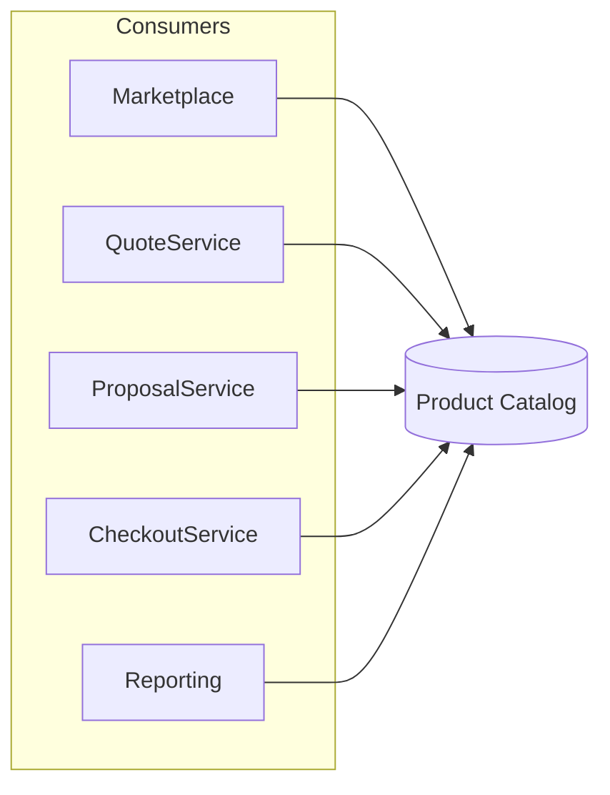
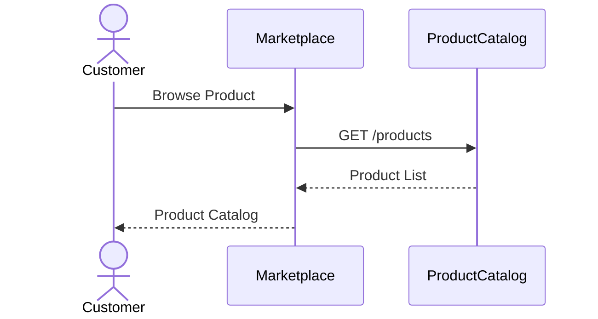
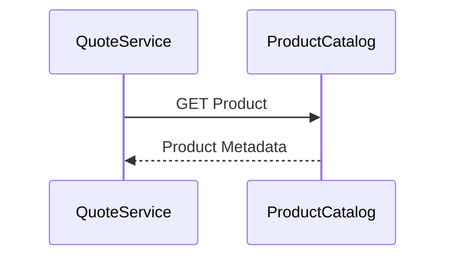
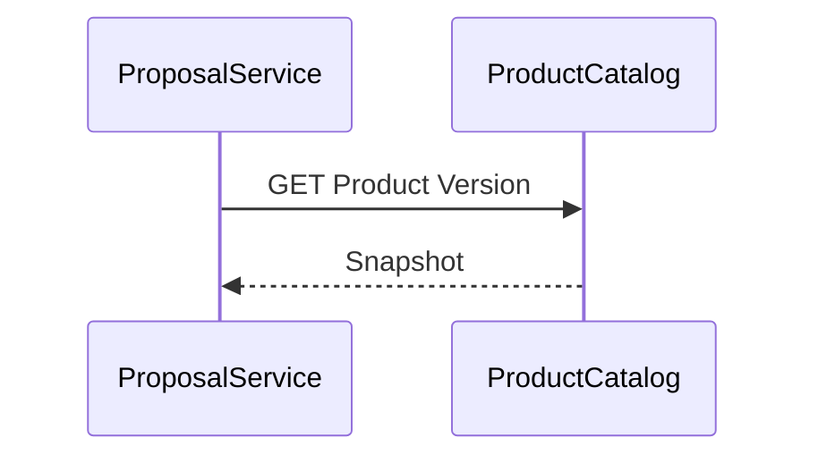
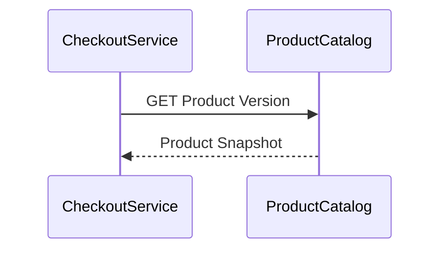
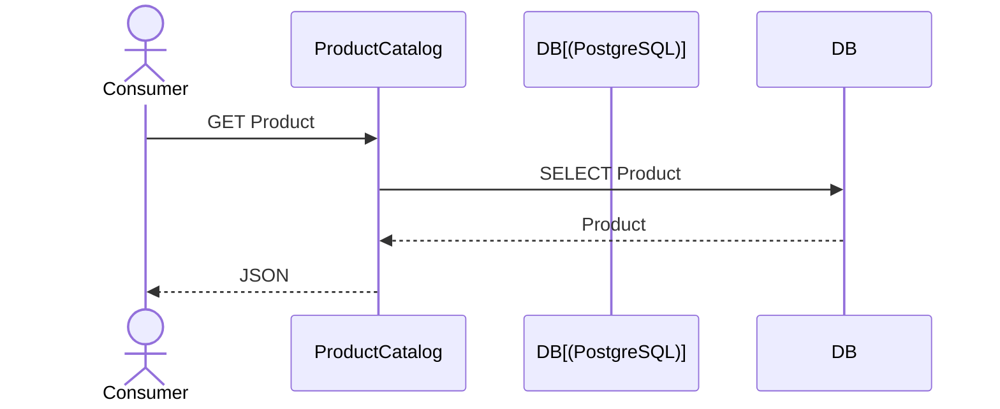
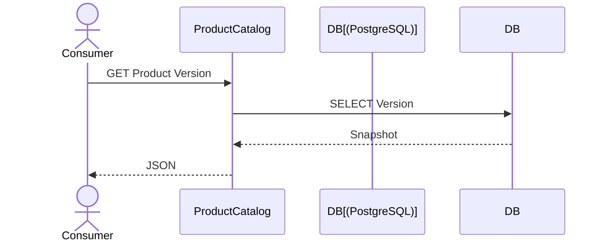

# FSD_07_INTEGRATION.md

> **Functional Specification Document (FSD)**  
> **Module:** Integration  
> **Project:** Pulse Engine – Product Catalog Service  
> **Version:** 1.0  
> **Status:** Draft  
> **Reference:** BRD-PC-001 (Stakeholder, Business Requirements, Business Objectives, Success Criteria) :contentReference[oaicite:0]{index=0} :contentReference[oaicite:1]{index=1} :contentReference[oaicite:2]{index=2}

---

# 1. Purpose

Dokumen ini mendefinisikan spesifikasi integrasi antara **Product Catalog Service** dengan seluruh consumer pada Pulse Engine.

Product Catalog merupakan **Single Source of Truth** untuk seluruh metadata produk Personal Accident Insurance.

Seluruh consumer wajib mengambil data produk melalui REST API Product Catalog.

Database sharing antar service tidak diperbolehkan.

---

# 2. Objective

Dokumen ini bertujuan untuk mendefinisikan:

- Integration Architecture
- API Contract
- Consumer Responsibility
- Request Flow
- Response Flow
- Error Handling
- Version Compatibility
- Security
- Integration Guideline

---

# 3. Integration Principles

Seluruh integrasi harus mengikuti prinsip berikut:

- API First
- Stateless
- RESTful
- JSON
- HTTPS
- OAuth2/JWT
- No Database Sharing
- Product Catalog sebagai Single Source of Truth
- Consumer tidak menyimpan master data produk

---

# 4. Integration Architecture



---

# 5. Consumer Overview

| Consumer | Purpose |
| ------------ | ------------------------------- |
| Marketplace | Menampilkan katalog produk |
| Quote Service | Mengambil metadata produk |
| Proposal Service | Mengambil snapshot produk |
| Checkout Service | Mengambil referensi produk |
| Reporting | Analisis produk |

Consumer mengikuti Stakeholder Analysis pada BRD. :contentReference[oaicite:3]{index=3}

---

# 6. Integration Pattern

Seluruh consumer menggunakan pola berikut.

```text
Consumer

↓

REST API

↓

Product Catalog

↓

JSON Response
```

Tidak terdapat komunikasi asynchronous maupun database replication pada Product Catalog berdasarkan ruang lingkup BRD.

---

# 7. Marketplace Integration

## Objective

Marketplace menggunakan Product Catalog untuk menampilkan katalog produk kepada customer.

---

## API

```
GET /api/v1/products
```

---

## Response

Marketplace memperoleh:

- Product
- Company
- Coverage
- Benefit
- Exclusion
- Product Document
- Version

Marketplace hanya dapat melihat Product dengan status **Published** sesuai Business Rule BR-001 dan BR-002. :contentReference[oaicite:4]{index=4}

---

## Sequence Diagram



---

# 8. Quote Service Integration

## Objective

Quote Service mengambil metadata produk sebelum menjalankan proses Quote.

Product Catalog **tidak melakukan Premium Calculation maupun Eligibility Validation**.

---

## API

```
GET /api/v1/products/{productId}
```

---

## Response

Quote Service memperoleh:

- Product
- Coverage
- Benefit
- Eligibility Configuration
- Premium Configuration

Selanjutnya Quote Service akan meneruskan konfigurasi tersebut ke Eligibility Engine dan Premium Engine sesuai arsitektur Pulse Engine.

---

## Sequence Diagram



---

# 9. Proposal Service Integration

## Objective

Proposal membutuhkan snapshot Product Version.

---

## API

```
GET /api/v1/products/{productId}/versions/{version}
```

---

## Response

Snapshot lengkap Product Version.

Proposal tidak menggunakan versi terbaru apabila Quote telah menggunakan versi sebelumnya.

Business Rule BR-012 tetap dipertahankan. :contentReference[oaicite:5]{index=5}

---

## Sequence Diagram



---

# 10. Checkout Service Integration

## Objective

Checkout menggunakan Product Version yang berasal dari Proposal atau Quote.

Checkout **tidak mengambil Product terbaru**, tetapi Product Version yang direferensikan oleh transaksi.

---

## API

```
GET /api/v1/products/{productId}/versions/{version}
```

---

## Response

Product Snapshot.

Dengan pendekatan ini perubahan Product setelah Quote tidak mempengaruhi transaksi yang sedang berjalan.

---

## Sequence Diagram



---

# 11. Reporting Integration

## Objective

Reporting mengambil metadata Product untuk analisis operasional dan bisnis.

---

## API

```
GET /api/v1/products
```

---

## Response

Reporting memperoleh metadata Product sesuai kebutuhan laporan.

Reporting dapat mengakses seluruh status Product (lihat ID-03).

---

# 12. REST API Summary

| Method | Endpoint | Consumer |
| ---------- | ------------------------------ | --------------------------- |
| GET | /products | Marketplace |
| GET | /products | Reporting |
| GET | /products | Product Administrator |
| GET | /products/{id} | Quote |
| GET | /products/{id} | Marketplace |
| GET | /products/{id}/versions | Product Administrator |
| GET | /products/{id}/versions/{version} | Proposal |
| GET | /products/{id}/versions/{version} | Checkout |

---

# 13. API Contract

## Request Header

```
Authorization: Bearer <JWT>

Accept: application/json
```

---

## Success Response

```
HTTP 200
```

---

## Error Response

```
400 Bad Request

401 Unauthorized

403 Forbidden

404 Not Found

500 Internal Server Error
```

---

# 14. Error Handling

| Error | Description |
| ---------- | ---------------------- |
| PRODUCT_NOT_FOUND | Product tidak ditemukan |
| VERSION_NOT_FOUND | Product Version tidak ditemukan |
| UNAUTHORIZED | JWT tidak valid |
| FORBIDDEN | Hak akses tidak sesuai |
| INVALID_PARAMETER | Parameter tidak valid |

---

# 15. Integration Security

Seluruh integrasi wajib menggunakan:

- HTTPS
- OAuth2
- JWT

Tidak diperbolehkan menggunakan:

- Anonymous Access
- Basic Authentication
- Shared Database

---

# 16. Version Compatibility

Consumer harus mengirimkan Product Version apabila membutuhkan histori.

Contoh

```
GET /products/{productId}/versions/3
```

Apabila Product Version tidak diberikan maka Product Catalog mengembalikan versi sesuai endpoint yang diminta (misalnya Product Detail saat ini).

---

# 17. Timeout

| Configuration | Value |
| -------------- | -------- |
| Connection Timeout | 5 Seconds |
| Read Timeout | 30 Seconds |

**Assumption:** BRD tidak mendefinisikan timeout. Nilai di atas merupakan rekomendasi implementasi dan harus disesuaikan dengan standar enterprise.

---

# 18. Retry Policy

GET API bersifat idempotent.

Consumer dapat melakukan retry apabila:

- Connection Timeout
- HTTP 503
- HTTP 504

Consumer tidak boleh melakukan retry tanpa batas.

---

# 19. Availability

Product Catalog mengikuti NFR:

- Availability 99.9%
- Horizontal Scaling
- Redis Cache

:contentReference[oaicite:6]{index=6}

---

# 20. Sequence Diagram

## Consumer Read Product



---

## Consumer Read Product Version



---

# 21. Integration Matrix

| Consumer | Search | Detail | Version | Audit |
| ------------ | -------- | -------- | --------- | -------- |
| Marketplace | ✔ | ✔ | ✖ | ✖ |
| Quote Service | ✔ | ✔ | ✖ | ✖ |
| Proposal Service | ✔ | ✔ | ✔ | ✖ |
| Checkout Service | ✖ | ✔ | ✔ | ✖ |
| Reporting | ✔ | ✔ | ✔* | ✖ |
| Product Administrator | ✔ | ✔ | ✔ | ✔ |

\* Berdasarkan kebutuhan pelaporan. Perlu konfirmasi Business Owner.

---

# 22. Acceptance Criteria

| ID | Scenario | Expected Result |
| ------ | ---------------------- | ---------------- |
| AC-01 | Marketplace mengambil Product | Berhasil |
| AC-02 | Quote mengambil Product | Berhasil |
| AC-03 | Proposal mengambil Product Version | Berhasil |
| AC-04 | Checkout mengambil Snapshot | Berhasil |
| AC-05 | Reporting mengambil Product | Berhasil |
| AC-06 | Product tidak ditemukan | HTTP 404 |
| AC-07 | JWT tidak valid | HTTP 401 |
| AC-08 | Role tidak sesuai | HTTP 403 |
| AC-09 | HTTPS digunakan | Berhasil |
| AC-10 | Tidak ada database sharing | Berhasil |

---

# 23. Requirement Traceability Matrix

| BRD | Integration Requirement |
| ------ | ------------------------- |
| BR-11 | Product Search API |
| BR-12 | Product Detail API |
| BR-13 | Product Version API |
| BR-14 | Product History API |
| BR-15 | Product Catalog sebagai Single Source of Truth |

---

# 24. Integration Decisions & Functional Clarification

Selama penyusunan FSD dilakukan beberapa keputusan desain integrasi untuk memastikan Product Catalog dapat digunakan secara konsisten oleh seluruh consumer tanpa memperluas ruang lingkup bisnis.

## 24.1 Integration Decisions

| ID    | Decision                                                                                                                       | Status   |
| ----- | ------------------------------------------------------------------------------------------------------------------------------ | -------- |
| ID-01 | Product Catalog menyediakan **API Back Office** dan **Public Catalog API** yang terpisah sesuai kebutuhan consumer              | Approved |
| ID-02 | Product Catalog menyediakan **Bulk Read API** untuk mengambil banyak Product dalam satu permintaan                             | Approved |
| ID-03 | Reporting mendukung **Full Extraction** dan **Incremental Extraction** berdasarkan waktu perubahan (`updatedAfter`)             | Approved |
| ID-04 | Sinkronisasi Product menggunakan **endpoint query yang sudah ada** dan tidak memerlukan API sinkronisasi khusus                 | Approved |

## 24.2 Functional Clarification

| ID    | Item                                                                                                                                                                                                                             | Status                       |
| ----- | -------------------------------------------------------------------------------------------------------------------------------------------------------------------------------------------------------------------------------- | ---------------------------- |
| FC-01 | Pola komunikasi antar service (API Gateway, Service Mesh, Internal Load Balancer, atau Direct Service Call) mengikuti arsitektur enterprise organisasi                                                                            | Requires Functional Clarification |

## 24.3 Bulk Read API Strategy

Karena pada TSD_04_API telah ditetapkan prinsip **RESTful**, endpoint `POST /api/v1/catalog/products/batch` layak digunakan **hanya jika** jumlah `productCode` cukup besar sehingga parameter query tidak lagi praktis (misalnya ratusan kode).

Untuk kebutuhan umum, lebih RESTful jika tetap mendukung:

```text
GET /api/v1/catalog/products?productCode=PA001,PA002,PA003
```

atau

```text
GET /api/v1/catalog/products?productCode=PA001&productCode=PA002&productCode=PA003
```

Strategi yang direkomendasikan:

1. **GET dengan parameter berulang atau daftar** sebagai mekanisme utama untuk mengambil banyak produk.
2. **POST `/batch`** sebagai endpoint alternatif hanya jika ada kebutuhan mengirim daftar yang sangat besar sehingga melampaui batas panjang URL atau kebutuhan payload yang lebih kompleks.

Pendekatan ini menjaga konsistensi dengan prinsip REST, mengurangi jumlah endpoint khusus, dan tetap memenuhi kebutuhan integrasi consumer.

---

# 25. Architecture Notes

## Integration Principles

Product Catalog hanya berperan sebagai **Provider**.

Seluruh service lain merupakan **Consumer**.

Product Catalog tidak memanggil:

- Quote Service
- Proposal Service
- Checkout Service
- Marketplace
- Reporting

Dengan demikian dependency tetap **unidirectional**, sehingga Product Catalog tidak memiliki ketergantungan terhadap service lain.

## Ownership

| Service | Owns Data |
| ---------- | ----------- |
| Product Catalog | Product Metadata |
| Quote Service | Quote |
| Proposal Service | Proposal |
| Checkout Service | Checkout |
| Reporting | Report Dataset |

Setiap service hanya menjadi pemilik (owner) terhadap datanya sendiri.

Tidak ada tabel Product yang disalin atau dimodifikasi oleh consumer.

Seluruh metadata Product selalu berasal dari Product Catalog sebagai **Single Source of Truth**, sesuai Business Objective dan Success Criteria pada BRD. :contentReference[oaicite:7]{index=7} :contentReference[oaicite:8]{index=8}
