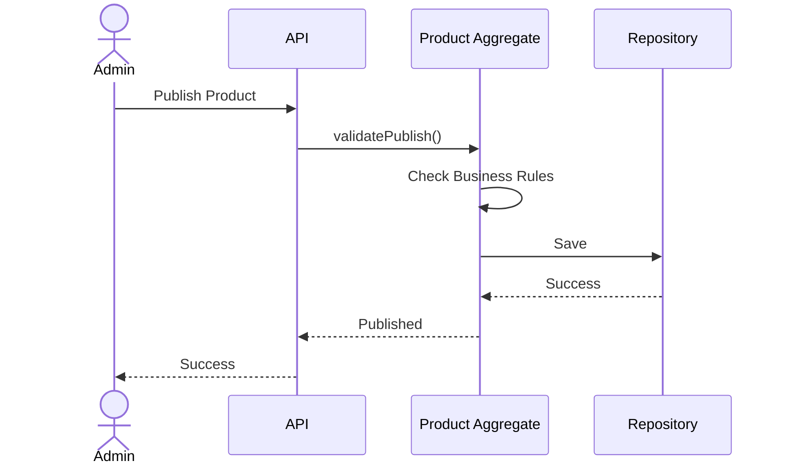

# FSD_09_VALIDATION.md

> **Functional Specification Document (FSD)**  
> **Module:** Validation  
> **Project:** Pulse Engine – Product Catalog Service  
> **Version:** 1.0  
> **Status:** Draft  
> **Reference:** BRD-PC-001 (Business Rules, Business Data Requirements, Non Functional Requirements, Versioning) :contentReference[oaicite:0]{index=0} :contentReference[oaicite:1]{index=1} :contentReference[oaicite:2]{index=2}

---

# 1. Purpose

Dokumen ini mendefinisikan seluruh aturan validasi (Validation Rules) yang diterapkan pada Product Catalog Service.

Validation bertujuan memastikan bahwa data produk yang tersimpan memiliki kualitas, konsistensi, dan memenuhi seluruh Business Rule sebelum digunakan oleh consumer.

Dokumen ini hanya membahas validasi pada Product Catalog dan tidak mencakup validasi bisnis yang menjadi tanggung jawab Quote Service, Eligibility Engine, Premium Engine, maupun service lainnya.

---

# 2. Objective

Validation bertujuan untuk memastikan:

- Data wajib telah diisi
- Konsistensi data
- Integritas relasi
- Konsistensi Product Version
- Validitas Product sebelum Publish
- Kepatuhan terhadap Business Rule

---

# 3. Validation Principles

Validation dilakukan secara berlapis.

```text
Client Validation

↓

API Validation

↓

Application Validation

↓

Domain Validation

↓

Database Constraint
```

Setiap layer memiliki tanggung jawab yang berbeda.

Business Rule hanya berada pada Domain Layer.

---

# 4. Validation Responsibility

| Layer | Responsibility |
| -------- | ---------------- |
| Controller | Request format |
| Application | Use Case Validation |
| Domain | Business Rule |
| Repository | Persistence |
| Database | Constraint |

Business Rule tidak boleh diduplikasi pada beberapa layer.

---

# 5. Validation Categories

```text
Validation

├── Request Validation

├── Mandatory Validation

├── Business Validation

├── Publish Validation

├── Version Validation

├── Referential Validation

└── Database Validation
```

---

# 6. Company Validation

## Mandatory Field

| Field | Required |
| -------- | ---------- |
| Company Code | Yes |
| Company Name | Yes |
| Status | Yes |

---

## Business Validation

### Company Code

- wajib unik
- tidak boleh kosong
- tidak dapat diubah setelah dibuat

---

### Company Name

- wajib diisi

---

### Company Status

Nilai yang diperbolehkan:

- ACTIVE
- INACTIVE

---

# 7. Product Validation

## Mandatory Field

| Field | Required |
| -------- | ---------- |
| Product Code | Yes |
| Product Name | Yes |
| Company | Yes |
| Status | Yes |
| Version | Yes |

---

## Product Code

Harus:

- unik dalam satu Insurance Company
- tidak boleh kosong
- tidak boleh berubah

---

## Product Name

Harus diisi.

---

## Company

Harus mengacu pada Company yang masih tersedia.

Product tidak boleh dibuat tanpa Company.

---

# 8. Product Configuration Validation

## Coverage

Minimal satu Coverage.

Sesuai Business Rule BR-009.

---

## Benefit

Minimal satu Benefit.

Sesuai Business Rule BR-008.

---

## Exclusion

Tidak terdapat aturan minimum pada BRD.

---

## Eligibility

Wajib tersedia.

Sesuai Business Rule BR-010.

---

## Premium Configuration

Wajib tersedia.

Sesuai Business Rule BR-011.

---

## Product Document

BRD tidak menetapkan sebagai mandatory.

---

# 9. Publish Validation

Sebelum Product dipublish sistem harus memastikan:

| Validation | Required |
| ------------ | ---------- |
| Company Active | Yes |
| Product Draft | Yes |
| Coverage Exists | Yes |
| Benefit Exists | Yes |
| Eligibility Exists | Yes |
| Premium Configuration Exists | Yes |

Jika salah satu gagal maka proses Publish ditolak.

---

# 10. Version Validation

## Draft

Dapat diubah.

---

## Published

Tidak dapat diubah.

Perubahan Published Product harus menghasilkan Product Version baru.

---

## Archived

Tidak dapat dimodifikasi.

---

# 11. Status Validation

Status yang diperbolehkan:

```
DRAFT

PUBLISHED

ARCHIVED
```

Transisi status:

```
Draft

↓

Published

↓

Archived
```

Selain transisi tersebut ditolak.

---

# 12. Referential Validation

Sistem memastikan:

Product

↓

Company

Company harus ada.

Coverage

↓

Product Version

Harus ada.

Benefit

↓

Product Version

Harus ada.

Exclusion

↓

Product Version

Harus ada.

Eligibility

↓

Product Version

Harus ada.

Premium Configuration

↓

Product Version

Harus ada.

Product Document

↓

Product Version

Harus ada.

---

# 13. Request Validation

Contoh menggunakan Jakarta Validation.

```java
@NotBlank
private String productCode;

@NotBlank
private String productName;

@NotNull
private UUID companyId;
```

---

# 14. Domain Validation

Contoh Business Rule.

```text
Published Product

↓

Update

↓

Rejected
```

Domain Aggregate bertanggung jawab melakukan validasi tersebut.

---

# 15. Database Constraint

Constraint yang direkomendasikan.

## Unique

- Company Code
- Company + Product Code

---

## Foreign Key

- Product → Company
- Coverage → Product Version
- Benefit → Product Version
- Exclusion → Product Version
- Eligibility → Product Version
- Premium Configuration → Product Version
- Product Document → Product Version

---

## Check Constraint

Product Status

```
DRAFT

PUBLISHED

ARCHIVED
```

---

# 16. Error Response

## Validation Error

```json
{
  "code": "VALIDATION_ERROR",
  "message": "Validation failed.",
  "errors": [
    {
      "field": "productCode",
      "message": "Product Code is required."
    }
  ]
}
```

---

## Business Rule Violation

```json
{
  "code": "BUSINESS_RULE_VIOLATION",
  "message": "Published product cannot be modified."
}
```

---

## Publish Validation Failed

```json
{
  "code": "PRODUCT_NOT_READY",
  "message": "Product is not ready to publish."
}
```

---

# 17. Validation Matrix

| Validation | Controller | Application | Domain | Database |
| ------------ | ------------ | ------------- | --------- | ----------- |
| Mandatory Field | ✔ | | | |
| Format | ✔ | | | |
| Duplicate Code | | ✔ | | ✔ |
| Company Exists | | ✔ | | ✔ |
| Publish Validation | | | ✔ | |
| Product Status | | | ✔ | ✔ |
| Version Rule | | | ✔ | |
| Referential Integrity | | | | ✔ |

---

# 18. Sequence Diagram

## Publish Validation



---

# 19. Acceptance Criteria

| ID | Scenario | Expected Result |
| ---- | ---------- | ---------------- |
| AC-01 | Company Code kosong | Ditolak |
| AC-02 | Product Code kosong | Ditolak |
| AC-03 | Product tanpa Company | Ditolak |
| AC-04 | Publish tanpa Coverage | Ditolak |
| AC-05 | Publish tanpa Benefit | Ditolak |
| AC-06 | Publish tanpa Eligibility | Ditolak |
| AC-07 | Publish tanpa Premium Configuration | Ditolak |
| AC-08 | Update Published Product | Ditolak |
| AC-09 | Duplicate Company Code | Ditolak |
| AC-10 | Duplicate Product Code dalam Company yang sama | Ditolak |

---

# 20. Requirement Traceability Matrix

| BRD | Validation Requirement |
| ------ | ------------------------ |
| BR-004 | Published Product immutable |
| BR-005 | Version Creation |
| BR-008 | Benefit Validation |
| BR-009 | Coverage Validation |
| BR-010 | Eligibility Validation |
| BR-011 | Premium Configuration Validation |
| BR-013 | Version Validation |

---

# 21. Open Items / Business Clarification

| ID | Question |
| ---- | ---------- |
| OI-01 | Apakah Product Code harus unik secara global atau hanya unik dalam satu Insurance Company? |
| OI-02 | Apakah Product Name boleh sama pada Company yang berbeda? |
| OI-03 | Apakah Product Document menjadi mandatory sebelum Publish? BRD tidak mengatur hal tersebut. |
| OI-04 | Apakah Company yang sudah memiliki Product Published masih boleh diubah menjadi INACTIVE? |
| OI-05 | Apakah Effective Date wajib lebih besar atau sama dengan tanggal Publish? BRD belum mendefinisikan aturan ini. |

---

# 22. Architecture Notes

## Validation Strategy

Validation diterapkan menggunakan pendekatan **layered validation** untuk menghindari duplikasi Business Rule.

| Layer | Technology |
| -------- | ------------ |
| Controller | Jakarta Bean Validation |
| Application | Use Case Validation |
| Domain | Aggregate Business Rules |
| Infrastructure | Database Constraint |

Dengan pendekatan ini:

- validasi format dilakukan sedini mungkin,
- Business Rule hanya berada di **Product Aggregate**,
- integritas data dijaga oleh **Database Constraint**,
- setiap aturan memiliki satu lokasi implementasi (**Single Responsibility Principle**).

Model ini sesuai dengan prinsip **DDD**, **Hexagonal Architecture**, dan **Clean Architecture**, serta memenuhi kebutuhan maintainability dan testability untuk sistem Product Catalog berskala enterprise.
