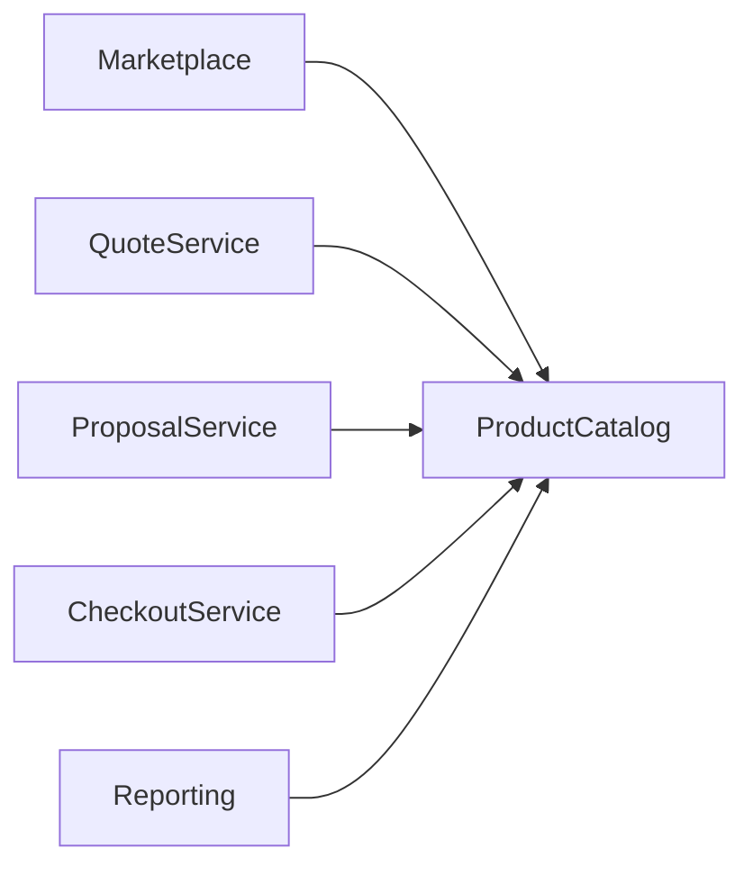

# FSD_PRODUCT_CATALOG.md

> **Functional Specification Document (FSD)**
> **Pulse Engine – Product Catalog Service**
> **Version:** 1.0
> **Status:** Draft
> **Document Owner:** Solution Architect
> **Based on:** Business Requirements Document (BRD-PC-001)

---

# Document Control

| Item            | Value                                                                                                                                      |
| --------------- | ------------------------------------------------------------------------------------------------------------------------------------------ |
| Project         | Pulse Engine                                                                                                                               |
| Module          | Product Catalog Service                                                                                                                    |
| Document Type   | Functional Specification Document                                                                                                          |
| Version         | 1.0                                                                                                                                        |
| Status          | Draft                                                                                                                                      |
| Owner           | Solution Architect                                                                                                                         |
| Audience        | Product Owner, Business Analyst, Solution Architect, Backend Developer, Frontend Developer, QA Engineer, DevOps Engineer, Integration Team |
| Source Document | BRD-PC-001                                                                                                                                 |

---

# 1. Purpose

Dokumen Functional Specification Document (FSD) ini mendefinisikan spesifikasi fungsional **Product Catalog Service** yang akan diimplementasikan pada Pulse Engine.

Dokumen ini menjadi acuan implementasi teknis berdasarkan Business Requirement Document (BRD) tanpa mengubah ataupun memperluas ruang lingkup bisnis yang telah ditetapkan.

FSD ini digunakan oleh seluruh tim implementasi agar memiliki pemahaman yang konsisten mengenai perilaku sistem, kebutuhan fungsional, integrasi, validasi, serta batasan implementasi.

---

# 2. Objective

Product Catalog Service bertujuan menjadi **Single Source of Truth** terhadap seluruh metadata produk Personal Accident Insurance yang digunakan oleh seluruh layanan pada Pulse Engine.

Service ini hanya bertanggung jawab mengelola metadata produk dan tidak menangani proses transaksi maupun business engine lainnya. Hal ini sesuai dengan tujuan BRD yang menyatakan Product Catalog sebagai master data terpusat untuk seluruh produk Personal Accident Insurance.  

---

# 3. Scope

## 3.1 In Scope

Sistem mendukung pengelolaan berikut.

### Insurance Company

* Registrasi perusahaan asuransi
* Aktivasi perusahaan
* Deaktivasi perusahaan

### Product

* Create Product
* Update Product
* Publish Product
* Archive Product
* Product Version

### Product Configuration

* Coverage
* Benefit
* Exclusion
* Eligibility
* Premium Configuration
* Product Document

### Product Query

* Product Search
* Product Detail
* Product Listing

Seluruh cakupan di atas mengikuti ruang lingkup yang ditetapkan pada BRD.

---

## 3.2 Out of Scope

Product Catalog **tidak melakukan**:

* Quote
* Proposal
* Checkout
* Payment
* Policy Issuance
* Claim
* Underwriting
* Campaign
* Notification

Daftar tersebut merupakan ruang lingkup yang secara eksplisit dinyatakan di luar Product Catalog pada BRD.

---

# 4. Business Overview

## Current Business

Saat ini informasi produk berasal dari berbagai sumber sehingga terjadi:

* tidak ada master data
* duplikasi informasi
* inkonsistensi data
* tidak ada histori perubahan
* tidak ada versioning
* integrasi antar aplikasi menjadi tightly coupled

Kondisi tersebut sesuai dengan deskripsi proses AS-IS pada BRD.

---

## Future Business

Seluruh metadata produk dikelola melalui Product Catalog sebelum tersedia untuk Marketplace.

```text
Product Administrator

        │

        ▼

Create Insurance Company

        │

        ▼

Create Product

        │

        ▼

Configure Coverage

        │

        ▼

Configure Benefit

        │

        ▼

Configure Exclusion

        │

        ▼

Configure Eligibility

        │

        ▼

Configure Premium

        │

        ▼

Submit For Approval

        │

        ▼

Publish Product

        │

        ▼

Available for Marketplace
```

Diagram di atas mengikuti proses TO-BE yang didokumentasikan dalam BRD.

---

# 5. Product Overview

## Product Vision

Product Catalog merupakan layanan master data yang menjadi referensi tunggal seluruh produk Personal Accident Insurance.

Service ini menyediakan metadata produk yang konsisten bagi seluruh consumer tanpa melakukan proses bisnis transaksi.

---

## Product Goals

* Menjadi master data produk.
* Mendukung multi insurance company.
* Mendukung product versioning.
* Mendukung audit perubahan.
* Menyediakan data produk yang konsisten.
* Mendukung onboarding insurer baru tanpa perubahan consumer.

Tujuan ini berasal langsung dari Business Objectives pada BRD.

---

# 6. Functional Overview

## Insurance Company Management

Fungsi ini memungkinkan administrator mengelola perusahaan asuransi yang menjadi pemilik produk.

Fitur:

* Create Company
* Update Company
* Activate Company
* Deactivate Company

---

## Product Management

Administrator dapat mengelola lifecycle produk.

Fitur:

* Create Product
* Update Product
* Publish Product
* Archive Product

---

## Coverage Management

Administrator mengelola konfigurasi coverage yang dimiliki suatu produk.

---

## Benefit Management

Administrator mengelola daftar manfaat produk.

---

## Exclusion Management

Administrator mengelola daftar pengecualian polis.

---

## Eligibility Configuration

Administrator mengelola konfigurasi eligibility produk.

Catatan: Product Catalog hanya menyimpan konfigurasi eligibility. Validasi eligibility dilakukan oleh Eligibility Engine sesuai constraint BRD.

---

## Premium Configuration

Administrator mengelola konfigurasi premi.

Catatan: Product Catalog hanya menyimpan konfigurasi premium. Perhitungan premi dilakukan oleh Premium Engine sesuai constraint BRD.

---

## Product Version

Setiap perubahan produk menghasilkan versi baru.

Versi lama tetap tersedia sebagai referensi historis.

Perilaku ini mengikuti BR-13 dan Business Rule BR-005.  

---

## Product Query

Consumer dapat melakukan:

* Search Product
* Product Listing
* Product Detail
* Version History

---

# 7. Stakeholder

| Stakeholder           | Responsibility                               |
| --------------------- | -------------------------------------------- |
| Product Owner         | Menentukan produk yang dipasarkan            |
| Product Administrator | Mengelola Product Catalog                    |
| Insurance Partner     | Menyediakan informasi produk                 |
| Marketplace Frontend  | Menampilkan katalog produk                   |
| Quote Service         | Mengambil metadata produk                    |
| Proposal Service      | Mengambil snapshot produk                    |
| Checkout Service      | Menggunakan referensi produk                 |
| Reporting Team        | Menghasilkan laporan                         |
| Customer Service      | Memberikan informasi produk kepada pelanggan |

Daftar stakeholder mengikuti BRD.

---

# 8. Actor

## Primary Actor

* Product Administrator

## Secondary Actor

* Product Owner
* Marketplace
* Quote Service
* Proposal Service
* Checkout Service
* Reporting
* Customer Service

---

# 9. Functional Module

```text
Product Catalog

├── Insurance Company Management

├── Product Management

├── Coverage Management

├── Benefit Management

├── Exclusion Management

├── Eligibility Configuration

├── Premium Configuration

├── Product Document

├── Product Version

├── Product Query

└── Audit History
```

---

# 10. Requirement Mapping

| BR    | Functional Module            |
| ----- | ---------------------------- |
| BR-01 | Insurance Company Management |
| BR-02 | Create Product               |
| BR-03 | Update Product               |
| BR-04 | Publish Product              |
| BR-05 | Archive Product              |
| BR-06 | Benefit Management           |
| BR-07 | Exclusion Management         |
| BR-08 | Coverage Management          |
| BR-09 | Eligibility Configuration    |
| BR-10 | Premium Configuration        |
| BR-11 | Product Search               |
| BR-12 | Product Detail               |
| BR-13 | Product Version              |
| BR-14 | Audit History                |
| BR-15 | Product Query API            |

Pemetaan ini mengikuti daftar Business Requirements pada BRD.

---

# 11. Consumer Systems

Product Catalog menyediakan metadata produk kepada consumer berikut:



Seluruh consumer mengakses Product Catalog melalui API. Tidak diperbolehkan melakukan akses langsung ke database Product Catalog. Hal ini sejalan dengan tujuan Product Catalog sebagai sumber data resmi bagi seluruh layanan marketplace.  

---

# 12. Functional Assumptions

Asumsi berikut hanya digunakan karena telah dinyatakan dalam BRD atau diperlukan untuk mengimplementasikan kebutuhan tanpa memperluas ruang lingkup:

| ID   | Assumption                                                                  |
| ---- | --------------------------------------------------------------------------- |
| A-01 | Product Administrator memiliki hak untuk mengelola seluruh katalog produk.  |
| A-02 | Setiap perusahaan asuransi mengikuti standar struktur data Product Catalog. |
| A-03 | Product Catalog menjadi referensi tunggal bagi seluruh consumer.            |

Assumptions ini berasal dari BRD dan tidak menambahkan perilaku bisnis baru.

---

# 13. Constraints

Implementasi wajib memenuhi batasan berikut:

* Product Catalog hanya menyimpan metadata produk.
* Tidak melakukan perhitungan premi.
* Tidak melakukan validasi eligibility.
* Tidak melakukan transaksi.
* Tidak melakukan checkout.
* Tidak melakukan policy issuance.
* Tidak melakukan underwriting.

Seluruh batasan tersebut berasal dari BRD.

---

# 14. Success Criteria

Implementasi Product Catalog dianggap berhasil apabila:

* Seluruh produk Personal Accident dikelola melalui Product Catalog.
* Seluruh consumer menggunakan Product Catalog sebagai sumber data resmi.
* Onboarding perusahaan asuransi baru tidak memerlukan perubahan aplikasi consumer.
* Setiap perubahan produk memiliki histori yang lengkap.
* Produk yang telah digunakan pada Quote, Proposal, atau Checkout tetap dapat direferensikan berdasarkan mekanisme versioning.
* Informasi produk yang ditampilkan kepada pelanggan konsisten di seluruh kanal marketplace.

Kriteria keberhasilan ini mengikuti BRD.

---

## Ringkasan

Dokumen **FSD_PRODUCT_CATALOG.md** ini berfungsi sebagai dokumen pengantar (overview document) yang menjelaskan ruang lingkup, tujuan, modul fungsional, stakeholder, pemetaan kebutuhan bisnis, batasan, dan asumsi implementasi. Dokumen ini menjadi dasar untuk FSD rinci per modul, yaitu:

1. `FSD_01_INSURANCE_COMPANY_MANAGEMENT.md`
2. `FSD_02_PRODUCT_MANAGEMENT.md`
3. `FSD_03_PRODUCT_CONFIGURATION.md`
4. `FSD_04_PRODUCT_QUERY.md`
5. `FSD_05_VERSIONING_AND_AUDIT.md`
6. `FSD_06_SECURITY.md`
7. `FSD_07_INTEGRATION.md`
8. `FSD_08_REPORTING.md`
9. `FSD_09_VALIDATION.md`
10. `FSD_10_TEST_SCENARIO.md`
