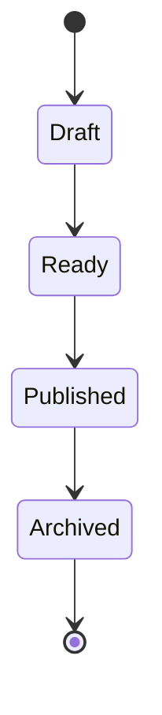
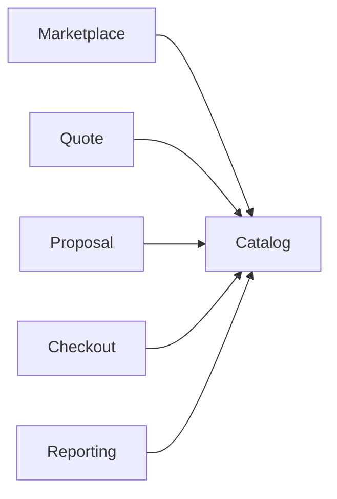
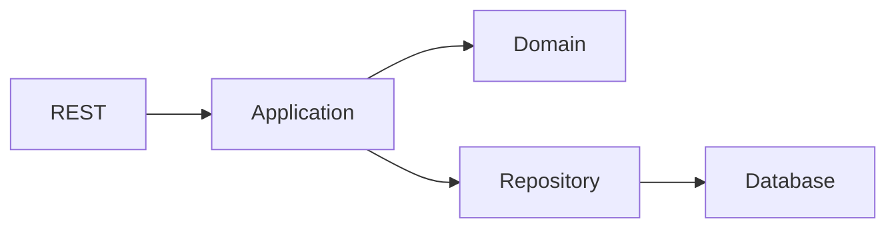

# APPENDIX.md

> **Technical Specification Document (TSD)**  
> **Appendix**  
> **Project:** Pulse Engine – Product Catalog Service  
> **Version:** 1.0  
> **Status:** Draft

---

# Table of Contents

- Appendix A — REST API Summary
- Appendix B — JSON Schema
- Appendix C — OpenAPI Standards
- Appendix D — Error Codes
- Appendix E — Product State Machine
- Appendix F — Versioning Strategy
- Appendix G — CRUD Matrix
- Appendix H — Role Permission Matrix
- Appendix I — HTTP Status Code
- Appendix J — Database Naming Convention
- Appendix K — REST Naming Convention
- Appendix L — Package Naming Convention
- Appendix M — Logging Standard
- Appendix N — Cache Key Convention
- Appendix O — Sequence Diagram
- Appendix P — Mermaid Diagrams
- Appendix Q — Configuration Standard
- Appendix R — Testing ID Convention
- Appendix S — Traceability ID
- Appendix T — Glossary

---

# Appendix A — REST API Summary

## Insurance Company

| Method | URI | Description |
|----------|------|------------|
| POST | /api/v1/companies | Create Company |
| PUT | /api/v1/companies/{id} | Update Company |
| GET | /api/v1/companies | Search Company |
| GET | /api/v1/companies/{id} | Company Detail |
| POST | /api/v1/companies/{id}/publish | Publish Company |
| POST | /api/v1/companies/{id}/deactivate | Deactivate Company |

---

## Product

| Method | URI |
|----------|------|
| POST | /api/v1/products |
| PUT | /api/v1/products/{id} |
| GET | /api/v1/products |
| GET | /api/v1/products/{id} |
| POST | /api/v1/products/{id}/publish |
| POST | /api/v1/products/{id}/archive |
| GET | /api/v1/products/{id}/versions |

---

# Appendix B — JSON Schema

## Product

```json
{
  "companyId": "UUID",
  "productCode": "PA001",
  "productName": "Personal Accident Gold",
  "description": "Personal Accident Product",
  "currency": "IDR",
  "status": "DRAFT"
}
```

---

## Coverage

```json
{
  "coverageCode": "ACCIDENT_DEATH",
  "coverageName": "Accidental Death",
  "sumInsured": 100000000
}
```

---

## Benefit

```json
{
  "benefitCode": "HOSPITAL",
  "benefitName": "Hospital Cash"
}
```

---

## Exclusion

```json
{
  "code": "WAR",
  "description": "War Risk"
}
```

---

# Appendix C — OpenAPI Standard

Seluruh endpoint mengikuti:

```
OpenAPI 3.1
```

Content Type

```
application/json
```

Response wajib menggunakan struktur berikut.

```json
{
  "timestamp": "...",
  "success": true,
  "data": {}
}
```

Error Response

```json
{
  "timestamp": "...",
  "success": false,
  "error": {
    "code": "PRODUCT_NOT_FOUND",
    "message": "Product not found"
  }
}
```

---

# Appendix D — Error Codes

## General

| Code | HTTP |
|---------|------|
| INVALID_REQUEST | 400 |
| VALIDATION_ERROR | 400 |
| UNAUTHORIZED | 401 |
| FORBIDDEN | 403 |
| NOT_FOUND | 404 |
| CONFLICT | 409 |
| INTERNAL_ERROR | 500 |

---

## Company

| Code |
|---------|
| COMPANY_ALREADY_EXISTS |
| COMPANY_NOT_FOUND |
| COMPANY_INACTIVE |

---

## Product

| Code |
|---------|
| PRODUCT_NOT_FOUND |
| PRODUCT_ALREADY_EXISTS |
| PRODUCT_ALREADY_PUBLISHED |
| PRODUCT_ARCHIVED |
| INVALID_PRODUCT_STATE |

---

## Version

| Code |
|---------|
| VERSION_NOT_FOUND |
| VERSION_IMMUTABLE |

---

# Appendix E — Product State Machine



---

# Appendix F — Product Version Strategy

```text
Draft v1

↓

Publish

↓

Published v1

↓

Edit

↓

Draft v2

↓

Publish

↓

Published v2
```

Published version bersifat immutable.

---

# Appendix G — CRUD Matrix

| Module | C | R | U | D |
|----------|---|---|---|---|
| Company | ✔ | ✔ | ✔ | Soft Delete |
| Product | ✔ | ✔ | ✔ | Archive |
| Coverage | ✔ | ✔ | ✔ | ✔ |
| Benefit | ✔ | ✔ | ✔ | ✔ |
| Exclusion | ✔ | ✔ | ✔ | ✔ |
| Version | Auto | ✔ | ✖ | ✖ |

---

# Appendix H — Role Permission Matrix

| Feature | Admin | Business | Read Only | Consumer |
|----------|--------|-----------|-----------|-----------|
| Create Company | ✔ | ✖ | ✖ | ✖ |
| Update Company | ✔ | ✖ | ✖ | ✖ |
| Publish Company | ✔ | ✔ | ✖ | ✖ |
| Create Product | ✔ | ✔ | ✖ | ✖ |
| Publish Product | ✔ | ✔ | ✖ | ✖ |
| Search Product | ✔ | ✔ | ✔ | ✔ |
| Version History | ✔ | ✔ | ✔ | ✖ |

---

# Appendix I — HTTP Status Codes

| HTTP | Description |
|--------|-------------|
| 200 | Success |
| 201 | Created |
| 204 | No Content |
| 400 | Bad Request |
| 401 | Unauthorized |
| 403 | Forbidden |
| 404 | Not Found |
| 409 | Conflict |
| 422 | Business Validation Failed |
| 500 | Internal Server Error |

---

# Appendix J — Database Naming Convention

## Table

```
snake_case
```

Contoh

```
insurance_company

product

product_version
```

---

## Column

```
created_at

updated_at

deleted_at

created_by

updated_by
```

---

## PK

```
id UUID
```

---

## FK

```
company_id

product_id
```

---

## Index

```
idx_product_code

idx_company_code
```

---

# Appendix K — REST Naming Convention

Gunakan:

```
Plural Resource
```

Contoh

```
/products

/companies
```

Action

```
POST /products/{id}/publish
```

Tidak menggunakan

```
/publishProduct
```

---

# Appendix L — Package Naming Convention

```
com.company.pulse.catalog
```

```
domain

application

infrastructure

adapter

config

security

api

shared
```

---

# Appendix M — Logging Standard

Gunakan JSON Structured Logging.

Minimal field.

```json
{
  "timestamp": "",
  "traceId": "",
  "spanId": "",
  "correlationId": "",
  "level": "INFO",
  "service": "product-catalog",
  "message": ""
}
```

---

# Appendix N — Cache Key Convention

```
catalog:product:{id}

catalog:product:code:{code}

catalog:company:{id}

catalog:search:{hash}
```

---

# Appendix O — Sequence Diagram

## Publish Product

```mermaid
sequenceDiagram

User->>Controller: Publish

Controller->>Application

Application->>Aggregate

Aggregate-->>Application

Application->>Repository

Repository-->>Application

Application-->>Controller

Controller-->>User
```

---

# Appendix P — Mermaid Diagrams

## Context



---

## Hexagonal Architecture



---

# Appendix Q — Configuration Standard

Environment Variable.

```
DB_URL

DB_USERNAME

DB_PASSWORD

REDIS_HOST

JWT_ISSUER

JWT_AUDIENCE
```

---

# Appendix R — Test Case ID

```
TC-PROD-001

TC-COMP-001

TC-API-001

TC-SEC-001

TC-CACHE-001

TC-ARCH-001
```

---

# Appendix S — Requirement ID Convention

## Business Requirement

```
BR-001
```

## Functional Requirement

```
FR-001
```

## Business Rule

```
BRULE-001
```

## Non Functional

```
NFR-001
```

## API

```
API-001
```

## Database

```
DB-001
```

## Test

```
TC-001
```

---

# Appendix T — Glossary

| Term | Definition |
|------|------------|
| Product Catalog | Master data service yang menyimpan metadata produk asuransi |
| Insurance Company | Perusahaan asuransi penyedia produk |
| Product | Produk asuransi yang dapat dipublikasikan ke marketplace |
| Coverage | Risiko yang dijamin oleh produk |
| Benefit | Manfaat yang diterima tertanggung |
| Exclusion | Risiko yang tidak dijamin |
| Product Version | Snapshot immutable dari produk yang telah dipublikasikan |
| Draft | Produk masih dapat diubah |
| Ready | Produk telah memenuhi validasi dan siap dipublikasikan |
| Published | Produk aktif dan tersedia untuk consumer |
| Archived | Produk tidak lagi tersedia untuk consumer |
| Audit Trail | Riwayat perubahan data beserta pelaku, waktu, dan alasan perubahan |
| Aggregate | Batas konsistensi transaksi dalam Domain-Driven Design |
| Value Object | Objek domain tanpa identitas yang bersifat immutable |
| Optimistic Locking | Mekanisme pencegahan konflik update bersamaan menggunakan version column |
| Soft Delete | Penandaan data sebagai terhapus tanpa menghapus record fisik |
| Consumer | Sistem yang menggunakan Product Catalog melalui REST API tanpa akses langsung ke database |

---

# Appendix U — Document Relationship

```text
BRD
 │
 ▼
FSD
 │
 ▼
TSD
 │
 ├── TSD_01_ARCHITECTURE
 ├── TSD_02_DOMAIN_MODEL
 ├── TSD_03_DATABASE
 ├── TSD_04_API
 ├── TSD_05_BUSINESS_RULE_IMPLEMENTATION
 ├── TSD_06_WORKFLOW
 ├── TSD_07_VERSIONING
 ├── TSD_08_CACHE
 ├── TSD_09_SECURITY
 ├── TSD_10_ERROR_HANDLING
 ├── TSD_11_LOGGING
 ├── TSD_12_OBSERVABILITY
 ├── TSD_13_PERFORMANCE
 ├── TSD_14_INTEGRATION
 ├── TSD_15_CONFIGURATION
 ├── TSD_16_DEPLOYMENT
 ├── TSD_17_TESTING
 ├── TSD_18_NFR_MAPPING
 ├── TSD_19_TRACEABILITY
 │
 ▼
Implementation
 │
 ▼
Testing
 │
 ▼
Production
```

---

# Appendix V — Complete Documentation Index

## Business Documents

- BRD_PRODUCT_CATALOG.md

## Functional Specification Documents

- FSD_PRODUCT_CATALOG.md
- FSD_01_INSURANCE_COMPANY_MANAGEMENT.md
- FSD_02_PRODUCT_MANAGEMENT.md
- FSD_03_PRODUCT_CONFIGURATION.md
- FSD_04_PRODUCT_QUERY.md
- FSD_05_VERSIONING_AND_AUDIT.md
- FSD_06_SECURITY.md
- FSD_07_INTEGRATION.md
- FSD_08_REPORTING.md
- FSD_09_VALIDATION.md
- FSD_10_TEST_SCENARIO.md

## Technical Specification Documents

- TSD_PRODUCT_CATALOG.md
- TSD_01_ARCHITECTURE.md
- TSD_02_DOMAIN_MODEL.md
- TSD_03_DATABASE.md
- TSD_04_API.md
- TSD_05_BUSINESS_RULE_IMPLEMENTATION.md
- TSD_06_WORKFLOW.md
- TSD_07_VERSIONING.md
- TSD_08_CACHE.md
- TSD_09_SECURITY.md
- TSD_10_ERROR_HANDLING.md
- TSD_11_LOGGING.md
- TSD_12_OBSERVABILITY.md
- TSD_13_PERFORMANCE.md
- TSD_14_INTEGRATION.md
- TSD_15_CONFIGURATION.md
- TSD_16_DEPLOYMENT.md
- TSD_17_TESTING.md
- TSD_18_NFR_MAPPING.md
- TSD_19_TRACEABILITY.md
- APPENDIX.md

---

# Appendix W — Production Readiness Checklist

| Area | Status |
|------|--------|
| BRD Completed | ✔ |
| FSD Completed | ✔ |
| TSD Completed | ✔ |
| OpenAPI Defined | ✔ |
| Domain Model Designed | ✔ |
| Database Designed | ✔ |
| Business Rules Mapped | ✔ |
| Security Designed | ✔ |
| Deployment Designed | ✔ |
| Testing Strategy Defined | ✔ |
| NFR Mapped | ✔ |
| Traceability Complete | ✔ |
| Implementation Ready | ✔ |
| Production Ready Review | Pending Implementation |