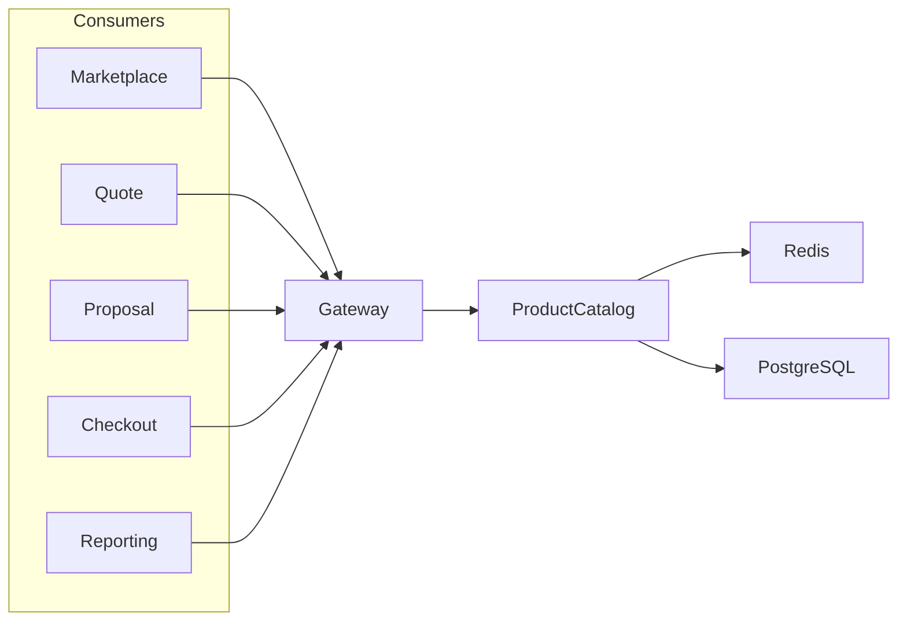
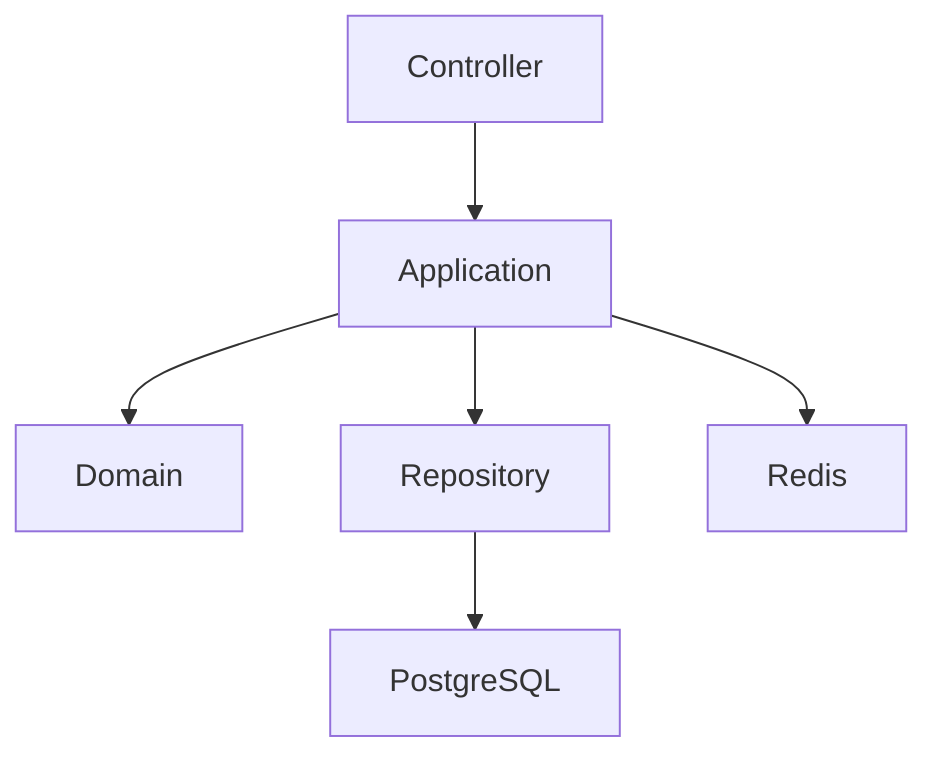
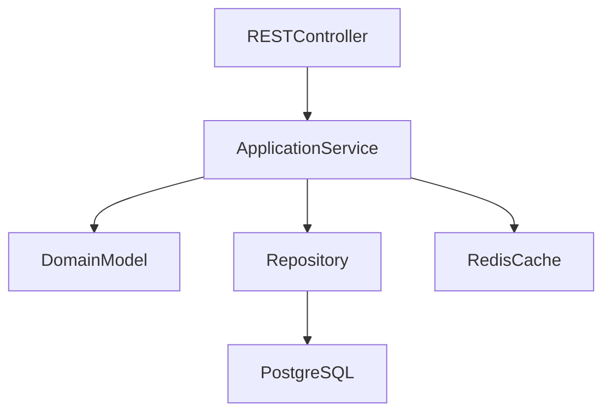
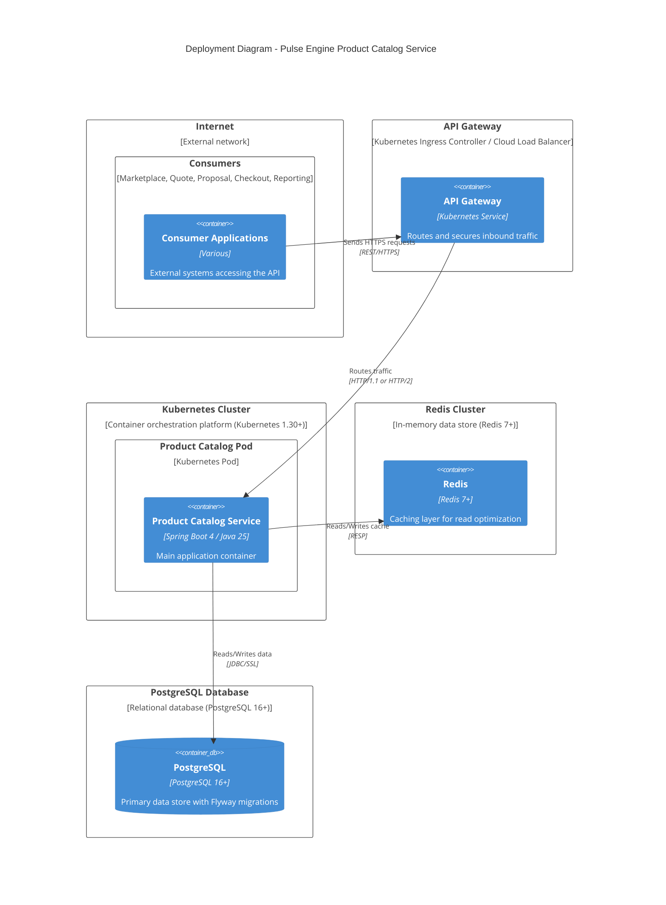

# TSD_01_ARCHITECTURE.md

> **Technical Specification Document (TSD)**  
> **Module:** Architecture  
> **Project:** Pulse Engine – Product Catalog Service  
> **Version:** 1.0  
> **Status:** Draft

---

# 1. Purpose

Dokumen ini mendefinisikan arsitektur teknis Product Catalog Service.

Dokumen ini menjadi acuan implementasi bagi:

- Solution Architect
- Backend Engineer
- DevOps Engineer
- QA Engineer
- Security Engineer
- SRE

Dokumen ini hanya membahas arsitektur teknis dan tidak menambahkan business requirement baru di luar BRD maupun FSD.

---

# 2. Architecture Goals

Arsitektur dirancang untuk memenuhi tujuan berikut:

- Maintainable
- Testable
- Scalable
- Stateless
- Modular
- Easily Extensible
- Cloud Native
- Production Ready

---

# 3. Technology Stack

| Technology | Version |
| ------------ | ---------- |
| Java | 25 |
| Spring Boot | 4.0.7 |
| Spring Framework | 7 (Managed by Spring Boot 4.0.7) |
| Build Tool | Maven (Maven Wrapper) |
| PostgreSQL | 16+ (Driver 42.7.11) |
| Redis | 7+ (Lettuce) |
| Flyway | 11.14.1 |
| OAuth2 | RFC 6749 |
| JWT | RFC 7519 |
| OpenAPI | 3.1 (springdoc-openapi 3.0.3) |
| Lombok | 1.18.46 |
| Testcontainers | 2.0.5 |
| Docker | Latest |
| Kubernetes | 1.30+ |
| Prometheus | Latest |
| OpenTelemetry | Latest |

---

# 4. Architectural Style

Product Catalog menggunakan kombinasi beberapa architectural pattern.

| Pattern | Purpose |
| ---------- | --------- |
| Domain Driven Design | Business Model |
| Hexagonal Architecture | Decouple Business & Technology |
| Clean Architecture | Dependency Management |
| RESTful API | Service Communication |
| Repository Pattern | Persistence Abstraction |
| CQRS (Lightweight) | Separation Read & Write Use Case |
| Stateless Service | Horizontal Scaling |

---

# 5. Architectural Principles

## 5.1 Dependency Rule

Dependency selalu mengarah ke dalam (Domain).

```text
Infrastructure

↓

Application

↓

Domain
```

Domain tidak mengetahui:

- Spring Boot
- PostgreSQL
- Redis
- REST API
- JWT
- Docker

---

## 5.2 Separation of Concerns

Setiap layer hanya memiliki satu tanggung jawab.

| Layer | Responsibility |
| --------- | ---------------- |
| API | HTTP |
| Application | Use Case |
| Domain | Business Rule |
| Infrastructure | External Technology |

---

## 5.3 Stateless

Service tidak menyimpan state.

Semua state disimpan pada:

- PostgreSQL
- Redis

---

## 5.4 API First

Semua consumer mengakses Product Catalog melalui REST API.

Database sharing tidak diperbolehkan.

---

# 6. High Level Architecture



---

# 7. Logical Architecture



---

# 8. Hexagonal Architecture

```text
                REST API

                    │

            REST Controller

                    │

            Input Port (Use Case)

                    │

         ==========================

                DOMAIN

         ==========================

                    │

         Output Port (Repository)

                    │

        JPA Repository Adapter

                    │

             PostgreSQL
```

---

# 9. Layer Responsibilities

## Presentation Layer

Berisi:

- REST Controller
- Request DTO
- Response DTO
- Validation
- Exception Handler

Tidak boleh mengandung Business Rule.

---

## Application Layer

Berisi:

- Use Case
- Command Handler
- Query Handler
- Transaction Boundary

Tugas:

- mengorkestrasi Domain
- memanggil Repository
- publish Domain Event (jika diperlukan)

---

## Domain Layer

Layer terpenting.

Berisi:

- Aggregate
- Entity
- Value Object
- Domain Service
- Domain Event
- Business Rule

Layer ini tidak boleh memiliki dependency ke Spring Framework.

---

## Infrastructure Layer

Berisi implementasi teknis.

- Spring Data JPA
- Redis
- PostgreSQL
- Flyway
- OAuth2
- JWT
- OpenTelemetry
- Prometheus

---

# 10. Package Structure

```text
src/main/java

com.irsyad.pulse.product

├── application
│
├── domain
│
├── infrastructure
│
├── interfaces
│
├── configuration
│
└── shared
```

---

# 11. Detailed Package Structure

```text
product

├── application
│   ├── command
│   ├── query
│   ├── mapper
│   ├── service
│   ├── port
│   │   ├── in
│   │   └── out
│   └── usecase
│
├── domain
│   ├── company
│   ├── product
│   ├── version
│   ├── audit
│   └── shared
│
├── infrastructure
│   ├── persistence
│   ├── cache
│   ├── security
│   ├── telemetry
│   ├── flyway
│   └── configuration
│
├── interfaces
│   └── rest
│
└── shared
    ├── exception
    ├── constants
    ├── util
    └── model
```

---

# 12. Module Responsibilities

| Module | Responsibility |
| ---------- | --------------- |
| Company | Insurance Company Management |
| Product | Product Aggregate |
| Version | Immutable Product Version |
| Audit | Audit Trail |
| Shared | Shared Kernel |

---

# 13. Component Diagram



---

# 14. Deployment Diagram



---

# 15. Dependency Rules

Diizinkan:

```text
Controller

↓

Application

↓

Domain
```

Tidak diizinkan:

```text
Domain

↓

Controller
```

Tidak diizinkan:

```text
Domain

↓

Spring Boot
```

Tidak diizinkan:

```text
Domain

↓

JPA Entity
```

---

# 16. Repository Pattern

Repository merupakan Output Port.

Contoh:

```java
public interface ProductRepository {

    Product save(Product product);

    Optional<Product> findById(ProductId id);

    Optional<Product> findByCode(ProductCode code);

}
```

Implementasi berada di Infrastructure Layer.

---

# 17. CQRS Strategy

Product Catalog menggunakan **Lightweight CQRS**.

Command:

- Create Product
- Update Product
- Publish Product
- Archive Product

Query:

- Search Product
- Product Detail
- Product Version
- Audit

Read dan Write tetap menggunakan database yang sama.

Event sourcing tidak digunakan.

---

# 18. Transaction Boundary

Transaction hanya berada pada Application Layer.

```text
REST

↓

Application Service

BEGIN TRANSACTION

↓

Aggregate

↓

Repository

↓

COMMIT
```

Aggregate tidak boleh membuka transaksi.

---

# 19. Caching Architecture

Redis digunakan hanya untuk read optimization.

```text
Client

↓

REST API

↓

Redis

↓

PostgreSQL
```

Write selalu langsung ke PostgreSQL.

Cache di-invalidasi setelah perubahan data.

---

# 20. Cross Cutting Concerns

Cross cutting concern dipisahkan dari Business Logic.

| Concern | Implementation |
| ---------- | ---------------- |
| Logging | Spring AOP / Filter |
| Security | Spring Security |
| Validation | Jakarta Validation |
| Exception | Global Exception Handler |
| Metrics | Micrometer |
| Tracing | OpenTelemetry |
| Audit | Domain + Infrastructure |

---

# 21. Architectural Decisions

| Decision | Reason |
| ---------- | -------- |
| Spring Boot 4 | Enterprise Standard |
| Java 25 | Latest LTS |
| PostgreSQL | Relational Consistency |
| Redis | Read Performance |
| Hexagonal | Maintainability |
| DDD | Business Isolation |
| Stateless | Horizontal Scaling |
| Lightweight CQRS | Simplicity |
| Flyway | Database Versioning |

---

# 22. Alternatives Considered

| Alternative | Decision | Reason |
| ------------- | ---------- | -------- |
| Quarkus | Tidak dipilih | Standarisasi menggunakan Spring Boot 4.0.7 |
| Event Sourcing | Tidak digunakan | Tidak dibutuhkan oleh BRD |
| GraphQL | Tidak digunakan | REST API telah memenuhi kebutuhan consumer |
| MongoDB | Tidak digunakan | Model data relasional lebih sesuai |
| gRPC | Tidak digunakan | BRD hanya mendefinisikan integrasi berbasis REST API |

---

# 23. Technical Risks

| Risk | Mitigation |
| ------ | ------------ |
| Circular Dependency | Package Rule & Architecture Test |
| God Service | DDD Aggregate |
| Business Logic di Controller | Code Review + ArchUnit |
| Cache Inconsistency | Cache Invalidation |
| Concurrent Update | Optimistic Locking |
| Database Bottleneck | Pagination + Index + Redis |

---

# 24. Recommendations

1. Gunakan **Spring Modulith** untuk menjaga batas modul internal tanpa memecah menjadi microservice.
2. Gunakan **ArchUnit** untuk memverifikasi dependency rule pada pipeline CI.
3. Terapkan **Constructor Injection** untuk seluruh komponen.
4. Pisahkan DTO, Entity Persistence, dan Domain Model.
5. Seluruh Business Rule harus berada pada Aggregate.
6. Gunakan Virtual Threads Java 25 hanya untuk workload blocking (database/IO), setelah dilakukan benchmark terhadap karakteristik aplikasi.

---

# 25. Requires Functional Clarification

Berikut area yang tidak dapat diturunkan dari BRD/FSD dan memerlukan keputusan lebih lanjut.

| Item | Status |
| ------ | -------- |
| API Gateway Product | Requires Functional Clarification |
| Identity Provider (Keycloak/Entra ID/Okta) | Requires Functional Clarification |
| Kubernetes Ingress Controller | Requires Functional Clarification |
| Service Mesh | Requires Functional Clarification |
| Multi Region Deployment | Requires Functional Clarification |
| Active-Active Database | Requires Functional Clarification |
| Redis Cluster Topology | Requires Functional Clarification |

---

# 26. Compliance & Security Architecture

Product Catalog Service harus memenuhi persyaratan compliance enterprise. Dokumen ini merujuk ke:

* [Enterprise Standards & Compliance Framework](../../../docs/16. ENTERPRISE_STANDARDS.md)
* [Compliance Implementation Matrix](../../../docs/18. COMPLIANCE_MATRIX.md)
* [Compliance Reference Guide](COMPLIANCE_REFERENCE.md)

### Key Compliance Requirements

* **UU PDP No. 27/2022** - Data encryption, audit trail, retention policy
* **POJK No. 13/2017** - IT governance, audit trail, business continuity
* **ISO/IEC 27001:2022** - Access control, cryptography, operations security
* **ISO/IEC 22301:2019** - Business continuity, RTO/RPO
* **ISO 31000:2018** - Risk management

### Security Architecture Principles

* Defense in Depth
* Least Privilege
* Separation of Duties
* Secure by Default
* Zero Trust

Lihat [TSD_09_SECURITY.md](TSD_09_SECURITY.md) untuk implementasi detail security controls.

Lihat [TSD_03_DATABASE.md](TSD_03_DATABASE.md) untuk database security dan encryption.

Lihat [TSD_11_LOGGING.md](TSD_11_LOGGING.md) untuk audit logging strategy.

Lihat [TSD_12_OBSERVABILITY.md](TSD_12_OBSERVABILITY.md) untuk security monitoring.

---

# 26. Next Document

Dokumen berikutnya:

**TSD_02_DOMAIN_MODEL.md**

Dokumen tersebut akan mendefinisikan:

- DDD Aggregate
- Entity
- Value Object
- Domain Service
- Domain Event
- Aggregate Boundary
- Lifecycle
- Business Invariants
- Mermaid Class Diagram
- Java Domain Model
- Repository Interface
- Factory Pattern
- Domain Validation Strategy
