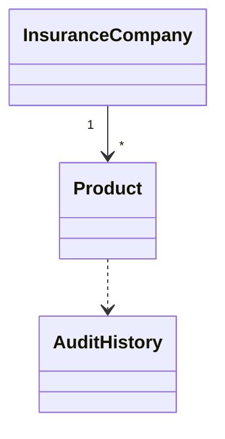
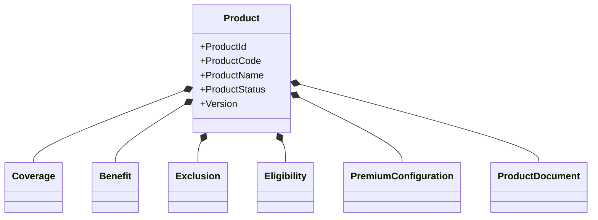
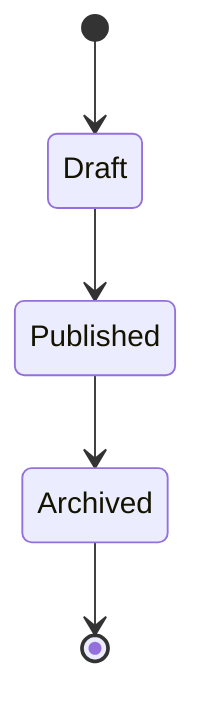

# TSD_02_DOMAIN_MODEL.md

> **Technical Specification Document (TSD)**  
> **Module:** Domain Model  
> **Project:** Pulse Engine – Product Catalog Service  
> **Version:** 1.0  
> **Status:** Draft

---

# 1. Purpose

Dokumen ini mendefinisikan **Domain Model** Product Catalog Service berdasarkan prinsip **Domain Driven Design (DDD)**.

Tujuan utama Domain Model adalah memastikan bahwa seluruh Business Rule berada pada Domain Layer sehingga tidak bergantung pada framework, database, maupun teknologi tertentu.

Dokumen ini menjadi referensi utama bagi:

- Backend Engineer
- Solution Architect
- QA Engineer
- Technical Lead

---

# 2. Design Principles

Domain Model mengikuti prinsip berikut.

- Rich Domain Model
- Behavior over Data
- Persistence Ignorance
- Aggregate Consistency
- Explicit Business Rule
- Immutable Value Object
- No Framework Dependency

---

# 3. Ubiquitous Language

| Business Term | Domain Object |
| -------------- | --------------- |
| Insurance Company | Company Aggregate |
| Product | Product Aggregate |
| Coverage | Coverage Entity |
| Benefit | Benefit Entity |
| Exclusion | Exclusion Entity |
| Eligibility | Eligibility Entity |
| Premium Configuration | PremiumConfiguration Entity |
| Product Document | ProductDocument Entity |
| Product Version | ProductVersion Entity |
| Audit Trail | AuditHistory Aggregate |

---

# 4. Aggregate Overview

Product Catalog terdiri dari dua Aggregate utama.

```text
InsuranceCompany

Product
```

Audit dikelola sebagai aggregate terpisah.

---

# 5. Aggregate Relationship



---

# 6. Aggregate Boundary

## InsuranceCompany Aggregate

Aggregate Root

```
InsuranceCompany
```

Entity

Tidak ada.

Value Object

- CompanyId
- CompanyCode
- CompanyName

---

## Product Aggregate

Aggregate Root

```
Product
```

Owned Entity

- Coverage
- Benefit
- Exclusion
- Eligibility
- PremiumConfiguration
- ProductDocument

ProductVersion bukan child entity.

ProductVersion merupakan aggregate snapshot.

---

## Audit Aggregate

Aggregate Root

```
AuditHistory
```

Append Only.

Tidak dapat diubah.

---

# 7. Aggregate Responsibilities

## InsuranceCompany

Bertanggung jawab terhadap

- Company Status
- Company Code
- Company Name

Tidak mengetahui Product Configuration.

---

## Product

Bertanggung jawab terhadap

- Product Status
- Product Metadata
- Configuration
- Publish Validation
- Version Creation

---

## AuditHistory

Bertanggung jawab terhadap

- Audit Log
- Audit Metadata
- Change History

---

# 8. Aggregate Lifecycle

## Company

```text
Create

↓

Active

↓

Inactive
```

---

## Product

```text
Draft

↓

Published

↓

Archived
```

---

## Product Version

```text
V1

↓

V2

↓

V3

↓

V4
```

Published Version bersifat immutable.

---

# 9. Aggregate Diagram



---

# 10. Entity Design

## Product

Attributes

- ProductId
- ProductCode
- ProductName
- CompanyId
- Status
- CurrentVersion

Business Behavior

- update()
- publish()
- archive()
- createVersion()

---

## Coverage

Attributes

- CoverageId
- Code
- Name

Behavior

Tidak memiliki business rule mandiri.

---

## Benefit

Attributes

- BenefitId
- Code
- Description

---

## Exclusion

Attributes

- ExclusionId
- Description

---

## Eligibility

Attributes

- EligibilityConfiguration

---

## PremiumConfiguration

Attributes

- PremiumCode

---

## ProductDocument

Attributes

- DocumentType
- FileName
- URI

---

# 11. Value Objects

Seluruh Value Object bersifat immutable.

## CompanyId

```java
public record CompanyId(UUID value) {}
```

---

## ProductId

```java
public record ProductId(UUID value) {}
```

---

## ProductCode

```java
public record ProductCode(String value) {}
```

---

## CompanyCode

```java
public record CompanyCode(String value) {}
```

---

## ProductVersionNumber

```java
public record ProductVersionNumber(Integer value) {}
```

---

## AuditId

```java
public record AuditId(UUID value) {}
```

---

# 12. Domain Services

Domain Service digunakan apabila Business Rule melibatkan lebih dari satu Aggregate.

Pada Product Catalog saat ini hanya terdapat:

```text
ProductVersionService
```

Responsibility

- membuat snapshot
- increment version
- immutable version

---

# 13. Domain Events

Product Catalog mendefinisikan Domain Event internal berikut.

```text
CompanyCreated

CompanyUpdated

CompanyActivated

CompanyDeactivated

ProductCreated

ProductUpdated

ProductPublished

ProductArchived

ProductVersionCreated

ConfigurationUpdated
```

Catatan:

BRD tidak mendefinisikan publishing event ke Kafka.

Event di atas hanya Domain Event.

---

# 14. Business Invariants

Aggregate Product harus selalu memenuhi aturan berikut.

Invariant 1

```
Product selalu memiliki Company.
```

---

Invariant 2

```
Product Code unik
dalam satu Company.
```

---

Invariant 3

```
Published Product

↓

Immutable
```

---

Invariant 4

```
Archive Product

↓

Tidak dapat diubah.
```

---

Invariant 5

```
Coverage minimal satu
sebelum Publish.
```

---

Invariant 6

```
Benefit minimal satu
sebelum Publish.
```

---

Invariant 7

```
Eligibility wajib tersedia.
```

---

Invariant 8

```
Premium Configuration wajib tersedia.
```

---

# 15. Aggregate Behavior



---

# 16. Domain Validation

Business Rule hanya boleh berada pada Aggregate.

Contoh

```java
public void publish() {

    validateReadyForPublish();

    this.status = ProductStatus.PUBLISHED;

}
```

Tidak diperbolehkan:

```
Controller

↓

Business Rule
```

---

# 17. Aggregate Root Example

```java
public class Product {

    private ProductId id;

    private ProductCode productCode;

    private ProductStatus status;

    private ProductVersionNumber version;

    public void publish() {

        validateReadyForPublish();

        this.status = ProductStatus.PUBLISHED;

    }

}
```

---

# 18. Factory Pattern

Factory digunakan untuk memastikan Aggregate selalu valid saat dibuat.

```java
public final class ProductFactory {

    public Product create(
            CompanyId companyId,
            ProductCode code,
            String productName
    ) {

        return Product.create(

                ProductId.generate(),

                companyId,

                code,

                productName

        );

    }

}
```

---

# 19. Repository Interface

Repository berada pada Domain.

```java
public interface ProductRepository {

    Product save(Product product);

    Optional<Product> findById(ProductId id);

    Optional<Product> findByProductCode(ProductCode code);

}
```

Implementasi berada pada Infrastructure.

---

# 20. Domain Package Structure

```text
domain

├── company
│
├── product
│   ├── aggregate
│   ├── entity
│   ├── event
│   ├── repository
│   ├── service
│   ├── valueobject
│   └── factory
│
├── version
│
├── audit
│
└── shared
```

---

# 21. Domain Dependency Rules

Diizinkan

```text
Aggregate

↓

Entity

↓

Value Object
```

---

Tidak diizinkan

```text
Aggregate

↓

Spring

↓

JPA

↓

Redis

↓

REST
```

---

# 22. Architectural Decisions

| Decision | Rationale |
| ---------- | ----------- |
| Rich Domain Model | Business Rule berada di Domain |
| Aggregate Root | Menjaga consistency boundary |
| Immutable Value Object | Thread-safe & mudah diuji |
| Factory Pattern | Valid object creation |
| Repository Pattern | Persistence abstraction |
| Domain Event | Memisahkan perubahan state dari reaksi internal |

---

# 23. Alternatives Considered

| Alternative | Decision | Reason |
| ------------- | ---------- | -------- |
| Anemic Domain Model | Tidak digunakan | Business Rule tersebar pada Service |
| Transaction Script | Tidak digunakan | Sulit dipelihara untuk domain yang berkembang |
| Generic CRUD Entity | Tidak digunakan | Tidak mencerminkan model bisnis |
| Active Record | Tidak digunakan | Mengikat Domain dengan persistence |

---

# 24. Trade-offs

| Decision | Benefit | Trade-off |
| ---------- | --------- | ----------- |
| Rich Domain | Business Rule terpusat | Lebih banyak class |
| Aggregate Boundary | Konsistensi tinggi | Perlu desain transaksi yang jelas |
| Immutable Value Object | Aman dan mudah diuji | Membutuhkan pembuatan objek baru saat berubah |
| Factory Pattern | Inisialisasi valid | Tambahan lapisan abstraksi |

---

# 25. Technical Risks

| Risk | Mitigation |
| ------ | ------------ |
| Aggregate terlalu besar | Pisahkan berdasarkan consistency boundary |
| Business Rule bocor ke Application | Code Review + ArchUnit |
| Circular Dependency | Enforce package dependency |
| Entity menjadi DTO | Pisahkan Domain dan API Model |
| Repository langsung dipanggil Controller | Gunakan Application Service sebagai satu-satunya orchestrator |

---

# 26. Recommendations

1. Gunakan **sealed interface** untuk Domain Event pada Java 25.
2. Hindari penggunaan Lombok pada Domain Model jika memungkinkan; prioritaskan konstruktor eksplisit dan `record` untuk Value Object.
3. Seluruh perubahan state harus melalui method Aggregate (`publish()`, `archive()`, `update()`), bukan melalui setter.
4. Jangan mengekspos Entity Domain langsung melalui REST API; gunakan DTO terpisah di layer Application/Interface.
5. Gunakan **ArchUnit** untuk memastikan Domain Layer tidak memiliki dependency terhadap Spring Framework maupun Infrastructure.

---

# 27. Requires Functional Clarification

Item berikut tidak dapat diturunkan langsung dari BRD/FSD.

| Item | Status |
| ------ | -------- |
| Apakah ProductVersion merupakan Aggregate terpisah atau snapshot persistence? | Requires Functional Clarification |
| Mekanisme penyimpanan ProductDocument (Object Storage atau metadata saja) | Requires Functional Clarification |
| Retention AuditHistory | Requires Functional Clarification |
| Domain Event dipublikasikan keluar service atau hanya internal | Requires Functional Clarification |
| Apakah Company dapat memiliki Product tanpa status ACTIVE | Requires Functional Clarification |

---

# 28. Next Document

Dokumen selanjutnya:

**TSD_03_DATABASE.md**

Dokumen ini akan mencakup:

- Logical Data Model
- Physical Data Model
- ERD
- PostgreSQL Schema
- Flyway Migration Strategy
- Index Strategy
- Foreign Key Strategy
- Optimistic Locking
- Soft Delete
- Audit Columns
- SQL DDL
- Database Performance Design
- Partitioning & Index Recommendations
