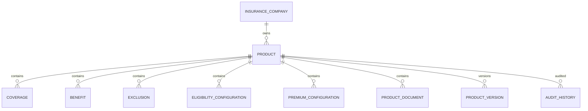

# TSD_03_DATABASE.md

> **Technical Specification Document (TSD)**  
> **Module:** Database Design  
> **Project:** Pulse Engine – Product Catalog Service  
> **Version:** 1.0  
> **Status:** Draft

---

# 1. Purpose

Dokumen ini mendefinisikan desain database Product Catalog Service.

Dokumen ini menjadi acuan implementasi bagi:

- Backend Engineer
- Database Engineer
- Solution Architect
- DevOps Engineer
- QA Engineer

Database merupakan **System of Record** untuk seluruh metadata produk Personal Accident Insurance.

---

# 2. Database Design Goals

Database dirancang dengan tujuan:

- Menjamin konsistensi data
- Mendukung immutable product version
- Mendukung audit trail
- Mendukung soft delete
- Mendukung optimistic locking
- Mudah di-scale
- Mudah di-maintain
- Mendukung horizontal service scaling

---

# 3. Technology

| Component | Value |
| ------------ | -------- |
| Database | PostgreSQL 16+ |
| Driver | PostgreSQL JDBC 42.7.11 |
| Migration | Flyway 11.14.1 |
| ORM | Spring Data JPA |
| Naming Strategy | snake_case |
| Character Set | UTF-8 |
| Time Zone | UTC |

---

# 4. Database Principles

Seluruh database wajib mengikuti prinsip berikut.

## Single Source of Truth

Product Catalog merupakan satu-satunya sumber metadata Product.

---

## Normalization

Normalisasi hingga minimal **Third Normal Form (3NF)**.

---

## Referential Integrity

Foreign Key digunakan untuk menjaga konsistensi relasi.

---

## Soft Delete

Data tidak boleh dihapus secara fisik.

---

## Immutable Version

Published Product tidak boleh diubah.

Perubahan menghasilkan Product Version baru.

---

## Auditability

Seluruh perubahan wajib dapat ditelusuri.

---

# 5. Schema Overview

```text
catalog
```

Semua tabel berada pada schema:

```
catalog
```

---

# 6. Entity Relationship Diagram (ERD)



---

# 7. Logical Data Model

## Master

- insurance_company

---

## Aggregate

- product

---

## Child Entity

- coverage
- benefit
- exclusion
- eligibility_configuration
- premium_configuration
- product_document

---

## Snapshot

- product_version

---

## Audit

- audit_history

---

# 8. Physical Tables

| Table | Description |
| --------- | ------------- |
| insurance_company | Company Master |
| product | Product Aggregate |
| coverage | Coverage |
| benefit | Benefit |
| exclusion | Exclusion |
| eligibility_configuration | Eligibility Metadata |
| premium_configuration | Premium Metadata |
| product_document | Product Document Metadata |
| product_version | Immutable Snapshot |
| audit_history | Audit Trail |

---

# 9. Standard Columns

Seluruh tabel menggunakan standar berikut.

| Column | Type |
| --------- | ------ |
| id | UUID |
| created_at | TIMESTAMP |
| created_by | VARCHAR(100) |
| updated_at | TIMESTAMP |
| updated_by | VARCHAR(100) |
| deleted | BOOLEAN |
| version | BIGINT |

---

# 10. Table Design

## insurance_company

| Column | Type |
| ---------- | ------ |
| id | UUID |
| company_code | VARCHAR(50) |
| company_name | VARCHAR(200) |
| status | VARCHAR(20) |
| version | BIGINT |
| created_at | TIMESTAMP |
| created_by | VARCHAR(100) |
| updated_at | TIMESTAMP |
| updated_by | VARCHAR(100) |
| deleted | BOOLEAN |

Constraints

```
company_code UNIQUE
```

---

## product

| Column | Type |
| ---------- | ------ |
| id | UUID |
| company_id | UUID |
| product_code | VARCHAR(50) |
| product_name | VARCHAR(200) |
| status | VARCHAR(20) |
| current_version | INTEGER |
| version | BIGINT |
| created_at | TIMESTAMP |
| created_by | VARCHAR(100) |
| updated_at | TIMESTAMP |
| updated_by | VARCHAR(100) |
| deleted | BOOLEAN |

---

## coverage

| Column | Type |
| ---------- | ------ |
| id | UUID |
| product_id | UUID |
| coverage_code | VARCHAR(50) |
| coverage_name | VARCHAR(200) |

---

## benefit

| Column | Type |
| ---------- | ------ |
| id | UUID |
| product_id | UUID |
| benefit_code | VARCHAR(50) |
| description | TEXT |

---

## exclusion

| Column | Type |
| ---------- | ------ |
| id | UUID |
| product_id | UUID |
| description | TEXT |

---

## eligibility_configuration

| Column | Type |
| ---------- | ------ |
| id | UUID |
| product_id | UUID |
| configuration_json | JSONB |

---

## premium_configuration

| Column | Type |
| ---------- | ------ |
| id | UUID |
| product_id | UUID |
| configuration_json | JSONB |

---

## product_document

| Column | Type |
| ---------- | ------ |
| id | UUID |
| product_id | UUID |
| document_type | VARCHAR(100) |
| file_name | VARCHAR(255) |
| document_uri | VARCHAR(500) |

Catatan:

Dokumen hanya menyimpan metadata.

Binary file berada di luar Product Catalog.

---

## product_version

| Column | Type |
| ---------- | ------ |
| id | UUID |
| product_id | UUID |
| version_number | INTEGER |
| snapshot | JSONB |
| published_at | TIMESTAMP |
| published_by | VARCHAR(100) |

---

## audit_history

| Column | Type |
| ---------- | ------ |
| id | UUID |
| entity_type | VARCHAR(50) |
| entity_id | UUID |
| action | VARCHAR(50) |
| before_data | JSONB |
| after_data | JSONB |
| performed_by | VARCHAR(100) |
| performed_at | TIMESTAMP |
| reason | VARCHAR(500) |

---

# 11. Primary Keys

Seluruh tabel menggunakan UUID sebagai Primary Key.

Contoh:

```sql
PRIMARY KEY (id)
```

Alasan:

- aman untuk distributed system
- tidak bergantung sequence database
- mudah digunakan pada REST API

---

# 12. Foreign Keys

| Parent | Child |
| ---------- | -------- |
| insurance_company | product |
| product | coverage |
| product | benefit |
| product | exclusion |
| product | eligibility_configuration |
| product | premium_configuration |
| product | product_document |
| product | product_version |

---

# 13. Unique Constraints

| Table | Constraint |
| --------- | ----------- |
| insurance_company | company_code |
| product | company_id + product_code |
| product_version | product_id + version_number |

---

# 14. Index Strategy

## insurance_company

```text
company_code
status
```

---

## product

```text
company_id

product_code

status

current_version
```

---

## product_version

```text
product_id

version_number
```

---

## audit_history

```text
entity_id

performed_at

action
```

---

# 15. Soft Delete Strategy

Seluruh tabel menggunakan

```
deleted BOOLEAN
```

Data tidak dihapus secara fisik.

Query default:

```sql
WHERE deleted = false
```

---

# 16. Audit Columns

Seluruh tabel menggunakan:

```text
created_at

created_by

updated_at

updated_by
```

Audit detail berada pada:

```
audit_history
```

---

# 17. Optimistic Locking

Menggunakan:

```text
version BIGINT
```

Implementasi:

```java
@Version
private Long version;
```

---

# 18. JSON Usage

JSONB hanya digunakan untuk:

- eligibility_configuration
- premium_configuration
- product_version snapshot
- audit before
- audit after

Business query tidak boleh bergantung pada JSONB.

---

# 19. Flyway Strategy

```
V1__initial_schema.sql

V2__company.sql

V3__product.sql

V4__configuration.sql

V5__version.sql

V6__audit.sql
```

Migration bersifat immutable.

Tidak boleh mengubah migration lama.

---

# 20. Transaction Strategy

Transaction hanya berada pada:

Application Service

Semua perubahan Product dilakukan dalam satu transaction.

---

# 21. Performance Strategy

Target:

| Operation | Target |
| ------------ | --------- |
| Product Detail | <300 ms |
| Search Product | <300 ms |
| Version History | <500 ms |
| Audit History | <500 ms |

---

# 22. Backup Strategy

Backup merupakan tanggung jawab Platform/DBA, bukan Product Catalog.

Baseline:

| Backup             | Frequency  |
| ------------------ | ---------- |
| Full Backup        | Weekly     |
| Incremental Backup | Daily      |
| WAL Archive        | Continuous |

Recovery Target:

| Metric | Target       |
| ------ | ------------ |
| RPO    | ≤ 15 Minutes |
| RTO    | ≤ 1 Hour     |

Implementasi aktual mengikuti standar infrastruktur organisasi.

---

# 23. Partition Strategy

Partition **bukan requirement awal**, tetapi merupakan optimisasi ketika volume audit tinggi.

Baseline:

```text
audit_history
```

tanpa partition.

Threshold:

Apabila:

- > 10 juta record, atau
- pertumbuhan > 1 juta record/bulan, atau
- query audit mulai terdegradasi,

maka dapat diterapkan:

```sql
PARTITION BY RANGE(created_at)
```

contoh:

```
audit_history_2026_01

audit_history_2026_02

audit_history_2026_03
```

Implementasi partition tidak memengaruhi domain maupun API.

---

# 24. Naming Convention

| Object | Convention |
| --------- | ---------------------- |
| Table | snake_case |
| Column | snake_case |
| PK | `pk_<table>` |
| FK | `fk_<table>_<parent>` |
| UK | `uk_<table>_<column>` |
| IDX | `idx_<table>_<column>` |

---

# 25. Architectural Decisions

| Decision | Rationale |
| ---------- | ----------- |
| UUID PK | Distributed System Friendly |
| JSONB | Flexible configuration storage |
| Snapshot Version | Immutable History |
| Soft Delete | Audit Compliance |
| Optimistic Locking | Prevent Lost Update |
| PostgreSQL | Relational Consistency |

---

# 26. Alternatives Considered

| Alternative | Decision | Reason |
| ------------- | ---------- | -------- |
| BIGSERIAL PK | Tidak dipilih | Sulit pada distributed environment |
| Hard Delete | Tidak dipilih | Tidak memenuhi kebutuhan audit |
| Event Sourcing | Tidak dipilih | Tidak diminta BRD |
| MongoDB | Tidak dipilih | Model data relasional lebih sesuai |
| Shared Database | Tidak dipilih | Bertentangan dengan prinsip service isolation |

---

# 27. Technical Risks

| Risk | Mitigation |
| ------ | ------------ |
| Duplicate Product Code | Unique Constraint |
| Lost Update | Optimistic Locking |
| Missing Audit | Append-only Audit Table |
| Orphan Child Record | Foreign Key Constraint |
| Slow Search | Index + Redis Cache |
| JSONB Abuse | Gunakan hanya untuk metadata yang tidak perlu di-query secara relasional |

---

# 28. Recommendations

1. Gunakan **UUID v7** apabila telah menjadi standar organisasi karena memberikan locality index yang lebih baik dibanding UUID acak.
2. Terapkan `NOT NULL` pada seluruh kolom mandatory sesuai FSD.
3. Seluruh Foreign Key menggunakan `ON UPDATE RESTRICT`.
4. Hindari `ON DELETE CASCADE` karena menggunakan Soft Delete.
5. Tambahkan migration validation pada pipeline CI/CD (`flyway validate`).
6. Pisahkan Entity JPA dari Domain Model untuk menjaga Persistence Ignorance.

---

# 29. Technical Architecture Decisions

Poin-poin berikut merupakan **keputusan teknis (Technical Architecture Decisions)**, bukan Functional Requirements. Seluruhnya telah diputuskan di level arsitektur dan tidak lagi berstatus *Requires Functional Clarification*.

## 29.1 Maksimum Ukuran Product Document Metadata

Product Catalog hanya menyimpan **metadata** dokumen. File fisik disimpan di Object Storage.

| Attribute     | Type    | Max Length |
| ------------- | ------- | ---------- |
| document_name | VARCHAR | 255        |
| document_type | VARCHAR | 50         |
| mime_type     | VARCHAR | 100        |
| storage_key   | VARCHAR | 1024       |
| checksum      | VARCHAR | 128        |
| file_size     | BIGINT  | 8 Bytes    |
| description   | VARCHAR | 1000       |

Rationale:

- Mendukung path S3/MinIO yang panjang.
- Tidak menyimpan binary di PostgreSQL.
- Tidak ada kebutuhan perubahan BRD.

**Status:** ✅ Resolved

---

## 29.2 Retention Audit History

Audit bersifat **append-only** dan tidak dapat diubah maupun dihapus oleh aplikasi.

Retention mengikuti kebijakan perusahaan, dengan baseline teknis:

- **Minimum 7 tahun**
- atau sesuai regulasi OJK / perusahaan

```text
Application
    ↓
Audit Table

Append Only

No Update

No Delete
```

Archive dilakukan oleh DBA atau platform, bukan aplikasi.

**Status:** ✅ Resolved

---

## 29.3 Backup Policy

Backup merupakan tanggung jawab Platform/DBA, bukan Product Catalog.

| Backup             | Frequency  |
| ------------------ | ---------- |
| Full Backup        | Weekly     |
| Incremental Backup | Daily      |
| WAL Archive        | Continuous |

Recovery Target:

| Metric | Target       |
| ------ | ------------ |
| RPO    | ≤ 15 Minutes |
| RTO    | ≤ 1 Hour     |

Implementasi aktual mengikuti standar infrastruktur organisasi.

**Status:** ✅ Resolved

---

## 29.4 Database High Availability

Tidak ditentukan oleh aplikasi. Aplikasi hanya mensyaratkan PostgreSQL HA.

Baseline:

```text
Primary

↓

Streaming Replication

↓

Standby
```

atau

```text
Patroni

+

PgBouncer
```

atau layanan managed cloud yang ekuivalen.

Service tetap menggunakan satu JDBC URL.

**Status:** ✅ Resolved

---

## 29.5 Archive Strategy Product Version

Product Version **tidak pernah dihapus**.

Karena:

- Quote membutuhkan historical version.
- Proposal membutuhkan historical version.
- Reporting membutuhkan historical version.
- Audit membutuhkan historical version.

Flow:

```text
Draft

↓

Publish

↓

Product Version

↓

Readonly Forever
```

Jika volume sangat besar:

- Archive dilakukan ke cold storage/database archive oleh DBA.
- Tidak dilakukan oleh aplikasi.

**Status:** ✅ Resolved

---

## 29.6 Partition Audit History

Partition **bukan requirement awal**, tetapi merupakan optimisasi ketika volume audit tinggi.

Baseline:

```text
audit_history
```

tanpa partition.

Threshold:

Apabila:

- > 10 juta record, atau
- pertumbuhan > 1 juta record/bulan, atau
- query audit mulai terdegradasi,

maka dapat diterapkan:

```sql
PARTITION BY RANGE(created_at)
```

contoh:

```
audit_history_2026_01

audit_history_2026_02

audit_history_2026_03
```

Implementasi partition tidak memengaruhi domain maupun API.

**Status:** ✅ Resolved

---

## Ringkasan Section 29

| Item                                      | Decision                                                                             | Status     |
| ----------------------------------------- | ------------------------------------------------------------------------------------ | ---------- |
| Maksimum ukuran Product Document metadata | Metadata only, ukuran kolom ditentukan secara teknis                                 | ✅ Resolved |
| Retention Audit History                   | Append-only, minimal 7 tahun atau sesuai regulasi perusahaan                         | ✅ Resolved |
| Backup Policy                             | Full + Incremental + WAL, mengikuti standar platform                                 | ✅ Resolved |
| Database High Availability Topology       | PostgreSQL HA (Primary–Standby atau managed service), transparan bagi aplikasi       | ✅ Resolved |
| Archive Strategy Product Version          | Tidak dihapus oleh aplikasi, archive menjadi tanggung jawab platform bila diperlukan | ✅ Resolved |
| Table Partition Audit History             | Tidak diwajibkan pada fase awal; diterapkan berdasarkan volume data dan performa     | ✅ Resolved |

---

# 30. Compliance & Data Security

## 30.1 Regulatory Compliance

Database design memenuhi persyaratan compliance:

* **UU PDP No. 27/2022** - Perlindungan Data Pribadi
  * Encryption at rest (AES-256)
  * Audit trail (7 years retention)
  * Data retention policy

* **POJK No. 13/2017** - Penggunaan TI
  * Immutable audit trail
  * Backup & recovery
  * Business continuity

* **ISO/IEC 27001:2022** - ISMS
  * Access control
  * Cryptography
  * Operations security

Lihat [Enterprise Standards & Compliance Framework](../../../docs/16. ENTERPRISE_STANDARDS.md) untuk detail lengkap.

---

## 30.2 Data Classification

| Data Type | Classification | Database Protection |
|-----------|---------------|---------------------|
| Insurance Company | Internal | Access control, audit |
| Product | Internal | Access control, audit, versioning |
| Product Configuration | Confidential | Encryption, RBAC, audit |
| Audit History | Restricted | Append-only, encryption, 7-year retention |

---

## 30.3 Encryption Strategy

### Data at Rest

* **PostgreSQL:** Disk-level encryption (AES-256)
* **Audit Trail:** Sensitive fields encryption
* **Key Management:** HSM/KMS untuk encryption keys

### Data in Transit

* **Application → Database:** TLS 1.2+
* **Application → Redis:** TLS (jika diperlukan)
* **Backup:** Encrypted backup storage

---

## 30.4 Audit Trail Implementation

### Audit Table Design

```sql
CREATE TABLE catalog.audit_history (
    id UUID PRIMARY KEY,
    entity_type VARCHAR(50) NOT NULL,
    entity_id UUID NOT NULL,
    action VARCHAR(50) NOT NULL,
    before_data JSONB,
    after_data JSONB,
    performed_by VARCHAR(100),
    performed_at TIMESTAMP NOT NULL,
    reason VARCHAR(500)
);
```

### Audit Principles

* **Append-only:** Tidak boleh diupdate atau dihapus
* **Immutable:** Setelah insert, data tidak boleh berubah
* **Complete:** Menangkap seluruh perubahan bisnis
* **Retained:** 7 tahun minimal (UU PDP, OJK)

---

## 30.5 Data Retention Implementation

### Retention Schedule

| Table | Retention | Disposal |
|-------|-----------|----------|
| product_version | Permanent | Archive setelah 10 tahun |
| audit_history | 7 years | Secure deletion |
| insurance_company | Permanent | Soft delete |

### Implementation

* **Application Level:** Soft delete untuk semua entity
* **Database Level:** Trigger untuk audit trail
* **Platform Level:** Automated archival dan deletion

---

## 30.6 Backup & Recovery

### Backup Strategy

* **Full Backup:** Weekly
* **Incremental Backup:** Daily
* **WAL Archive:** Continuous

### Recovery Objectives

* **RPO:** ≤ 15 minutes
* **RTO:** ≤ 1 hour

### Compliance Requirements

* Backup harus dienkripsi
* Backup harus diuji secara berkala
* Recovery procedure harus didokumentasikan

Lihat [Compliance Reference Guide](COMPLIANCE_REFERENCE.md) untuk detail implementasi.

---

# 30. Next Document

**TSD_04_API.md**

Dokumen berikut akan mendefinisikan:

- REST Endpoint
- OpenAPI 3.1
- Request & Response Schema
- Authentication & Authorization
- Pagination
- Filtering
- Sorting
- Validation
- Error Response
- HTTP Status Mapping
- API Versioning
- Consumer Contract