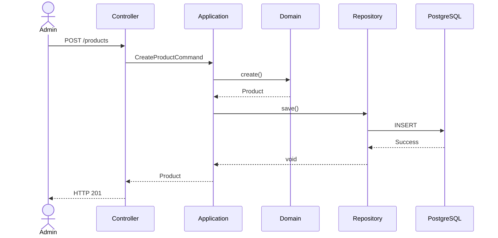

# TSD_04_API.md

> **Technical Specification Document (TSD)**  
> **Module:** API Specification  
> **Project:** Pulse Engine – Product Catalog Service  
> **Version:** 1.0  
> **Status:** Draft

---

# 1. Purpose

Dokumen ini mendefinisikan spesifikasi REST API Product Catalog Service.

Dokumen ini menjadi acuan implementasi bagi:

- Backend Developer
- Frontend Developer
- QA Engineer
- Integration Team
- API Gateway Team

Seluruh API mengikuti prinsip:

- RESTful API
- Stateless
- Resource Oriented
- JSON
- OpenAPI 3.1
- OAuth2 + JWT
- Versioned API

---

# 2. API Design Principles

## REST Resource

Endpoint menggunakan noun.

Contoh:

```
/products
```

bukan

```
/createProduct
```

---

## HTTP Method

| Method | Purpose |
| ---------- | ----------- |
| GET | Read |
| POST | Create |
| PUT | Replace |
| PATCH | Partial Update (tidak digunakan saat ini) |
| DELETE | Tidak digunakan (Soft Delete) |

---

## API Version

Semua endpoint menggunakan URI Versioning.

```
/api/v1
```

Contoh

```
/api/v1/products
```

---

## Media Type

Request

```
application/json
```

Response

```
application/json
```

---

# 3. Authentication

Seluruh endpoint memerlukan JWT.

Header

```http
Authorization: Bearer <access_token>
```

---

# 4. Authorization

| Role | Access |
| ------ | -------- |
| PRODUCT_ADMIN | Full Access |
| BUSINESS_USER | Read |
| READ_ONLY | Read |
| MARKETPLACE | Published Product Only |

---

# 5. Standard Headers

## Request

```http
Authorization

Content-Type

Accept

X-Correlation-ID
```

---

## Response

```http
Content-Type

X-Correlation-ID

ETag
```

---

# 6. URI Convention

## Company

```
/api/v1/companies
```

---

## Product

```
/api/v1/products
```

---

## Version

```
/api/v1/products/{id}/versions
```

---

## Audit

```
/api/v1/products/{id}/audit
```

---

# 7. Company APIs

---

## Create Company

### POST

```
POST /api/v1/companies
```

### Permission

```
PRODUCT_ADMIN
```

### Request

```json
{
  "companyCode": "PRU",
  "companyName": "Prudential Indonesia"
}
```

### Response

```json
{
  "id": "UUID",
  "companyCode": "PRU",
  "companyName": "Prudential Indonesia",
  "status": "ACTIVE"
}
```

### Status

```
201 Created
```

---

## Update Company

```
PUT /api/v1/companies/{companyId}
```

---

## Activate Company

```
POST /api/v1/companies/{companyId}/activate
```

---

## Deactivate Company

```
POST /api/v1/companies/{companyId}/deactivate
```

---

## Search Company

```
GET /api/v1/companies
```

Query Parameter

```
page

size

sort

status

keyword
```

---

## Company Detail

```
GET /api/v1/companies/{companyId}
```

---

# 8. Product APIs

---

## Create Product

```
POST /api/v1/products
```

Permission

```
PRODUCT_ADMIN
```

Request

```json
{
  "companyId":"UUID",
  "productCode":"PA001",
  "productName":"Personal Accident Basic"
}
```

Response

```json
{
  "id":"UUID",
  "status":"DRAFT",
  "version":1
}
```

---

## Update Product

```
PUT /api/v1/products/{productId}
```

Hanya Draft Product.

---

## Publish Product

```
POST /api/v1/products/{productId}/publish
```

---

## Archive Product

```
POST /api/v1/products/{productId}/archive
```

---

## Product Detail

```
GET /api/v1/products/{productId}
```

---

## Search Product

```
GET /api/v1/products
```

---

# 9. Product Configuration APIs

---

## Coverage

```
PUT

/api/v1/products/{id}/coverage
```

---

## Benefit

```
PUT

/api/v1/products/{id}/benefits
```

---

## Exclusion

```
PUT

/api/v1/products/{id}/exclusions
```

---

## Eligibility

```
PUT

/api/v1/products/{id}/eligibility
```

---

## Premium Configuration

```
PUT

/api/v1/products/{id}/premium
```

---

## Product Document

```
PUT

/api/v1/products/{id}/documents
```

Catatan:

API hanya mengelola metadata dokumen.

---

# 10. Version APIs

## Product Versions

```
GET

/api/v1/products/{id}/versions
```

---

## Product Version Detail

```
GET

/api/v1/products/{id}/versions/{version}
```

---

# 11. Audit APIs

## Audit History

```
GET

/api/v1/products/{id}/audit
```

---

## Audit Detail

```
GET

/api/v1/audit/{auditId}
```

---

# 12. Pagination

Parameter

```
page

size

sort
```

Contoh

```
GET

/products?page=0&size=20
```

Response

```json
{
  "content": [],
  "page": 0,
  "size": 20,
  "totalElements": 100,
  "totalPages": 5
}
```

---

# 13. Filtering

Company

```
status

keyword
```

---

Product

```
companyId

status

productCode

productName
```

---

# 14. Sorting

Contoh

```
sort=productName,asc

sort=createdAt,desc

sort=updatedAt,desc
```

---

# 15. Validation

## Company

Mandatory

```
companyCode

companyName
```

---

## Product

Mandatory

```
companyId

productCode

productName
```

---

## Publish Validation

Product wajib memiliki

- Coverage
- Benefit
- Eligibility Configuration
- Premium Configuration

Apabila salah satu belum tersedia maka Publish ditolak.

---

# 16. Standard Response

Success

```json
{
  "success": true,
  "data": {}
}
```

---

Validation Error

```json
{
  "success": false,
  "code":"VALIDATION_ERROR",
  "message":"Validation failed",
  "errors":[]
}
```

---

Business Error

```json
{
  "success": false,
  "code":"PRODUCT_NOT_READY",
  "message":"Product is not ready for publishing."
}
```

---

# 17. HTTP Status Mapping

| Status | Description |
| ---------- | ------------ |
| 200 | Success |
| 201 | Created |
| 400 | Validation Error |
| 401 | Unauthorized |
| 403 | Forbidden |
| 404 | Resource Not Found |
| 409 | Business Conflict |
| 500 | Internal Server Error |

---

# 18. Error Codes

| Code | Description |
| -------- | ------------- |
| VALIDATION_ERROR | Invalid Request |
| COMPANY_NOT_FOUND | Company Not Found |
| PRODUCT_NOT_FOUND | Product Not Found |
| VERSION_NOT_FOUND | Version Not Found |
| PRODUCT_NOT_READY | Publish Validation Failed |
| INVALID_STATUS | Invalid Product Status |
| INVALID_TRANSITION | Invalid State Transition |
| DUPLICATE_PRODUCT_CODE | Duplicate Product Code |
| DUPLICATE_COMPANY_CODE | Duplicate Company Code |
| CONCURRENT_MODIFICATION | Optimistic Lock Failure |

---

# 19. OpenAPI Security

```yaml
security:
  - bearerAuth: []
```

---

Security Scheme

```yaml
components:

  securitySchemes:

    bearerAuth:

      type: http

      bearerFormat: JWT

      scheme: bearer
```

---

# 20. API Sequence

## Create Product



---

# 21. API Naming Convention

URI menggunakan

```
kebab-case
```

JSON menggunakan

```
camelCase
```

Contoh

URI

```
/product-documents
```

JSON

```json
{
  "productCode":"PA001"
}
```

---

# 22. Idempotency

| API | Idempotent |
| ------ | ------------ |
| GET | ✔ |
| PUT | ✔ |
| POST Create | ✖ |
| Publish | ✔* |
| Archive | ✔* |

\* Mengembalikan representasi state yang sama jika resource sudah berada pada status tujuan, tanpa membuat perubahan tambahan.

---

# 23. API Versioning Strategy

Menggunakan URI Version.

```
/api/v1
```

Versi baru

```
/api/v2
```

Tidak mengubah kontrak API existing.

---

# 24. Architectural Decisions

| Decision | Reason |
| ----------- | -------- |
| REST API | Sesuai kebutuhan integrasi BRD |
| JSON | Standar interoperabilitas |
| URI Versioning | Mendukung backward compatibility |
| Stateless | Horizontal scaling |
| Bearer JWT | Enterprise authentication |
| Pagination | Menghindari full table scan pada consumer |

---

# 25. Alternatives Considered

| Alternative | Decision | Reason |
| ------------ | ---------- | -------- |
| GraphQL | Tidak digunakan | BRD hanya membutuhkan REST API |
| gRPC | Tidak digunakan | Tidak ada kebutuhan low-latency RPC pada BRD |
| Header Versioning | Tidak dipilih | URI versioning lebih eksplisit dan mudah dikelola |
| XML Payload | Tidak digunakan | JSON menjadi standar organisasi |

---

# 26. Technical Risks

| Risk | Mitigation |
| ------ | ------------ |
| Breaking API Change | URI Versioning |
| Large Payload | Pagination & Filtering |
| Unauthorized Access | OAuth2 + JWT |
| Duplicate Request | Validasi business key dan optimistic locking |
| Slow Search | Index + Redis Cache |

---

# 27. Recommendations

1. Gunakan **RFC 7807 (Problem Details for HTTP APIs)** sebagai format standar error response agar lebih interoperable.
2. Tambahkan **OpenAPI annotations** pada seluruh controller sehingga dokumentasi selalu sinkron dengan implementasi.
3. Gunakan **ETag** dan `If-Match` untuk update resource jika diperlukan di masa depan sebagai pelengkap optimistic locking.
4. Standarkan format tanggal menggunakan **ISO-8601 UTC** (`2026-08-03T12:30:45Z`).
5. Seluruh endpoint harus menyertakan `X-Correlation-ID` untuk kebutuhan tracing lintas service.

---

# 28. Requires Functional Clarification

| Item | Status |
| ------ | -------- |
| API Rate Limiting | Requires Functional Clarification |
| Maximum Page Size | Requires Functional Clarification |
| Batch Create/Update API | Requires Functional Clarification |
| Partial Update (PATCH) | Requires Functional Clarification |
| API Deprecation Policy | Requires Functional Clarification |
| ETag diwajibkan atau opsional | Requires Functional Clarification |

---

# 29. Next Document

**TSD_05_BUSINESS_RULE_IMPLEMENTATION.md**

Dokumen berikut akan memetakan setiap Business Rule dari BRD/FSD ke implementasi teknis, meliputi:

- Rule ID
- Domain Implementation
- Validation Strategy
- Aggregate Method
- Database Constraint
- Exception Mapping
- Related API
- Related Test Case
- Sequence of Validation
