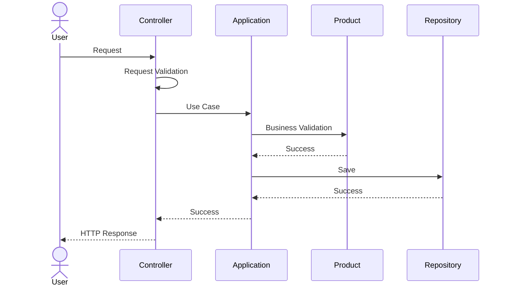

# TSD_05_BUSINESS_RULE_IMPLEMENTATION.md

> **Technical Specification Document (TSD)**  
> **Module:** Business Rule Implementation  
> **Project:** Pulse Engine – Product Catalog Service  
> **Version:** 1.0  
> **Status:** Draft

---

# 1. Purpose

Dokumen ini mendefinisikan implementasi teknis seluruh Business Rule yang berasal dari BRD dan FSD.

Dokumen ini bertujuan untuk memastikan bahwa:

- setiap Business Rule hanya diimplementasikan satu kali;
- tidak terjadi duplikasi validasi;
- seluruh Business Rule dapat ditelusuri hingga source code;
- seluruh Business Rule dapat diuji melalui Unit Test dan Integration Test.

---

# 2. Design Principles

Business Rule harus mengikuti prinsip berikut.

## Single Source of Truth

Setiap Business Rule hanya memiliki satu lokasi implementasi.

---

## Rich Domain Model

Business Rule berada pada Aggregate.

---

## No Business Logic in Controller

Controller hanya bertugas:

- menerima request
- validasi format
- memanggil Use Case

---

## No Business Logic in Repository

Repository hanya bertanggung jawab terhadap persistence.

---

## Validation Layering

Validasi dilakukan bertingkat.

```
Controller

↓

Application

↓

Domain

↓

Database
```

---

# 3. Business Rule Mapping Overview

| Layer | Responsibility |
| -------- | --------------- |
| Controller | Request Validation |
| Application | Use Case Orchestration |
| Domain | Business Rule |
| Repository | Persistence |
| Database | Constraint |

---

# 4. Rule Implementation Matrix

| Rule ID | Rule | Layer |
| ---------- | ------ | ------ |
| BR-001 | Company Code wajib unik | Database + Domain |
| BR-002 | Product harus memiliki Company | Domain |
| BR-003 | Product Code unik dalam Company | Domain + Database |
| BR-004 | Draft Product dapat diubah | Domain |
| BR-005 | Published Product tidak dapat diubah | Domain |
| BR-006 | Product harus memiliki Coverage sebelum Publish | Domain |
| BR-007 | Product harus memiliki Benefit sebelum Publish | Domain |
| BR-008 | Product harus memiliki Eligibility sebelum Publish | Domain |
| BR-009 | Product harus memiliki Premium Configuration sebelum Publish | Domain |
| BR-010 | Publish menghasilkan immutable Product Version | Domain |
| BR-011 | Archive tidak menghapus data | Domain |
| BR-012 | Audit wajib dibuat setiap perubahan | Application |

---

# 5. Rule BR-001

## Company Code Harus Unik

### Description

Setiap Insurance Company wajib memiliki Company Code yang unik.

---

### Implementation Layer

| Layer | Implementation |
| -------- | --------------- |
| Controller | - |
| Application | Check Existing |
| Domain | Validate Uniqueness |
| Database | Unique Constraint |

---

### Database

```sql
UNIQUE(company_code)
```

---

### Exception

```
DuplicateCompanyCodeException
```

---

### HTTP Response

```
409 Conflict
```

---

### Related API

```
POST /companies
```

---

### Test Case

```
TC-COMP-002
```

---

# 6. Rule BR-002

## Product Harus Memiliki Company

---

### Description

Product wajib dimiliki oleh satu Insurance Company.

---

### Aggregate

```
Product
```

---

### Validation

```java
if (companyId == null) {

    throw new CompanyRequiredException();

}
```

---

### HTTP

```
400 Bad Request
```

---

### Test Case

```
TC-PROD-003
```

---

# 7. Rule BR-003

## Product Code Unik

---

### Description

Product Code harus unik di dalam satu Company.

---

### Constraint

```sql
UNIQUE(company_id, product_code)
```

---

### Domain

```java
validateDuplicateCode();
```

---

### Exception

```
DuplicateProductCodeException
```

---

### HTTP

```
409 Conflict
```

---

# 8. Rule BR-004

## Draft Product Dapat Diubah

---

### Aggregate

```
Product
```

---

### Domain

```java
public void update(...) {

    ensureDraft();

}
```

---

### Exception

```
InvalidProductStatusException
```

---

### HTTP

```
409 Conflict
```

---

# 9. Rule BR-005

## Published Product Tidak Dapat Diubah

---

### Domain

```java
ensureNotPublished();
```

---

### Result

```
Reject Update
```

---

### Exception

```
ProductAlreadyPublishedException
```

---

# 10. Rule BR-006

## Coverage Wajib Sebelum Publish

---

### Aggregate

```
Product
```

---

### Domain

```java
if (coverages.isEmpty()) {

    throw new ProductNotReadyException();

}
```

---

### HTTP

```
409 Conflict
```

---

### Test

```
TC-PUB-001
```

---

# 11. Rule BR-007

## Benefit Wajib Sebelum Publish

---

### Domain

```java
if (benefits.isEmpty()) {

    throw new ProductNotReadyException();

}
```

---

### Test

```
TC-PUB-002
```

---

# 12. Rule BR-008

## Eligibility Configuration Wajib

---

### Domain

```java
if (eligibility == null) {

    throw new ProductNotReadyException();

}
```

---

### Test

```
TC-PUB-003
```

---

# 13. Rule BR-009

## Premium Configuration Wajib

---

### Domain

```java
if (premiumConfiguration == null) {

    throw new ProductNotReadyException();

}
```

---

### Test

```
TC-PUB-004
```

---

# 14. Rule BR-010

## Publish Membuat Product Version Baru

---

### Aggregate

```
Product
```

---

### Sequence

```
Validate

↓

Create Snapshot

↓

Increment Version

↓

Publish
```

---

### Domain

```java
createVersion();

publish();
```

---

### Test

```
TC-VERSION-002
```

---

# 15. Rule BR-011

## Archive Tidak Menghapus Data

---

### Domain

```java
archive();
```

---

### Database

```text
deleted = false

status = ARCHIVED
```

---

### Physical Delete

Tidak diperbolehkan.

---

# 16. Rule BR-012

## Audit Harus Dibuat

---

### Layer

Application Service

---

### Flow

```
Update Product

↓

Save Product

↓

Insert Audit

↓

Commit
```

---

### Exception

Rollback seluruh transaction apabila Audit gagal dibuat.

---

# 17. Validation Strategy

## Request Validation

Controller

Menggunakan

```
Jakarta Validation
```

---

Contoh

```java
@NotBlank

@NotNull

@Size
```

---

## Business Validation

Domain

Contoh

```java
product.publish();
```

---

## Persistence Validation

Database

Contoh

```
Unique

Foreign Key

Not Null
```

---

# 18. Exception Mapping

| Exception | HTTP |
| ------------ | ------ |
| ValidationException | 400 |
| CompanyNotFoundException | 404 |
| ProductNotFoundException | 404 |
| DuplicateCompanyCodeException | 409 |
| DuplicateProductCodeException | 409 |
| ProductAlreadyPublishedException | 409 |
| ProductNotReadyException | 409 |
| OptimisticLockException | 409 |
| AccessDeniedException | 403 |

---

# 19. Validation Sequence



---

# 20. Rule Ownership

| Rule | Owner |
| ------- | ------- |
| Mandatory Field | Controller |
| Business Validation | Domain |
| Transaction | Application |
| Persistence | Repository |
| Constraint | Database |

---

# 21. Transaction Boundary

Semua Business Rule dijalankan dalam satu transaction.

```
BEGIN

↓

Validate

↓

Business Rule

↓

Repository

↓

Audit

↓

COMMIT
```

Apabila salah satu gagal

```
ROLLBACK
```

---

# 22. Domain Events

Business Rule dapat menghasilkan Domain Event internal.

| Event | Trigger |
| --------- | ---------- |
| CompanyCreated | Create Company |
| CompanyUpdated | Update Company |
| CompanyActivated | Activate Company |
| CompanyDeactivated | Deactivate Company |
| ProductCreated | Create Product |
| ProductUpdated | Update Draft Product |
| ProductPublished | Publish Product |
| ProductArchived | Archive Product |
| ProductVersionCreated | Create Version |
| ProductConfigurationUpdated | Update Coverage/Benefit/Eligibility/Premium/Document |

Catatan:

Event di atas merupakan **Domain Event internal**.

BRD tidak mendefinisikan event publishing ke Kafka atau message broker.

---

# 23. Architecture Decisions

| Decision | Rationale |
| ---------- | ----------- |
| Business Rule di Aggregate | Menjaga konsistensi domain |
| Validation Berlapis | Mencegah invalid data sedini mungkin |
| Database Constraint | Menjamin integritas data |
| Transaction di Application Layer | Memastikan atomicity |
| Audit sebagai bagian dari transaction | Menjaga konsistensi perubahan |

---

# 24. Alternatives Considered

| Alternative | Decision | Reason |
| ------------- | ---------- | -------- |
| Business Rule di Controller | Tidak dipilih | Sulit diuji dan mudah terduplikasi |
| Business Rule di Service utilitas | Tidak dipilih | Menghasilkan Anemic Domain Model |
| Trigger Database untuk Audit | Tidak dipilih | Sulit ditelusuri dari Domain dan mengurangi portabilitas |
| Constraint hanya di aplikasi | Tidak dipilih | Database tetap harus menjaga integritas data |

---

# 25. Technical Risks

| Risk | Mitigation |
| ------ | ------------ |
| Rule terduplikasi | ArchUnit + Code Review |
| Business Rule berpindah ke Controller | Layered Architecture Enforcement |
| Constraint Database tidak sinkron dengan Domain | Traceability Matrix + Migration Review |
| Update concurrent | Optimistic Locking |
| Audit tidak konsisten | Audit dalam transaction yang sama |

---

# 26. Recommendations

1. Seluruh Aggregate harus memiliki Unit Test untuk setiap Business Rule.
2. Gunakan exception yang spesifik terhadap domain, bukan `RuntimeException` generik.
3. Seluruh Business Rule diberi identifier (`BR-xxx`) pada JavaDoc agar mudah ditelusuri ke BRD/FSD.
4. Gunakan ArchUnit untuk memastikan Controller tidak mengakses Repository secara langsung.
5. Semua perubahan state Aggregate harus dilakukan melalui method domain (`publish()`, `archive()`, `update()`), bukan setter.

---

# 27. Compliance & Audit Trail

## 27.1 Regulatory Compliance

Business Rule implementation memenuhi persyaratan compliance:

* **UU PDP No. 27/2022** - Perlindungan Data Pribadi
  * Audit trail untuk seluruh perubahan data
  * Data integrity melalui business validation
  * Retention policy untuk audit logs

* **POJK No. 13/2017** - Penggunaan TI
  * Immutable audit trail
  * Business rule enforcement
  * Change tracking

* **ISO/IEC 27001:2022** - ISMS
  * A.14 System Acquisition - Security requirements in development
  * A.12 Operations Security - Logging and monitoring

Lihat [Enterprise Standards & Compliance Framework](../../../docs/16. ENTERPRISE_STANDARDS.md) untuk detail lengkap.

---

## 27.2 Audit Trail Requirements

Setiap Business Rule change harus menghasilkan audit event:

| Business Rule | Audit Event | Retention |
|---------------|-------------|-----------|
| Company Created | COMPANY_CREATED | 7 years |
| Company Updated | COMPANY_UPDATED | 7 years |
| Company Activated | COMPANY_ACTIVATED | 7 years |
| Company Deactivated | COMPANY_DEACTIVATED | 7 years |
| Product Created | PRODUCT_CREATED | 10 years |
| Product Updated | PRODUCT_UPDATED | 10 years |
| Product Published | PRODUCT_PUBLISHED | 10 years |
| Product Archived | PRODUCT_ARCHIVED | 10 years |
| Coverage Updated | COVERAGE_UPDATED | 7 years |
| Benefit Updated | BENEFIT_UPDATED | 7 years |
| Eligibility Updated | ELIGIBILITY_UPDATED | 7 years |
| Premium Updated | PREMIUM_UPDATED | 7 years |

---

## 27.3 Data Classification for Business Rules

| Business Rule | Data Classification | Audit Required |
|---------------|---------------------|----------------|
| Company Management | Internal | Yes |
| Product Creation | Internal | Yes |
| Product Configuration | Confidential | Yes |
| Product Publish | Confidential | Yes |
| Product Archive | Confidential | Yes |
| Version Creation | Confidential | Yes |

---

## 27.4 Compliance Checklist

### Business Rule Compliance Checklist

- [ ] All business rules implemented in Domain Layer
- [ ] Audit trail generated for all state changes
- [ ] Business rule validation tested
- [ ] Database constraints enforce business rules
- [ ] Transaction boundaries ensure atomicity
- [ ] Exception handling provides clear error messages
- [ ] Business rule IDs traceable to BRD/FSD
- [ ] Unit tests cover all business rules
- [ ] Integration tests verify business rule enforcement
- [ ] ArchUnit tests enforce layered architecture

Lihat [Compliance Reference Guide](COMPLIANCE_REFERENCE.md) untuk detail implementasi.

---

# 27. Requires Functional Clarification

Item berikut tidak dapat diturunkan langsung dari BRD/FSD.

| Item | Status |
| ------ | -------- |
| Maksimum jumlah Coverage per Product | Requires Functional Clarification |
| Maksimum jumlah Benefit per Product | Requires Functional Clarification |
| Apakah Product dapat dipublish kembali setelah Archive | Requires Functional Clarification |
| Apakah perubahan Company ACTIVE menjadi INACTIVE mempengaruhi Product Published | Requires Functional Clarification |
| Alasan (`reason`) pada Audit wajib atau opsional | Requires Functional Clarification |

---

# 28. Traceability

| BRD | FSD | Domain Method | API | Test Case |
| ----- | ----- | --------------- | ----- | ----------- |
| BR-001 | Company Management | `Company.create()` | POST /companies | TC-COMP-001 |
| BR-002 | Product Management | `Product.create()` | POST /products | TC-PROD-001 |
| BR-003 | Product Management | `Product.validateDuplicateCode()` | POST /products | TC-PROD-002 |
| BR-004 | Product Management | `Product.update()` | PUT /products/{id} | TC-PROD-004 |
| BR-005 | Product Management | `Product.ensureNotPublished()` | PUT /products/{id} | TC-PROD-005 |
| BR-006 | Product Configuration | `Product.validateCoverage()` | POST /products/{id}/publish | TC-PUB-001 |
| BR-007 | Product Configuration | `Product.validateBenefit()` | POST /products/{id}/publish | TC-PUB-002 |
| BR-008 | Product Configuration | `Product.validateEligibility()` | POST /products/{id}/publish | TC-PUB-003 |
| BR-009 | Product Configuration | `Product.validatePremiumConfiguration()` | POST /products/{id}/publish | TC-PUB-004 |
| BR-010 | Versioning | `Product.createVersion()` | POST /products/{id}/publish | TC-VERSION-002 |
| BR-011 | Product Management | `Product.archive()` | POST /products/{id}/archive | TC-PROD-006 |
| BR-012 | Audit | `AuditApplicationService.record()` | Semua API Write | TC-AUDIT-001 s.d. TC-AUDIT-004 |

---

# 29. Next Document

**TSD_06_WORKFLOW.md**

Dokumen berikut akan membahas:

- Request Flow
- Sequence Diagram
- Service Interaction
- Transaction Boundary
- Error Flow
- Retry Strategy
- Compensation Strategy
- Lifecycle Workflow
- Publish Workflow
- Version Creation Workflow
- Audit Workflow

```
