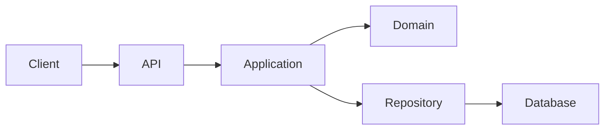
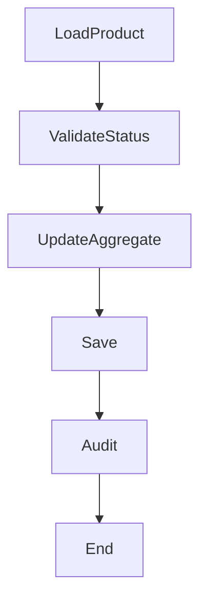
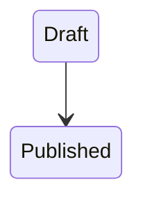
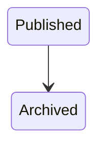
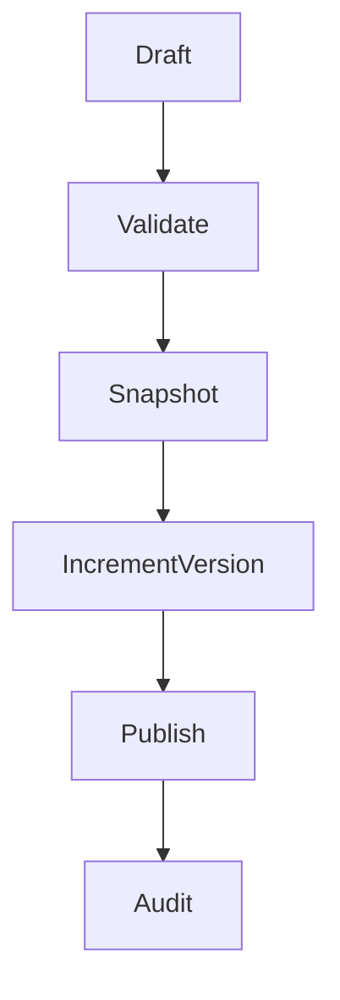
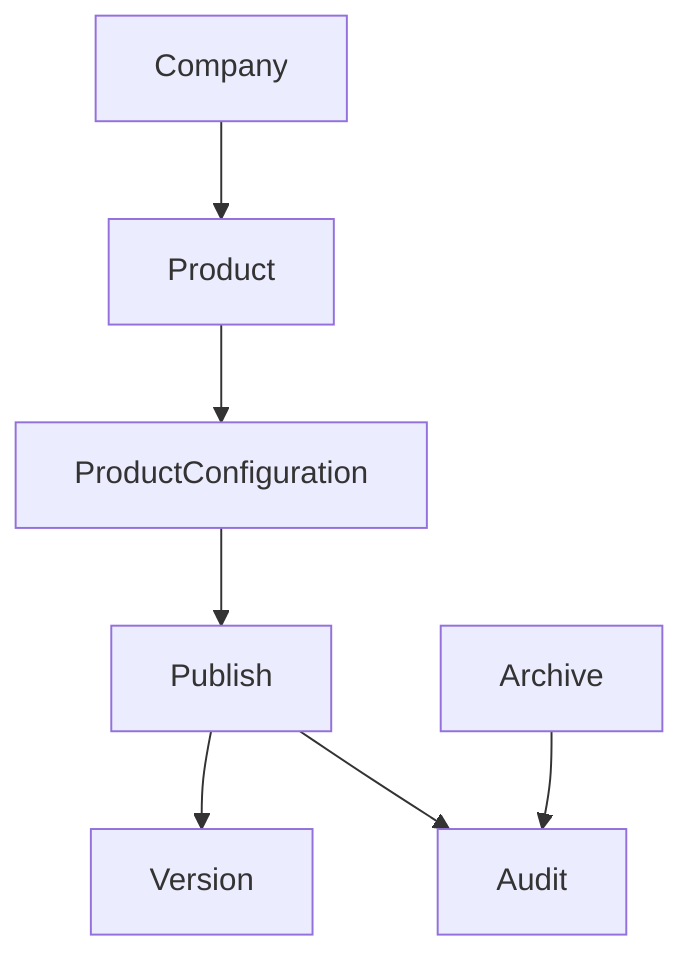

# TSD_06_WORKFLOW.md

> **Technical Specification Document (TSD)**  
> **Module:** Workflow Design  
> **Project:** Pulse Engine – Product Catalog Service  
> **Version:** 1.0  
> **Status:** Draft

---

# 1. Purpose

Dokumen ini mendefinisikan workflow teknis Product Catalog Service.

Workflow menjelaskan:

- Request Flow
- Service Interaction
- Transaction Boundary
- Domain Flow
- Error Flow
- Versioning Flow
- Audit Flow

Workflow hanya mencakup Product Catalog.

Dokumen ini **tidak membahas**:

- Quote
- Premium Calculation
- Eligibility Engine
- Checkout
- Payment
- Policy Issuance

karena berada di luar ruang lingkup Product Catalog.

---

# 2. Workflow Overview

Product Catalog memiliki workflow utama berikut.

| Workflow | Description |
| ----------- | ------------- |
| Create Company | Membuat Insurance Company |
| Update Company | Mengubah Company |
| Activate Company | Mengaktifkan Company |
| Deactivate Company | Menonaktifkan Company |
| Create Product | Membuat Product Draft |
| Update Product | Mengubah Product Draft |
| Update Configuration | Mengubah Coverage, Benefit, Eligibility, Premium Configuration, Product Document |
| Publish Product | Publish Product menjadi Published Version |
| Archive Product | Mengarsipkan Product |
| Query Product | Membaca Product |
| Query Version | Membaca Product Version |
| Query Audit | Membaca Audit History |

---

# 3. Workflow Architecture



---

# 4. General Request Flow

```mermaid
sequenceDiagram

actor User

participant API

participant Application

participant Domain

participant Repository

database PostgreSQL

User->>API: HTTP Request

API->>API: Request Validation

API->>Application: Command

Application->>Domain: Execute Business Rule

Domain-->>Application: Aggregate

Application->>Repository: Save

Repository->>PostgreSQL: SQL

PostgreSQL-->>Repository

Repository-->>Application

Application-->>API

API-->>User: HTTP Response
```

---

# 5. Transaction Boundary

Seluruh perubahan data dilakukan dalam **satu transaction**.

```text
BEGIN

↓

Business Validation

↓

Domain Execution

↓

Repository Save

↓

Audit Save

↓

COMMIT
```

Jika salah satu langkah gagal.

```text
ROLLBACK
```

---

# 6. Create Company Workflow

## Description

Workflow membuat Insurance Company baru.

---

## Sequence Diagram

```mermaid
sequenceDiagram

actor Admin

participant CompanyController

participant CompanyApplicationService

participant Company

participant CompanyRepository

participant AuditRepository

database PostgreSQL

Admin->>CompanyController: POST /companies

CompanyController->>CompanyApplicationService: CreateCompanyCommand

CompanyApplicationService->>Company: create()

Company->>Company: validate()

CompanyApplicationService->>CompanyRepository: save()

CompanyApplicationService->>AuditRepository: insert()

CompanyApplicationService-->>CompanyController

CompanyController-->>Admin: 201 Created
```

---

# 7. Create Product Workflow

## Description

Product baru selalu dibuat dengan status:

```
DRAFT
```

---

## Sequence Diagram

```mermaid
sequenceDiagram

actor Admin

participant Controller

participant ProductApplicationService

participant Product

participant Repository

database PostgreSQL

Admin->>Controller: POST /products

Controller->>ProductApplicationService

ProductApplicationService->>Product:create()

Product->>Product:validate()

ProductApplicationService->>Repository:save()

Repository->>PostgreSQL

PostgreSQL-->>Repository

Repository-->>ProductApplicationService

ProductApplicationService-->>Controller

Controller-->>Admin
```

---

# 8. Update Product Workflow

Hanya Product dengan status:

```
DRAFT
```

yang boleh diubah.

---

## Workflow



---

# 9. Update Product Configuration Workflow

Workflow ini berlaku untuk:

- Coverage
- Benefit
- Exclusion
- Eligibility
- Premium Configuration
- Product Document

---

## Flow

```text
Load Product

↓

Validate Draft

↓

Update Configuration

↓

Save

↓

Audit
```

---

# 10. Publish Product Workflow

Publish merupakan workflow paling penting.

---

## Preconditions

Product harus memiliki:

- Coverage
- Benefit
- Eligibility Configuration
- Premium Configuration

Jika salah satu belum ada maka Publish ditolak.

---

## Sequence Diagram

```mermaid
sequenceDiagram

actor Admin

participant Controller

participant ProductApplicationService

participant Product

participant VersionRepository

participant ProductRepository

participant AuditRepository

database PostgreSQL

Admin->>Controller: Publish Product

Controller->>ProductApplicationService

ProductApplicationService->>Product:publish()

Product->>Product:validateReadyForPublish()

Product->>VersionRepository:createSnapshot()

Product->>Product:setPublished()

ProductApplicationService->>ProductRepository:save()

ProductApplicationService->>AuditRepository:insert()

ProductApplicationService-->>Controller

Controller-->>Admin
```

---

# 11. Publish State Transition



Transition lain ditolak.

---

# 12. Archive Product Workflow

Workflow Archive tidak menghapus Product.

---

## Flow

```text
Load Product

↓

Validate Published

↓

Archive

↓

Save

↓

Audit
```

---

## State



---

# 13. Product Version Workflow

Setiap Publish menghasilkan snapshot baru.

---

## Workflow



---

# 14. Version Snapshot

Snapshot menyimpan representasi Product saat dipublish.

```text
Product

↓

JSON Snapshot

↓

Product Version
```

Snapshot bersifat immutable.

---

# 15. Query Product Workflow

Query Product tidak mengubah data.

---

## Flow

```text
Receive Request

↓

Repository Query

↓

Mapping DTO

↓

Return Response
```

---

## Sequence

```mermaid
sequenceDiagram

actor User

participant Controller

participant QueryService

participant Repository

database PostgreSQL

User->>Controller

Controller->>QueryService

QueryService->>Repository

Repository->>PostgreSQL

PostgreSQL-->>Repository

Repository-->>QueryService

QueryService-->>Controller

Controller-->>User
```

---

# 16. Query Version Workflow

```text
Receive Request

↓

Load Version

↓

Return Snapshot
```

---

# 17. Query Audit Workflow

Audit bersifat Read Only.

```text
Load Audit

↓

Return Audit History
```

---

# 18. Error Flow

```mermaid
flowchart TD

Request

↓

Validate

↓

Business Rule

↓

Persistence

↓

Success

Request --> Validate

Validate --> BusinessRule

BusinessRule --> Persistence

Persistence --> Success

Validate --> Error

BusinessRule --> Error

Persistence --> Error
```

---

# 19. Exception Flow

| Stage | Exception |
| --------- | ----------- |
| Validation | ValidationException |
| Domain | BusinessException |
| Repository | DataAccessException |
| Database | ConstraintViolation |
| Optimistic Lock | OptimisticLockException |

---

# 20. Retry Strategy

Product Catalog tidak menggunakan retry pada Business Command.

Retry hanya diperbolehkan pada:

- database connection transient failure
- infrastructure timeout

Retry **tidak boleh** mengulangi Business Rule yang sudah berhasil dieksekusi sebagian.

---

# 21. Compensation Strategy

Product Catalog menggunakan database transaction.

Tidak menggunakan Saga maupun Compensation.

Jika transaction gagal.

```
ROLLBACK
```

---

# 22. Concurrency Workflow

Menggunakan Optimistic Lock.

```text
Load Product

↓

Version = 5

↓

Update

↓

Save

↓

Version = 6
```

Jika terdapat update bersamaan.

```
409 Conflict
```

---

# 23. Audit Workflow

Audit dibuat setelah perubahan Aggregate berhasil.

```mermaid
flowchart TD

Update Aggregate

↓

Save Aggregate

↓

Insert Audit

↓

Commit
```

Audit menjadi bagian dari transaction.

---

# 24. Logging Workflow

Setiap request menghasilkan:

- Correlation ID
- Trace ID
- Request Log
- Response Log

Contoh:

```text
HTTP Request

↓

Application Log

↓

Domain Log

↓

Repository Log

↓

HTTP Response
```

---

# 25. Workflow Dependency



---

# 26. Architectural Decisions

| Decision | Rationale |
| ----------- | ----------- |
| Application Service mengelola workflow | Memisahkan orchestration dari Domain |
| Domain Aggregate mengelola Business Rule | Konsistensi Domain |
| Repository hanya Persistence | Separation of Concern |
| Audit bagian dari transaction | Menjamin konsistensi |
| Snapshot saat Publish | Immutable Product Version |

---

# 27. Alternatives Considered

| Alternative | Decision | Reason |
| ------------ | ---------- | -------- |
| Saga Pattern | Tidak digunakan | Tidak ada transaksi lintas service |
| Event Sourcing | Tidak digunakan | BRD tidak mensyaratkan |
| CQRS Read Database | Belum digunakan | Volume data belum memerlukan |
| Kafka Workflow | Tidak digunakan | Di luar scope Product Catalog |

---

# 28. Technical Risks

| Risk | Mitigation |
| ------ | ------------ |
| Publish bersamaan | Optimistic Locking |
| Audit gagal | Rollback transaction |
| Duplicate Publish | Domain Validation |
| Update Published Product | Business Rule Validation |
| Long Transaction | Batasi transaction hanya pada Aggregate Product |

---

# 29. Recommendations

1. Gunakan `@Transactional` hanya pada **Application Service**, bukan pada Controller atau Repository.
2. Hindari memanggil Repository langsung dari Controller.
3. Seluruh workflow harus menghasilkan Audit Trail untuk operasi yang mengubah data.
4. Pisahkan Command dan Query Service apabila kebutuhan query berkembang (CQRS ringan).
5. Tambahkan OpenTelemetry Span pada setiap tahapan workflow untuk observability.

---

# 30. Requires Functional Clarification

| Item | Status |
| ------ | -------- |
| Apakah Publish memerlukan approval sebelum menjadi Published | Requires Functional Clarification |
| Apakah Archive dapat dibatalkan (Unarchive) | Requires Functional Clarification |
| Mekanisme locking selain optimistic locking | Requires Functional Clarification |
| SLA maksimum untuk setiap workflow | Requires Functional Clarification |
| Apakah terdapat workflow bulk publish | Requires Functional Clarification |

---

# 31. Next Document

**TSD_07_VERSIONING.md**

Dokumen berikut akan membahas:

- Product Version Strategy
- Immutable Version Design
- Snapshot Strategy
- Version Numbering
- Historical Retrieval
- Backward Compatibility
- Database Implementation
- API Version Access
- Sequence Diagram
- Java Implementation
- SQL Design

```
