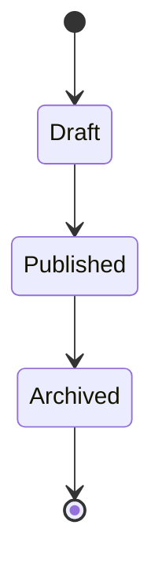
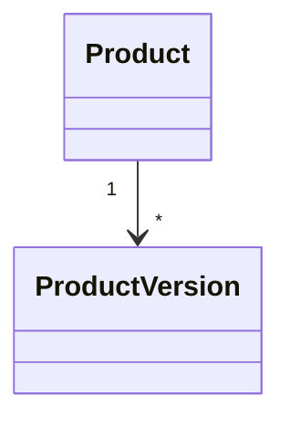
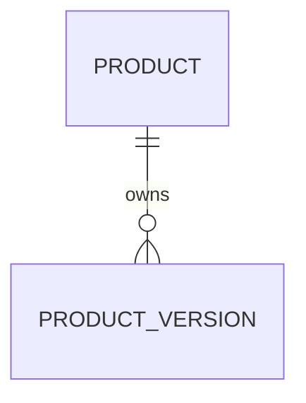

# TSD_07_VERSIONING.md

> **Technical Specification Document (TSD)**  
> **Module:** Versioning Strategy  
> **Project:** Pulse Engine – Product Catalog Service  
> **Version:** 1.0  
> **Status:** Draft

---

# 1. Purpose

Dokumen ini mendefinisikan strategi versioning pada Product Catalog Service.

Versioning bertujuan untuk:

- menjaga immutable Product yang telah dipublish;
- menyediakan historical snapshot;
- mendukung traceability;
- memastikan seluruh consumer dapat menggunakan versi produk yang tepat;
- memenuhi kebutuhan audit dan regulasi industri asuransi.

---

# 2. Scope

Versioning hanya berlaku untuk:

- Product
- Product Configuration
- Coverage
- Benefit
- Exclusion
- Eligibility Configuration
- Premium Configuration
- Product Document

Versioning **tidak berlaku** untuk:

- Insurance Company
- Audit History

---

# 3. Design Principles

Versioning mengikuti prinsip berikut.

## Immutable Version

Published Product tidak dapat diubah.

---

## Snapshot Based

Setiap Publish menghasilkan snapshot lengkap Product.

---

## Read Only

Version hanya dapat dibaca.

Tidak dapat diupdate.

---

## Sequential Numbering

Version menggunakan urutan integer.

```
1

↓

2

↓

3

↓

4
```

---

## No Delete

Version tidak boleh dihapus.

---

# 4. Version Lifecycle



Perubahan hanya diperbolehkan pada Draft.

---

# 5. Versioning Workflow

```mermaid
flowchart TD

Draft

↓

Update Product

↓

Publish

↓

Create Snapshot

↓

Version +1

↓

Published
```

---

# 6. Version Creation

Version baru dibuat ketika:

| Operation | Create Version |
| ------------ | ---------------- |
| Create Draft | Tidak |
| Update Draft | Tidak |
| Publish | Ya |
| Archive | Tidak |
| Query | Tidak |

---

# 7. Version Numbering

Contoh

| Product | Version |
| ---------- | ---------- |
| Draft | 1 |
| Publish Pertama | 1 |
| Draft Baru | 2 |
| Publish Kedua | 2 |
| Draft Baru | 3 |

Current Version selalu menunjukkan Published Version terbaru.

---

# 8. Aggregate Relationship



---

# 9. Version Structure

ProductVersion menyimpan snapshot Product.

```text
ProductVersion

├── Version Number
├── Product Snapshot
├── Published By
├── Published At
```

---

# 10. Product Snapshot

Snapshot berisi representasi lengkap Product.

Meliputi:

- Product Metadata
- Coverage
- Benefit
- Exclusion
- Eligibility Configuration
- Premium Configuration
- Product Document

Snapshot tidak menyimpan Audit History.

---

# 11. Database Model



---

## product_version

| Column | Type |
| ---------- | ------ |
| id | UUID |
| product_id | UUID |
| version_number | INTEGER |
| snapshot | JSONB |
| published_by | VARCHAR(100) |
| published_at | TIMESTAMP |

---

Constraint

```sql
UNIQUE(product_id, version_number)
```

---

# 12. Snapshot Strategy

Snapshot menggunakan pendekatan **Full Snapshot**.

```text
Product

↓

JSON Snapshot

↓

Product Version
```

Tidak menggunakan Delta Version.

---

# 13. Why Full Snapshot

Keuntungan:

- sederhana
- cepat diambil
- tidak memerlukan replay
- mudah untuk audit
- mudah dibandingkan antar versi

Trade-off:

- ukuran storage lebih besar.

---

# 14. Publish Workflow

```mermaid
sequenceDiagram

actor Admin

participant Product

participant VersionService

participant ProductVersionRepository

Admin->>Product: Publish()

Product->>Product: Validate()

Product->>VersionService: Create Snapshot

VersionService->>ProductVersionRepository: Save Version

VersionService-->>Product

Product-->>Admin
```

---

# 15. Version Repository

```java
public interface ProductVersionRepository {

    ProductVersion save(ProductVersion version);

    Optional<ProductVersion> findByProductAndVersion(
            ProductId productId,
            Integer version);

    List<ProductVersion> findAll(ProductId productId);

}
```

---

# 16. ProductVersion Aggregate

```text
ProductVersion

├── ProductVersionId
├── ProductId
├── VersionNumber
├── Snapshot
├── PublishedAt
├── PublishedBy
```

ProductVersion bersifat immutable.

---

# 17. Version Access API

## Latest Version

```
GET

/api/v1/products/{productId}
```

---

## Version History

```
GET

/api/v1/products/{productId}/versions
```

---

## Specific Version

```
GET

/api/v1/products/{productId}/versions/{version}
```

---

# 18. Version Retrieval Workflow

```mermaid
sequenceDiagram

actor Consumer

participant Controller

participant QueryService

participant Repository

Consumer->>Controller

Controller->>QueryService

QueryService->>Repository

Repository-->>QueryService

QueryService-->>Controller

Controller-->>Consumer
```

---

# 19. Historical Access

Consumer dapat mengambil seluruh historical version.

Contoh

```
Version 1

Version 2

Version 3

Version 4
```

Semua bersifat Read Only.

---

# 20. Version Validation

Sebelum membuat version baru.

Validasi:

- Product masih Draft
- Coverage tersedia
- Benefit tersedia
- Eligibility tersedia
- Premium Configuration tersedia

Jika gagal.

```
409 Conflict
```

---

# 21. Immutable Rules

Published Version tidak boleh:

- Update
- Delete
- Replace

Perubahan harus melalui Draft baru.

---

# 22. Sequence of Publish

```text
Load Draft

↓

Validate

↓

Create Snapshot

↓

Increment Version

↓

Persist ProductVersion

↓

Update Current Version

↓

Publish Product

↓

Insert Audit

↓

Commit
```

---

# 23. Current Version

Tabel Product memiliki kolom.

```
current_version
```

Kolom ini menunjuk Published Version terakhir.

---

# 24. Version Comparison

Saat ini BRD tidak mendefinisikan Compare Version.

Status

```
Requires Functional Clarification
```

---

# 25. Backward Compatibility

Consumer yang menggunakan Version lama tetap dapat membaca snapshot.

Version lama tidak berubah.

---

# 26. Rollback Strategy

Rollback Product ke Version sebelumnya **tidak didefinisikan** pada BRD.

Status

```
Requires Functional Clarification
```

---

# 27. Caching Strategy

Cache hanya digunakan untuk:

Latest Version

```
product::{productId}
```

Version History

```
product-version::{productId}
```

Specific Version

```
product-version::{productId}::{version}
```

Published Version dapat di-cache karena immutable.

---

# 28. Java Implementation

## Product

```java
public void publish() {

    validateReadyForPublish();

    createVersion();

    this.status = ProductStatus.PUBLISHED;

}
```

---

## ProductVersion

```java
public record ProductVersion(

        UUID id,

        UUID productId,

        Integer version,

        String snapshot,

        Instant publishedAt,

        String publishedBy

) {
}
```

---

# 29. SQL Example

```sql
CREATE TABLE catalog.product_version (

    id UUID PRIMARY KEY,

    product_id UUID NOT NULL,

    version_number INTEGER NOT NULL,

    snapshot JSONB NOT NULL,

    published_at TIMESTAMP NOT NULL,

    published_by VARCHAR(100),

    CONSTRAINT uk_product_version
        UNIQUE(product_id, version_number)

);
```

---

# 30. Architecture Decisions

| Decision | Rationale |
| ----------- | ----------- |
| Full Snapshot | Sederhana dan mudah diambil |
| Immutable Version | Audit & Compliance |
| Integer Version | Mudah dipahami |
| Separate Table | Isolasi data historis |
| Current Version Pointer | Query lebih cepat |

---

# 31. Alternatives Considered

| Alternative | Decision | Reason |
| ------------ | ---------- | -------- |
| Delta Version | Tidak dipilih | Kompleks untuk restore |
| Event Sourcing | Tidak dipilih | Tidak diminta BRD |
| Overwrite Existing Product | Tidak dipilih | Menghilangkan histori |
| Database Trigger Versioning | Tidak dipilih | Business Rule harus berada di Domain |

---

# 32. Technical Risks

| Risk | Mitigation |
| ------ | ------------ |
| Snapshot semakin besar | Simpan metadata saja, bukan binary document |
| Publish bersamaan | Optimistic Locking |
| Version hilang | Transaction + Constraint |
| Consumer membaca versi salah | Current Version pointer |
| Storage bertambah | Monitoring kapasitas dan kebijakan retensi bila disetujui bisnis |

---

# 33. Recommendations

1. Simpan snapshot dalam format JSONB agar fleksibel terhadap perubahan struktur.
2. Jangan mengubah struktur snapshot lama setelah dipublish.
3. Tambahkan checksum/hash snapshot jika di masa depan diperlukan verifikasi integritas.
4. Pisahkan Query Service untuk Product Version apabila volume histori meningkat.
5. Audit dan Product Version harus selalu dibuat dalam transaction yang sama.

---

# 34. Requires Functional Clarification

| Item | Status |
| ------ | -------- |
| Mekanisme rollback ke version sebelumnya | Requires Functional Clarification |
| Compare antar Product Version | Requires Functional Clarification |
| Maksimum jumlah Product Version | Requires Functional Clarification |
| Retention Product Version | Requires Functional Clarification |
| Snapshot compression | Requires Functional Clarification |
| Apakah Draft berikutnya dibuat otomatis setelah Publish | Requires Functional Clarification |

---

# 35. Traceability

| BRD | FSD | Domain | Database | API | Test Case |
| ----- | ----- | -------- | ---------- | ----- | ----------- |
| Product Version | FSD-05 | `Product.createVersion()` | product_version | GET /products/{id}/versions | TC-VERSION-001 |
| Publish Product | FSD-02 | `Product.publish()` | product.current_version | POST /products/{id}/publish | TC-PUB-001 |
| Historical Access | FSD-04 | QueryService | product_version | GET /products/{id}/versions/{version} | TC-VERSION-003 |
| Immutable Published Product | FSD-05 | `ensureNotPublished()` | Constraint + Version | PUT /products/{id} | TC-PROD-005 |

---

# 36. Next Document

**TSD_08_CACHING.md**

Dokumen berikut akan membahas:

- Redis Architecture
- Cache Strategy
- Cache Key Design
- TTL
- Cache Invalidation
- Read Through Cache
- Write Strategy
- Cache Consistency
- Spring Cache Implementation
- Performance Optimization
- Sequence Diagram
