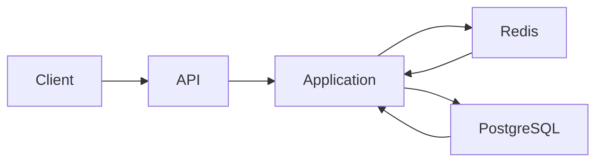
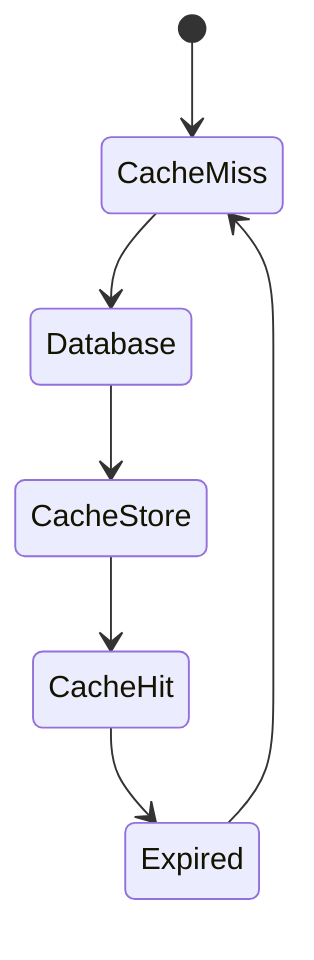
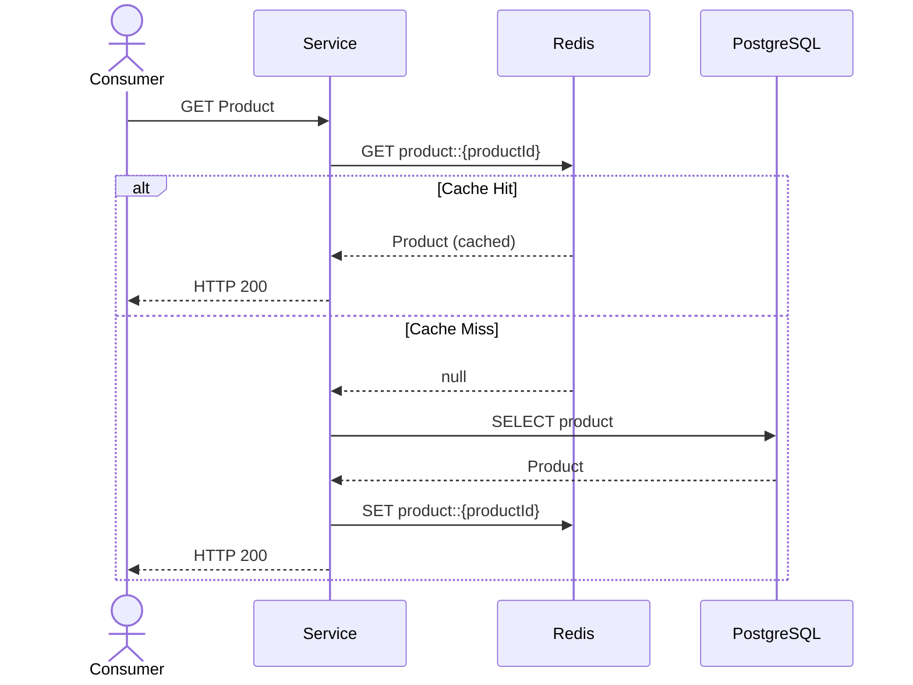
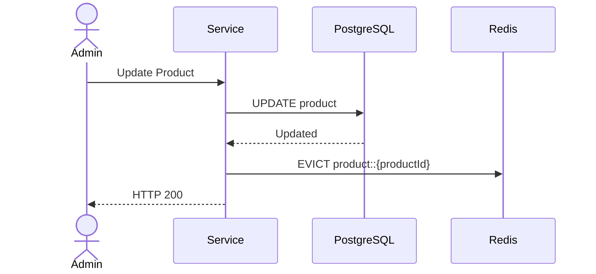
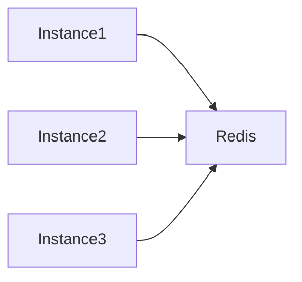

# TSD_08_CACHE.md

> **Technical Specification Document (TSD)**  
> **Module:** Cache Strategy  
> **Project:** Pulse Engine – Product Catalog Service  
> **Version:** 1.0  
> **Status:** Draft

---

# 1. Purpose

Dokumen ini mendefinisikan desain caching untuk Product Catalog Service.

Tujuan utama caching adalah:

- meningkatkan performa query;
- mengurangi beban PostgreSQL;
- mempercepat akses Product Catalog;
- mendukung horizontal scalability;
- menjaga konsistensi data.

Cache **bukan** merupakan Source of Truth.

Source of Truth tetap berada pada PostgreSQL.

---

# 2. Scope

Caching hanya digunakan untuk operasi **Read**.

Operasi berikut menggunakan cache.

- Get Company Detail
- Search Company
- Get Product Detail
- Search Product
- Product Version
- Version History

Operasi berikut **tidak menggunakan cache**.

- Create
- Update
- Publish
- Archive
- Audit Write

---

# 3. Technology

| Component | Technology |
| ------------ | ------------ |
| Cache | Redis 7+ |
| Client | Spring Data Redis |
| Driver | Lettuce |
| Serialization | JSON |
| Compression | Tidak Digunakan |
| Cache Abstraction | Spring Cache |

---

# 4. Cache Architecture



---

# 5. Cache Principles

## Cache Aside Pattern

Menggunakan pola:

```
Cache Aside
```

Flow:

```text
Read

↓

Check Redis

↓

Hit?

↓

Yes

↓

Return

↓

No

↓

Query Database

↓

Store Redis

↓

Return
```

---

## Write Around Strategy

Setiap perubahan data akan:

```text
Update Database

↓

Evict Cache

↓

Request Berikutnya

↓

Reload Cache
```

---

## Source of Truth

```
PostgreSQL
```

Cache hanya merupakan salinan.

---

# 6. Cached Resources

| Resource | Cached |
| ------------ | -------- |
| Company Detail | Yes |
| Product Detail | Yes |
| Published Product | Yes |
| Product Search | Yes |
| Product Version | Yes |
| Version History | Yes |
| Audit History | No |

---

# 7. Cache Key Design

## Company

```
company::{companyId}
```

Contoh

```
company::3bd29f84...
```

---

## Company Search

```
company-search::{hash}
```

---

## Product Detail

```
product::{productId}
```

---

## Product Search

```
product-search::{hash}
```

---

## Latest Product Version

```
product-version::{productId}
```

---

## Specific Version

```
product-version::{productId}::{version}
```

---

# 8. Cache TTL

| Cache | TTL |
| --------- | ------ |
| Company Detail | 30 Minutes |
| Product Detail | 30 Minutes |
| Search Product | 10 Minutes |
| Product Version | 24 Hours |
| Version History | 60 Minutes |

Alasan:

Published Product relatif jarang berubah.

---

# 9. Cache Lifecycle



---

# 10. Cache Read Workflow



---

# 11. Cache Write Workflow



---

# 12. Cache Invalidation

Cache dihapus pada operasi berikut.

| Operation | Cache Eviction |
| ------------ | --------------- |
| Create Company | Company Search |
| Update Company | Company Detail + Search |
| Activate Company | Company Detail + Search |
| Deactivate Company | Company Detail + Search |
| Create Product | Product Search |
| Update Product | Product Detail + Search |
| Publish Product | Product Detail + Search + Product Version |
| Archive Product | Product Detail + Search |
| Update Configuration | Product Detail |

---

# 13. Spring Cache Strategy

Menggunakan Spring Cache.

Contoh

```java
@Cacheable(
    value = "product",
    key = "#productId"
)
public ProductDetail getProduct(UUID productId) {
}
```

---

Update

```java
@CacheEvict(
    value = "product",
    key = "#productId"
)
public void updateProduct(...) {
}
```

---

# 14. Search Cache

Search menggunakan hash parameter.

Contoh

```
page=0

size=20

status=PUBLISHED

company=ABC
```

Hash menjadi

```
product-search::7AF9E18...
```

---

# 15. Cache Consistency

Product Catalog menggunakan:

```
Eventual Consistency
```

antara Redis dan PostgreSQL.

Karena:

Database merupakan Source of Truth.

---

# 16. Cache Serialization

Menggunakan JSON.

Contoh

```json
{
  "id":"UUID",
  "productCode":"PA001",
  "productName":"Personal Accident Basic"
}
```

---

# 17. Cache Size

Kapasitas Redis ditentukan melalui **capacity planning** (lihat Section 30.1 Cache Infrastructure Decisions).

Baseline deployment awal:

| Environment | Recommended Memory |
|-------------|--------------------|
| Development | 512 MB |
| SIT / UAT | 1 GB |
| Production | Minimal 4 GB |

Kapasitas final mengikuti hasil capacity planning dan observasi penggunaan memori.

---

# 18. Cache Eviction Policy

Redis menggunakan

```
allkeys-lru
```

Alasan:

Data yang jarang diakses akan dikeluarkan terlebih dahulu.

---

# 19. Distributed Cache

Semua instance Product Catalog menggunakan Redis yang sama.



---

# 20. Failure Strategy

Jika Redis gagal.

Workflow berubah menjadi

```text
Read

↓

Database

↓

Return
```

Service tetap berjalan.

Redis bukan dependency kritikal.

---

# 21. Monitoring

Metric yang dipantau.

| Metric | Description |
| ---------- | ------------ |
| Cache Hit | Cache ditemukan |
| Cache Miss | Cache tidak ditemukan |
| Eviction | Cache dihapus |
| Redis Latency | Waktu akses Redis |
| Redis Memory | Penggunaan Memory |
| TTL | Expired Cache |

---

# 22. Performance Target

| Operation | Target |
| ------------ | --------- |
| Cache Hit | <10 ms |
| Cache Miss | <300 ms |
| Redis GET | <5 ms |
| Redis SET | <10 ms |

---

# 23. Java Configuration

```java
@Configuration
@EnableCaching
public class CacheConfiguration {

}
```

---

Redis Configuration

```yaml
spring:

  data:

    redis:

      host: redis

      port: 6379

      timeout: 2s
```

---

# 24. Cache Naming Convention

| Cache | Name |
| --------- | ------ |
| Company | company |
| Product | product |
| Product Search | product-search |
| Product Version | product-version |
| Company Search | company-search |

---

# 25. Security

Redis tidak menyimpan:

- JWT
- Password
- OAuth Token
- Credential

Redis hanya menyimpan metadata Product.

---

# 26. Architectural Decisions

| Decision | Rationale |
| ---------- | ----------- |
| Redis | Mature & Enterprise Standard |
| Cache Aside | Paling sederhana dan mudah dipelihara |
| Write Around | Menghindari stale write ke cache |
| Shared Redis | Mendukung horizontal scaling |
| JSON Serialization | Mudah di-debug dan interoperable |

---

# 27. Alternatives Considered

| Alternative | Decision | Reason |
| ------------- | ---------- | -------- |
| In-Memory Cache (Caffeine) | Tidak dipilih | Tidak sinkron antar instance |
| Write Through Cache | Tidak dipilih | Menambah kompleksitas write path |
| Write Behind Cache | Tidak dipilih | Risiko kehilangan data jika Redis gagal |
| Hazelcast | Tidak dipilih | Redis sudah memenuhi kebutuhan BRD |

---

# 28. Technical Risks

| Risk | Mitigation |
| ------ | ------------ |
| Stale Cache | Evict setelah update |
| Redis Down | Fallback ke PostgreSQL |
| Cache Stampede | Gunakan TTL acak (jitter) pada implementasi |
| Large Search Cache | Batasi page size dan TTL |
| Memory Growth | Monitoring + LRU Eviction |

---

# 29. Recommendations

1. Gunakan **Spring Cache Abstraction** agar implementasi tidak bergantung langsung pada Redis API.
2. Tambahkan **TTL jitter** (±10%) untuk mengurangi cache stampede.
3. Cache hanya untuk endpoint dengan rasio baca tinggi.
4. Jangan cache hasil query yang mengandung informasi sensitif atau authorization-specific.
5. Tambahkan Micrometer Redis Metrics untuk monitoring hit ratio dan latency.

---

# 30. Cache Infrastructure Decisions

Poin-poin berikut merupakan **Infrastructure Architecture Decisions**, bukan Functional Requirements. Product Catalog tidak menentukan topologi Redis secara spesifik, tetapi menetapkan **baseline requirement** yang dapat diimplementasikan oleh tim Platform/DevOps.

## 30.1 Maximum Redis Memory

### Keputusan

Product Catalog tidak menetapkan kapasitas memori Redis secara absolut.

Service hanya menetapkan karakteristik cache:

- Cache hanya menyimpan metadata.
- Tidak menyimpan binary document.
- Cache bersifat disposable (dapat dibangun kembali dari PostgreSQL).

Baseline kapasitas untuk deployment awal:

| Environment | Recommended Memory |
|-------------|--------------------|
| Development | 512 MB |
| SIT / UAT | 1 GB |
| Production | Minimal 4 GB |

Kapasitas final mengikuti hasil capacity planning dan observasi penggunaan memori.

### Rationale

- Kapasitas Redis merupakan keputusan infrastruktur.
- Menghindari hardcoded sizing di level aplikasi.

**Status:** ✅ Resolved

---

## 30.2 Redis Deployment Mode

### Keputusan

Product Catalog hanya mensyaratkan Redis yang kompatibel dengan Redis Protocol.

Mode deployment tidak ditentukan oleh aplikasi.

Implementasi yang didukung:

- Redis Standalone
- Redis Sentinel
- Redis Cluster
- Managed Redis Service (AWS ElastiCache, Azure Cache for Redis, Google Memorystore, dll.)

### Baseline

| Environment | Recommended |
|-------------|-------------|
| Development | Standalone |
| Production | Sentinel atau Managed Redis |

### Rationale

Aplikasi menggunakan Spring Data Redis + Lettuce sehingga topologi transparan bagi aplikasi.

**Status:** ✅ Resolved

---

## 30.3 Redis High Availability

### Keputusan

High Availability merupakan tanggung jawab Platform Team.

Service hanya membutuhkan:

- Automatic Failover
- Automatic Reconnection
- Connection Retry

Implementasi dapat berupa:

- Redis Sentinel
- Redis Cluster
- Managed Redis HA

### Rationale

Tidak ada logika bisnis yang bergantung pada topologi Redis.

Cache dapat direbuild dari database.

**Status:** ✅ Resolved

---

## 30.4 Maximum Search Cache Size

### Keputusan

Search cache dibatasi menggunakan kombinasi TTL dan eviction policy.

Tidak menggunakan batas jumlah record pada level aplikasi.

Baseline:

| Parameter | Value |
|-----------|-------|
| TTL | 5 menit |
| Eviction | allkeys-lru |
| Max Page Size | 100 |

Search cache hanya digunakan untuk query populer.

### Rationale

Mencegah cache tumbuh tanpa batas.

Ukuran aktual mengikuti konfigurasi Redis.

**Status:** ✅ Resolved

---

## 30.5 Cache Warming Strategy

### Keputusan

Cache warming tidak dilakukan saat deployment.

Cache menggunakan strategi **Cache Aside (Lazy Loading)**.

Flow:

```text
Request

↓

Redis

↓

Hit
│
└── Return

Miss

↓

Database

↓

Redis

↓

Return
```

Optional enhancement:

Job asynchronous untuk preload:

- Product Published
- Company Active
- Frequently Accessed Product

Tidak menjadi requirement versi pertama.

### Rationale

- Deployment lebih cepat.
- Menghindari spike load setelah restart.
- Mengurangi kompleksitas operasional.

**Status:** ✅ Resolved

---

## 30.6 Multi-Region Redis

### Keputusan

Tidak menjadi requirement Product Catalog.

Service bersifat region-agnostic.

Apabila sistem di-deploy secara multi-region, setiap region memiliki Redis lokal.

Sinkronisasi data dilakukan melalui PostgreSQL sebagai source of truth, bukan melalui Redis.

### Rationale

Redis hanya merupakan cache.

Tidak boleh menjadi sumber data utama.

**Status:** ✅ Resolved

---

## 30.7 Cache Availability Policy

### Keputusan

Redis **bukan dependency kritis**, melainkan komponen optimisasi performa.

```text
Redis Down

↓

Fallback ke PostgreSQL

↓

Request tetap berhasil

↓

Cache akan terisi kembali setelah Redis tersedia
```

Artinya:

- Jika Redis gagal, aplikasi **tidak boleh mengembalikan HTTP 500** hanya karena cache tidak tersedia.
- Risiko yang diterima hanyalah peningkatan latency akibat pembacaan langsung ke PostgreSQL.

**Status:** ✅ Resolved

---

# 31. Cache Governance Summary

| Area | Decision |
|------|----------|
| Cache Strategy | Cache Aside |
| Redis Protocol | Redis Compatible |
| Deployment Mode | Standalone, Sentinel, Cluster, atau Managed Service |
| HA | Platform Responsibility |
| Cache Memory | Ditentukan melalui Capacity Planning |
| Search Cache | TTL + LRU Eviction |
| Cache Warming | Lazy Loading |
| Multi-Region | Redis per Region |
| Source of Truth | PostgreSQL |
| Cache Failure | Tidak memengaruhi konsistensi data |

---

# 32. Architectural Constraints

1. Redis tidak boleh menjadi Source of Truth.
2. Semua cache dapat direbuild dari PostgreSQL.
3. Cache miss tidak boleh menyebabkan kegagalan bisnis.
4. Semua operasi write wajib melakukan cache invalidation.
5. Semua operasi read harus tetap dapat berjalan ketika Redis tidak tersedia (degradasi performa diperbolehkan).

---

# 33. Compliance & Data Security

## 33.1 Regulatory Compliance

Cache design memenuhi persyaratan compliance:

* **UU PDP No. 27/2022** - Perlindungan Data Pribadi
  * Data encryption in transit (TLS)
  * Data minimization (hanya metadata, tidak PII)
  * Audit trail untuk cache operations

* **POJK No. 13/2017** - Penggunaan TI
  * Data security
  * Access control
  * Monitoring

* **ISO/IEC 27001:2022** - ISMS
  * A.9 Access Control
  * A.10 Cryptography
  * A.12 Operations Security

Lihat [Enterprise Standards & Compliance Framework](../../../docs/16. ENTERPRISE_STANDARDS.md) untuk detail lengkap.

---

## 33.2 Data Classification in Cache

| Data Type | Classification | Cache Protection |
|-----------|---------------|------------------|
| Product Metadata | Internal | RBAC, HTTPS, audit trail |
| Product Configuration | Confidential | Encryption, RBAC, TTL |
| Company Information | Internal | RBAC, HTTPS |
| Search Results | Internal | RBAC, TTL |

---

## 33.3 Cache Security Controls

### Data Protection

* **Encryption in Transit:** TLS untuk komunikasi dengan Redis
* **Encryption at Rest:** Redis persistence encryption (platform managed)
* **Access Control:** Network isolation, Redis AUTH
* **No Sensitive Data:** Cache hanya menyimpan metadata, bukan PII

### Monitoring

* Cache hit/miss ratio
* Cache eviction events
* Redis memory usage
* Redis latency
* Security events: unauthorized access attempts

---

## 33.4 Data Retention in Cache

| Data | TTL | Reason |
|------|-----|--------|
| Product Detail | 30 minutes | Stale data prevention |
| Product Search | 10 minutes | Frequent updates |
| Company Detail | 30 minutes | Rarely changed |
| Product Version | 24 hours | Immutable data |
| Version History | 60 minutes | Rarely accessed |

### Retention Implementation

* **Application Level:** TTL configuration
* **Redis Level:** Automatic expiration
* **Platform Level:** Memory management with LRU eviction

---

## 33.5 Compliance Checklist

### Cache Security Checklist

- [ ] Redis authentication enabled
- [ ] TLS enabled for Redis communication
- [ ] Network isolation implemented
- [ ] No sensitive data cached
- [ ] Cache encryption at rest enabled
- [ ] Access logging enabled
- [ ] Cache eviction policy configured
- [ ] TTL set for all cached data
- [ ] Monitoring and alerting configured
- [ ] Cache penetration protection implemented

Lihat [Compliance Reference Guide](COMPLIANCE_REFERENCE.md) untuk detail implementasi.

---

# 33. Traceability

| BRD | FSD | Cache | API | Test Case |
| ----- | ----- | ------- | ----- | ----------- |
| Product Search | FSD-04 | product-search | GET /products | TC-CACHE-001 |
| Product Detail | FSD-04 | product | GET /products/{id} | TC-CACHE-002 |
| Product Version | FSD-05 | product-version | GET /products/{id}/versions | TC-CACHE-003 |
| Company Detail | FSD-01 | company | GET /companies/{id} | TC-CACHE-004 |
| Publish Product | FSD-02 | Cache Eviction | POST /products/{id}/publish | TC-CACHE-005 |

---

# 34. Next Document

**TSD_09_SECURITY.md**

Dokumen berikut akan membahas:

- OAuth2 Architecture
- JWT Validation
- Spring Security 7
- RBAC
- Permission Matrix
- Endpoint Security
- Authentication Flow
- Authorization Flow
- Audit Security
- Secrets Management
- Encryption
- Security Headers
- Threat Model
- OWASP Recommendations
