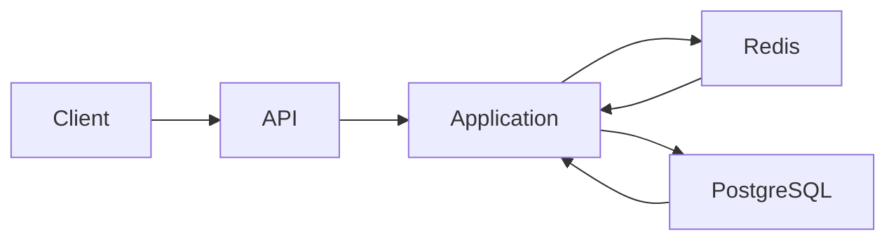
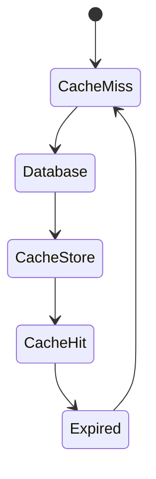
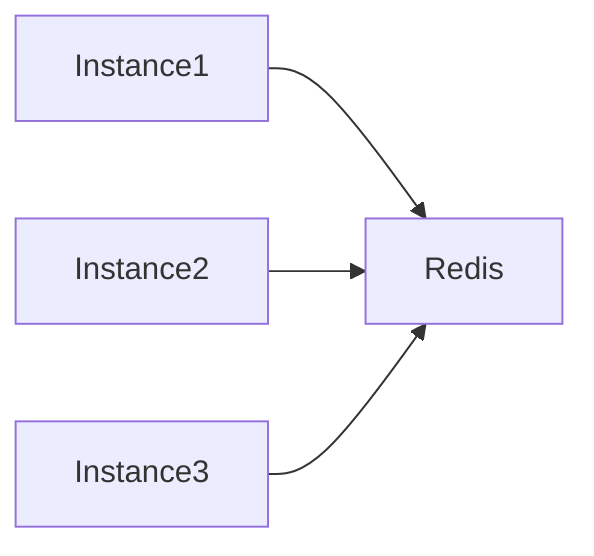

# TSD_08_CACHE.md

> **Technical Specification Document (TSD)**  
> **Module:** Cache Strategy  
> **Project:** Pulse Engine – Product Catalog Service  
> **Version:** 1.0  
> **Status:** Draft

---

# 1. Purpose

Dokumen ini mendefinisikan desain caching untuk Product Catalog Service.

Tujuan utama caching adalah:

- meningkatkan performa query;
- mengurangi beban PostgreSQL;
- mempercepat akses Product Catalog;
- mendukung horizontal scalability;
- menjaga konsistensi data.

Cache **bukan** merupakan Source of Truth.

Source of Truth tetap berada pada PostgreSQL.

---

# 2. Scope

Caching hanya digunakan untuk operasi **Read**.

Operasi berikut menggunakan cache.

- Get Company Detail
- Search Company
- Get Product Detail
- Search Product
- Product Version
- Version History

Operasi berikut **tidak menggunakan cache**.

- Create
- Update
- Publish
- Archive
- Audit Write

---

# 3. Technology

| Component | Technology |
| ------------ | ------------ |
| Cache | Redis 7+ |
| Client | Spring Data Redis |
| Driver | Lettuce |
| Serialization | JSON |
| Compression | Tidak Digunakan |
| Cache Abstraction | Spring Cache |

---

# 4. Cache Architecture



---

# 5. Cache Principles

## Cache Aside Pattern

Menggunakan pola:

```
Cache Aside
```

Flow:

```text
Read

↓

Check Redis

↓

Hit?

↓

Yes

↓

Return

↓

No

↓

Query Database

↓

Store Redis

↓

Return
```

---

## Write Around Strategy

Setiap perubahan data akan:

```text
Update Database

↓

Evict Cache

↓

Request Berikutnya

↓

Reload Cache
```

---

## Source of Truth

```
PostgreSQL
```

Cache hanya merupakan salinan.

---

# 6. Cached Resources

| Resource | Cached |
| ------------ | -------- |
| Company Detail | Yes |
| Product Detail | Yes |
| Published Product | Yes |
| Product Search | Yes |
| Product Version | Yes |
| Version History | Yes |
| Audit History | No |

---

# 7. Cache Key Design

## Company

```
company::{companyId}
```

Contoh

```
company::3bd29f84...
```

---

## Company Search

```
company-search::{hash}
```

---

## Product Detail

```
product::{productId}
```

---

## Product Search

```
product-search::{hash}
```

---

## Latest Product Version

```
product-version::{productId}
```

---

## Specific Version

```
product-version::{productId}::{version}
```

---

# 8. Cache TTL

| Cache | TTL |
| --------- | ------ |
| Company Detail | 30 Minutes |
| Product Detail | 30 Minutes |
| Search Product | 10 Minutes |
| Product Version | 24 Hours |
| Version History | 60 Minutes |

Alasan:

Published Product relatif jarang berubah.

---

# 9. Cache Lifecycle



---

# 10. Cache Read Workflow

```mermaid
sequenceDiagram

actor Consumer

participant Service

participant Redis

participant PostgreSQL

Consumer->>Service: GET Product

Service->>Redis: GET

alt Cache Hit

Redis-->>Service: Product

Service-->>Consumer

else Cache Miss

Redis-->>Service

Service->>PostgreSQL

PostgreSQL-->>Service

Service->>Redis: SET

Service-->>Consumer

end
```

---

# 11. Cache Write Workflow

```mermaid
sequenceDiagram

actor Admin

participant Service

participant PostgreSQL

participant Redis

Admin->>Service: Update Product

Service->>PostgreSQL: UPDATE

PostgreSQL-->>Service

Service->>Redis: EVICT

Service-->>Admin
```

---

# 12. Cache Invalidation

Cache dihapus pada operasi berikut.

| Operation | Cache Eviction |
| ------------ | --------------- |
| Create Company | Company Search |
| Update Company | Company Detail + Search |
| Activate Company | Company Detail + Search |
| Deactivate Company | Company Detail + Search |
| Create Product | Product Search |
| Update Product | Product Detail + Search |
| Publish Product | Product Detail + Search + Product Version |
| Archive Product | Product Detail + Search |
| Update Configuration | Product Detail |

---

# 13. Spring Cache Strategy

Menggunakan Spring Cache.

Contoh

```java
@Cacheable(
    value = "product",
    key = "#productId"
)
public ProductDetail getProduct(UUID productId) {
}
```

---

Update

```java
@CacheEvict(
    value = "product",
    key = "#productId"
)
public void updateProduct(...) {
}
```

---

# 14. Search Cache

Search menggunakan hash parameter.

Contoh

```
page=0

size=20

status=PUBLISHED

company=ABC
```

Hash menjadi

```
product-search::7AF9E18...
```

---

# 15. Cache Consistency

Product Catalog menggunakan:

```
Eventual Consistency
```

antara Redis dan PostgreSQL.

Karena:

Database merupakan Source of Truth.

---

# 16. Cache Serialization

Menggunakan JSON.

Contoh

```json
{
  "id":"UUID",
  "productCode":"PA001",
  "productName":"Personal Accident Basic"
}
```

---

# 17. Cache Size

BRD tidak mendefinisikan kapasitas Redis.

Status

```
Requires Functional Clarification
```

---

# 18. Cache Eviction Policy

Redis menggunakan

```
allkeys-lru
```

Alasan:

Data yang jarang diakses akan dikeluarkan terlebih dahulu.

---

# 19. Distributed Cache

Semua instance Product Catalog menggunakan Redis yang sama.



---

# 20. Failure Strategy

Jika Redis gagal.

Workflow berubah menjadi

```text
Read

↓

Database

↓

Return
```

Service tetap berjalan.

Redis bukan dependency kritikal.

---

# 21. Monitoring

Metric yang dipantau.

| Metric | Description |
| ---------- | ------------ |
| Cache Hit | Cache ditemukan |
| Cache Miss | Cache tidak ditemukan |
| Eviction | Cache dihapus |
| Redis Latency | Waktu akses Redis |
| Redis Memory | Penggunaan Memory |
| TTL | Expired Cache |

---

# 22. Performance Target

| Operation | Target |
| ------------ | --------- |
| Cache Hit | <10 ms |
| Cache Miss | <300 ms |
| Redis GET | <5 ms |
| Redis SET | <10 ms |

---

# 23. Java Configuration

```java
@Configuration
@EnableCaching
public class CacheConfiguration {

}
```

---

Redis Configuration

```yaml
spring:

  data:

    redis:

      host: redis

      port: 6379

      timeout: 2s
```

---

# 24. Cache Naming Convention

| Cache | Name |
| --------- | ------ |
| Company | company |
| Product | product |
| Product Search | product-search |
| Product Version | product-version |
| Company Search | company-search |

---

# 25. Security

Redis tidak menyimpan:

- JWT
- Password
- OAuth Token
- Credential

Redis hanya menyimpan metadata Product.

---

# 26. Architectural Decisions

| Decision | Rationale |
| ---------- | ----------- |
| Redis | Mature & Enterprise Standard |
| Cache Aside | Paling sederhana dan mudah dipelihara |
| Write Around | Menghindari stale write ke cache |
| Shared Redis | Mendukung horizontal scaling |
| JSON Serialization | Mudah di-debug dan interoperable |

---

# 27. Alternatives Considered

| Alternative | Decision | Reason |
| ------------- | ---------- | -------- |
| In-Memory Cache (Caffeine) | Tidak dipilih | Tidak sinkron antar instance |
| Write Through Cache | Tidak dipilih | Menambah kompleksitas write path |
| Write Behind Cache | Tidak dipilih | Risiko kehilangan data jika Redis gagal |
| Hazelcast | Tidak dipilih | Redis sudah memenuhi kebutuhan BRD |

---

# 28. Technical Risks

| Risk | Mitigation |
| ------ | ------------ |
| Stale Cache | Evict setelah update |
| Redis Down | Fallback ke PostgreSQL |
| Cache Stampede | Gunakan TTL acak (jitter) pada implementasi |
| Large Search Cache | Batasi page size dan TTL |
| Memory Growth | Monitoring + LRU Eviction |

---

# 29. Recommendations

1. Gunakan **Spring Cache Abstraction** agar implementasi tidak bergantung langsung pada Redis API.
2. Tambahkan **TTL jitter** (±10%) untuk mengurangi cache stampede.
3. Cache hanya untuk endpoint dengan rasio baca tinggi.
4. Jangan cache hasil query yang mengandung informasi sensitif atau authorization-specific.
5. Tambahkan Micrometer Redis Metrics untuk monitoring hit ratio dan latency.

---

# 30. Requires Functional Clarification

| Item | Status |
| ------ | -------- |
| Maximum Redis Memory | Requires Functional Clarification |
| Redis Cluster atau Standalone | Requires Functional Clarification |
| Redis High Availability (Sentinel/Cluster) | Requires Functional Clarification |
| Maksimum ukuran Search Cache | Requires Functional Clarification |
| Kebijakan cache warming saat deployment | Requires Functional Clarification |
| Multi-region Redis | Requires Functional Clarification |

---

# 31. Traceability

| BRD | FSD | Cache | API | Test Case |
| ----- | ----- | ------- | ----- | ----------- |
| Product Search | FSD-04 | product-search | GET /products | TC-CACHE-001 |
| Product Detail | FSD-04 | product | GET /products/{id} | TC-CACHE-002 |
| Product Version | FSD-05 | product-version | GET /products/{id}/versions | TC-CACHE-003 |
| Company Detail | FSD-01 | company | GET /companies/{id} | TC-CACHE-004 |
| Publish Product | FSD-02 | Cache Eviction | POST /products/{id}/publish | TC-CACHE-005 |

---

# 32. Next Document

**TSD_09_SECURITY.md**

Dokumen berikut akan membahas:

- OAuth2 Architecture
- JWT Validation
- Spring Security 7
- RBAC
- Permission Matrix
- Endpoint Security
- Authentication Flow
- Authorization Flow
- Audit Security
- Secrets Management
- Encryption
- Security Headers
- Threat Model
- OWASP Recommendations
