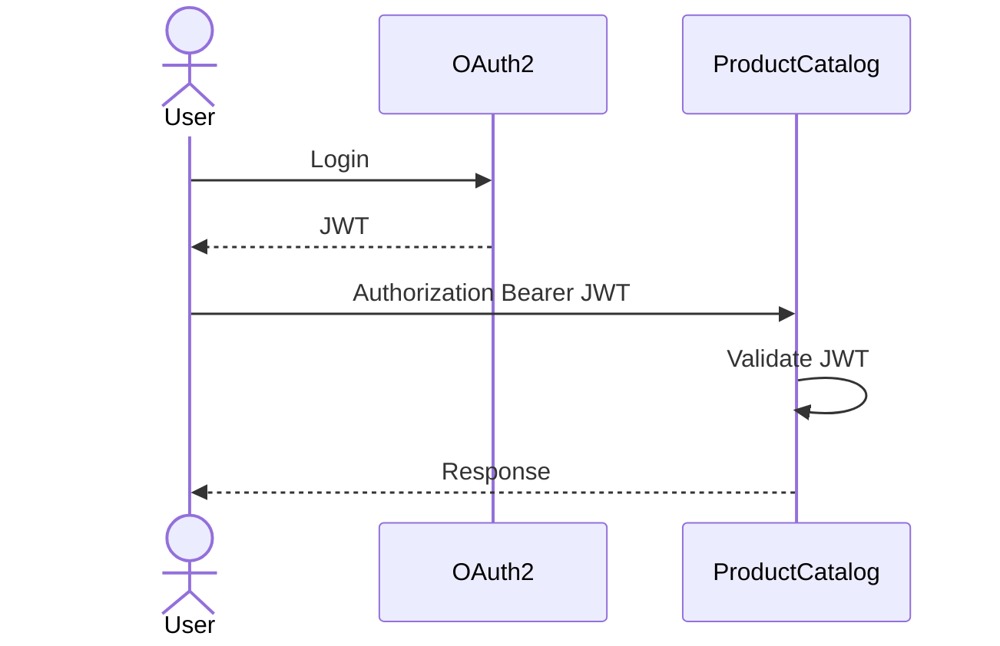

# TSD_09_SECURITY.md

> **Technical Specification Document (TSD)**  
> **Module:** Security Design  
> **Project:** Pulse Engine – Product Catalog Service  
> **Version:** 1.0  
> **Status:** Draft

---

# 1. Purpose

Dokumen ini mendefinisikan desain keamanan (Security Design) untuk Product Catalog Service.

Dokumen ini menjadi acuan implementasi bagi:

- Backend Engineer
- Security Engineer
- DevOps Engineer
- Solution Architect
- SRE

Security mengikuti prinsip:

- Defense in Depth
- Least Privilege
- Zero Trust
- Secure by Default
- Principle of Least Knowledge

---

# 2. Security Objectives

Product Catalog harus mampu:

- Melakukan Authentication menggunakan OAuth2 + JWT
- Melakukan Authorization menggunakan RBAC
- Melindungi endpoint dari akses tidak sah
- Menjamin integritas data
- Menyediakan Audit Trail
- Mendukung observability terhadap aktivitas keamanan

---

# 3. Security Scope

Security mencakup:

- Authentication
- Authorization
- Endpoint Protection
- API Security
- Transport Security
- Audit Logging
- Secrets Management
- Secure Configuration

Security **tidak mencakup**:

- Identity Provider
- User Management
- MFA
- IAM Administration

Komponen tersebut berada di luar Product Catalog Service.

---

# 4. Technology

| Component | Technology |
| ------------ | ------------ |
| Authentication | OAuth2 |
| Token | JWT |
| Authorization | Spring Security 7 |
| Password | Tidak Disimpan |
| TLS | HTTPS (TLS 1.2+) |
| Secret | Kubernetes Secret / External Secret Manager |
| Audit | PostgreSQL |

---

# 5. Security Architecture

```mermaid
flowchart LR

User

API Gateway

OAuth2 Server

ProductCatalog

PostgreSQL

User --> API Gateway

API Gateway --> OAuth2 Server

API Gateway --> ProductCatalog

ProductCatalog --> PostgreSQL
```

---

# 6. Authentication Flow



---

# 7. JWT Validation

Setiap request wajib memvalidasi:

- Signature
- Expiration
- Issuer
- Audience
- Subject

Apabila salah satu gagal.

```
401 Unauthorized
```

---

# 8. JWT Claims

Contoh Claim

```json
{
  "sub":"12345",
  "preferred_username":"admin",
  "roles":[
    "PRODUCT_ADMIN"
  ],
  "iss":"pulse-auth",
  "aud":"product-catalog",
  "exp":1780000000
}
```

---

# 9. Authentication Header

```http
Authorization: Bearer eyJhbGciOi...
```

---

# 10. Authorization Model

Menggunakan

```
RBAC

(Role Based Access Control)
```

---

# 11. Roles

| Role | Description |
| ------ | ------------- |
| PRODUCT_ADMIN | Mengelola seluruh Product Catalog |
| BUSINESS_USER | Melihat Product Catalog |
| READ_ONLY | Read Only |
| MARKETPLACE | Mengakses Published Product |

---

# 12. Permission Matrix

| Endpoint | PRODUCT_ADMIN | BUSINESS_USER | READ_ONLY | MARKETPLACE |
| ------------ | :-------------: | :-------------: | :---------: | :-----------: |
| GET Company | ✔ | ✔ | ✔ | ✔ |
| POST Company | ✔ | ✖ | ✖ | ✖ |
| PUT Company | ✔ | ✖ | ✖ | ✖ |
| Activate Company | ✔ | ✖ | ✖ | ✖ |
| Deactivate Company | ✔ | ✖ | ✖ | ✖ |
| GET Product | ✔ | ✔ | ✔ | ✔* |
| Search Product | ✔ | ✔ | ✔ | ✔* |
| Create Product | ✔ | ✖ | ✖ | ✖ |
| Update Product | ✔ | ✖ | ✖ | ✖ |
| Publish Product | ✔ | ✖ | ✖ | ✖ |
| Archive Product | ✔ | ✖ | ✖ | ✖ |
| Get Version | ✔ | ✔ | ✔ | ✔* |
| Get Audit | ✔ | ✔ | ✖ | ✖ |

\* MARKETPLACE hanya boleh mengakses Product dengan status **PUBLISHED**.

---

# 13. Endpoint Security

Contoh konfigurasi Spring Security.

```java
http
    .authorizeHttpRequests(auth -> auth

        .requestMatchers(HttpMethod.GET, "/api/v1/products/**")
            .hasAnyRole("PRODUCT_ADMIN","BUSINESS_USER","READ_ONLY","MARKETPLACE")

        .requestMatchers(HttpMethod.POST,"/api/v1/products/**")
            .hasRole("PRODUCT_ADMIN")

        .anyRequest()
            .authenticated()

    );
```

---

# 14. Resource Authorization

Authorization tidak hanya berdasarkan Role.

Tetapi juga berdasarkan Status Product.

Contoh

```
MARKETPLACE

↓

Hanya Published Product
```

Walaupun endpoint sama.

---

# 15. Security Workflow

```mermaid
sequenceDiagram

actor User

participant SecurityFilter

participant Controller

participant Application

User->>SecurityFilter: HTTP Request

SecurityFilter->>SecurityFilter: Validate JWT

SecurityFilter->>SecurityFilter: Validate Role

SecurityFilter->>Controller

Controller->>Application

Application-->>Controller

Controller-->>User
```

---

# 16. HTTPS

Semua komunikasi menggunakan

```
HTTPS ONLY
```

HTTP tidak diperbolehkan.

---

# 17. CORS

Contoh konfigurasi

```
Allowed Origins

↓

Marketplace

↓

Admin Portal
```

Origin lain ditolak.

---

# 18. CSRF

Product Catalog merupakan REST API stateless.

CSRF Protection dinonaktifkan.

```java
http.csrf(AbstractHttpConfigurer::disable);
```

---

# 19. Session

Session tidak digunakan.

Authentication menggunakan JWT.

```
STATELESS
```

---

# 20. Audit Security

Setiap perubahan data wajib mencatat.

- User
- Time
- Action
- Entity
- Before
- After

Audit tidak dapat dimodifikasi.

---

# 21. Sensitive Data

Product Catalog **tidak menyimpan**:

- Password
- OTP
- Access Token
- Refresh Token
- Kartu Kredit
- Data Pembayaran

---

# 22. Secrets Management

Rahasia aplikasi tidak boleh berada di source code.

Gunakan:

- Kubernetes Secret
- External Secret Manager
- Environment Variable

Contoh:

```
SPRING_DATASOURCE_PASSWORD
```

---

# 23. Encryption

## In Transit

TLS 1.2+

---

## At Rest

Mengikuti kebijakan database organisasi.

BRD tidak mendefinisikan kebutuhan enkripsi kolom tertentu.

Status:

```
Requires Functional Clarification
```

---

# 24. Security Headers

Disarankan mengaktifkan:

```http
X-Content-Type-Options: nosniff

X-Frame-Options: DENY

Referrer-Policy: no-referrer

Cache-Control: no-store

Strict-Transport-Security

Content-Security-Policy
```

---

# 25. Input Validation

Validasi dilakukan menggunakan

Jakarta Validation

Contoh

```java
@NotNull

@NotBlank

@Size

@Pattern
```

---

# 26. SQL Injection Protection

Menggunakan:

- Spring Data JPA
- Parameter Binding
- Prepared Statement

Tidak diperbolehkan menggunakan SQL String Concatenation.

---

# 27. XSS Protection

REST API tidak menghasilkan HTML.

Payload tetap harus divalidasi.

Logging harus menghindari output raw HTML apabila ada input pengguna.

---

# 28. File Security

Product Catalog hanya menyimpan metadata dokumen.

Tidak menyimpan file fisik.

Validasi dilakukan terhadap:

- Document Type
- Metadata
- URI Format

---

# 29. Logging Security

Log tidak boleh berisi:

- JWT
- Password
- Secret
- Connection String
- Credential

Contoh

```
Authorization: Bearer ********
```

---

# 30. Rate Limiting

BRD tidak mendefinisikan Rate Limiting.

Status

```
Requires Functional Clarification
```

---

# 31. Threat Model

| Threat | Mitigation |
| ---------- | ------------ |
| Unauthorized Access | OAuth2 + JWT |
| Token Expired | JWT Validation |
| SQL Injection | Prepared Statement |
| Broken Access Control | RBAC |
| Data Tampering | HTTPS |
| Replay Attack | JWT Expiration + TLS |
| Credential Leak | Secret Management |
| Log Leakage | Sensitive Data Masking |

---

# 32. Spring Security Configuration

```java
@Bean
SecurityFilterChain securityFilterChain(HttpSecurity http)
throws Exception {

    http

        .csrf(AbstractHttpConfigurer::disable)

        .sessionManagement(session ->

            session.sessionCreationPolicy(
                SessionCreationPolicy.STATELESS))

        .oauth2ResourceServer(oauth2 ->

            oauth2.jwt(Customizer.withDefaults())

        );

    return http.build();

}
```

---

# 33. Audit Security Event

Security Event yang dicatat.

| Event | Audit |
| ---------- | ------- |
| Create Product | ✔ |
| Update Product | ✔ |
| Publish Product | ✔ |
| Archive Product | ✔ |
| Update Company | ✔ |
| Authentication Success | Bergantung Identity Provider |
| Authentication Failure | Bergantung Identity Provider |

---

# 34. Security Testing

Meliputi.

- Authentication Test
- Authorization Test
- JWT Validation Test
- Role Permission Test
- SQL Injection Test
- Security Header Test
- Access Control Test

---

# 35. Architectural Decisions

| Decision | Rationale |
| ----------- | ----------- |
| OAuth2 Resource Server | Standar enterprise |
| JWT | Stateless Authentication |
| RBAC | Sederhana dan sesuai kebutuhan BRD |
| HTTPS Only | Melindungi komunikasi |
| Stateless | Mendukung horizontal scaling |
| Secret Manager | Mencegah hardcoded credential |

---

# 36. Alternatives Considered

| Alternative | Decision | Reason |
| ------------ | ---------- | -------- |
| Session Authentication | Tidak dipilih | Tidak cocok untuk microservice |
| API Key | Tidak dipilih | Tidak mendukung RBAC dengan baik |
| Basic Authentication | Tidak dipilih | Tidak memenuhi standar enterprise |
| ACL per Entity | Tidak dipilih | Tidak dibutuhkan oleh BRD |
| OAuth2 Introspection per Request | Tidak dipilih | JWT offline validation lebih efisien |

---

# 37. Technical Risks

| Risk | Mitigation |
| ------ | ------------ |
| JWT Expired | Validasi token |
| Token Forgery | Signature Verification |
| Broken Authorization | Integration Test + Permission Matrix |
| Secret Exposure | External Secret Manager |
| Over-Privileged Role | Least Privilege Principle |
| Sensitive Data di Log | Log Masking |

---

# 38. Recommendations

1. Gunakan **Spring Security 7 Resource Server** dengan validasi JWT offline menggunakan JWKS.
2. Terapkan **method-level security** (`@PreAuthorize`) pada Application Service sebagai lapisan tambahan.
3. Tambahkan **Correlation ID** dan **User ID** pada seluruh audit log.
4. Lakukan **security scanning** menggunakan OWASP Dependency Check dan SAST pada pipeline CI/CD.
5. Ikuti **OWASP API Security Top 10** sebagai baseline pengujian keamanan.

---

# 39. Requires Functional Clarification

| Item | Status |
| ------ | -------- |
| Identity Provider (Keycloak, Auth0, Azure AD, dll.) | Requires Functional Clarification |
| Token Lifetime | Requires Functional Clarification |
| Refresh Token Policy | Requires Functional Clarification |
| API Rate Limiting | Requires Functional Clarification |
| IP Whitelist | Requires Functional Clarification |
| Mutual TLS (mTLS) antar service | Requires Functional Clarification |
| Data Classification Policy | Requires Functional Clarification |
| Encryption at Rest Requirement | Requires Functional Clarification |

---

# 40. Traceability

| BRD | FSD | Security Control | Endpoint | Test Case |
| ----- | ----- | ------------------ | ---------- | ----------- |
| Authentication | FSD-06 | OAuth2 JWT | Semua Endpoint | TC-SEC-001 |
| Authorization | FSD-06 | RBAC | Semua Endpoint | TC-SEC-002 |
| Product Publish | FSD-02 | PRODUCT_ADMIN Role | POST /products/{id}/publish | TC-SEC-003 |
| Product Read | FSD-04 | Role Validation | GET /products/{id} | TC-SEC-004 |
| Audit Trail | FSD-05 | Audit Logging | Semua Write API | TC-SEC-005 |

---

# 41. Next Document

**TSD_10_ERROR_HANDLING.md**

Dokumen berikut akan membahas:

- Exception Hierarchy
- Business Exception
- Validation Exception
- Infrastructure Exception
- Global Exception Handler
- RFC 7807 Problem Details
- HTTP Status Mapping
- Retryable vs Non-Retryable Error
- Error Code Standard
- Logging Strategy
- Java Implementation
- Sequence Diagram

```
