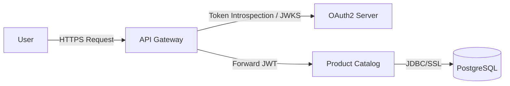
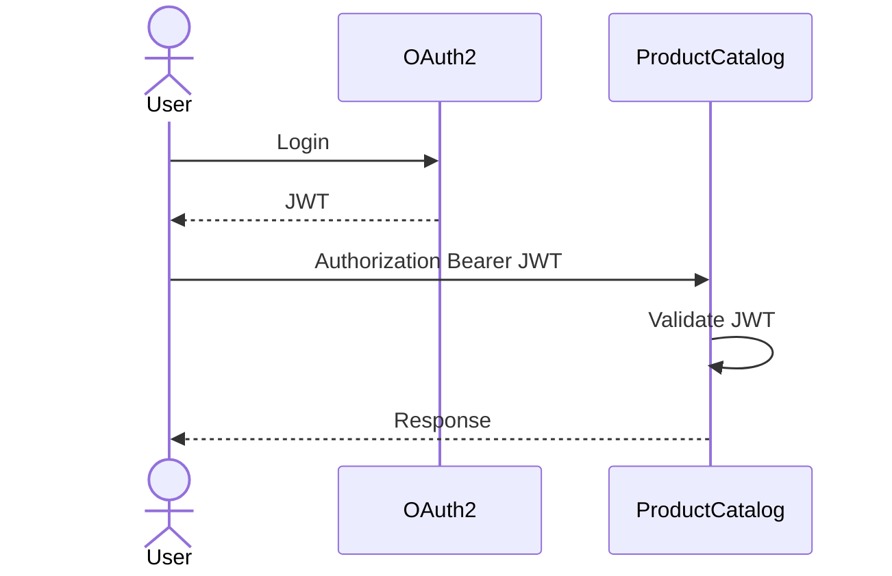
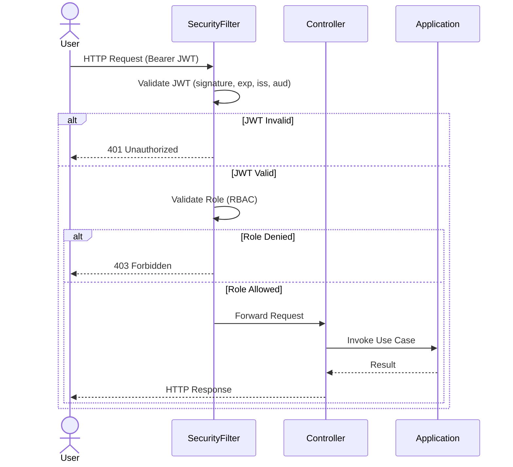

# TSD_09_SECURITY.md

> **Technical Specification Document (TSD)**  
> **Module:** Security Design  
> **Project:** Pulse Engine – Product Catalog Service  
> **Version:** 1.0  
> **Status:** Draft

---

# 1. Purpose

Dokumen ini mendefinisikan desain keamanan (Security Design) untuk Product Catalog Service.

Dokumen ini menjadi acuan implementasi bagi:

- Backend Engineer
- Security Engineer
- DevOps Engineer
- Solution Architect
- SRE

Security mengikuti prinsip:

- Defense in Depth
- Least Privilege
- Zero Trust
- Secure by Default
- Principle of Least Knowledge

---

# 2. Security Objectives

Product Catalog harus mampu:

- Melakukan Authentication menggunakan OAuth2 + JWT
- Melakukan Authorization menggunakan RBAC
- Melindungi endpoint dari akses tidak sah
- Menjamin integritas data
- Menyediakan Audit Trail
- Mendukung observability terhadap aktivitas keamanan

---

# 3. Security Scope

Security mencakup:

- Authentication
- Authorization
- Endpoint Protection
- API Security
- Transport Security
- Audit Logging
- Secrets Management
- Secure Configuration

Security **tidak mencakup**:

- Identity Provider
- User Management
- MFA
- IAM Administration

Komponen tersebut berada di luar Product Catalog Service.

---

# 4. Technology

| Component | Technology |
| ------------ | ------------ |
| Authentication | OAuth2 |
| Token | JWT |
| Authorization | Spring Security 7 |
| Password | Tidak Disimpan |
| TLS | HTTPS (TLS 1.2+) |
| Secret | Kubernetes Secret / External Secret Manager |
| Audit | PostgreSQL |

---

# 5. Security Architecture



---

# 6. Authentication Flow



---

# 7. JWT Validation

Setiap request wajib memvalidasi:

- Signature
- Expiration
- Issuer
- Audience
- Subject

Apabila salah satu gagal.

```
401 Unauthorized
```

---

# 8. JWT Claims

Contoh Claim

```json
{
  "sub":"12345",
  "preferred_username":"admin",
  "roles":[
    "PRODUCT_ADMIN"
  ],
  "iss":"pulse-auth",
  "aud":"product-catalog",
  "exp":1780000000
}
```

---

# 9. Authentication Header

```http
Authorization: Bearer eyJhbGciOi...
```

---

# 10. Authorization Model

Menggunakan

```
RBAC

(Role Based Access Control)
```

---

# 11. Roles

| Role | Description |
| ------ | ------------- |
| PRODUCT_ADMIN | Mengelola seluruh Product Catalog |
| BUSINESS_USER | Melihat Product Catalog |
| READ_ONLY | Read Only |
| MARKETPLACE | Mengakses Published Product |

---

# 12. Permission Matrix

| Endpoint | PRODUCT_ADMIN | BUSINESS_USER | READ_ONLY | MARKETPLACE |
| ------------ | :-------------: | :-------------: | :---------: | :-----------: |
| GET Company | ✔ | ✔ | ✔ | ✔ |
| POST Company | ✔ | ✖ | ✖ | ✖ |
| PUT Company | ✔ | ✖ | ✖ | ✖ |
| Activate Company | ✔ | ✖ | ✖ | ✖ |
| Deactivate Company | ✔ | ✖ | ✖ | ✖ |
| GET Product | ✔ | ✔ | ✔ | ✔* |
| Search Product | ✔ | ✔ | ✔ | ✔* |
| Create Product | ✔ | ✖ | ✖ | ✖ |
| Update Product | ✔ | ✖ | ✖ | ✖ |
| Publish Product | ✔ | ✖ | ✖ | ✖ |
| Archive Product | ✔ | ✖ | ✖ | ✖ |
| Get Version | ✔ | ✔ | ✔ | ✔* |
| Get Audit | ✔ | ✔ | ✖ | ✖ |

\* MARKETPLACE hanya boleh mengakses Product dengan status **PUBLISHED**.

---

# 13. Endpoint Security

Contoh konfigurasi Spring Security.

```java
http
    .authorizeHttpRequests(auth -> auth

        .requestMatchers(HttpMethod.GET, "/api/v1/products/**")
            .hasAnyRole("PRODUCT_ADMIN","BUSINESS_USER","READ_ONLY","MARKETPLACE")

        .requestMatchers(HttpMethod.POST,"/api/v1/products/**")
            .hasRole("PRODUCT_ADMIN")

        .anyRequest()
            .authenticated()

    );
```

---

# 14. Resource Authorization

Authorization tidak hanya berdasarkan Role.

Tetapi juga berdasarkan Status Product.

Contoh

```
MARKETPLACE

↓

Hanya Published Product
```

Walaupun endpoint sama.

---

# 15. Security Workflow



---

# 16. HTTPS

Semua komunikasi menggunakan

```
HTTPS ONLY
```

HTTP tidak diperbolehkan.

---

# 17. CORS

Contoh konfigurasi

```
Allowed Origins

↓

Marketplace

↓

Admin Portal
```

Origin lain ditolak.

---

# 18. CSRF

Product Catalog merupakan REST API stateless.

CSRF Protection dinonaktifkan.

```java
http.csrf(AbstractHttpConfigurer::disable);
```

---

# 19. Session

Session tidak digunakan.

Authentication menggunakan JWT.

```
STATELESS
```

---

# 20. Audit Security

Setiap perubahan data wajib mencatat.

- User
- Time
- Action
- Entity
- Before
- After

Audit tidak dapat dimodifikasi.

---

# 21. Sensitive Data

Product Catalog **tidak menyimpan**:

- Password
- OTP
- Access Token
- Refresh Token
- Kartu Kredit
- Data Pembayaran

---

# 22. Secrets Management

Rahasia aplikasi tidak boleh berada di source code.

Gunakan:

- Kubernetes Secret
- External Secret Manager
- Environment Variable

Contoh:

```
SPRING_DATASOURCE_PASSWORD
```

---

# 23. Encryption

## In Transit

TLS 1.2+

---

## At Rest

Encryption at Rest merupakan tanggung jawab platform penyimpanan (lihat Section 39.8).

Persyaratan minimum:

- PostgreSQL menggunakan encrypted storage (disk/volume encryption).
- Redis menggunakan encrypted storage apabila persistence diaktifkan.
- Object Storage menggunakan server-side encryption.

Aplikasi tidak melakukan enkripsi manual terhadap seluruh tabel.

---

# 24. Security Headers

Disarankan mengaktifkan:

```http
X-Content-Type-Options: nosniff

X-Frame-Options: DENY

Referrer-Policy: no-referrer

Cache-Control: no-store

Strict-Transport-Security

Content-Security-Policy
```

---

# 25. Input Validation

Validasi dilakukan menggunakan

Jakarta Validation

Contoh

```java
@NotNull

@NotBlank

@Size

@Pattern
```

---

# 26. SQL Injection Protection

Menggunakan:

- Spring Data JPA
- Parameter Binding
- Prepared Statement

Tidak diperbolehkan menggunakan SQL String Concatenation.

---

# 27. XSS Protection

REST API tidak menghasilkan HTML.

Payload tetap harus divalidasi.

Logging harus menghindari output raw HTML apabila ada input pengguna.

---

# 28. File Security

Product Catalog hanya menyimpan metadata dokumen.

Tidak menyimpan file fisik.

Validasi dilakukan terhadap:

- Document Type
- Metadata
- URI Format

---

# 29. Logging Security

Log tidak boleh berisi:

- JWT
- Password
- Secret
- Connection String
- Credential

Contoh

```
Authorization: Bearer ********
```

---

# 30. Rate Limiting

Rate Limiting diterapkan pada **API Gateway atau API Management Layer** (lihat Section 39.4).

Product Catalog tidak mengimplementasikan rate limiting di level aplikasi.

Baseline:

| Consumer | Rate Limit |
|----------|------------|
| Internal Service | Tidak dibatasi |
| Back Office UI | 300 request/menit |
| External Consumer | 100 request/menit |

---

# 31. Threat Model

| Threat | Mitigation |
| ---------- | ------------ |
| Unauthorized Access | OAuth2 + JWT |
| Token Expired | JWT Validation |
| SQL Injection | Prepared Statement |
| Broken Access Control | RBAC |
| Data Tampering | HTTPS |
| Replay Attack | JWT Expiration + TLS |
| Credential Leak | Secret Management |
| Log Leakage | Sensitive Data Masking |

---

# 32. Spring Security Configuration

```java
@Bean
SecurityFilterChain securityFilterChain(HttpSecurity http)
throws Exception {

    http

        .csrf(AbstractHttpConfigurer::disable)

        .sessionManagement(session ->

            session.sessionCreationPolicy(
                SessionCreationPolicy.STATELESS))

        .oauth2ResourceServer(oauth2 ->

            oauth2.jwt(Customizer.withDefaults())

        );

    return http.build();

}
```

---

# 33. Audit Security Event

Security Event yang dicatat.

| Event | Audit |
| ---------- | ------- |
| Create Product | ✔ |
| Update Product | ✔ |
| Publish Product | ✔ |
| Archive Product | ✔ |
| Update Company | ✔ |
| Authentication Success | Bergantung Identity Provider |
| Authentication Failure | Bergantung Identity Provider |

---

# 34. Security Testing

Meliputi.

- Authentication Test
- Authorization Test
- JWT Validation Test
- Role Permission Test
- SQL Injection Test
- Security Header Test
- Access Control Test

---

# 35. Architectural Decisions

| Decision | Rationale |
| ----------- | ----------- |
| OAuth2 Resource Server | Standar enterprise |
| JWT | Stateless Authentication |
| RBAC | Sederhana dan sesuai kebutuhan BRD |
| HTTPS Only | Melindungi komunikasi |
| Stateless | Mendukung horizontal scaling |
| Secret Manager | Mencegah hardcoded credential |

---

# 36. Alternatives Considered

| Alternative | Decision | Reason |
| ------------ | ---------- | -------- |
| Session Authentication | Tidak dipilih | Tidak cocok untuk microservice |
| API Key | Tidak dipilih | Tidak mendukung RBAC dengan baik |
| Basic Authentication | Tidak dipilih | Tidak memenuhi standar enterprise |
| ACL per Entity | Tidak dipilih | Tidak dibutuhkan oleh BRD |
| OAuth2 Introspection per Request | Tidak dipilih | JWT offline validation lebih efisien |

---

# 37. Technical Risks

| Risk | Mitigation |
| ------ | ------------ |
| JWT Expired | Validasi token |
| Token Forgery | Signature Verification |
| Broken Authorization | Integration Test + Permission Matrix |
| Secret Exposure | External Secret Manager |
| Over-Privileged Role | Least Privilege Principle |
| Sensitive Data di Log | Log Masking |

---

# 38. Recommendations

1. Gunakan **Spring Security 7 Resource Server** dengan validasi JWT offline menggunakan JWKS.
2. Terapkan **method-level security** (`@PreAuthorize`) pada Application Service sebagai lapisan tambahan.
3. Tambahkan **Correlation ID** dan **User ID** pada seluruh audit log.
4. Lakukan **security scanning** menggunakan OWASP Dependency Check dan SAST pada pipeline CI/CD.
5. Ikuti **OWASP API Security Top 10** sebagai baseline pengujian keamanan.

---

# 39. Security Architecture Decisions

Poin-poin berikut merupakan **Security Architecture Decisions** yang dapat ditetapkan oleh arsitek. Item yang bergantung pada organisasi/infrastruktur ditetapkan sebagai **Platform / Infrastructure Responsibility** (lihat Section 41).

## 39.1 Identity Provider (IdP)

### Keputusan

Product Catalog tidak bergantung pada Identity Provider tertentu.

Service mendukung standar:

- OAuth2 Authorization Framework (RFC 6749)
- JWT Bearer Token (RFC 7519)
- OpenID Connect (OIDC)

Identity Provider yang didukung antara lain:

- Keycloak
- Microsoft Entra ID (Azure AD)
- Auth0
- Okta
- Ping Identity
- IAM lain yang kompatibel dengan OAuth2/OIDC

Spring Security dikonfigurasi sebagai OAuth2 Resource Server.

### Rationale

- Menghindari vendor lock-in.
- Memungkinkan deployment di berbagai lingkungan.
- Selaras dengan standar OAuth2/OIDC.

**Status:** ✅ Resolved

---

## 39.2 Token Lifetime

### Keputusan

Product Catalog tidak menentukan masa berlaku token.

Token lifetime merupakan kebijakan Identity Provider.

Baseline yang direkomendasikan:

| Token | Recommended Lifetime |
|--------|----------------------|
| Access Token | 15–30 menit |
| Refresh Token | 8–24 jam |

Service hanya memvalidasi:

- signature
- issuer
- audience
- expiration (`exp`)
- not before (`nbf`)

### Rationale

Lifecycle token merupakan tanggung jawab IdP.

**Status:** ✅ Resolved

---

## 39.3 Refresh Token Policy

### Keputusan

Refresh Token tidak pernah dikirim ke Product Catalog.

Refresh Token hanya digunakan antara Client dan Identity Provider.

Flow:

```text
Client

↓

Identity Provider

↓

Access Token

↓

Product Catalog
```

Product Catalog hanya menerima Access Token.

### Rationale

Mengurangi risiko kebocoran Refresh Token.

**Status:** ✅ Resolved

---

## 39.4 API Rate Limiting

### Keputusan

Rate Limiting diterapkan pada API Gateway atau API Management Layer.

Product Catalog tidak mengimplementasikan rate limiting di level aplikasi.

### Baseline

| Consumer | Rate Limit |
|----------|------------|
| Internal Service | Tidak dibatasi |
| Back Office UI | 300 request/menit |
| External Consumer | 100 request/menit |

### Rationale

Menjaga service tetap stateless dan sederhana.

**Status:** ✅ Resolved

---

## 39.5 IP Whitelist

### Keputusan

IP Whitelist bukan tanggung jawab aplikasi.

Jika diperlukan, diterapkan pada:

- API Gateway
- WAF
- Load Balancer
- Kubernetes Ingress
- Firewall

### Rationale

Kebijakan jaringan berbeda pada setiap organisasi.

**Status:** ✅ Resolved

---

## 39.6 Mutual TLS (mTLS)

### Keputusan

Product Catalog mendukung komunikasi melalui HTTPS.

mTLS bersifat opsional dan ditentukan oleh platform.

Apabila organisasi menerapkan Service Mesh (misalnya Istio atau Linkerd), mTLS dapat diaktifkan tanpa perubahan kode aplikasi.

### Rationale

Menghindari coupling dengan implementasi jaringan tertentu.

**Status:** ✅ Resolved

---

## 39.7 Data Classification Policy

### Keputusan

Data diklasifikasikan sebagai berikut.

| Data | Classification |
|------|----------------|
| Product | Internal |
| Company | Internal |
| Coverage | Internal |
| Benefit | Internal |
| Exclusion | Internal |
| Premium Configuration | Confidential |
| Audit History | Confidential |
| JWT | Confidential |
| Access Token | Confidential |
| Password | Tidak disimpan oleh Product Catalog |

Data classified sebagai **Confidential** wajib dimasking pada log dan tidak boleh diekspos tanpa otorisasi.

### Rationale

Mendukung prinsip least privilege dan auditability.

**Status:** ✅ Resolved

---

## 39.8 Encryption at Rest

### Keputusan

Encryption at Rest merupakan tanggung jawab platform penyimpanan.

Persyaratan minimum:

- PostgreSQL menggunakan encrypted storage (disk/volume encryption).
- Redis menggunakan encrypted storage apabila persistence diaktifkan.
- Object Storage menggunakan server-side encryption.

Aplikasi tidak melakukan enkripsi manual terhadap seluruh tabel.

Field yang mengandung secret (jika ada) dapat menggunakan application-level encryption.

### Rationale

Menghindari kompleksitas yang tidak diperlukan dan memanfaatkan kemampuan platform.

**Status:** ✅ Resolved

---

# 40. Security Governance Summary

| Area | Decision |
|------|----------|
| Authentication | OAuth2 + JWT + OIDC |
| Identity Provider | Vendor agnostic |
| Access Token | Mandatory |
| Refresh Token | Tidak diterima oleh Product Catalog |
| Token Validation | Signature, Issuer, Audience, Expiration |
| Rate Limiting | API Gateway |
| IP Whitelist | Infrastructure Layer |
| mTLS | Opsional, Platform Managed |
| Data Classification | Internal & Confidential |
| Encryption in Transit | HTTPS/TLS 1.2+ |
| Encryption at Rest | Platform Managed |
| Secret Management | Kubernetes Secret / Vault |
| Password Storage | Tidak ada di Product Catalog |

---

# 41. Platform / Infrastructure Responsibility

Item berikut **tidak boleh diputuskan oleh tim aplikasi** karena merupakan keputusan organisasi atau platform. Bukan *Requires Functional Clarification*, melainkan tanggung jawab platform/infrastruktur.

| Item | Keputusan yang Disarankan |
| ---------------------------------------------------------------- | --------------------------------------------------------- |
| Identity Provider yang dipakai (Keycloak, Auth0, Azure AD, dll.) | **Platform Decision** (aplikasi bersifat vendor-agnostic) |
| Token Lifetime aktual                                            | **Identity Provider Configuration**                       |
| Refresh Token Lifetime                                           | **Identity Provider Configuration**                       |
| API Rate Limiting aktual                                         | **API Gateway Configuration**                             |
| IP Whitelist                                                     | **Network Security Policy**                               |
| mTLS diaktifkan atau tidak                                       | **Infrastructure / Service Mesh Configuration**           |
| Encryption at Rest                                               | **Storage Platform Policy**                               |

---

# 42. Traceability

| BRD | FSD | Security Control | Endpoint | Test Case |
| ----- | ----- | ------------------ | ---------- | ----------- |
| Authentication | FSD-06 | OAuth2 JWT | Semua Endpoint | TC-SEC-001 |
| Authorization | FSD-06 | RBAC | Semua Endpoint | TC-SEC-002 |
| Product Publish | FSD-02 | PRODUCT_ADMIN Role | POST /products/{id}/publish | TC-SEC-003 |
| Product Read | FSD-04 | Role Validation | GET /products/{id} | TC-SEC-004 |
| Audit Trail | FSD-05 | Audit Logging | Semua Write API | TC-SEC-005 |

---

# 43. Compliance & Regulatory Alignment

## 43.1 Regulatory Compliance

Security Design memenuhi persyaratan compliance enterprise:

* **UU PDP No. 27/2022** - Perlindungan Data Pribadi
  * Access control dan authentication
  * Audit trail untuk akses data
  * Data encryption in transit (TLS 1.3)
  * Security incident response

* **POJK No. 13/2017** - Penggunaan TI
  * OAuth2/JWT authentication
  * RBAC authorization
  * Security monitoring
  * Incident management

* **ISO/IEC 27001:2022** - ISMS
  * A.9 Access Control
  * A.10 Cryptography
  * A.12 Operations Security
  * A.16 Incident Management

Lihat [Enterprise Standards & Compliance Framework](../../../docs/16. ENTERPRISE_STANDARDS.md) untuk detail lengkap.

---

## 43.2 Security Controls Mapping

| Control Category | ISO 27001 Control | Product Catalog Implementation | Status |
|-----------------|-------------------|-------------------------------|--------|
| Access Control | A.9.1, A.9.2 | OAuth2 + JWT + RBAC | 🔄 Planned |
| Cryptography | A.10.1 | TLS 1.3, AES-256 | 🔄 Planned |
| Operations Security | A.12.1, A.12.4 | Security monitoring, logging | 🔄 Planned |
| Incident Management | A.16.1 | Incident response procedure | 🔄 Planned |

---

## 43.3 Data Classification & Security

| Data Type | Classification | Security Control |
|-----------|---------------|------------------|
| Product Metadata | Internal | RBAC, audit trail |
| Product Configuration | Confidential | Encryption, RBAC, audit |
| Audit Trail | Restricted | Immutable, encrypted, 7-year retention |
| JWT Token | Confidential | Short-lived, HTTPS only |

---

## 43.4 Security Monitoring

Security events yang harus dimonitor:

| Event | Severity | Action |
|-------|----------|--------|
| Authentication Failure | WARN | Alert after 5 failures |
| Authorization Failure | WARN | Alert immediately |
| Invalid JWT | WARN | Alert after 3 failures |
| Rate Limit Exceeded | INFO | Log + throttle |
| SQL Injection Attempt | CRITICAL | Alert + block |
| Suspicious Pattern | CRITICAL | Alert + investigate |

---

## 43.5 Compliance Checklist

### Security Implementation Checklist

- [ ] OAuth2 authentication configured
- [ ] JWT validation implemented (signature, exp, iss, aud)
- [ ] RBAC authorization enforced
- [ ] TLS 1.3 enabled for all communications
- [ ] Rate limiting configured at API Gateway
- [ ] Input validation implemented
- [ ] SQL injection prevention verified
- [ ] XSS prevention implemented
- [ ] CSRF protection configured
- [ ] Security headers configured
- [ ] Audit logging operational
- [ ] Security monitoring enabled
- [ ] Incident response procedure documented
- [ ] Vulnerability scanning scheduled
- [ ] Security testing completed

Lihat [Compliance Reference Guide](COMPLIANCE_REFERENCE.md) untuk detail implementasi security controls.

---

# 44. Next Document

**TSD_10_ERROR_HANDLING.md**

Dokumen berikut akan membahas:

- Exception Hierarchy
- Business Exception
- Validation Exception
- Infrastructure Exception
- Global Exception Handler
- RFC 7807 Problem Details
- HTTP Status Mapping
- Retryable vs Non-Retryable Error
- Error Code Standard
- Logging Strategy
- Java Implementation
- Sequence Diagram

```
