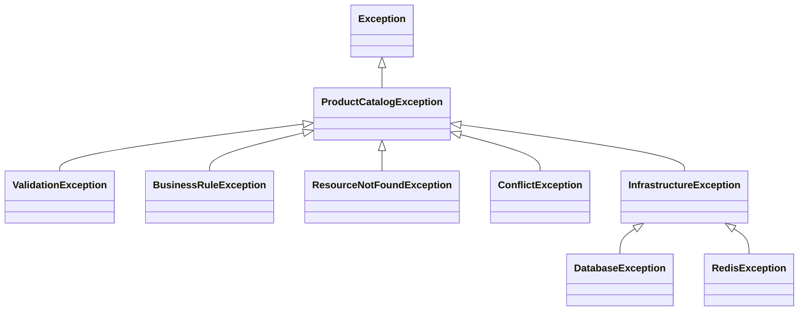
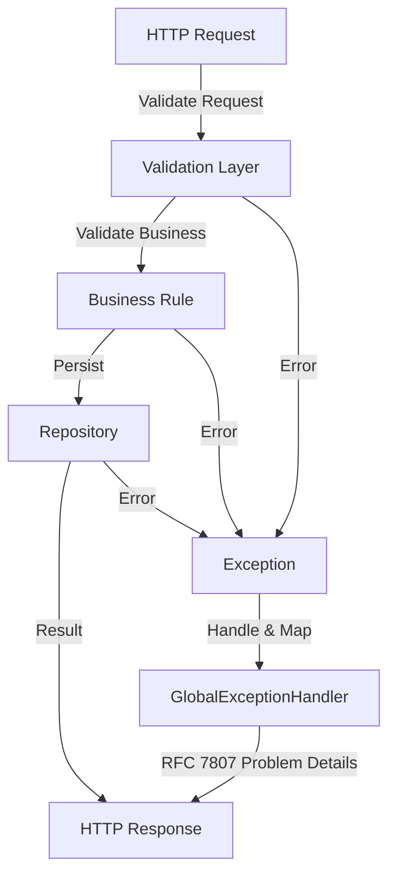
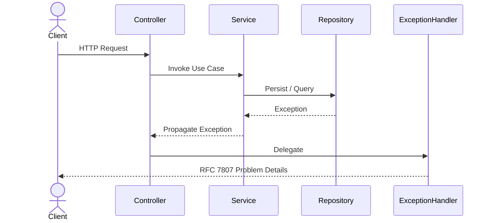

# TSD_10_ERROR_HANDLING.md

> **Technical Specification Document (TSD)**  
> **Module:** Error Handling  
> **Project:** Pulse Engine – Product Catalog Service  
> **Version:** 1.0  
> **Status:** Draft

---

# 1. Purpose

Dokumen ini mendefinisikan standar penanganan error pada Product Catalog Service.

Tujuan utama:

- menghasilkan error yang konsisten
- memudahkan debugging
- memudahkan observability
- memudahkan integrasi antar service
- menghindari kebocoran informasi sensitif
- mendukung automated monitoring

Semua endpoint wajib mengikuti standar ini.

---

# 2. Objectives

Error Handling harus memenuhi prinsip berikut.

- Predictable
- Consistent
- Traceable
- Secure
- Machine Readable
- Human Readable

---

# 3. Design Principles

## Standardized Error Response

Seluruh API mengembalikan format yang sama.

---

## Fail Fast

Validasi dilakukan sedini mungkin.

---

## No Sensitive Information

Response tidak boleh mengandung:

- SQL Query
- Stacktrace
- Password
- JWT
- Internal Server Path
- Connection String

---

## Structured Logging

Seluruh exception wajib dicatat.

---

## Correlation ID

Setiap error memiliki Correlation ID.

---

# 4. Error Classification

| Category | Description |
| ----------- | ------------- |
| Validation Error | Kesalahan input |
| Business Error | Pelanggaran business rule |
| Authentication Error | Token tidak valid |
| Authorization Error | Hak akses tidak cukup |
| Resource Error | Data tidak ditemukan |
| Conflict Error | Konflik data |
| Infrastructure Error | Database, Redis, Network |
| Unexpected Error | Internal Server Error |

---

# 5. Exception Hierarchy



---

# 6. HTTP Status Mapping

| Status | Description |
| ---------- | ------------- |
| 200 | Success |
| 201 | Created |
| 204 | No Content |
| 400 | Validation Error |
| 401 | Unauthorized |
| 403 | Forbidden |
| 404 | Resource Not Found |
| 409 | Conflict |
| 422 | Business Rule Violation |
| 429 | Too Many Requests* |
| 500 | Internal Server Error |
| 503 | Service Unavailable |

\* Bergantung implementasi Rate Limiting.

---

# 7. Error Response Format

Menggunakan format yang konsisten.

```json
{
  "timestamp": "2026-08-03T10:15:20Z",
  "status": 409,
  "error": "Conflict",
  "code": "PRODUCT_ALREADY_PUBLISHED",
  "message": "Published product cannot be modified.",
  "path": "/api/v1/products/123",
  "correlationId": "7bde5b1cfd9a",
  "traceId": "8cf9a6e5f4a7"
}
```

---

# 8. Error Response Fields

| Field | Description |
| --------- | ------------- |
| timestamp | Waktu error |
| status | HTTP Status |
| error | HTTP Description |
| code | Business Error Code |
| message | User-friendly message |
| path | Endpoint |
| correlationId | Correlation ID |
| traceId | Distributed Trace ID |

---

# 9. Business Error Codes

## Company

| Code | Description |
| -------- | ------------- |
| COMPANY_NOT_FOUND | Company tidak ditemukan |
| COMPANY_ALREADY_EXISTS | Company sudah ada |
| COMPANY_ALREADY_ACTIVE | Company sudah aktif |
| COMPANY_ALREADY_INACTIVE | Company sudah nonaktif |

---

## Product

| Code | Description |
| --------- | ------------ |
| PRODUCT_NOT_FOUND | Product tidak ditemukan |
| PRODUCT_ALREADY_EXISTS | Product Code sudah digunakan |
| PRODUCT_ALREADY_PUBLISHED | Product sudah dipublish |
| PRODUCT_ALREADY_ARCHIVED | Product sudah diarsipkan |
| PRODUCT_INVALID_STATE | Status Product tidak valid |

---

## Version

| Code | Description |
| --------- | ------------ |
| VERSION_NOT_FOUND | Version tidak ditemukan |
| VERSION_ALREADY_EXISTS | Version sudah ada |

---

## Validation

| Code | Description |
| -------- | ------------ |
| VALIDATION_ERROR | Request tidak valid |
| REQUIRED_FIELD | Mandatory field kosong |
| INVALID_FORMAT | Format tidak valid |

---

# 10. Validation Error

Contoh

```json
{
  "status":400,
  "code":"VALIDATION_ERROR",
  "message":"Validation failed.",
  "errors":[
    {
      "field":"productName",
      "message":"must not be blank"
    },
    {
      "field":"companyId",
      "message":"must not be null"
    }
  ]
}
```

---

# 11. Business Rule Error

Contoh

```json
{
  "status":422,
  "code":"PRODUCT_ALREADY_PUBLISHED",
  "message":"Published product cannot be modified."
}
```

---

# 12. Resource Not Found

```json
{
  "status":404,
  "code":"PRODUCT_NOT_FOUND",
  "message":"Product not found."
}
```

---

# 13. Authentication Error

```json
{
  "status":401,
  "code":"INVALID_TOKEN",
  "message":"Authentication failed."
}
```

---

# 14. Authorization Error

```json
{
  "status":403,
  "code":"ACCESS_DENIED",
  "message":"Access denied."
}
```

---

# 15. Conflict Error

Optimistic Lock.

```json
{
  "status":409,
  "code":"OPTIMISTIC_LOCK",
  "message":"The resource has been modified by another user."
}
```

---

# 16. Infrastructure Error

Database.

```json
{
  "status":503,
  "code":"DATABASE_UNAVAILABLE",
  "message":"Service temporarily unavailable."
}
```

---

# 17. Internal Server Error

```json
{
  "status":500,
  "code":"INTERNAL_SERVER_ERROR",
  "message":"Unexpected error occurred."
}
```

Tidak boleh mengembalikan stacktrace.

---

# 18. Exception Flow



---

# 19. Global Exception Handler

Menggunakan `@RestControllerAdvice`.

```java
@RestControllerAdvice
public class GlobalExceptionHandler {

}
```

---

# 20. Validation Handler

```java
@ExceptionHandler(MethodArgumentNotValidException.class)
public ResponseEntity<ApiErrorResponse> handleValidation(...) {

}
```

---

# 21. Business Exception

```java
public class BusinessRuleException
        extends ProductCatalogException {

}
```

---

# 22. Resource Not Found

```java
public class ResourceNotFoundException
        extends ProductCatalogException {

}
```

---

# 23. Conflict Exception

```java
public class ConflictException
        extends ProductCatalogException {

}
```

---

# 24. Infrastructure Exception

```java
public class InfrastructureException
        extends RuntimeException {

}
```

---

# 25. Retry Strategy

Retry hanya diperbolehkan untuk:

- Redis Timeout
- Connection Timeout
- Temporary Network Failure

Tidak boleh Retry untuk:

- Validation Error
- Business Rule Error
- Conflict Error

---

# 26. Logging Strategy

Semua exception dicatat.

| Exception | Log Level |
| ----------- | ----------- |
| Validation | WARN |
| Business | WARN |
| Authentication | WARN |
| Authorization | WARN |
| Conflict | WARN |
| Database | ERROR |
| Redis | ERROR |
| Unknown | ERROR |

---

# 27. Correlation ID

Seluruh exception wajib memiliki.

```
X-Correlation-ID
```

Jika tidak ada.

Service membuat otomatis.

---

# 28. Trace ID

Menggunakan OpenTelemetry.

```
Trace ID

↓

Span ID
```

---

# 29. Sensitive Data

Tidak boleh dicatat.

- JWT
- Password
- Authorization Header
- Database Password
- Connection URL

---

# 30. Database Exception Mapping

| Exception | HTTP |
| ------------ | ------ |
| Duplicate Key | 409 |
| FK Constraint | 409 |
| Timeout | 503 |
| Connection Failed | 503 |

---

# 31. Optimistic Lock

```java
OptimisticLockingFailureException
```

↓

```
409 Conflict
```

---

# 32. Spring Validation

Menggunakan

```java
@Valid

@NotBlank

@NotNull

@Pattern

@Size
```

---

# 33. Java Error Response

```java
public record ApiErrorResponse(

        Instant timestamp,

        Integer status,

        String error,

        String code,

        String message,

        String path,

        String correlationId,

        String traceId

) {
}
```

---

# 34. Sequence Diagram



---

# 35. RFC Compliance

Direkomendasikan mengikuti **RFC 7807 (Problem Details for HTTP APIs)** sebagai standar error response agar interoperabilitas lebih baik dengan consumer lintas platform.

> **Catatan:** Struktur response pada dokumen ini dapat dipetakan ke RFC 7807 tanpa mengubah business behavior.

---

# 36. Architectural Decisions

| Decision | Rationale |
| ---------- | ----------- |
| Global Exception Handler | Konsisten |
| Business Error Code | Mudah diintegrasikan |
| Correlation ID | Traceability |
| Structured Response | Machine Readable |
| No Stacktrace | Security |

---

# 37. Alternatives Considered

| Alternative | Decision | Reason |
| ------------ | ---------- | -------- |
| Return Stacktrace | Tidak dipilih | Security Risk |
| Exception per Controller | Tidak dipilih | Sulit dipelihara |
| Plain String Error | Tidak dipilih | Tidak konsisten |
| Vendor-specific Error Format | Tidak dipilih | Mengurangi interoperabilitas |
| Silent Error Handling | Tidak dipilih | Sulit diobservasi |

---

# 38. Technical Risks

| Risk | Mitigation |
| ------ | ------------ |
| Error Code tidak konsisten | Centralized Error Catalog |
| Sensitive Data bocor | Response & Log Sanitization |
| Duplicate Error Mapping | Global Exception Handler |
| Retry berulang | Retry hanya untuk Infrastructure Error |
| Sulit melakukan root cause analysis | Correlation ID + Trace ID + Structured Logging |

---

# 39. Recommendations

1. Gunakan **RFC 7807** sebagai standar response error.
2. Pisahkan **Business Error Code** dari **HTTP Status Code**.
3. Gunakan **enum ErrorCode** agar seluruh kode error konsisten.
4. Semua exception harus menghasilkan log terstruktur dengan Correlation ID dan Trace ID.
5. Jangan pernah mengekspos stacktrace atau detail exception internal ke consumer.

---

# 40. Error Handling Governance

Poin-poin berikut merupakan **API Error Governance / Enterprise API Standard** yang ditetapkan oleh arsitek, bukan Functional Requirements.

## 40.1 Standard Error Code Organization

### Keputusan

Product Catalog menggunakan struktur Error Code yang terstandarisasi.

Format:

```
<DOMAIN>_<CATEGORY>_<ERROR>
```

Contoh:

```
PRODUCT_NOT_FOUND

PRODUCT_ALREADY_EXISTS

PRODUCT_ALREADY_PUBLISHED

PRODUCT_INVALID_STATE

COMPANY_NOT_FOUND

COMPANY_ALREADY_EXISTS

VALIDATION_REQUIRED_FIELD

VALIDATION_INVALID_FORMAT

SECURITY_ACCESS_DENIED

SYSTEM_INTERNAL_ERROR
```

Kategori:

| Category | Prefix |
|----------|--------|
| Validation | VALIDATION_* |
| Business | PRODUCT_* / COMPANY_* |
| Security | SECURITY_* |
| Infrastructure | SYSTEM_* |
| Integration | INTEGRATION_* |

### Rationale

- Error code stabil.
- Tidak bergantung pada bahasa.
- Mudah dipetakan oleh Frontend.
- Mendukung monitoring.

**Status:** ✅ Resolved

---

## 40.2 Localization

### Keputusan

Error Code bersifat tetap.

Error Message menggunakan Bahasa Inggris sebagai default.

Contoh:

```json
{
  "code": "PRODUCT_NOT_FOUND",
  "message": "Product not found."
}
```

Apabila diperlukan di masa depan, localization dilakukan melalui:

```
Accept-Language
```

misalnya:

```
Accept-Language: id-ID
```

atau

```
Accept-Language: en-US
```

Namun Product Catalog versi pertama tidak menyediakan translasi multi-bahasa.

### Rationale

- Error code menjadi kontrak utama.
- Menghindari kompleksitas i18n.
- Frontend dapat melakukan translasi sendiri apabila diperlukan.

**Status:** ✅ Resolved

---

## 40.3 Error Message Customization

### Keputusan

Tidak ada customization berdasarkan consumer.

Semua consumer menerima:

- Error Code yang sama
- HTTP Status yang sama
- Error Response yang sama

Contoh:

Marketplace

↓

```
PRODUCT_NOT_FOUND
```

Quote Service

↓

```
PRODUCT_NOT_FOUND
```

Proposal Service

↓

```
PRODUCT_NOT_FOUND
```

### Rationale

- Konsistensi API.
- Mengurangi kompleksitas maintenance.
- Mempermudah dokumentasi OpenAPI.

**Status:** ✅ Resolved

---

## 40.4 Rate Limiting Error Response

### Keputusan

Apabila request dibatasi oleh API Gateway, response menggunakan:

```
HTTP 429 Too Many Requests
```

Response Body

```json
{
  "timestamp": "2026-08-04T12:00:00Z",
  "success": false,
  "error": {
    "code": "RATE_LIMIT_EXCEEDED",
    "message": "API rate limit exceeded."
  }
}
```

### Rationale

Mengikuti RFC 6585 dan praktik REST API enterprise.

**Status:** ✅ Resolved

---

## 40.5 Retry-After Header

### Keputusan

Header berikut dikembalikan hanya untuk response yang mendukung retry.

Contoh:

```
HTTP/1.1 429 Too Many Requests

Retry-After: 60
```

atau

```
HTTP/1.1 503 Service Unavailable

Retry-After: 30
```

Header tidak dikirim untuk:

- 400
- 401
- 403
- 404
- 409
- 422

### Rationale

Retry hanya relevan untuk kondisi sementara.

**Status:** ✅ Resolved

---

## 40.6 Error Code Immutability

### Keputusan

Error Code bersifat **immutable** setelah dipublikasikan.

- `PRODUCT_NOT_FOUND` akan selalu berarti kondisi yang sama.
- Jangan pernah mengubah arti sebuah error code setelah dipublikasikan.
- Jika diperlukan perilaku baru, buat error code baru.

Dengan begitu frontend dan consumer tidak mengalami breaking change.

**Status:** ✅ Resolved

---

## 40.7 Internal Error Masking

### Keputusan

Untuk seluruh error **500 Internal Server Error**, jangan pernah mengembalikan detail exception Java.

Contoh yang **tidak boleh**:

```text
org.postgresql.util.PSQLException:
duplicate key value violates unique constraint...
```

Yang benar:

```json
{
  "code": "SYSTEM_INTERNAL_ERROR",
  "message": "An unexpected error occurred."
}
```

Detail teknis tetap dicatat di log menggunakan `traceId` dan `correlationId`, tetapi tidak diekspos ke consumer.

### Rationale

- Mencegah kebocoran informasi internal.
- Mencegah eksploitasi celah keamanan.
- Detail teknis tersedia bagi engineer melalui log untuk root cause analysis.

**Status:** ✅ Resolved

---

# 41. Error Response Standard

Semua endpoint menggunakan struktur error berikut.

```json
{
  "timestamp": "2026-08-04T12:00:00Z",
  "success": false,
  "error": {
    "code": "PRODUCT_NOT_FOUND",
    "message": "Product not found."
  },
  "traceId": "4d3f0b2c...",
  "correlationId": "REQ-20260804-001"
}
```

---

# 42. Error Handling Summary

| Area | Decision |
|------|----------|
| Error Code | Stable dan vendor-independent |
| Error Message | Default Bahasa Inggris |
| Localization | Tidak pada versi pertama |
| Consumer Customization | Tidak didukung |
| Rate Limiting | HTTP 429 |
| Retry-After | Hanya untuk 429 dan 503 |
| Trace ID | Wajib |
| Correlation ID | Wajib |
| Error Format | Konsisten untuk seluruh endpoint |
| Error Code Immutability | Tidak boleh diubah setelah dipublikasikan |
| Internal Error Masking | Detail teknis tidak diekspos ke consumer |

---

# 43. Traceability

| BRD | FSD | Component | API | Test Case |
| ----- | ----- | ----------- | ----- | ----------- |
| Validation | FSD-09 | Validation Layer | Semua Write API | TC-ERR-001 |
| Business Rule | FSD-09 | Domain | Publish Product | TC-ERR-002 |
| Audit | FSD-05 | Exception Handler | Semua Write API | TC-ERR-003 |
| Query Product | FSD-04 | Resource Handler | GET /products/{id} | TC-ERR-004 |
| Optimistic Lock | FSD-05 | Repository | PUT /products/{id} | TC-ERR-005 |

---

# 44. Compliance & Security

## 44.1 Regulatory Compliance

Error handling memenuhi persyaratan compliance:

* **UU PDP No. 27/2022** - Perlindungan Data Pribadi
  * No sensitive data exposure di error messages
  * Audit trail untuk error events
  * Secure error handling

* **POJK No. 13/2017** - Penggunaan TI
  * Incident tracking through error logs
  * Security incident reporting
  * Error monitoring

* **ISO/IEC 27001:2022** - ISMS
  * A.16 Incident Management - Error tracking dan response
  * A.12 Operations Security - Secure error handling

Lihat [Enterprise Standards & Compliance Framework](../../../docs/16. ENTERPRISE_STANDARDS.md) untuk detail lengkap.

---

## 44.2 Security Considerations

### Information Disclosure Prevention

Error response **tidak boleh** mengandung:

* Stack trace
* SQL query
* Internal file paths
* Database connection strings
* Framework versions
* Internal IP addresses
* JWT tokens
* Passwords atau credentials

### Error Classification for Security

| Error Type | Security Impact | Logging Level | Action |
|------------|----------------|---------------|--------|
| Authentication Failure | Medium | WARN | Alert after 5 attempts |
| Authorization Failure | High | WARN | Alert immediately |
| Invalid JWT | Medium | WARN | Alert after 3 attempts |
| SQL Injection Attempt | Critical | ERROR | Alert + block |
| Rate Limit Exceeded | Low | INFO | Log + throttle |

---

## 44.3 Audit Trail for Errors

Setiap error harus dicatat dengan:

| Field | Description | Example |
|-------|-------------|---------|
| Timestamp | Waktu error | `2026-08-04T10:30:00Z` |
| Error Code | Business error code | `PRODUCT_NOT_FOUND` |
| HTTP Status | HTTP status code | `404` |
| Endpoint | API endpoint | `/api/v1/products/{id}` |
| User ID | Actor (jika authenticated) | `user-123` |
| Correlation ID | Request correlation | `corr-456` |
| Trace ID | Distributed trace | `trace-789` |
| Message | User-friendly message | `Product not found` |
| Stack Trace | Internal only (not in response) | Logged to ELK/Splunk |

### Error Retention

* **Application Logs:** 30 days
* **Error Logs:** 90 days
* **Security Error Logs:** 1 year (authentication/authorization failures)
* **Audit Logs:** 7 years (regulatory requirement)

---

## 44.4 Compliance Checklist

### Error Handling Security Checklist

- [ ] Error messages sanitized (no sensitive data)
- [ ] Stack traces not exposed to consumers
- [ ] Internal errors logged with full context
- [ ] Correlation ID in all error responses
- [ ] Trace ID for distributed tracing
- [ ] Security errors logged separately
- [ ] Error monitoring and alerting configured
- [ ] Error rate tracking enabled
- [ ] Incident response procedure documented
- [ ] Error taxonomy defined and documented

Lihat [Compliance Reference Guide](COMPLIANCE_REFERENCE.md) untuk detail implementasi.

---

# 45. Next Document

**TSD_11_LOGGING.md**

Dokumen berikut akan membahas:

- Structured Logging
- JSON Log Format
- Correlation ID
- Trace ID
- Logback Configuration
- Log Levels
- Audit Logging
- OpenTelemetry Integration
- Sensitive Data Masking
- Logging Best Practices
- Java Implementation
- Spring Boot 4 Logging Configuration
- Observability Integration
