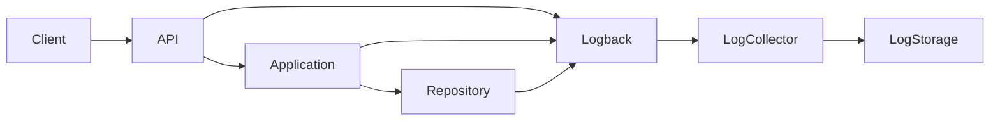

# TSD_11_LOGGING.md

> **Technical Specification Document (TSD)**  
> **Module:** Logging Design  
> **Project:** Pulse Engine – Product Catalog Service  
> **Version:** 1.0  
> **Status:** Draft

---

# 1. Purpose

Dokumen ini mendefinisikan standar logging untuk Product Catalog Service.

Logging bertujuan untuk:

- mempermudah troubleshooting
- mendukung observability
- mendukung distributed tracing
- mendukung audit
- membantu incident investigation
- memenuhi kebutuhan operasional production

Logging **bukan** pengganti Audit Trail.

Audit Trail menyimpan perubahan business data.

Logging menyimpan aktivitas sistem.

---

# 2. Objectives

Logging harus memenuhi karakteristik berikut.

- Structured
- Searchable
- Correlated
- Consistent
- Low Overhead
- Secure
- Machine Readable

---

# 3. Logging Scope

Logging mencakup:

- HTTP Request
- HTTP Response
- Business Process
- Repository
- Integration
- Exception
- Security
- Performance
- Infrastructure

Tidak mencakup:

- Business Audit History
- User Activity Report

---

# 4. Technology

| Component | Technology |
| ------------ | ------------ |
| Logging Framework | SLF4J |
| Implementation | Logback |
| JSON Encoder | Logstash Logback Encoder |
| Distributed Tracing | OpenTelemetry |
| Metrics | Micrometer |
| Log Collector | Fluent Bit / Vector (Deployment) |
| Log Storage | ELK / OpenSearch / Loki (Organization Standard) |

---

# 5. Logging Architecture



---

# 6. Logging Principles

## Structured Logging

Semua log harus berbentuk JSON.

Tidak menggunakan log bebas.

---

## Correlation

Seluruh log harus memiliki Correlation ID.

---

## Traceability

Seluruh log harus memiliki:

- Trace ID
- Span ID

---

## Immutable Log

Log tidak boleh diubah.

---

## No Sensitive Data

Tidak boleh mencatat:

- Password
- JWT
- OAuth Token
- Authorization Header
- Database Password

---

# 7. Log Categories

| Category | Description |
| ----------- | ------------- |
| ACCESS | HTTP Request |
| BUSINESS | Business Process |
| DATABASE | Database Operation |
| CACHE | Redis |
| SECURITY | Authentication & Authorization |
| ERROR | Exception |
| PERFORMANCE | Response Time |
| AUDIT | Audit Creation |

---

# 8. Log Levels

| Level | Usage |
| --------- | ------ |
| TRACE | Deep Debug |
| DEBUG | Development |
| INFO | Normal Operation |
| WARN | Business Warning |
| ERROR | Failure |

---

# 9. Log Flow

```mermaid
sequenceDiagram

actor Client

participant Controller

participant Service

participant Repository

participant Logger

Client->>Controller

Controller->>Logger: ACCESS

Controller->>Service

Service->>Logger: BUSINESS

Service->>Repository

Repository->>Logger: DATABASE

Repository-->>Service

Service-->>Controller

Controller->>Logger: RESPONSE

Controller-->>Client
```

---

# 10. Correlation ID

Seluruh request wajib memiliki

```
X-Correlation-ID
```

Jika tidak ada.

Service akan membuat secara otomatis.

Contoh

```
c67fa24bcf4f4fd89f9b0baf
```

---

# 11. Trace ID

Menggunakan OpenTelemetry.

```
Trace ID

↓

Span ID
```

Semua log wajib membawa Trace ID.

---

# 12. MDC (Mapped Diagnostic Context)

Setiap request mengisi MDC.

```java
MDC.put("correlationId", correlationId);
MDC.put("traceId", traceId);
MDC.put("userId", userId);
```

---

# 13. HTTP Request Logging

Yang dicatat.

- Method
- URI
- Query Parameter
- Response Time
- Correlation ID
- Trace ID
- Client IP
- User Agent

Tidak mencatat Body secara default.

---

# 14. HTTP Response Logging

Yang dicatat.

- Status Code
- Duration
- Endpoint
- Correlation ID

---

# 15. Business Logging

Business Event.

Contoh.

```
Create Product

Publish Product

Archive Product

Deactivate Company
```

---

Contoh.

```text
INFO

Product published successfully.

productId=...

version=3
```

---

# 16. Repository Logging

Yang dicatat.

- Query Duration
- Rows Affected
- Slow Query

Tidak mencatat SQL lengkap pada Production.

---

# 17. Redis Logging

Yang dicatat.

```
Cache Hit

Cache Miss

Eviction
```

Contoh

```
Cache Hit

product::123
```

---

# 18. Exception Logging

Contoh.

```text
ERROR

Product publish failed.

productId=...

reason=Already Published
```

---

# 19. Security Logging

Yang dicatat.

- Authentication Success*
- Authorization Failure
- Access Denied
- Invalid Token

> *Authentication success umumnya dicatat oleh Identity Provider apabila autentikasi dilakukan di luar Product Catalog.

---

# 20. Performance Logging

Mencatat.

- Response Time
- Database Time
- Redis Time
- External Call Time

---

# 21. Slow Request

Default Threshold

```
1000 ms
```

Jika lebih.

```
WARN
```

---

# 22. Slow Query

Threshold

```
500 ms
```

---

# 23. JSON Log Format

Contoh.

```json
{
  "timestamp":"2026-08-03T10:15:20Z",
  "level":"INFO",
  "service":"product-catalog",
  "correlationId":"abc123",
  "traceId":"xyz789",
  "logger":"ProductService",
  "event":"PRODUCT_PUBLISHED",
  "productId":"123",
  "version":2,
  "duration":120
}
```

---

# 24. Logback Configuration

```xml
<configuration>

    <appender name="JSON"
              class="ch.qos.logback.core.ConsoleAppender">

    </appender>

</configuration>
```

---

# 25. Spring Boot Configuration

```yaml
logging:

  level:

    root: INFO

    com.pulse.catalog: INFO

    org.springframework.security: WARN

    org.hibernate.SQL: OFF

    org.hibernate.orm.jdbc.bind: OFF
```

---

# 26. Sensitive Data Masking

Harus disamarkan.

Contoh.

```
Authorization

↓

Bearer **********
```

---

```
Database Password

↓

********
```

---

# 27. Audit vs Logging

| Audit | Logging |
| --------- | --------- |
| Business Evidence | Operational Evidence |
| Immutable | Rotated |
| Database | Log Storage |
| Compliance | Troubleshooting |

---

# 28. Log Retention

BRD tidak mendefinisikan retensi log.

Status

```
Requires Functional Clarification
```

---

# 29. Log Rotation

Mengikuti kebijakan platform.

Contoh.

```
Daily Rotation
```

atau

```
100 MB
```

Status implementasi mengikuti standar organisasi.

---

# 30. OpenTelemetry Integration

Seluruh request membuat Span.

```
HTTP

↓

Controller

↓

Application

↓

Repository

↓

Database
```

---

# 31. Sequence Diagram

```mermaid
sequenceDiagram

actor Client

participant Filter

participant Controller

participant Service

participant Repository

participant Logger

Client->>Filter

Filter->>Logger: Request

Filter->>Controller

Controller->>Service

Service->>Repository

Repository-->>Service

Service->>Logger: Business Event

Controller-->>Filter

Filter->>Logger: Response
```

---

# 32. Java Example

```java
private static final Logger log =
        LoggerFactory.getLogger(ProductService.class);

log.info(
    "Product published. productId={}, version={}",
    productId,
    version
);
```

---

# 33. Logging Filter

Contoh.

```java
@Component
public class CorrelationIdFilter
        extends OncePerRequestFilter {

}
```

---

# 34. Architectural Decisions

| Decision | Rationale |
| ---------- | ----------- |
| JSON Logging | Mudah diproses mesin |
| SLF4J | Standar Java |
| Logback | Default Spring Boot |
| MDC | Correlation |
| OpenTelemetry | Distributed Tracing |
| Log Separation | Memudahkan monitoring |

---

# 35. Alternatives Considered

| Alternative | Decision | Reason |
| ------------ | ---------- | -------- |
| Plain Text Log | Tidak dipilih | Sulit dicari |
| Log4j2 | Tidak dipilih | Logback sudah menjadi default Spring Boot |
| XML Log | Tidak dipilih | Tidak efisien |
| SQL Logging Production | Tidak dipilih | Risiko keamanan dan overhead |
| File-only Logging | Tidak dipilih | Tidak cocok untuk Kubernetes |

---

# 36. Technical Risks

| Risk | Mitigation |
| ------ | ------------ |
| Log Volume Besar | INFO sebagai default |
| Sensitive Data Bocor | Log Masking |
| Missing Correlation ID | Filter otomatis |
| Storage Penuh | Rotasi log |
| Sulit Trace Request | OpenTelemetry + MDC |

---

# 37. Recommendations

1. Gunakan **JSON Structured Logging** pada seluruh environment.
2. Gunakan **MDC** untuk Correlation ID, Trace ID, dan User ID.
3. Hindari logging request body kecuali diperlukan untuk debugging dan telah melalui proses masking.
4. Nonaktifkan SQL logging pada Production.
5. Integrasikan logging dengan OpenTelemetry dan Micrometer untuk observability end-to-end.

---

# 38. Requires Functional Clarification

| Item | Status |
| ------ | -------- |
| Log Retention Policy | Requires Functional Clarification |
| Centralized Logging Platform (ELK/Loki/OpenSearch) | Requires Functional Clarification |
| Log Archiving Policy | Requires Functional Clarification |
| PII Masking Standard | Requires Functional Clarification |
| Request Body Logging Policy | Requires Functional Clarification |
| Security Event Retention | Requires Functional Clarification |

---

# 39. Traceability

| BRD | FSD | Logging | Component | Test Case |
| ----- | ----- | ---------- | ----------- | ----------- |
| Audit Requirement | FSD-05 | Business Log | Application Service | TC-LOG-001 |
| Query Product | FSD-04 | Access Log | Controller | TC-LOG-002 |
| Publish Product | FSD-02 | Business Log | Product Service | TC-LOG-003 |
| Error Handling | TSD-10 | Error Log | Global Exception Handler | TC-LOG-004 |
| Security | FSD-06 | Security Log | Spring Security | TC-LOG-005 |

---

# 40. Next Document

**TSD_12_OBSERVABILITY.md**

Dokumen berikut akan membahas:

- Observability Architecture
- Spring Boot Actuator
- Micrometer Metrics
- Prometheus Integration
- OpenTelemetry
- Distributed Tracing
- Health Check
- Liveness & Readiness Probe
- Alerting Strategy
- Grafana Dashboard
- SLI/SLO
- Production Monitoring
- Kubernetes Observability
