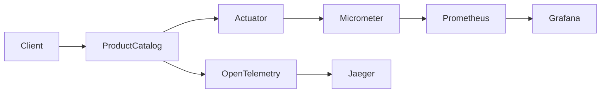
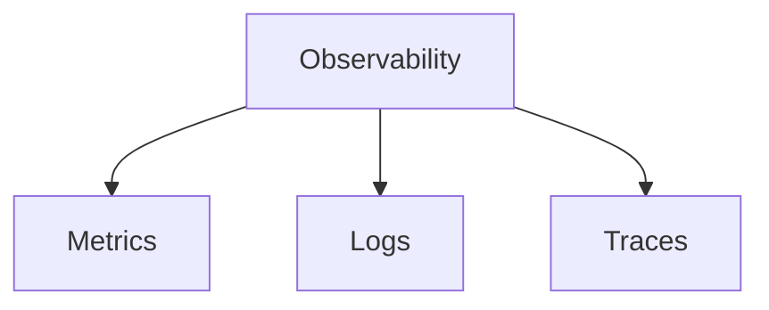
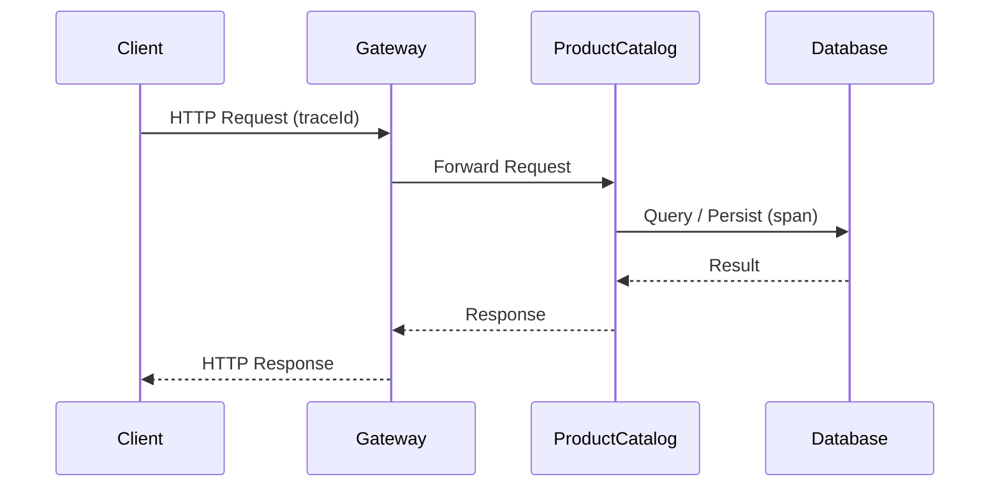
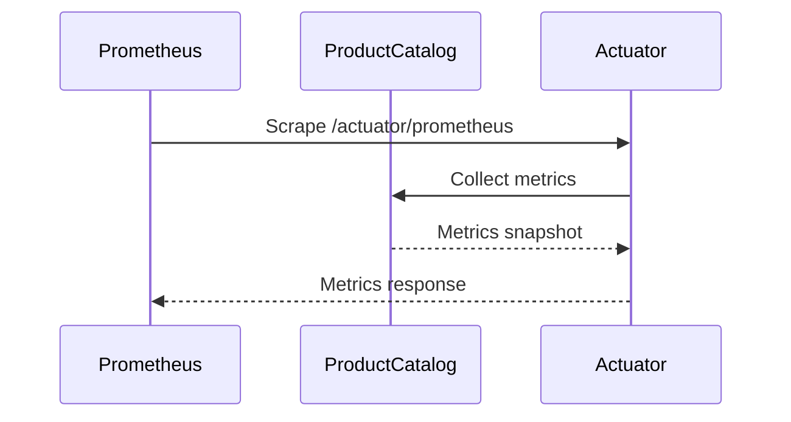

# TSD_12_OBSERVABILITY.md

> **Technical Specification Document (TSD)**  
> **Module:** Observability Design  
> **Project:** Pulse Engine – Product Catalog Service  
> **Version:** 1.0  
> **Status:** Draft

---

# 1. Purpose

Dokumen ini mendefinisikan standar observability untuk Product Catalog Service.

Observability bertujuan untuk:

- memonitor kesehatan aplikasi
- mendeteksi masalah lebih cepat
- mempermudah troubleshooting
- menyediakan metrics operasional
- mendukung distributed tracing
- mendukung SRE dan DevOps dalam menjaga SLA

Observability terdiri dari tiga pilar utama:

- Metrics
- Logs
- Traces

---

# 2. Objectives

Product Catalog harus mampu:

- menyediakan Health Check
- menyediakan Metrics
- menyediakan Distributed Tracing
- menyediakan Application Information
- menghasilkan Alert yang dapat ditindaklanjuti
- mendukung dashboard operasional

---

# 3. Technology Stack

| Component | Technology |
| ------------ | ------------ |
| Spring Boot | 4.0.7 |
| Spring Actuator | Built-in |
| Micrometer | Latest |
| Prometheus | Latest |
| Grafana | Latest |
| OpenTelemetry | Latest |
| OTLP Exporter | Latest |
| Kubernetes | 1.30+ |

---

# 4. Observability Architecture



---

# 5. Three Pillars



---

# 6. Metrics

Metrics digunakan untuk mengukur performa aplikasi.

Contoh:

- Request Count
- Error Count
- Latency
- Active Request
- JVM Metrics
- Database Metrics
- Redis Metrics

---

# 7. Standard Metrics

| Metric | Description |
| ---------- | ------------ |
| http.server.requests | Total HTTP Request |
| http.server.duration | Response Time |
| jvm.memory.used | JVM Memory |
| jvm.gc.pause | GC Duration |
| process.cpu.usage | CPU Usage |
| system.cpu.usage | System CPU |
| jdbc.connections.active | Active DB Connection |
| redis.commands | Redis Operation |

---

# 8. Business Metrics

Selain metrics teknis, Product Catalog menyediakan Business Metrics.

| Metric | Description |
| --------- | ------------ |
| company.created | Company dibuat |
| company.deactivated | Company dinonaktifkan |
| product.created | Product dibuat |
| product.updated | Product diperbarui |
| product.published | Product dipublish |
| product.archived | Product diarsipkan |

---

# 9. Custom Metrics

Contoh Micrometer Counter.

```java
Counter.builder("product.published")
       .description("Published Products")
       .register(meterRegistry)
       .increment();
```

---

# 10. Timer Metrics

Mengukur response time.

```java
Timer.Sample sample = Timer.start(meterRegistry);

try {

    service.publishProduct();

} finally {

    sample.stop(
        meterRegistry.timer("product.publish.duration")
    );

}
```

---

# 11. Health Check

Spring Boot Actuator menyediakan endpoint.

```
/actuator/health
```

---

Contoh.

```json
{
  "status":"UP"
}
```

---

# 12. Health Indicators

Health Check meliputi.

| Component | Health Check |
| ------------ | -------------- |
| Application | ✔ |
| PostgreSQL | ✔ |
| Redis | ✔ |
| Disk Space | ✔ |
| Ping | ✔ |

---

# 13. Readiness Probe

Digunakan Kubernetes.

Endpoint

```
/actuator/health/readiness
```

Status.

```
UP

↓

Ready menerima traffic
```

---

# 14. Liveness Probe

Endpoint

```
/actuator/health/liveness
```

Status.

```
UP

↓

Container sehat
```

---

# 15. Info Endpoint

```
/actuator/info
```

Contoh.

```json
{
  "application":"product-catalog",
  "version":"1.0.0",
  "build":"2026.08.03",
  "java":"25"
}
```

---

# 16. Metrics Endpoint

```
/actuator/prometheus
```

Digunakan Prometheus.

---

# 17. Distributed Tracing

Menggunakan OpenTelemetry.



---

# 18. Trace Information

Setiap request menghasilkan.

- Trace ID
- Span ID

Contoh.

```
Trace ID

↓

8fd7abf991....

Span ID

↓

91ab45...
```

---

# 19. Trace Hierarchy

```text
HTTP Request

↓

Controller

↓

Application Service

↓

Domain

↓

Repository

↓

Database
```

---

# 20. Spring Boot Configuration

```yaml
management:

  endpoints:

    web:

      exposure:

        include: health,info,prometheus,metrics

  endpoint:

    health:

      probes:

        enabled: true

      show-details: when-authorized
```

---

# 21. Prometheus Configuration

```yaml
scrape_configs:

- job_name: product-catalog

  metrics_path: /actuator/prometheus

  static_configs:

  - targets:

      - product-catalog:8080
```

---

# 22. Grafana Dashboard

Dashboard minimum.

| Dashboard | Description |
| ------------ | ------------ |
| Request Rate | HTTP Throughput |
| Response Time | Latency |
| Error Rate | HTTP Error |
| JVM | Heap & GC |
| Database | Connection |
| Redis | Cache |
| Business | Publish Product |

---

# 23. Alerting

Alert minimum.

| Alert | Threshold |
| --------- | ----------- |
| CPU > 80% | Warning |
| Memory > 85% | Warning |
| Error Rate > 5% | Critical |
| Response Time > 2 sec | Critical |
| Database Down | Critical |
| Redis Down | Warning |

---

# 24. SLI

Service Level Indicators.

| Indicator | Description |
| ------------ | ------------ |
| Availability | Success Request |
| Latency | Response Time |
| Error Rate | Failed Request |
| Throughput | Request/sec |

---

# 25. SLO

Target.

| SLO | Target |
| ------ | --------- |
| Availability | 99.9% |
| Response Time P95 | <300 ms |
| Response Time P99 | <500 ms |
| Error Rate | <1% |

---

# 26. Golden Signals

Mengikuti Google SRE.

- Latency
- Traffic
- Errors
- Saturation

---

# 27. Database Monitoring

Metric.

- Active Connection
- Connection Pool
- Slow Query
- Query Duration
- Deadlock

---

# 28. Redis Monitoring

Metric.

- Hit Ratio
- Miss Ratio
- Memory
- Eviction
- Latency

---

# 29. JVM Monitoring

Metric.

- Heap
- Non Heap
- Thread Count
- GC Time
- CPU
- Class Loader

---

# 30. Container Monitoring

Metric.

- CPU
- Memory
- Restart Count
- OOM Kill
- File Descriptor

---

# 31. Kubernetes Monitoring

Metric.

- Pod Ready
- Replica
- Restart
- Deployment Status
- HPA Status

---

# 32. Sequence Diagram



---

# 33. Spring Configuration

```yaml
management:

  tracing:

    enabled: true

  otlp:

    tracing:

      endpoint: http://otel-collector:4318/v1/traces
```

---

# 34. OpenTelemetry Configuration

Contoh.

```java
@Bean
ObservationRegistry observationRegistry() {

    return ObservationRegistry.create();

}
```

---

# 35. Architectural Decisions

| Decision | Rationale |
| ---------- | ----------- |
| Spring Actuator | Standar Spring Boot |
| Micrometer | Standar Metrics |
| Prometheus | Monitoring Enterprise |
| OpenTelemetry | Vendor Neutral |
| Grafana | Dashboard Standar |
| Health Probe | Kubernetes Native |

---

# 36. Alternatives Considered

| Alternative | Decision | Reason |
| ------------ | ---------- | -------- |
| Zipkin | Tidak dipilih | OpenTelemetry lebih fleksibel |
| New Relic Agent | Tidak dipilih | Vendor-specific |
| Datadog Agent | Tidak dipilih | Bergantung lisensi organisasi |
| Custom Metrics API | Tidak dipilih | Micrometer sudah memenuhi kebutuhan |
| File-based Monitoring | Tidak dipilih | Tidak cocok untuk cloud-native |

---

# 37. Technical Risks

| Risk | Mitigation |
| ------ | ------------ |
| Metrics Overhead | Gunakan sampling bila diperlukan |
| High Cardinality Metrics | Hindari label dinamis seperti UUID |
| Trace Storage Growth | Terapkan sampling dan retention policy |
| Dashboard Tidak Konsisten | Gunakan dashboard template standar |
| Alert Fatigue | Tetapkan threshold yang realistis |

---

# 38. Recommendations

1. Gunakan **Spring Boot Actuator** sebagai standar endpoint observability.
2. Integrasikan seluruh metrics melalui **Micrometer**.
3. Gunakan **OpenTelemetry Auto Instrumentation** untuk tracing HTTP, JDBC, dan Redis.
4. Hindari penggunaan label metrics dengan nilai unik (misalnya `productId`) karena menyebabkan high cardinality.
5. Bangun dashboard Grafana berdasarkan **Golden Signals** dan tambahkan dashboard business metrics untuk aktivitas Product Catalog.

---

# 39. Observability Governance

Poin-poin berikut merupakan **Platform Governance** dan **Organization Policy**, bukan Functional Requirements. Product Catalog tidak boleh mengunci implementasi ke vendor atau angka tertentu tanpa dasar organisasi.

## 39.1 Observability Platform

### Keputusan

Product Catalog tidak bergantung pada platform observability tertentu.

Service menghasilkan telemetry yang kompatibel dengan OpenTelemetry sehingga dapat diintegrasikan dengan berbagai platform observability.

Platform yang didukung antara lain:

- Prometheus + Grafana
- Grafana Cloud
- OpenSearch
- ELK Stack
- Datadog
- New Relic
- Dynatrace
- Azure Monitor
- Google Cloud Operations

### Rationale

- Vendor agnostic.
- Tidak mengunci implementasi pada platform tertentu.
- Selaras dengan OpenTelemetry.

**Status:** ✅ Resolved

---

## 39.2 Alert Notification Channel

### Keputusan

Product Catalog tidak mengirim notifikasi alert secara langsung.

Alert dikelola oleh platform monitoring.

Channel yang dapat digunakan:

- Email
- Microsoft Teams
- Slack
- PagerDuty
- Opsgenie
- ServiceNow

Pemilihan channel mengikuti kebijakan SRE organisasi.

### Rationale

Alert routing merupakan tanggung jawab platform observability.

**Status:** ✅ Resolved

---

## 39.3 Metric Retention

### Keputusan

Metric retention mengikuti kebijakan platform observability.

Product Catalog hanya menghasilkan metric.

Contoh baseline (dapat disesuaikan organisasi):

| Metric | Recommended Retention |
|---------|-----------------------|
| High Resolution | 30 Hari |
| Aggregated Metric | 13 Bulan |

### Rationale

Retensi metric merupakan keputusan kapasitas observability.

**Status:** ✅ Resolved

---

## 39.4 Trace Retention

### Keputusan

Trace retention mengikuti konfigurasi distributed tracing platform.

Baseline yang direkomendasikan:

| Trace Type | Recommended Retention |
|------------|-----------------------|
| Full Trace | 7 Hari |
| Aggregated Trace | 30 Hari |

### Rationale

Storage trace sangat bergantung pada volume traffic.

**Status:** ✅ Resolved

---

## 39.5 OpenTelemetry Sampling

### Keputusan

Sampling rate tidak ditentukan oleh aplikasi.

Sampling dikendalikan oleh OpenTelemetry Collector atau observability platform.

Default yang direkomendasikan:

| Environment | Sampling |
|-------------|----------|
| Development | 100% |
| SIT / UAT | 100% |
| Production | Parent Based + TraceId Ratio |

Besaran sampling production mengikuti kebutuhan operasional.

### Rationale

Sampling merupakan konfigurasi operasional, bukan logika aplikasi.

**Status:** ✅ Resolved

---

## 39.6 Service Level Objective (SLO)

### Keputusan

Product Catalog mendukung pengukuran SLO namun tidak menetapkan target organisasi.

Service menyediakan metric yang diperlukan untuk menghitung:

- Availability
- Latency
- Error Rate
- Throughput

Target SLO ditentukan oleh organisasi atau SRE Team.

### Rationale

SLO merupakan kebijakan operasional organisasi dan dapat berbeda antar lingkungan.

**Status:** ✅ Resolved

---

# 40. Observability Summary

| Area | Decision |
|------|----------|
| Metrics | Prometheus/OpenTelemetry Compatible |
| Tracing | OpenTelemetry Compatible |
| Logging | Structured JSON |
| Platform | Vendor Agnostic |
| Alerting | Platform Responsibility |
| Notification Channel | Organization Policy |
| Metric Retention | Platform Policy |
| Trace Retention | Platform Policy |
| Sampling | Collector Configuration |
| SLO | Organization Policy |

---

## 40.1 Golden Signals

| Signal     | Metric                                            |
| ---------- | ------------------------------------------------- |
| Latency    | HTTP Request Duration                             |
| Traffic    | Request Count                                     |
| Errors     | HTTP 4xx / 5xx Rate                               |
| Saturation | CPU, Memory, Database Pool, Redis Connection Pool |

Keempat metrik ini menjadi dasar dashboard dan alerting, serta selaras dengan praktik observability modern.

---

## 40.2 Decision Ownership

Item berikut **tidak boleh diputuskan oleh Product Catalog**:

| Item                             | Pemilik Keputusan                 |
| -------------------------------- | --------------------------------- |
| Grafana / ELK / OpenSearch       | **Platform Team**                 |
| Slack / Teams / PagerDuty        | **SRE Team**                      |
| Metric Retention                 | **Observability Platform**        |
| Trace Retention                  | **Observability Platform**        |
| Sampling Rate                    | **OpenTelemetry Collector**       |
| SLO Target (99.9%, 99.95%, dst.) | **Organization / SRE Governance** |

---

# 41. Traceability

| BRD | FSD | Observability | Component | Test Case |
| ----- | ----- | --------------- | ----------- | ----------- |
| Availability | NFR | Health Check | Spring Actuator | TC-OBS-001 |
| Performance | NFR | Prometheus Metrics | Micrometer | TC-OBS-002 |
| Traceability | FSD-05 | OpenTelemetry | Tracing | TC-OBS-003 |
| Product Publish | FSD-02 | Business Metrics | Product Service | TC-OBS-004 |
| Cache | TSD-08 | Redis Metrics | Redis | TC-OBS-005 |

---

# 42. Compliance & Monitoring

## 42.1 Regulatory Compliance

Observability design memenuhi persyaratan compliance:

* **UU PDP No. 27/2022** - Perlindungan Data Pribadi
  * Monitoring untuk data access
  * Audit trail untuk security events
  * Incident detection and response

* **POJK No. 13/2017** - Penggunaan TI
  * IT monitoring and alerting
  * Performance monitoring
  * Availability monitoring
  * Incident management

* **ISO/IEC 27001:2022** - ISMS
  * A.12 Operations Security - Monitoring
  * A.16 Incident Management - Security monitoring
  * A.17 Business Continuity - Availability monitoring

Lihat [Enterprise Standards & Compliance Framework](../../../docs/16. ENTERPRISE_STANDARDS.md) untuk detail lengkap.

---

## 42.2 Security Monitoring

### Security Events to Monitor

| Event | Severity | Alert Threshold | Action |
|-------|----------|-----------------|--------|
| Authentication Failure | WARN | > 5 in 5 minutes | Alert + block |
| Authorization Failure | WARN | > 10 in 5 minutes | Alert |
| Invalid JWT | WARN | > 3 in 5 minutes | Alert |
| SQL Injection Attempt | CRITICAL | Any | Alert + block |
| Rate Limit Exceeded | INFO | N/A | Log + throttle |
| Unusual Access Pattern | WARN | > 2 std dev | Alert |
| Service Down | CRITICAL | Any | Immediate alert |

### Security Metrics

* Authentication success/failure rate
* Authorization failure rate
* Token validation failures
* Rate limit violations
* Unusual access patterns
* Error rate by endpoint

---

## 42.3 Compliance Metrics

### Key Compliance Indicators (KCI)

| Metric | Target | Measurement | Alert |
|--------|--------|-------------|-------|
| Audit Log Coverage | 100% | Log completeness | Critical if < 100% |
| Security Event Response | < 1 hour | Response time | Warning if > 1 hour |
| Vulnerability Remediation | Critical: < 24h | Scan results | Critical if exceeded |
| Configuration Change | 100% tracked | Change detection | Warning if untracked |
| Access Review Completion | 100% quarterly | Review completion | Warning if incomplete |

---

## 42.4 Data Retention for Metrics

| Metric Type | Retention | Reason |
|-------------|-----------|--------|
| Performance Metrics | 90 days | Trending and capacity planning |
| Business Metrics | 10 years | Regulatory compliance (OJK) |
| Security Metrics | 1 year | Incident investigation |
| Audit Metrics | 7 years | Regulatory compliance (UU PDP, OJK) |
| Availability Metrics | 2 years | SLA reporting |

---

## 42.5 Alert Management

### Alert Classification

| Severity | Description | Response Time | Escalation |
|----------|-------------|---------------|------------|
| P1 - Critical | Service down, data breach | 15 minutes | Immediate C-level |
| P2 - High | Major functionality impaired | 30 minutes | Engineering Manager |
| P3 - Medium | Minor functionality affected | 2 hours | Engineering Team |
| P4 - Low | Cosmetic issue | 8 hours | Standard tracking |

### Alert Channels

* **Critical:** Phone call + SMS + Slack
* **High:** Slack + Teams + PagerDuty
* **Medium:** Slack + Teams + Email
* **Low:** Email + Ticket

---

## 42.6 Compliance Checklist

### Observability Compliance Checklist

- [ ] Health checks implemented (/actuator/health)
- [ ] Metrics endpoint exposed (/actuator/prometheus)
- [ ] Distributed tracing enabled (OpenTelemetry)
- [ ] Business metrics collected
- [ ] Security metrics monitored
- [ ] Alerting configured for security events
- [ ] Dashboard created for compliance metrics
- [ ] Log aggregation integrated
- [ ] SIEM integration (if required)
- [ ] Incident response procedure documented
- [ ] On-call rotation defined
- [ ] Escalation procedure documented
- [ ] Post-incident review process defined
- [ ] SLOs defined and monitored
- [ ] SLA reporting automated

Lihat [Compliance Reference Guide](COMPLIANCE_REFERENCE.md) untuk detail implementasi.

**TSD_13_PERFORMANCE.md**

Dokumen berikut akan membahas:

- Performance Architecture
- Performance Target
- Database Optimization
- Redis Optimization
- Connection Pool
- Pagination Strategy
- Search Optimization
- Bulk Processing
- JVM Tuning
- Virtual Threads (Java 25)
- Horizontal Scaling
- Capacity Planning
- Load Testing Strategy

```
