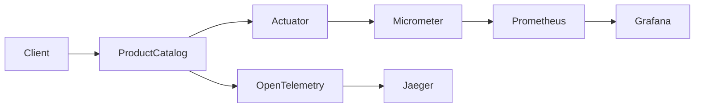
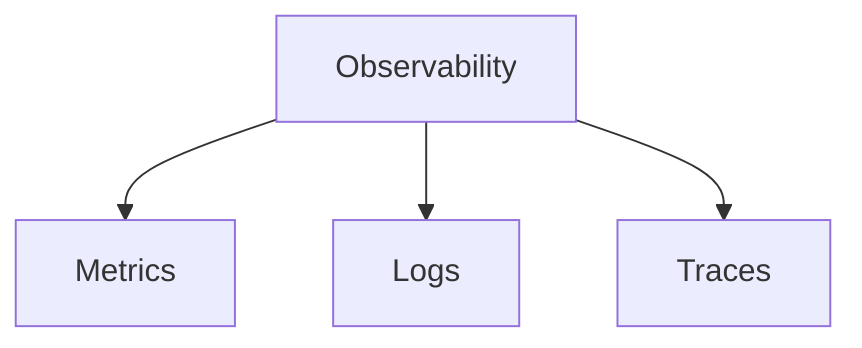

# TSD_12_OBSERVABILITY.md

> **Technical Specification Document (TSD)**  
> **Module:** Observability Design  
> **Project:** Pulse Engine – Product Catalog Service  
> **Version:** 1.0  
> **Status:** Draft

---

# 1. Purpose

Dokumen ini mendefinisikan standar observability untuk Product Catalog Service.

Observability bertujuan untuk:

- memonitor kesehatan aplikasi
- mendeteksi masalah lebih cepat
- mempermudah troubleshooting
- menyediakan metrics operasional
- mendukung distributed tracing
- mendukung SRE dan DevOps dalam menjaga SLA

Observability terdiri dari tiga pilar utama:

- Metrics
- Logs
- Traces

---

# 2. Objectives

Product Catalog harus mampu:

- menyediakan Health Check
- menyediakan Metrics
- menyediakan Distributed Tracing
- menyediakan Application Information
- menghasilkan Alert yang dapat ditindaklanjuti
- mendukung dashboard operasional

---

# 3. Technology Stack

| Component | Technology |
| ------------ | ------------ |
| Spring Boot | 4.0.7 |
| Spring Actuator | Built-in |
| Micrometer | Latest |
| Prometheus | Latest |
| Grafana | Latest |
| OpenTelemetry | Latest |
| OTLP Exporter | Latest |
| Kubernetes | 1.30+ |

---

# 4. Observability Architecture



---

# 5. Three Pillars



---

# 6. Metrics

Metrics digunakan untuk mengukur performa aplikasi.

Contoh:

- Request Count
- Error Count
- Latency
- Active Request
- JVM Metrics
- Database Metrics
- Redis Metrics

---

# 7. Standard Metrics

| Metric | Description |
| ---------- | ------------ |
| http.server.requests | Total HTTP Request |
| http.server.duration | Response Time |
| jvm.memory.used | JVM Memory |
| jvm.gc.pause | GC Duration |
| process.cpu.usage | CPU Usage |
| system.cpu.usage | System CPU |
| jdbc.connections.active | Active DB Connection |
| redis.commands | Redis Operation |

---

# 8. Business Metrics

Selain metrics teknis, Product Catalog menyediakan Business Metrics.

| Metric | Description |
| --------- | ------------ |
| company.created | Company dibuat |
| company.deactivated | Company dinonaktifkan |
| product.created | Product dibuat |
| product.updated | Product diperbarui |
| product.published | Product dipublish |
| product.archived | Product diarsipkan |

---

# 9. Custom Metrics

Contoh Micrometer Counter.

```java
Counter.builder("product.published")
       .description("Published Products")
       .register(meterRegistry)
       .increment();
```

---

# 10. Timer Metrics

Mengukur response time.

```java
Timer.Sample sample = Timer.start(meterRegistry);

try {

    service.publishProduct();

} finally {

    sample.stop(
        meterRegistry.timer("product.publish.duration")
    );

}
```

---

# 11. Health Check

Spring Boot Actuator menyediakan endpoint.

```
/actuator/health
```

---

Contoh.

```json
{
  "status":"UP"
}
```

---

# 12. Health Indicators

Health Check meliputi.

| Component | Health Check |
| ------------ | -------------- |
| Application | ✔ |
| PostgreSQL | ✔ |
| Redis | ✔ |
| Disk Space | ✔ |
| Ping | ✔ |

---

# 13. Readiness Probe

Digunakan Kubernetes.

Endpoint

```
/actuator/health/readiness
```

Status.

```
UP

↓

Ready menerima traffic
```

---

# 14. Liveness Probe

Endpoint

```
/actuator/health/liveness
```

Status.

```
UP

↓

Container sehat
```

---

# 15. Info Endpoint

```
/actuator/info
```

Contoh.

```json
{
  "application":"product-catalog",
  "version":"1.0.0",
  "build":"2026.08.03",
  "java":"25"
}
```

---

# 16. Metrics Endpoint

```
/actuator/prometheus
```

Digunakan Prometheus.

---

# 17. Distributed Tracing

Menggunakan OpenTelemetry.

```mermaid
sequenceDiagram

Client->>Gateway

Gateway->>ProductCatalog

ProductCatalog->>Database

Database-->>ProductCatalog

ProductCatalog-->>Gateway

Gateway-->>Client
```

---

# 18. Trace Information

Setiap request menghasilkan.

- Trace ID
- Span ID

Contoh.

```
Trace ID

↓

8fd7abf991....

Span ID

↓

91ab45...
```

---

# 19. Trace Hierarchy

```text
HTTP Request

↓

Controller

↓

Application Service

↓

Domain

↓

Repository

↓

Database
```

---

# 20. Spring Boot Configuration

```yaml
management:

  endpoints:

    web:

      exposure:

        include: health,info,prometheus,metrics

  endpoint:

    health:

      probes:

        enabled: true

      show-details: when-authorized
```

---

# 21. Prometheus Configuration

```yaml
scrape_configs:

- job_name: product-catalog

  metrics_path: /actuator/prometheus

  static_configs:

  - targets:

      - product-catalog:8080
```

---

# 22. Grafana Dashboard

Dashboard minimum.

| Dashboard | Description |
| ------------ | ------------ |
| Request Rate | HTTP Throughput |
| Response Time | Latency |
| Error Rate | HTTP Error |
| JVM | Heap & GC |
| Database | Connection |
| Redis | Cache |
| Business | Publish Product |

---

# 23. Alerting

Alert minimum.

| Alert | Threshold |
| --------- | ----------- |
| CPU > 80% | Warning |
| Memory > 85% | Warning |
| Error Rate > 5% | Critical |
| Response Time > 2 sec | Critical |
| Database Down | Critical |
| Redis Down | Warning |

---

# 24. SLI

Service Level Indicators.

| Indicator | Description |
| ------------ | ------------ |
| Availability | Success Request |
| Latency | Response Time |
| Error Rate | Failed Request |
| Throughput | Request/sec |

---

# 25. SLO

Target.

| SLO | Target |
| ------ | --------- |
| Availability | 99.9% |
| Response Time P95 | <300 ms |
| Response Time P99 | <500 ms |
| Error Rate | <1% |

---

# 26. Golden Signals

Mengikuti Google SRE.

- Latency
- Traffic
- Errors
- Saturation

---

# 27. Database Monitoring

Metric.

- Active Connection
- Connection Pool
- Slow Query
- Query Duration
- Deadlock

---

# 28. Redis Monitoring

Metric.

- Hit Ratio
- Miss Ratio
- Memory
- Eviction
- Latency

---

# 29. JVM Monitoring

Metric.

- Heap
- Non Heap
- Thread Count
- GC Time
- CPU
- Class Loader

---

# 30. Container Monitoring

Metric.

- CPU
- Memory
- Restart Count
- OOM Kill
- File Descriptor

---

# 31. Kubernetes Monitoring

Metric.

- Pod Ready
- Replica
- Restart
- Deployment Status
- HPA Status

---

# 32. Sequence Diagram

```mermaid
sequenceDiagram

participant Prometheus

participant ProductCatalog

participant Actuator

Prometheus->>Actuator

Actuator->>ProductCatalog

ProductCatalog-->>Actuator

Actuator-->>Prometheus
```

---

# 33. Spring Configuration

```yaml
management:

  tracing:

    enabled: true

  otlp:

    tracing:

      endpoint: http://otel-collector:4318/v1/traces
```

---

# 34. OpenTelemetry Configuration

Contoh.

```java
@Bean
ObservationRegistry observationRegistry() {

    return ObservationRegistry.create();

}
```

---

# 35. Architectural Decisions

| Decision | Rationale |
| ---------- | ----------- |
| Spring Actuator | Standar Spring Boot |
| Micrometer | Standar Metrics |
| Prometheus | Monitoring Enterprise |
| OpenTelemetry | Vendor Neutral |
| Grafana | Dashboard Standar |
| Health Probe | Kubernetes Native |

---

# 36. Alternatives Considered

| Alternative | Decision | Reason |
| ------------ | ---------- | -------- |
| Zipkin | Tidak dipilih | OpenTelemetry lebih fleksibel |
| New Relic Agent | Tidak dipilih | Vendor-specific |
| Datadog Agent | Tidak dipilih | Bergantung lisensi organisasi |
| Custom Metrics API | Tidak dipilih | Micrometer sudah memenuhi kebutuhan |
| File-based Monitoring | Tidak dipilih | Tidak cocok untuk cloud-native |

---

# 37. Technical Risks

| Risk | Mitigation |
| ------ | ------------ |
| Metrics Overhead | Gunakan sampling bila diperlukan |
| High Cardinality Metrics | Hindari label dinamis seperti UUID |
| Trace Storage Growth | Terapkan sampling dan retention policy |
| Dashboard Tidak Konsisten | Gunakan dashboard template standar |
| Alert Fatigue | Tetapkan threshold yang realistis |

---

# 38. Recommendations

1. Gunakan **Spring Boot Actuator** sebagai standar endpoint observability.
2. Integrasikan seluruh metrics melalui **Micrometer**.
3. Gunakan **OpenTelemetry Auto Instrumentation** untuk tracing HTTP, JDBC, dan Redis.
4. Hindari penggunaan label metrics dengan nilai unik (misalnya `productId`) karena menyebabkan high cardinality.
5. Bangun dashboard Grafana berdasarkan **Golden Signals** dan tambahkan dashboard business metrics untuk aktivitas Product Catalog.

---

# 39. Requires Functional Clarification

| Item | Status |
| ------ | -------- |
| Platform observability organisasi (Grafana Cloud, ELK, OpenSearch, dll.) | Requires Functional Clarification |
| Alert Notification Channel (Email, Slack, Teams, PagerDuty) | Requires Functional Clarification |
| Metric Retention Period | Requires Functional Clarification |
| Trace Retention Period | Requires Functional Clarification |
| Sampling Rate OpenTelemetry | Requires Functional Clarification |
| SLO resmi organisasi | Requires Functional Clarification |

---

# 40. Traceability

| BRD | FSD | Observability | Component | Test Case |
| ----- | ----- | --------------- | ----------- | ----------- |
| Availability | NFR | Health Check | Spring Actuator | TC-OBS-001 |
| Performance | NFR | Prometheus Metrics | Micrometer | TC-OBS-002 |
| Traceability | FSD-05 | OpenTelemetry | Tracing | TC-OBS-003 |
| Product Publish | FSD-02 | Business Metrics | Product Service | TC-OBS-004 |
| Cache | TSD-08 | Redis Metrics | Redis | TC-OBS-005 |

---

# 41. Next Document

**TSD_13_PERFORMANCE.md**

Dokumen berikut akan membahas:

- Performance Architecture
- Performance Target
- Database Optimization
- Redis Optimization
- Connection Pool
- Pagination Strategy
- Search Optimization
- Bulk Processing
- JVM Tuning
- Virtual Threads (Java 25)
- Horizontal Scaling
- Capacity Planning
- Load Testing Strategy

```
