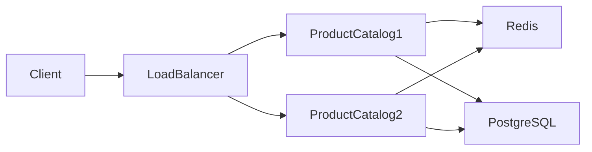
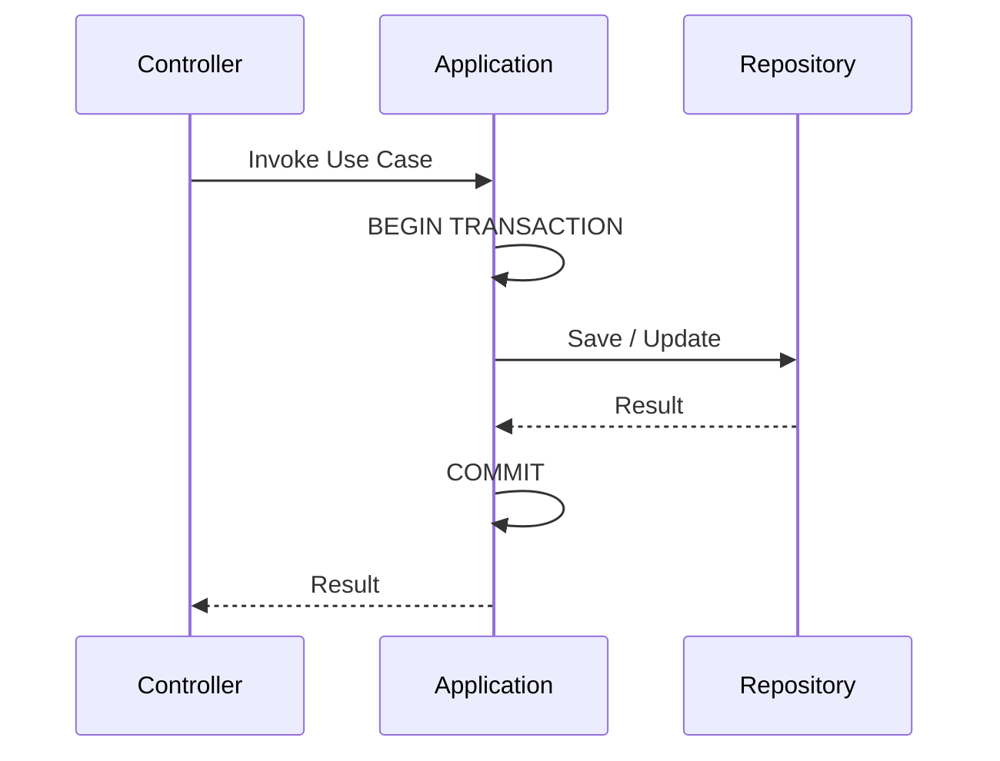
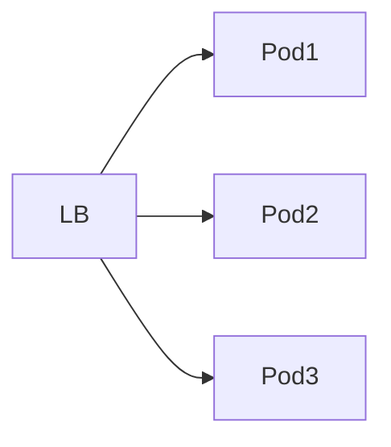

# TSD_13_PERFORMANCE.md

> **Technical Specification Document (TSD)**  
> **Module:** Performance Design  
> **Project:** Pulse Engine – Product Catalog Service  
> **Version:** 1.0  
> **Status:** Draft

---

# 1. Purpose

Dokumen ini mendefinisikan desain performa Product Catalog Service agar mampu memenuhi kebutuhan Non-Functional Requirement (NFR) dengan arsitektur yang scalable, stateless, dan cloud-native.

Dokumen ini mencakup:

- Performance Target
- Capacity Planning
- Database Optimization
- Redis Optimization
- JVM Optimization
- Search Optimization
- Horizontal Scaling
- Performance Testing

---

# 2. Objectives

Performance Design bertujuan untuk:

- Mengurangi response time
- Mengoptimalkan query database
- Meminimalkan latency
- Mengurangi beban database melalui caching
- Mendukung horizontal scalability
- Menjamin performa tetap stabil pada beban tinggi

---

# 3. Performance Principles

Product Catalog mengikuti prinsip berikut:

- Read Optimized
- Stateless Service
- Cache First
- Lazy Loading
- Pagination Mandatory
- Index Driven Query
- Horizontal Scaling
- Immutable Read Model

---

# 4. Performance Architecture



---

# 5. Performance Target

| Metric | Target |
| --------- | -------- |
| Average Response Time | < 150 ms |
| P95 Response Time | < 300 ms |
| P99 Response Time | < 500 ms |
| Search Product | < 300 ms |
| Create Product | < 500 ms |
| Publish Product | < 500 ms |
| Error Rate | < 1% |
| Availability | 99.9% |

---

# 6. Workload Characteristics

## Read

Diperkirakan mendominasi traffic.

Contoh:

- Search Product
- Product Detail
- Product Listing
- Version History

---

## Write

Lebih sedikit dibanding read.

Contoh:

- Create Product
- Update Product
- Publish Product
- Archive Product

---

# 7. Performance Strategy

| Area | Strategy |
| ------ | ---------- |
| Read | Redis Cache |
| Write | Direct Database |
| Search | Indexed Query |
| Version | Immutable Data |
| Pagination | Mandatory |
| Sorting | Database |
| Filtering | Database |

---

# 8. Read Optimization

Read API menggunakan:

- Redis
- Projection Query
- DTO Projection
- Read-only Transaction

```java
@Transactional(readOnly = true)
```

---

# 9. Write Optimization

Write API:

- Tidak menggunakan cache
- Menggunakan optimistic locking
- Transaction pendek
- Flush seminimal mungkin

---

# 10. Database Optimization

Prinsip:

- Hindari Full Table Scan
- Gunakan Composite Index
- Gunakan Covering Index
- Hindari N+1 Query
- Hindari Select *

---

# 11. Index Strategy

## Product

```sql
CREATE INDEX idx_product_status
ON product(status);
```

---

## Company

```sql
CREATE INDEX idx_company_code
ON insurance_company(company_code);
```

---

## Product Search

```sql
CREATE INDEX idx_product_search

ON product(

company_id,

status,

product_code
);
```

---

# 12. Query Optimization

Gunakan Projection.

```java
record ProductSummary(

UUID id,

String code,

String name

){}
```

Daripada mengambil seluruh entity.

---

# 13. Fetch Strategy

| Relationship | Strategy |
| -------------- | ---------- |
| Company → Product | LAZY |
| Product → Coverage | LAZY |
| Product → Benefit | LAZY |
| Product → Exclusion | LAZY |
| Product → Version | LAZY |

---

# 14. Transaction Strategy

Semua transaction dibuat sesingkat mungkin.



Tidak melakukan pemanggilan service eksternal dalam transaction database.

---

# 15. Connection Pool

Menggunakan HikariCP.

Rekomendasi awal:

| Property | Value |
| ---------- | ------- |
| Maximum Pool Size | 20 |
| Minimum Idle | 5 |
| Connection Timeout | 30 s |
| Idle Timeout | 600 s |
| Max Lifetime | 1800 s |

> Nilai akhir harus disesuaikan melalui load test.

---

# 16. Pagination Strategy

Semua endpoint listing wajib menggunakan pagination.

```
GET /products

?page=0

&size=20
```

Tidak diperbolehkan mengembalikan seluruh data.

---

# 17. Sorting

Sorting dilakukan di database.

Contoh:

```
sort=name

sort=createdAt

sort=status
```

---

# 18. Filtering

Filtering dilakukan menggunakan query SQL.

Contoh:

- companyId
- status
- productCode
- productName

---

# 19. Search Strategy

Search menggunakan kombinasi:

- Indexed LIKE Prefix
- Exact Match
- Composite Filter

BRD tidak mendefinisikan Full Text Search.

Status:

```
Tidak Diimplementasikan
```

---

# 20. Redis Performance

Redis digunakan untuk:

- Product Detail
- Product Listing
- Company Detail

Tidak digunakan untuk transaksi write.

---

# 21. Cache Strategy

```
Read

↓

Redis

↓

Database
```

Write akan menghapus cache terkait.

---

# 22. Cache Hit Ratio

Target.

| Metric | Target |
| --------- | -------- |
| Cache Hit Ratio | > 90% |
| Cache Miss | < 10% |

---

# 23. JVM Optimization

Java 25.

Menggunakan:

- G1GC (default)
- Container Aware JVM
- CDS (Class Data Sharing)

Status implementasi tuning spesifik mengikuti hasil performance test.

---

# 24. Virtual Threads

Java 25 menyediakan Virtual Threads.

Direkomendasikan untuk:

- HTTP Request
- Blocking Database Call

Tidak digunakan pada CPU intensive processing.

---

# 25. Memory Optimization

Prinsip.

- Hindari object sementara
- Gunakan immutable object
- Gunakan record
- Hindari copy collection yang tidak diperlukan

---

# 26. API Payload Optimization

Response hanya mengembalikan field yang dibutuhkan.

Contoh.

Product Listing tidak mengembalikan:

- Coverage Detail
- Benefit Detail
- Audit History

---

# 27. Compression

Aktifkan HTTP Compression.

```yaml
server:

  compression:

    enabled: true
```

---

# 28. Horizontal Scaling

Service bersifat stateless.



Session tidak disimpan di server.

---

# 29. Database Scaling

Saat ini menggunakan satu primary database.

Read Replica **kompatibel secara arsitektur** (lihat Section 40.5).

Aplikasi menggunakan satu abstraction Repository sehingga implementasi Read Replica dapat ditambahkan tanpa perubahan Domain Layer.

Penggunaan Read Replica merupakan keputusan infrastruktur dan dilakukan apabila diperlukan.

---

# 30. Bulk Operation

BRD tidak mendefinisikan Bulk API.

Status:

```
Tidak Diimplementasikan
```

---

# 31. Load Characteristics

Estimasi bottleneck:

1. Database Search
2. Cache Miss
3. Large Payload
4. Slow Query

---

# 32. Performance Monitoring

Metric yang dipantau.

- Response Time
- Throughput
- Cache Hit
- CPU
- Memory
- Slow Query
- Active Connection

---

# 33. Performance Testing

Jenis pengujian.

| Test | Purpose |
| ------ | --------- |
| Load Test | Beban normal |
| Stress Test | Beban ekstrem |
| Spike Test | Lonjakan traffic |
| Endurance Test | Beban jangka panjang |
| Scalability Test | Horizontal Scaling |

---

# 34. Load Test Target

| Scenario | Target |
| ---------- | -------- |
| Search Product | 500 RPS |
| Product Detail | 1000 RPS |
| Publish Product | 50 RPS |
| Create Product | 50 RPS |

> Nilai di atas merupakan target teknis awal dan **bukan berasal dari BRD**. Kapasitas produksi harus divalidasi melalui capacity planning.

---

# 35. Capacity Planning

Asumsi awal.

| Resource | Initial |
| ---------- | --------- |
| CPU | 2 vCPU |
| Memory | 2 GB |
| Replica | 2 |
| Redis | 1 |
| PostgreSQL | 1 |

Status:

```
Requires Capacity Validation
```

---

# 36. Performance Risks

| Risk | Mitigation |
| ------ | ------------ |
| Full Table Scan | Index |
| N+1 Query | Fetch Strategy |
| Cache Miss | Redis |
| Large Response | Pagination |
| Slow Query | SQL Optimization |
| Connection Exhausted | HikariCP |

---

# 37. Architectural Decisions

| Decision | Rationale |
| ---------- | ----------- |
| Stateless Service | Horizontal Scaling |
| Redis Cache | Mengurangi beban database |
| Pagination Mandatory | Mencegah response besar |
| Lazy Loading | Mengurangi query yang tidak diperlukan |
| Optimistic Locking | Menghindari blocking |
| Virtual Threads | Efisiensi thread pada Java 25 |

---

# 38. Alternatives Considered

| Alternative | Decision | Reason |
| ------------ | ---------- | -------- |
| Eager Fetch | Tidak dipilih | Over-fetching |
| Offset Tanpa Pagination | Tidak dipilih | Tidak scalable |
| Session-based Scaling | Tidak dipilih | Tidak cocok untuk cloud-native |
| Full Entity Response | Tidak dipilih | Payload terlalu besar |
| Database Cache | Tidak dipilih | Redis lebih fleksibel |

---

# 39. Recommendations

1. Gunakan projection DTO untuk seluruh endpoint query.
2. Semua endpoint list wajib menggunakan pagination, filtering, dan sorting.
3. Pantau slow query secara berkala dan lakukan optimasi index berdasarkan execution plan.
4. Gunakan Redis hanya untuk data yang sering dibaca dan jarang berubah.
5. Lakukan load test sebelum production untuk menentukan ukuran HikariCP, jumlah replica, dan kapasitas Redis.

---

# 40. Performance Governance

Poin-poin berikut dibagi menjadi **Performance Architecture Decision** (dapat diputuskan sekarang) dan **Capacity Planning** (berasal dari bisnis/operasional). Tidak menggunakan angka yang tidak didukung BRD.

## 40.1 Peak Concurrent User

### Keputusan

Product Catalog tidak menetapkan target jumlah concurrent user.

Service dirancang sebagai **stateless service** sehingga dapat diskalakan secara horizontal.

Target kapasitas (jumlah concurrent user) merupakan hasil Capacity Planning berdasarkan:

- jumlah pengguna Back Office
- jumlah integrasi antar service
- pola traffic produksi

### Architectural Requirement

Service harus mampu melakukan horizontal scaling tanpa perubahan kode aplikasi.

### Rationale

Jumlah concurrent user merupakan karakteristik deployment, bukan requirement fungsional.

**Status:** ✅ Resolved

---

## 40.2 Service Level Agreement (SLA)

### Keputusan

Product Catalog tidak menetapkan SLA organisasi.

Sebagai acuan implementasi, service memiliki **Performance Objective** berikut.

| API | Target Response Time |
|------|----------------------|
| GET Product | ≤ 300 ms |
| Search Product | ≤ 500 ms |
| Create Product | ≤ 500 ms |
| Update Product | ≤ 500 ms |
| Publish Product | ≤ 2 detik |

Target SLA resmi tetap mengikuti kebijakan organisasi atau SRE Team.

### Rationale

SLA merupakan komitmen layanan organisasi, sedangkan Performance Objective digunakan sebagai target implementasi dan pengujian.

**Status:** ✅ Resolved

---

## 40.3 Product Volume per Company

### Keputusan

Product Catalog tidak menetapkan batas jumlah Product per Company.

Database dan domain model harus mendukung pertumbuhan tanpa batas logis.

Optimasi dilakukan melalui:

- Indexing
- Pagination
- Query Optimization
- Redis Cache

### Rationale

Jumlah produk merupakan data bisnis yang dapat berubah sewaktu-waktu.

Tidak boleh dibatasi oleh implementasi aplikasi.

**Status:** ✅ Resolved

---

## 40.4 Target Growth

### Keputusan

Target pertumbuhan bisnis tidak menjadi bagian dari Product Catalog.

Service harus dirancang agar dapat diskalakan melalui:

- Horizontal Scaling
- Database Optimization
- Cache Layer
- Connection Pool Tuning

### Rationale

Pertumbuhan bisnis merupakan input Capacity Planning.

Arsitektur tidak boleh mengasumsikan angka tertentu.

**Status:** ✅ Resolved

---

## 40.5 Read Replica

### Keputusan

Product Catalog kompatibel dengan arsitektur Read Replica.

Aplikasi menggunakan satu abstraction Repository sehingga implementasi Read Replica dapat ditambahkan tanpa perubahan Domain Layer.

Contoh implementasi:

```
Write

↓

Primary Database

Read

↓

Read Replica
```

Penggunaan Read Replica merupakan keputusan infrastruktur dan dilakukan apabila diperlukan.

### Rationale

Mengurangi beban database utama pada workload yang didominasi operasi baca.

**Status:** ✅ Resolved

---

## 40.6 Autoscaling

### Keputusan

Autoscaling bukan tanggung jawab aplikasi.

Service dirancang agar kompatibel dengan Kubernetes Horizontal Pod Autoscaler (HPA).

Metric yang direkomendasikan:

- CPU Utilization
- Memory Utilization
- HTTP Request Rate
- Response Time

### Rationale

Kebijakan autoscaling ditentukan oleh Platform Team.

Aplikasi hanya perlu bersifat stateless.

**Status:** ✅ Resolved

---

## 40.7 Multi Region Deployment

### Keputusan

Multi-region deployment bukan requirement Product Catalog.

Service dirancang agar region-agnostic.

Apabila organisasi mengadopsi multi-region di masa depan:

- setiap region memiliki deployment sendiri
- PostgreSQL menjadi Source of Truth sesuai strategi organisasi
- Redis bersifat lokal per region

Tidak ada perubahan pada Domain Model maupun API.

### Rationale

Multi-region merupakan keputusan deployment, bukan requirement aplikasi.

**Status:** ✅ Resolved

---

# 41. Performance Architecture Summary

| Area | Decision |
|------|----------|
| Service Design | Stateless |
| Scaling | Horizontal |
| Database | PostgreSQL |
| Cache | Redis |
| Read Replica | Supported |
| Autoscaling | Kubernetes HPA Compatible |
| Multi Region | Supported secara arsitektur |
| Performance Target | Implementation Objective |
| SLA | Organization Responsibility |
| Capacity Planning | Organization Responsibility |

---

## 41.1 Performance Design Principles

- Seluruh endpoint GET harus mendukung pagination.
- Tidak ada endpoint yang mengembalikan seluruh dataset tanpa batas.
- Seluruh query pencarian harus menggunakan indeks yang sesuai.
- Operasi write menggunakan transaksi sesingkat mungkin.
- Tidak boleh ada operasi sinkron yang memblokir request lebih lama dari yang diperlukan.
- Cache digunakan untuk data referensi yang sering dibaca.
- Database connection pool harus dikonfigurasi dan dipantau.

---

## 41.2 Decision Ownership

Item berikut **tidak boleh diputuskan oleh Product Catalog** dan menjadi tanggung jawab organisasi atau platform.

| Item                                              | Pemilik Keputusan            |
| ------------------------------------------------- | ---------------------------- |
| Peak Concurrent User                              | Business + Capacity Planning |
| SLA resmi (mis. 99,95%)                           | SRE / Organization           |
| Volume Product per Company aktual                 | Business Growth              |
| Target Growth Tahunan                             | Business Planning            |
| Read Replica digunakan atau tidak                 | DBA / Platform Team          |
| Autoscaling Threshold (CPU 70%, Memory 80%, dst.) | Platform Team                |
| Multi Region Deployment                           | Enterprise Architecture      |

---

# 42. Traceability

| BRD | FSD | Performance Strategy | Component | Test Case |
| ----- | ----- | ---------------------- | ----------- | ----------- |
| Product Search | FSD-04 | Indexed Query + Cache | Repository | TC-PERF-001 |
| Product Detail | FSD-04 | Redis Cache | Cache Layer | TC-PERF-002 |
| Product Publish | FSD-02 | Optimistic Lock | Application Service | TC-PERF-003 |
| Pagination | FSD-04 | Database Pagination | API | TC-PERF-004 |
| Availability | NFR | Horizontal Scaling | Kubernetes | TC-PERF-005 |

---

# 43. Compliance & Performance Security

## 43.1 Regulatory Compliance

Performance design memenuhi persyaratan compliance:

* **UU PDP No. 27/2022** - Perlindungan Data Pribadi
  * Performance optimization tidak mengorbankan data protection
  * Resource management untuk data integrity
  * Monitoring untuk abnormal access patterns

* **POJK No. 13/2017** - Penggunaan TI
  * Performance monitoring
  * Capacity management
  * Availability management

* **ISO/IEC 27001:2022** - ISMS
  * A.12 Operations Security - Performance monitoring
  * A.17 Business Continuity - Availability

Lihat [Enterprise Standards & Compliance Framework](../../../docs/16. ENTERPRISE_STANDARDS.md) untuk detail lengkap.

---

## 43.2 Performance Security Considerations

### DoS Prevention

| Attack Vector | Mitigation |
|----------------|------------|
| Large Payload Attack | Pagination (max 100), request size limits |
| Database Exhaustion | Connection pool limits, query timeouts |
| Cache Penetration | Cache null values, Bloom filter |
| Resource Exhaustion | Rate limiting, circuit breaker |
| Slowloris Attack | Connection timeout, request timeout |

### Resource Limits

| Resource | Limit | Enforcement |
|----------|-------|-------------|
| Page Size | Max 100 | API validation |
| Connection Pool | 20 | HikariCP config |
| Request Timeout | 30s | Spring config |
| Query Timeout | 5s | Database config |
| Cache Memory | 4GB | Redis config |

---

## 43.3 Monitoring for Compliance

### Performance Metrics

* Response time (P95, P99)
* Throughput (RPS)
* Error rate
* Database connection pool utilization
* Cache hit ratio
* Memory usage
* CPU usage

### Alert Thresholds

| Metric | Warning | Critical |
|--------|---------|----------|
| Response Time P95 | > 300ms | > 500ms |
| Error Rate | > 1% | > 5% |
| Database Pool | > 80% | > 95% |
| Cache Hit Ratio | < 85% | < 70% |
| Memory | > 80% | > 90% |
| CPU | > 75% | > 90% |

---

## 43.4 Compliance Checklist

### Performance Security Checklist

- [ ] Rate limiting configured
- [ ] Request size limits enforced
- [ ] Connection pool limits configured
- [ ] Query timeouts set
- [ ] Pagination enforced (max page size)
- [ ] Circuit breaker implemented (if needed)
- [ ] Resource monitoring enabled
- [ ] Alert thresholds configured
- [ ] DoS protection measures in place
- [ ] Load testing completed
- [ ] Capacity planning documented
- [ ] Performance baseline established

Lihat [Compliance Reference Guide](COMPLIANCE_REFERENCE.md) untuk detail implementasi.

**TSD_14_INTEGRATION.md**

Dokumen berikut akan membahas:

- Integration Architecture
- REST API Contracts
- Service-to-Service Communication
- Marketplace Integration
- Quote Service Integration
- Proposal Service Integration
- Checkout Service Integration
- Reporting Integration
- API Versioning
- Timeout Strategy
- Circuit Breaker
- Retry Policy
- Idempotency
- Security Between Services
