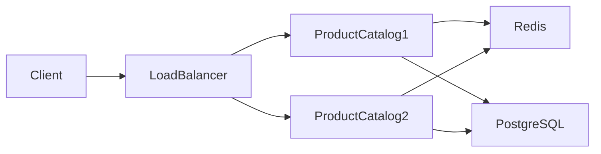
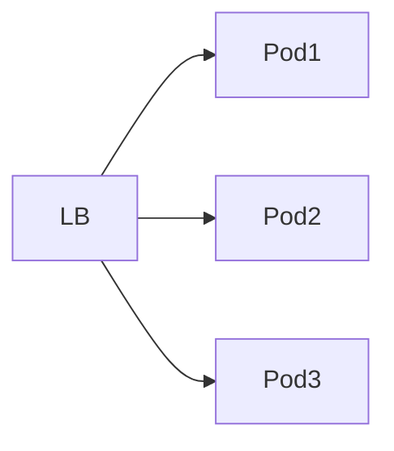

# TSD_13_PERFORMANCE.md

> **Technical Specification Document (TSD)**  
> **Module:** Performance Design  
> **Project:** Pulse Engine – Product Catalog Service  
> **Version:** 1.0  
> **Status:** Draft

---

# 1. Purpose

Dokumen ini mendefinisikan desain performa Product Catalog Service agar mampu memenuhi kebutuhan Non-Functional Requirement (NFR) dengan arsitektur yang scalable, stateless, dan cloud-native.

Dokumen ini mencakup:

- Performance Target
- Capacity Planning
- Database Optimization
- Redis Optimization
- JVM Optimization
- Search Optimization
- Horizontal Scaling
- Performance Testing

---

# 2. Objectives

Performance Design bertujuan untuk:

- Mengurangi response time
- Mengoptimalkan query database
- Meminimalkan latency
- Mengurangi beban database melalui caching
- Mendukung horizontal scalability
- Menjamin performa tetap stabil pada beban tinggi

---

# 3. Performance Principles

Product Catalog mengikuti prinsip berikut:

- Read Optimized
- Stateless Service
- Cache First
- Lazy Loading
- Pagination Mandatory
- Index Driven Query
- Horizontal Scaling
- Immutable Read Model

---

# 4. Performance Architecture



---

# 5. Performance Target

| Metric | Target |
| --------- | -------- |
| Average Response Time | < 150 ms |
| P95 Response Time | < 300 ms |
| P99 Response Time | < 500 ms |
| Search Product | < 300 ms |
| Create Product | < 500 ms |
| Publish Product | < 500 ms |
| Error Rate | < 1% |
| Availability | 99.9% |

---

# 6. Workload Characteristics

## Read

Diperkirakan mendominasi traffic.

Contoh:

- Search Product
- Product Detail
- Product Listing
- Version History

---

## Write

Lebih sedikit dibanding read.

Contoh:

- Create Product
- Update Product
- Publish Product
- Archive Product

---

# 7. Performance Strategy

| Area | Strategy |
| ------ | ---------- |
| Read | Redis Cache |
| Write | Direct Database |
| Search | Indexed Query |
| Version | Immutable Data |
| Pagination | Mandatory |
| Sorting | Database |
| Filtering | Database |

---

# 8. Read Optimization

Read API menggunakan:

- Redis
- Projection Query
- DTO Projection
- Read-only Transaction

```java
@Transactional(readOnly = true)
```

---

# 9. Write Optimization

Write API:

- Tidak menggunakan cache
- Menggunakan optimistic locking
- Transaction pendek
- Flush seminimal mungkin

---

# 10. Database Optimization

Prinsip:

- Hindari Full Table Scan
- Gunakan Composite Index
- Gunakan Covering Index
- Hindari N+1 Query
- Hindari Select *

---

# 11. Index Strategy

## Product

```sql
CREATE INDEX idx_product_status
ON product(status);
```

---

## Company

```sql
CREATE INDEX idx_company_code
ON insurance_company(company_code);
```

---

## Product Search

```sql
CREATE INDEX idx_product_search

ON product(

company_id,

status,

product_code
);
```

---

# 12. Query Optimization

Gunakan Projection.

```java
record ProductSummary(

UUID id,

String code,

String name

){}
```

Daripada mengambil seluruh entity.

---

# 13. Fetch Strategy

| Relationship | Strategy |
| -------------- | ---------- |
| Company → Product | LAZY |
| Product → Coverage | LAZY |
| Product → Benefit | LAZY |
| Product → Exclusion | LAZY |
| Product → Version | LAZY |

---

# 14. Transaction Strategy

Semua transaction dibuat sesingkat mungkin.

```mermaid
sequenceDiagram

Controller->>Application

Application->>Repository

Repository-->>Application

Application-->>Controller
```

Tidak melakukan pemanggilan service eksternal dalam transaction database.

---

# 15. Connection Pool

Menggunakan HikariCP.

Rekomendasi awal:

| Property | Value |
| ---------- | ------- |
| Maximum Pool Size | 20 |
| Minimum Idle | 5 |
| Connection Timeout | 30 s |
| Idle Timeout | 600 s |
| Max Lifetime | 1800 s |

> Nilai akhir harus disesuaikan melalui load test.

---

# 16. Pagination Strategy

Semua endpoint listing wajib menggunakan pagination.

```
GET /products

?page=0

&size=20
```

Tidak diperbolehkan mengembalikan seluruh data.

---

# 17. Sorting

Sorting dilakukan di database.

Contoh:

```
sort=name

sort=createdAt

sort=status
```

---

# 18. Filtering

Filtering dilakukan menggunakan query SQL.

Contoh:

- companyId
- status
- productCode
- productName

---

# 19. Search Strategy

Search menggunakan kombinasi:

- Indexed LIKE Prefix
- Exact Match
- Composite Filter

BRD tidak mendefinisikan Full Text Search.

Status:

```
Tidak Diimplementasikan
```

---

# 20. Redis Performance

Redis digunakan untuk:

- Product Detail
- Product Listing
- Company Detail

Tidak digunakan untuk transaksi write.

---

# 21. Cache Strategy

```
Read

↓

Redis

↓

Database
```

Write akan menghapus cache terkait.

---

# 22. Cache Hit Ratio

Target.

| Metric | Target |
| --------- | -------- |
| Cache Hit Ratio | > 90% |
| Cache Miss | < 10% |

---

# 23. JVM Optimization

Java 25.

Menggunakan:

- G1GC (default)
- Container Aware JVM
- CDS (Class Data Sharing)

Status implementasi tuning spesifik mengikuti hasil performance test.

---

# 24. Virtual Threads

Java 25 menyediakan Virtual Threads.

Direkomendasikan untuk:

- HTTP Request
- Blocking Database Call

Tidak digunakan pada CPU intensive processing.

---

# 25. Memory Optimization

Prinsip.

- Hindari object sementara
- Gunakan immutable object
- Gunakan record
- Hindari copy collection yang tidak diperlukan

---

# 26. API Payload Optimization

Response hanya mengembalikan field yang dibutuhkan.

Contoh.

Product Listing tidak mengembalikan:

- Coverage Detail
- Benefit Detail
- Audit History

---

# 27. Compression

Aktifkan HTTP Compression.

```yaml
server:

  compression:

    enabled: true
```

---

# 28. Horizontal Scaling

Service bersifat stateless.



Session tidak disimpan di server.

---

# 29. Database Scaling

Saat ini menggunakan satu primary database.

Read Replica **tidak didefinisikan dalam BRD**.

Status:

```
Requires Functional Clarification
```

---

# 30. Bulk Operation

BRD tidak mendefinisikan Bulk API.

Status:

```
Tidak Diimplementasikan
```

---

# 31. Load Characteristics

Estimasi bottleneck:

1. Database Search
2. Cache Miss
3. Large Payload
4. Slow Query

---

# 32. Performance Monitoring

Metric yang dipantau.

- Response Time
- Throughput
- Cache Hit
- CPU
- Memory
- Slow Query
- Active Connection

---

# 33. Performance Testing

Jenis pengujian.

| Test | Purpose |
| ------ | --------- |
| Load Test | Beban normal |
| Stress Test | Beban ekstrem |
| Spike Test | Lonjakan traffic |
| Endurance Test | Beban jangka panjang |
| Scalability Test | Horizontal Scaling |

---

# 34. Load Test Target

| Scenario | Target |
| ---------- | -------- |
| Search Product | 500 RPS |
| Product Detail | 1000 RPS |
| Publish Product | 50 RPS |
| Create Product | 50 RPS |

> Nilai di atas merupakan target teknis awal dan **bukan berasal dari BRD**. Kapasitas produksi harus divalidasi melalui capacity planning.

---

# 35. Capacity Planning

Asumsi awal.

| Resource | Initial |
| ---------- | --------- |
| CPU | 2 vCPU |
| Memory | 2 GB |
| Replica | 2 |
| Redis | 1 |
| PostgreSQL | 1 |

Status:

```
Requires Capacity Validation
```

---

# 36. Performance Risks

| Risk | Mitigation |
| ------ | ------------ |
| Full Table Scan | Index |
| N+1 Query | Fetch Strategy |
| Cache Miss | Redis |
| Large Response | Pagination |
| Slow Query | SQL Optimization |
| Connection Exhausted | HikariCP |

---

# 37. Architectural Decisions

| Decision | Rationale |
| ---------- | ----------- |
| Stateless Service | Horizontal Scaling |
| Redis Cache | Mengurangi beban database |
| Pagination Mandatory | Mencegah response besar |
| Lazy Loading | Mengurangi query yang tidak diperlukan |
| Optimistic Locking | Menghindari blocking |
| Virtual Threads | Efisiensi thread pada Java 25 |

---

# 38. Alternatives Considered

| Alternative | Decision | Reason |
| ------------ | ---------- | -------- |
| Eager Fetch | Tidak dipilih | Over-fetching |
| Offset Tanpa Pagination | Tidak dipilih | Tidak scalable |
| Session-based Scaling | Tidak dipilih | Tidak cocok untuk cloud-native |
| Full Entity Response | Tidak dipilih | Payload terlalu besar |
| Database Cache | Tidak dipilih | Redis lebih fleksibel |

---

# 39. Recommendations

1. Gunakan projection DTO untuk seluruh endpoint query.
2. Semua endpoint list wajib menggunakan pagination, filtering, dan sorting.
3. Pantau slow query secara berkala dan lakukan optimasi index berdasarkan execution plan.
4. Gunakan Redis hanya untuk data yang sering dibaca dan jarang berubah.
5. Lakukan load test sebelum production untuk menentukan ukuran HikariCP, jumlah replica, dan kapasitas Redis.

---

# 40. Requires Functional Clarification

| Item | Status |
| ------ | -------- |
| Peak Concurrent User | Requires Functional Clarification |
| SLA Resmi | Requires Functional Clarification |
| Volume Product per Company | Requires Functional Clarification |
| Target Growth Tahunan | Requires Functional Clarification |
| Read Replica Database | Requires Functional Clarification |
| Autoscaling Policy | Requires Functional Clarification |
| Multi Region Deployment | Requires Functional Clarification |

---

# 41. Traceability

| BRD | FSD | Performance Strategy | Component | Test Case |
| ----- | ----- | ---------------------- | ----------- | ----------- |
| Product Search | FSD-04 | Indexed Query + Cache | Repository | TC-PERF-001 |
| Product Detail | FSD-04 | Redis Cache | Cache Layer | TC-PERF-002 |
| Product Publish | FSD-02 | Optimistic Lock | Application Service | TC-PERF-003 |
| Pagination | FSD-04 | Database Pagination | API | TC-PERF-004 |
| Availability | NFR | Horizontal Scaling | Kubernetes | TC-PERF-005 |

---

# 42. Next Document

**TSD_14_INTEGRATION.md**

Dokumen berikut akan membahas:

- Integration Architecture
- REST API Contracts
- Service-to-Service Communication
- Marketplace Integration
- Quote Service Integration
- Proposal Service Integration
- Checkout Service Integration
- Reporting Integration
- API Versioning
- Timeout Strategy
- Circuit Breaker
- Retry Policy
- Idempotency
- Security Between Services
