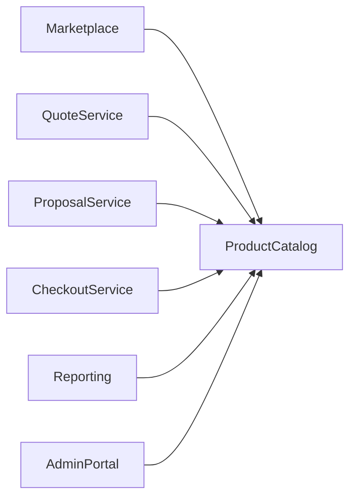
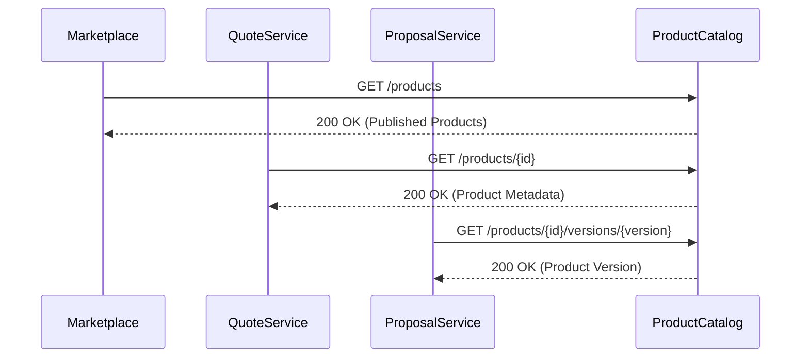
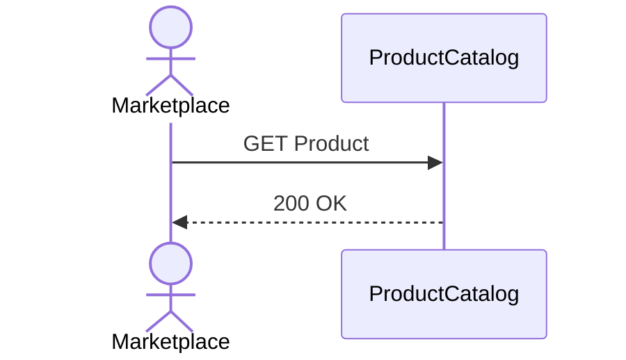
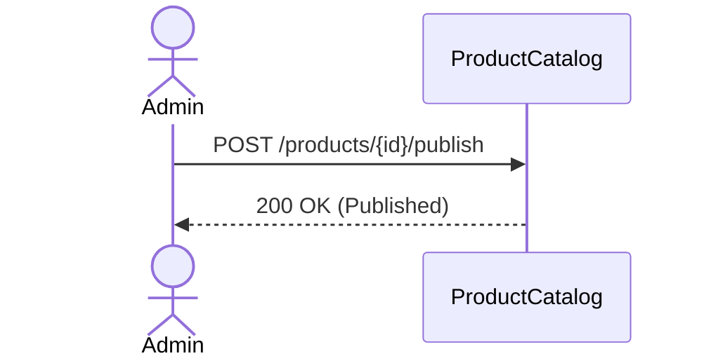
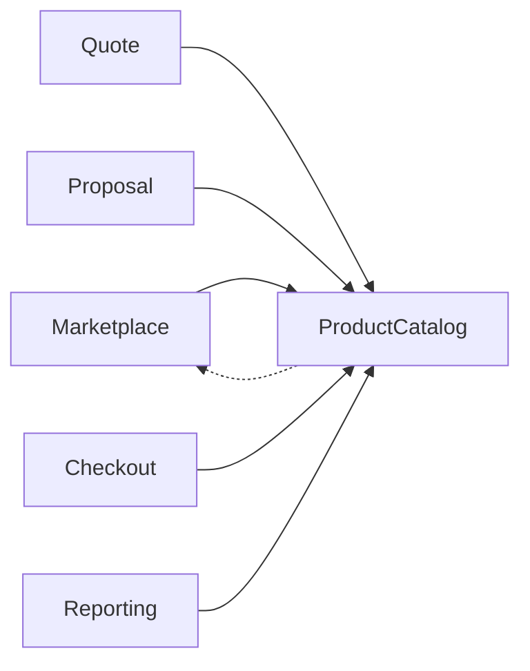

# TSD_14_INTEGRATION.md

> **Technical Specification Document (TSD)**  
> **Module:** Integration Design  
> **Project:** Pulse Engine – Product Catalog Service  
> **Version:** 1.0  
> **Status:** Draft

---

# 1. Purpose

Dokumen ini mendefinisikan desain integrasi Product Catalog Service dengan service lain di dalam Pulse Engine.

Dokumen ini menjadi acuan bagi:

- Backend Engineer
- Solution Architect
- DevOps Engineer
- QA Engineer
- SRE

Seluruh integrasi dilakukan melalui **REST API**.

Product Catalog **tidak mengakses database service lain**.

---

# 2. Objectives

Integration Design bertujuan untuk:

- Menyediakan Single Source of Truth untuk Product Metadata
- Mendukung loose coupling antar service
- Menjamin backward compatibility
- Menghindari database sharing
- Mendukung horizontal scalability
- Memastikan integrasi aman dan dapat diobservasi

---

# 3. Integration Principles

Product Catalog mengikuti prinsip berikut.

- API First
- Contract First
- Stateless
- Synchronous REST Communication
- No Shared Database
- Consumer Driven
- Backward Compatible
- Versioned API

---

# 4. Integration Architecture



---

# 5. Integration Scope

Product Catalog hanya menyediakan metadata.

Tidak menangani:

- Premium Calculation
- Eligibility Evaluation
- Checkout
- Policy Issuance
- Payment
- Underwriting
- Claim

---

# 6. Consumer List

| Consumer | Purpose |
| ------------ | ---------- |
| Marketplace | Menampilkan Product |
| Quote Service | Mengambil Product Metadata |
| Proposal Service | Mengambil Product Version |
| Checkout Service | Mengambil Snapshot Product |
| Reporting | Reporting Product |
| Admin Portal | Product Administration |

---

# 7. Provider Responsibility

Product Catalog menyediakan:

- Company
- Product
- Coverage
- Benefit
- Exclusion
- Eligibility Metadata
- Premium Configuration Metadata
- Product Document Metadata
- Product Version

---

# 8. High-Level Integration



---

# 9. API Versioning

Semua endpoint menggunakan URI Versioning.

```
/api/v1/...
```

Contoh.

```
GET /api/v1/products
```

---

# 10. Integration Authentication

Semua komunikasi menggunakan:

- OAuth2
- JWT Bearer Token

Contoh.

```
Authorization: Bearer <JWT>
```

---

# 11. Integration Authorization

Role minimum.

| Consumer | Role |
| ------------ | ------ |
| Marketplace | MARKETPLACE |
| Quote | MARKETPLACE |
| Proposal | MARKETPLACE |
| Checkout | MARKETPLACE |
| Reporting | READ_ONLY |
| Admin | PRODUCT_ADMIN |

---

# 12. Marketplace Integration

## Purpose

Menampilkan Product kepada Customer.

---

### API

```
GET /api/v1/products
```

---

### Detail

```
GET /api/v1/products/{id}
```

---

Marketplace hanya dapat melihat:

```
Published Product
```

---

# 13. Quote Service Integration

## Purpose

Mengambil metadata Product.

Quote Service bertanggung jawab melakukan Premium Calculation.

Product Catalog hanya menyediakan:

- Product
- Coverage
- Benefit
- Exclusion
- Eligibility Configuration
- Premium Configuration Metadata

---

### API

```
GET /api/v1/products/{id}
```

---

# 14. Proposal Service Integration

Proposal membutuhkan Product Version.

API.

```
GET /api/v1/products/{id}/versions/{version}
```

Proposal menyimpan referensi version.

---

# 15. Checkout Service Integration

Checkout mengambil Product Snapshot.

API.

```
GET /api/v1/products/{id}/versions/{version}
```

Checkout tidak menggunakan Product terbaru.

Selalu menggunakan version yang dipilih saat checkout dimulai.

---

# 16. Reporting Integration

Reporting menggunakan endpoint read.

Contoh.

```
GET /api/v1/products

GET /api/v1/companies
```

Tidak membaca database Product Catalog secara langsung.

---

# 17. Admin Portal Integration

Admin Portal menggunakan seluruh endpoint administrasi.

Contoh.

```
POST /companies

POST /products

PUT /products

POST /publish

POST /archive
```

---

# 18. Request Flow



---

# 19. Product Publish Flow



---

# 20. Request Headers

```
Authorization

X-Correlation-ID

Accept

Content-Type
```

---

# 21. Standard Response

```json
{
  "data": {

  },
  "metadata": {

  }
}
```

---

# 22. Error Response

Mengikuti

```
TSD_10_ERROR_HANDLING.md
```

---

# 23. Timeout Strategy

Rekomendasi timeout.

| Integration | Timeout |
| ------------- | --------- |
| Internal REST | 3 s |
| Database | 5 s |
| Redis | 500 ms |

Nilai akhir harus divalidasi melalui performance testing.

---

# 24. Retry Strategy

Retry hanya diperbolehkan untuk:

- Connection Timeout
- Temporary Network Failure
- HTTP 503

Tidak Retry:

- HTTP 400
- HTTP 401
- HTTP 403
- HTTP 404
- HTTP 409
- HTTP 422

---

# 25. Circuit Breaker

Circuit Breaker diterapkan pada layer Infrastructure (lihat Section 40.3).

Implementasi dapat menggunakan:

- Spring Cloud Circuit Breaker
- Resilience4j
- Service Mesh
- API Gateway

Business Layer tidak memiliki dependency terhadap library Circuit Breaker.

Status implementasi: **✅ Resolved**

---

# 26. Idempotency

GET API

```
Idempotent
```

PUT API

```
Idempotent
```

POST Publish

Tidak menggunakan Idempotency-Key karena operasi publish divalidasi melalui business rule dan optimistic locking.

---

# 27. API Contract Stability

Perubahan API harus menjaga:

- Backward Compatibility
- Field Existing Tidak Dihapus
- URI Tetap
- Contract Tetap

Breaking change hanya diperbolehkan pada major version API.

---

# 28. API Evolution

```
v1

↓

v2

↓

v3
```

Consumer tetap dapat menggunakan versi lama selama masih didukung.

---

# 29. Dependency Rules



Product Catalog tidak bergantung pada consumer.

---

# 30. Integration Security

Semua komunikasi wajib:

- HTTPS
- JWT
- TLS 1.2+
- OAuth2 Resource Server

---

# 31. Observability

Setiap request membawa.

```
X-Correlation-ID

Trace ID

Span ID
```

---

# 32. Sequence Diagram

## Search Product

```mermaid
sequenceDiagram

Marketplace->>ProductCatalog

GET Products

ProductCatalog->>Database

Database-->>ProductCatalog

ProductCatalog-->>Marketplace
```

---

# 33. Sequence Diagram

## Get Product Version

```mermaid
sequenceDiagram

ProposalService->>ProductCatalog

GET Version

ProductCatalog->>Database

Database-->>ProductCatalog

ProductCatalog-->>ProposalService
```

---

# 34. HTTP Status

| Status | Meaning |
| ---------- | --------- |
| 200 | Success |
| 201 | Created |
| 204 | Deleted/No Content |
| 400 | Validation |
| 401 | Unauthorized |
| 403 | Forbidden |
| 404 | Not Found |
| 409 | Conflict |
| 422 | Business Rule |
| 500 | Internal Error |

---

# 35. API Compatibility Rules

Tidak diperbolehkan:

- Menghapus field existing
- Mengubah tipe field
- Mengubah URI existing

Diperbolehkan:

- Menambah field opsional
- Menambah endpoint baru
- Menambah API Version baru

---

# 36. Architectural Decisions

| Decision | Rationale |
| ---------- | ----------- |
| REST API | Sesuai standar enterprise dan kebutuhan BRD |
| Stateless | Mendukung horizontal scaling |
| No Shared Database | Loose Coupling |
| API Versioning | Backward Compatibility |
| JWT | Secure Integration |
| Read-only Consumer | Menjaga Single Source of Truth |

---

# 37. Alternatives Considered

| Alternative | Decision | Reason |
| ------------ | ---------- | -------- |
| Database Sharing | Tidak dipilih | Tight Coupling |
| gRPC | Tidak dipilih | BRD tidak mensyaratkan |
| GraphQL | Tidak dipilih | REST sudah memenuhi kebutuhan |
| Kafka Event Integration | Tidak dipilih | BRD tidak mendefinisikan event-driven integration |
| SOAP | Tidak dipilih | Tidak sesuai standar arsitektur target |

---

# 38. Technical Risks

| Risk | Mitigation |
| ------ | ------------ |
| API Breaking Change | Versioning |
| Network Timeout | Timeout + Retry |
| Consumer Overload | Pagination |
| Unauthorized Access | OAuth2 + JWT |
| Tight Coupling | REST Contract |
| Contract Drift | OpenAPI Specification |

---

# 39. Recommendations

1. Gunakan **OpenAPI 3.1** sebagai kontrak resmi seluruh endpoint.
2. Terapkan **Consumer Contract Testing** untuk Marketplace, Quote, Proposal, Checkout, dan Reporting.
3. Semua integrasi wajib menggunakan HTTPS, OAuth2, dan JWT.
4. Gunakan Correlation ID dan Trace ID pada setiap request lintas service.
5. Hindari penambahan dependency dua arah antar service untuk menjaga bounded context.

---

# 40. Integration Architecture Decisions

Poin-poin berikut merupakan **Integration Architecture Decisions**. Hanya satu poin (Event Publishing) yang memang bergantung pada BRD/FSD.

## 40.1 API Gateway

### Keputusan

Product Catalog tidak bergantung pada API Gateway tertentu.

Service menyediakan REST API yang mengikuti standar HTTP dan OpenAPI 3.1.

Gateway yang didukung antara lain:

- Spring Cloud Gateway
- Kong Gateway
- Apigee
- Azure API Management
- AWS API Gateway
- NGINX
- Envoy

### Rationale

- Menghindari vendor lock-in.
- Memungkinkan deployment pada berbagai platform.
- Gateway merupakan tanggung jawab Platform Team.

**Status:** ✅ Resolved

---

## 40.2 Service Discovery

### Keputusan

Product Catalog tidak bergantung pada mekanisme Service Discovery tertentu.

Implementasi dapat menggunakan:

- Kubernetes DNS
- Eureka
- Consul
- Service Mesh
- Static Configuration

Pada deployment Kubernetes, service discovery menggunakan DNS bawaan Kubernetes.

### Rationale

Service Discovery merupakan keputusan deployment.

Aplikasi tidak memiliki dependency terhadap framework tertentu.

**Status:** ✅ Resolved

---

## 40.3 Circuit Breaker

### Keputusan

Circuit Breaker diterapkan pada layer Infrastructure.

Implementasi dapat menggunakan:

- Spring Cloud Circuit Breaker
- Resilience4j
- Service Mesh
- API Gateway

Business Layer tidak memiliki dependency terhadap library Circuit Breaker.

### Rationale

- Menjaga Domain Layer tetap bersih.
- Menghindari coupling terhadap library tertentu.

**Status:** ✅ Resolved

---

## 40.4 Retry Policy

### Keputusan

Retry hanya dilakukan terhadap error yang bersifat sementara (transient failure).

Retry tidak dilakukan untuk Business Exception.

| HTTP Status | Retry |
|-------------|-------|
| 408 Request Timeout | Ya |
| 429 Too Many Requests | Ya (mengikuti Retry-After) |
| 500 Internal Server Error | Ya (terbatas) |
| 502 Bad Gateway | Ya |
| 503 Service Unavailable | Ya |
| 504 Gateway Timeout | Ya |
| 400 Bad Request | Tidak |
| 401 Unauthorized | Tidak |
| 403 Forbidden | Tidak |
| 404 Not Found | Tidak |
| 409 Conflict | Tidak |
| 422 Unprocessable Entity | Tidak |

Retry menggunakan Exponential Backoff.

### Rationale

Menghindari retry terhadap kesalahan bisnis yang tidak dapat diperbaiki secara otomatis.

**Status:** ✅ Resolved

---

## 40.5 API Rate Limiting

### Keputusan

API Rate Limiting diterapkan pada API Gateway.

Product Catalog tidak mengimplementasikan rate limiting pada level aplikasi.

### Rationale

- Stateless
- Konsisten untuk seluruh microservice
- Mudah dikonfigurasi oleh Platform Team

**Status:** ✅ Resolved

---

## 40.6 Consumer SLA

### Keputusan

Product Catalog tidak menetapkan SLA masing-masing consumer.

Seluruh consumer menggunakan kontrak API yang sama.

Target response time implementasi:

| API Type | Target |
|----------|--------|
| GET | ≤ 300 ms |
| SEARCH | ≤ 500 ms |
| WRITE | ≤ 500 ms |
| PUBLISH | ≤ 2 detik |

SLA resmi mengikuti kebijakan organisasi.

### Rationale

SLA merupakan komitmen layanan organisasi, bukan kontrak antar service.

**Status:** ✅ Resolved

---

## 40.7 Event Publishing

### Keputusan

Versi pertama Product Catalog menggunakan REST API sebagai mekanisme integrasi.

Tidak ada kewajiban mempublikasikan event setelah Product Published.

Apabila di masa depan diperlukan event-driven architecture, Product Catalog dapat menerbitkan Integration Event, misalnya:

- ProductPublished
- ProductArchived
- ProductVersionCreated

**Arsitektur mendukung penambahan Integration Event di masa depan tanpa mengubah Domain Model maupun API, apabila terdapat kebutuhan bisnis baru.** Event tersebut tidak menjadi bagian dari ruang lingkup implementasi saat ini.

### Rationale

- BRD dan FSD saat ini hanya mendefinisikan integrasi melalui REST API.
- Menambahkan event publishing tanpa kebutuhan bisnis akan memperluas scope implementasi.
- Tidak ada requirement Kafka, Outbox Pattern, atau Event Bus (konsisten dengan seluruh dokumen sebelumnya).

**Status:** ✅ Resolved

---

# 41. Integration Governance Summary

| Area | Decision |
|------|----------|
| Integration Style | REST API |
| API Contract | OpenAPI 3.1 |
| API Gateway | Vendor Agnostic |
| Service Discovery | Deployment Responsibility |
| Circuit Breaker | Infrastructure Layer |
| Retry | Exponential Backoff untuk Transient Error |
| Rate Limiting | API Gateway |
| Consumer SLA | Organization Responsibility |
| Event Publishing | Tidak menjadi requirement versi pertama |

---

# 42. Traceability

| BRD | FSD | Integration | API | Test Case |
| ----- | ----- | ------------- | ----- | ----------- |
| Product Listing | FSD-04 | Marketplace | GET /products | TC-INT-001 |
| Product Detail | FSD-04 | Quote Service | GET /products/{id} | TC-INT-002 |
| Product Version | FSD-05 | Proposal Service | GET /products/{id}/versions/{version} | TC-INT-003 |
| Product Snapshot | FSD-05 | Checkout Service | GET /products/{id}/versions/{version} | TC-INT-004 |
| Reporting | FSD-08 | Reporting | GET /products | TC-INT-005 |

---

# 43. Next Document

**TSD_15_CONFIGURATION.md**

Dokumen berikut akan membahas:

- Configuration Management
- Spring Boot Configuration
- Environment Variables
- Application Profiles
- Maven Profiles
- Database Configuration
- Redis Configuration
- OAuth2 Configuration
- OpenAPI Configuration
- Flyway Configuration
- Feature Flags
- Externalized Configuration
- Secrets Management
- Kubernetes ConfigMap & Secret
- Best Practices Configuration
