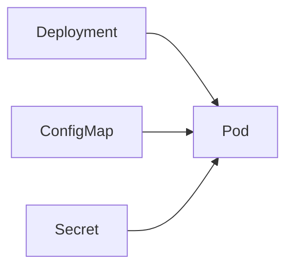

# TSD_15_CONFIGURATION.md

> **Technical Specification Document (TSD)**  
> **Module:** Configuration Management  
> **Project:** Pulse Engine – Product Catalog Service  
> **Version:** 1.0  
> **Status:** Draft

---

# 1. Purpose

Dokumen ini mendefinisikan standar Configuration Management untuk Product Catalog Service.

Tujuan utama:

- Memisahkan konfigurasi dari source code
- Mendukung multi-environment deployment
- Mempermudah deployment automation
- Mendukung Kubernetes
- Mengamankan credential aplikasi
- Mendukung observability dan maintainability

Konfigurasi mengikuti prinsip **Externalized Configuration** sesuai best practice Spring Boot.

---

# 2. Objectives

Configuration harus memenuhi karakteristik berikut.

- Externalized
- Immutable Artifact
- Environment Independent
- Secure
- Version Controlled
- Cloud Native
- Kubernetes Ready

---

# 3. Technology

| Component | Technology |
| ------------ | ------------ |
| Java | 25 |
| Spring Boot | 4.0.7 |
| Spring Framework | 7 |
| Maven | Maven Wrapper |
| PostgreSQL | 16+ |
| Redis | 7+ |
| Flyway | 11.14.1 |
| Spring Security | 7 |
| OAuth2 Resource Server | Spring Security |
| Docker | Latest |
| Kubernetes | 1.30+ |

---

# 4. Configuration Principles

Semua konfigurasi mengikuti prinsip berikut.

- Configuration outside application
- No hardcoded credential
- Environment specific
- Immutable build artifact
- Secrets dipisahkan dari ConfigMap
- Configuration dapat diubah tanpa rebuild image

---

# 5. Environment Strategy

Product Catalog mendukung environment berikut.

| Environment | Purpose |
| ------------ | --------- |
| local | Development |
| dev | Development Server |
| sit | System Integration Test |
| uat | User Acceptance Test |
| staging | Pre Production |
| production | Production |

---

# 6. Configuration Hierarchy

Prioritas konfigurasi.

```text
Command Line

↓

Environment Variable

↓

application-{profile}.yaml

↓

application.yaml

↓

Default Value
```

---

# 7. Configuration Architecture

```mermaid
flowchart TD

Developer

Git Repository

Docker Image

ConfigMap

Secret

Kubernetes

Application

Developer --> GitRepository

GitRepository --> DockerImage

ConfigMap --> Kubernetes

Secret --> Kubernetes

DockerImage --> Kubernetes

Kubernetes --> Application
```

---

# 8. Project Structure

```text
src/main/resources

├── application.yaml

├── application-local.yaml

├── application-dev.yaml

├── application-sit.yaml

├── application-uat.yaml

├── application-staging.yaml

└── application-production.yaml
```

---

# 9. Base Configuration

```yaml
spring:

  application:

    name: product-catalog

  profiles:

    active: local
```

---

# 10. Server Configuration

```yaml
server:

  port: 8080

  shutdown: graceful

  compression:

    enabled: true
```

---

# 11. Database Configuration

```yaml
spring:

  datasource:

    url: ${DB_URL}

    username: ${DB_USERNAME}

    password: ${DB_PASSWORD}

    driver-class-name: org.postgresql.Driver
```

---

# 12. JPA Configuration

```yaml
spring:

  jpa:

    open-in-view: false

    hibernate:

      ddl-auto: validate

    properties:

      hibernate:

        jdbc:

          batch_size: 50
```

---

# 13. Flyway Configuration

```yaml
spring:

  flyway:

    enabled: true

    locations:

      - classpath:db/migration

    baseline-on-migrate: true
```

---

# 14. Redis Configuration

```yaml
spring:

  data:

    redis:

      host: ${REDIS_HOST}

      port: ${REDIS_PORT}

      password: ${REDIS_PASSWORD}

      timeout: 2s
```

---

# 15. OAuth2 Resource Server

```yaml
spring:

  security:

    oauth2:

      resourceserver:

        jwt:

          issuer-uri: ${JWT_ISSUER}
```

---

# 16. OpenAPI Configuration

```yaml
springdoc:

  api-docs:

    enabled: true

  swagger-ui:

    enabled: true
```

---

# 17. Logging Configuration

```yaml
logging:

  level:

    root: INFO

    com.pulse.catalog: INFO
```

---

# 18. Actuator Configuration

```yaml
management:

  endpoints:

    web:

      exposure:

        include:

          - health

          - info

          - metrics

          - prometheus
```

---

# 19. OpenTelemetry Configuration

```yaml
management:

  tracing:

    enabled: true

  otlp:

    tracing:

      endpoint: ${OTEL_EXPORTER_ENDPOINT}
```

---

# 20. Cache Configuration

```yaml
spring:

  cache:

    type: redis
```

---

# 21. Connection Pool

```yaml
spring:

  datasource:

    hikari:

      maximum-pool-size: 20

      minimum-idle: 5

      connection-timeout: 30000
```

---

# 22. Environment Variables

| Variable | Description |
| ----------- | ------------- |
| DB_URL | PostgreSQL URL |
| DB_USERNAME | Database Username |
| DB_PASSWORD | Database Password |
| REDIS_HOST | Redis Host |
| REDIS_PORT | Redis Port |
| REDIS_PASSWORD | Redis Password |
| JWT_ISSUER | OAuth2 Issuer |
| OTEL_EXPORTER_ENDPOINT | OpenTelemetry Collector |
| LOG_LEVEL | Logging Level |

---

# 23. Secrets Management

Secret **tidak boleh** berada di repository.

Menggunakan:

- Kubernetes Secret
- External Secret Manager
- Environment Variable

Contoh:

```text
DB_PASSWORD

JWT_PRIVATE_KEY

REDIS_PASSWORD
```

---

# 24. ConfigMap

Konfigurasi non-sensitive.

Contoh.

```text
Application Name

Log Level

Cache TTL

OpenAPI Setting
```

---

# 25. Secret

Konfigurasi sensitive.

```text
Database Password

OAuth Secret

JWT Secret

Redis Password
```

---

# 26. Docker Configuration

Docker Image tidak menyimpan konfigurasi environment.

Semua konfigurasi diberikan saat runtime.

```bash
docker run \
-e DB_URL=... \
-e DB_USERNAME=... \
-e DB_PASSWORD=...
```

---

# 27. Kubernetes Configuration



---

# 28. ConfigMap Example

```yaml
apiVersion: v1

kind: ConfigMap

metadata:

  name: product-catalog-config
```

---

# 29. Secret Example

```yaml
apiVersion: v1

kind: Secret

metadata:

  name: product-catalog-secret
```

---

# 30. Spring Profiles

| Profile | Purpose |
| ---------- | ---------- |
| local | Local Development |
| dev | Development |
| sit | SIT |
| uat | UAT |
| staging | Pre Production |
| production | Production |

---

# 31. Feature Flag

BRD tidak mendefinisikan Feature Flag.

Status.

```text
Requires Functional Clarification
```

---

# 32. Maven Profiles

Maven hanya digunakan untuk build.

Deployment menggunakan Spring Profile.

---

# 33. Configuration Validation

Startup gagal apabila konfigurasi wajib tidak tersedia.

Contoh.

```java
@ConfigurationProperties
@Validated
public record DatabaseProperties(

    @NotBlank
    String url,

    @NotBlank
    String username,

    @NotBlank
    String password

){}
```

---

# 34. Fail Fast Strategy

Application tidak boleh berjalan apabila:

- Database URL kosong
- JWT Issuer kosong
- Redis Host kosong (jika cache diaktifkan)

---

# 35. Configuration Reload

Dynamic configuration **tidak didefinisikan dalam BRD**.

Status.

```
Requires Functional Clarification
```

---

# 36. Configuration Security

Tidak diperbolehkan.

- Hardcoded Password
- Hardcoded Token
- Hardcoded Secret

---

# 37. Architectural Decisions

| Decision | Rationale |
| ---------- | ----------- |
| Externalized Configuration | Twelve-Factor App |
| Spring Profile | Multi Environment |
| ConfigMap | Non-sensitive Configuration |
| Secret | Sensitive Configuration |
| Environment Variable | Cloud Native |
| Fail Fast | Menghindari runtime error |

---

# 38. Alternatives Considered

| Alternative | Decision | Reason |
| ------------ | ---------- | -------- |
| Hardcoded Configuration | Tidak dipilih | Tidak aman |
| Multiple Docker Image | Tidak dipilih | Sulit dipelihara |
| Custom Config Service | Tidak dipilih | Tidak diperlukan oleh BRD |
| Property File per Build | Tidak dipilih | Tidak cloud-native |
| Database Configuration Store | Tidak dipilih | Menambah kompleksitas |

---

# 39. Technical Risks

| Risk | Mitigation |
| ------ | ------------ |
| Secret Bocor | Kubernetes Secret |
| Environment Tidak Konsisten | Spring Profile |
| Salah Konfigurasi | Configuration Validation |
| Runtime Failure | Fail Fast |
| Configuration Drift | Git Version Control |

---

# 40. Recommendations

1. Gunakan satu Docker Image untuk seluruh environment.
2. Simpan seluruh credential di Secret Manager atau Kubernetes Secret.
3. Gunakan Spring Profile hanya untuk membedakan environment, bukan business behavior.
4. Terapkan validasi konfigurasi menggunakan `@ConfigurationProperties` dan `@Validated`.
5. Hindari penggunaan nilai default untuk konfigurasi sensitif agar kesalahan konfigurasi dapat terdeteksi saat startup.

---

# 41. Requires Functional Clarification

| Item | Status |
| ------ | -------- |
| Secret Manager (Vault, AWS Secrets Manager, Azure Key Vault, dll.) | Requires Functional Clarification |
| Configuration Server | Requires Functional Clarification |
| Feature Flag Platform | Requires Functional Clarification |
| Dynamic Configuration Reload | Requires Functional Clarification |
| Encryption Property | Requires Functional Clarification |

---

# 42. Traceability

| BRD | FSD | Configuration | Component | Test Case |
| ----- | ----- | -------------- | ----------- | ----------- |
| Database | NFR | Datasource | Spring Boot | TC-CONF-001 |
| Cache | TSD-08 | Redis | Redis Configuration | TC-CONF-002 |
| Security | FSD-06 | OAuth2 | Resource Server | TC-CONF-003 |
| Logging | TSD-11 | Logging | Logback | TC-CONF-004 |
| Observability | TSD-12 | Actuator | Spring Actuator | TC-CONF-005 |

---

# 43. Next Document

**TSD_16_DEPLOYMENT.md**

Dokumen berikut akan membahas:

- Deployment Architecture
- Dockerfile
- Multi-stage Build
- Kubernetes Deployment
- Service
- Ingress
- Horizontal Pod Autoscaler (HPA)
- Resource Request & Limit
- Rolling Update Strategy
- High Availability
- Backup & Recovery
- Disaster Recovery
- CI/CD Pipeline
- Production Readiness Checklist
