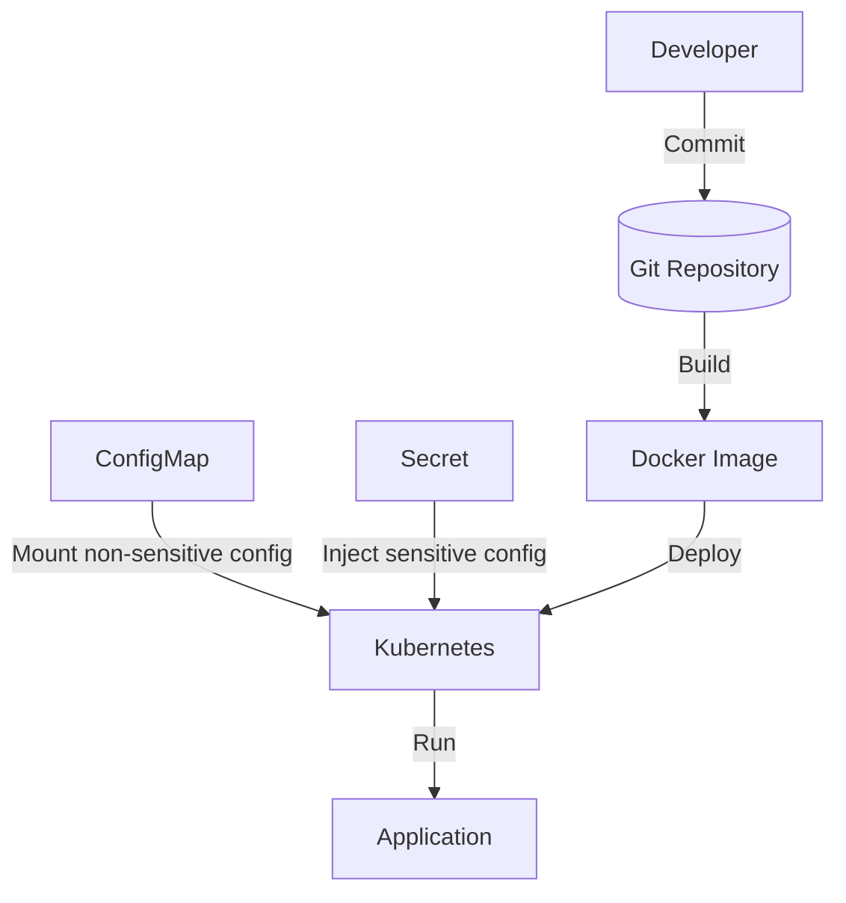
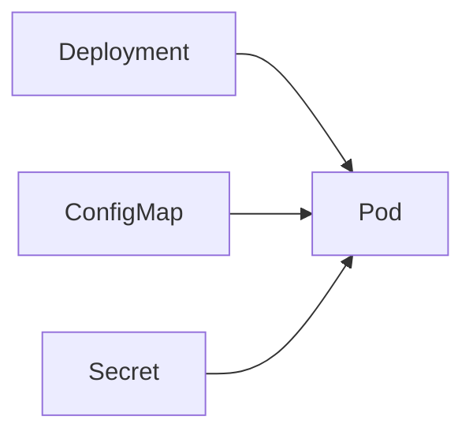

# TSD_15_CONFIGURATION.md

> **Technical Specification Document (TSD)**  
> **Module:** Configuration Management  
> **Project:** Pulse Engine – Product Catalog Service  
> **Version:** 1.0  
> **Status:** Draft

---

# 1. Purpose

Dokumen ini mendefinisikan standar Configuration Management untuk Product Catalog Service.

Tujuan utama:

- Memisahkan konfigurasi dari source code
- Mendukung multi-environment deployment
- Mempermudah deployment automation
- Mendukung Kubernetes
- Mengamankan credential aplikasi
- Mendukung observability dan maintainability

Konfigurasi mengikuti prinsip **Externalized Configuration** sesuai best practice Spring Boot.

---

# 2. Objectives

Configuration harus memenuhi karakteristik berikut.

- Externalized
- Immutable Artifact
- Environment Independent
- Secure
- Version Controlled
- Cloud Native
- Kubernetes Ready

---

# 3. Technology

| Component | Technology |
| ------------ | ------------ |
| Java | 25 |
| Spring Boot | 4.0.7 |
| Spring Framework | 7 |
| Maven | Maven Wrapper |
| PostgreSQL | 16+ |
| Redis | 7+ |
| Flyway | 11.14.1 |
| Spring Security | 7 |
| OAuth2 Resource Server | Spring Security |
| Docker | Latest |
| Kubernetes | 1.30+ |

---

# 4. Configuration Principles

Semua konfigurasi mengikuti prinsip berikut.

- Configuration outside application
- No hardcoded credential
- Environment specific
- Immutable build artifact
- Secrets dipisahkan dari ConfigMap
- Configuration dapat diubah tanpa rebuild image

---

# 5. Environment Strategy

Product Catalog mendukung environment berikut.

| Environment | Purpose |
| ------------ | --------- |
| local | Development |
| dev | Development Server |
| sit | System Integration Test |
| uat | User Acceptance Test |
| staging | Pre Production |
| production | Production |

---

# 6. Configuration Hierarchy

Prioritas konfigurasi.

```text
Command Line

↓

Environment Variable

↓

application-{profile}.yaml

↓

application.yaml

↓

Default Value
```

---

# 7. Configuration Architecture



---

# 8. Project Structure

```text
src/main/resources

├── application.yaml

├── application-local.yaml

├── application-dev.yaml

├── application-sit.yaml

├── application-uat.yaml

├── application-staging.yaml

└── application-production.yaml
```

---

# 9. Base Configuration

```yaml
spring:

  application:

    name: product-catalog

  profiles:

    active: local
```

---

# 10. Server Configuration

```yaml
server:

  port: 8080

  shutdown: graceful

  compression:

    enabled: true
```

---

# 11. Database Configuration

```yaml
spring:

  datasource:

    url: ${DB_URL}

    username: ${DB_USERNAME}

    password: ${DB_PASSWORD}

    driver-class-name: org.postgresql.Driver
```

---

# 12. JPA Configuration

```yaml
spring:

  jpa:

    open-in-view: false

    hibernate:

      ddl-auto: validate

    properties:

      hibernate:

        jdbc:

          batch_size: 50
```

---

# 13. Flyway Configuration

```yaml
spring:

  flyway:

    enabled: true

    locations:

      - classpath:db/migration

    baseline-on-migrate: true
```

---

# 14. Redis Configuration

```yaml
spring:

  data:

    redis:

      host: ${REDIS_HOST}

      port: ${REDIS_PORT}

      password: ${REDIS_PASSWORD}

      timeout: 2s
```

---

# 15. OAuth2 Resource Server

```yaml
spring:

  security:

    oauth2:

      resourceserver:

        jwt:

          issuer-uri: ${JWT_ISSUER}
```

---

# 16. OpenAPI Configuration

```yaml
springdoc:

  api-docs:

    enabled: true

  swagger-ui:

    enabled: true
```

---

# 17. Logging Configuration

```yaml
logging:

  level:

    root: INFO

    com.pulse.catalog: INFO
```

---

# 18. Actuator Configuration

```yaml
management:

  endpoints:

    web:

      exposure:

        include:

          - health

          - info

          - metrics

          - prometheus
```

---

# 19. OpenTelemetry Configuration

```yaml
management:

  tracing:

    enabled: true

  otlp:

    tracing:

      endpoint: ${OTEL_EXPORTER_ENDPOINT}
```

---

# 20. Cache Configuration

```yaml
spring:

  cache:

    type: redis
```

---

# 21. Connection Pool

```yaml
spring:

  datasource:

    hikari:

      maximum-pool-size: 20

      minimum-idle: 5

      connection-timeout: 30000
```

---

# 22. Environment Variables

| Variable | Description |
| ----------- | ------------- |
| DB_URL | PostgreSQL URL |
| DB_USERNAME | Database Username |
| DB_PASSWORD | Database Password |
| REDIS_HOST | Redis Host |
| REDIS_PORT | Redis Port |
| REDIS_PASSWORD | Redis Password |
| JWT_ISSUER | OAuth2 Issuer |
| OTEL_EXPORTER_ENDPOINT | OpenTelemetry Collector |
| LOG_LEVEL | Logging Level |

---

# 23. Secrets Management

Secret **tidak boleh** berada di repository.

Menggunakan:

- Kubernetes Secret
- External Secret Manager
- Environment Variable

Contoh:

```text
DB_PASSWORD

JWT_PRIVATE_KEY

REDIS_PASSWORD
```

---

# 24. ConfigMap

Konfigurasi non-sensitive.

Contoh.

```text
Application Name

Log Level

Cache TTL

OpenAPI Setting
```

---

# 25. Secret

Konfigurasi sensitive.

```text
Database Password

OAuth Secret

JWT Secret

Redis Password
```

---

# 26. Docker Configuration

Docker Image tidak menyimpan konfigurasi environment.

Semua konfigurasi diberikan saat runtime.

```bash
docker run \
-e DB_URL=... \
-e DB_USERNAME=... \
-e DB_PASSWORD=...
```

---

# 27. Kubernetes Configuration



---

# 28. ConfigMap Example

```yaml
apiVersion: v1

kind: ConfigMap

metadata:

  name: product-catalog-config
```

---

# 29. Secret Example

```yaml
apiVersion: v1

kind: Secret

metadata:

  name: product-catalog-secret
```

---

# 30. Spring Profiles

| Profile | Purpose |
| ---------- | ---------- |
| local | Local Development |
| dev | Development |
| sit | SIT |
| uat | UAT |
| staging | Pre Production |
| production | Production |

---

# 31. Feature Flag

Feature Flag bersifat **opsional** (lihat Section 41.3).

Apabila organisasi menggunakan Feature Flag Platform, Product Catalog harus dapat berintegrasi tanpa perubahan Domain Layer.

Versi pertama Product Catalog tidak memiliki dependency terhadap platform Feature Flag tertentu.

---

# 32. Maven Profiles

Maven hanya digunakan untuk build.

Deployment menggunakan Spring Profile.

---

# 33. Configuration Validation

Startup gagal apabila konfigurasi wajib tidak tersedia.

Contoh.

```java
@ConfigurationProperties
@Validated
public record DatabaseProperties(

    @NotBlank
    String url,

    @NotBlank
    String username,

    @NotBlank
    String password

){}
```

---

# 34. Fail Fast Strategy

Application tidak boleh berjalan apabila:

- Database URL kosong
- JWT Issuer kosong
- Redis Host kosong (jika cache diaktifkan)

---

# 35. Configuration Reload

Dynamic Configuration Reload **tidak menjadi requirement aplikasi** (lihat Section 41.4).

Perubahan konfigurasi dilakukan melalui mekanisme deployment atau restart yang dikendalikan oleh platform.

Apabila platform mendukung dynamic reload, aplikasi dapat memanfaatkannya tanpa perubahan pada Domain Layer.

---

# 36. Configuration Security

Tidak diperbolehkan.

- Hardcoded Password
- Hardcoded Token
- Hardcoded Secret

---

# 37. Architectural Decisions

| Decision | Rationale |
| ---------- | ----------- |
| Externalized Configuration | Twelve-Factor App |
| Spring Profile | Multi Environment |
| ConfigMap | Non-sensitive Configuration |
| Secret | Sensitive Configuration |
| Environment Variable | Cloud Native |
| Fail Fast | Menghindari runtime error |

---

# 38. Alternatives Considered

| Alternative | Decision | Reason |
| ------------ | ---------- | -------- |
| Hardcoded Configuration | Tidak dipilih | Tidak aman |
| Multiple Docker Image | Tidak dipilih | Sulit dipelihara |
| Custom Config Service | Tidak dipilih | Tidak diperlukan oleh BRD |
| Property File per Build | Tidak dipilih | Tidak cloud-native |
| Database Configuration Store | Tidak dipilih | Menambah kompleksitas |

---

# 39. Technical Risks

| Risk | Mitigation |
| ------ | ------------ |
| Secret Bocor | Kubernetes Secret |
| Environment Tidak Konsisten | Spring Profile |
| Salah Konfigurasi | Configuration Validation |
| Runtime Failure | Fail Fast |
| Configuration Drift | Git Version Control |

---

# 40. Recommendations

1. Gunakan satu Docker Image untuk seluruh environment.
2. Simpan seluruh credential di Secret Manager atau Kubernetes Secret.
3. Gunakan Spring Profile hanya untuk membedakan environment, bukan business behavior.
4. Terapkan validasi konfigurasi menggunakan `@ConfigurationProperties` dan `@Validated`.
5. Hindari penggunaan nilai default untuk konfigurasi sensitif agar kesalahan konfigurasi dapat terdeteksi saat startup.

---

# 41. Configuration Governance

Poin-poin berikut merupakan **Platform Configuration Decisions**. Product Catalog tidak mengunci organisasi pada produk tertentu, tetapi mendefinisikan capability yang dibutuhkan.

## 41.1 Secret Management

### Keputusan

Product Catalog tidak menyimpan secret di source code maupun file konfigurasi.

Seluruh secret harus dikelola oleh Secret Management Platform yang mendukung injection ke aplikasi.

Platform yang didukung antara lain:

- HashiCorp Vault
- AWS Secrets Manager
- Azure Key Vault
- Google Secret Manager
- Kubernetes Secret
- Enterprise Secret Management lain yang setara

Contoh secret:

- Database Password
- Redis Password
- OAuth2 Client Secret
- JWT Public Key (jika diperlukan)
- API Key

### Rationale

- Menghindari hardcoded secret.
- Mengurangi risiko kebocoran credential.
- Mendukung rotasi secret tanpa perubahan kode.

**Status:** ✅ Resolved

---

## 41.2 Configuration Management

### Keputusan

Product Catalog menggunakan externalized configuration sesuai prinsip Twelve-Factor App.

Konfigurasi dapat berasal dari:

- Environment Variable
- Kubernetes ConfigMap
- Spring Configuration Import
- Spring Cloud Config (opsional)

Aplikasi tidak bergantung pada Configuration Server tertentu.

### Rationale

- Vendor agnostic.
- Mendukung berbagai model deployment.
- Mempermudah CI/CD.

**Status:** ✅ Resolved

---

## 41.3 Feature Flag

### Keputusan

Feature Flag bersifat opsional.

Apabila organisasi menggunakan Feature Flag Platform, Product Catalog harus dapat berintegrasi tanpa perubahan Domain Layer.

Platform yang dapat digunakan:

- OpenFeature
- Unleash
- LaunchDarkly
- Azure App Configuration
- ConfigCat

Versi pertama Product Catalog tidak memiliki dependency terhadap platform Feature Flag tertentu.

### Rationale

Feature Flag merupakan capability platform, bukan requirement bisnis.

**Status:** ✅ Resolved

---

## 41.4 Dynamic Configuration Reload

### Keputusan

Dynamic Configuration Reload tidak menjadi requirement aplikasi.

Perubahan konfigurasi dilakukan melalui mekanisme deployment atau restart yang dikendalikan oleh platform.

Apabila platform mendukung dynamic reload (misalnya Spring Cloud Config atau Kubernetes Reload Controller), aplikasi dapat memanfaatkannya tanpa perubahan pada Domain Layer.

### Rationale

- Mengurangi kompleksitas implementasi.
- Menjaga konsistensi konfigurasi selama runtime.
- Menghindari perubahan perilaku aplikasi yang tidak terkontrol.

**Status:** ✅ Resolved

---

## 41.5 Configuration Encryption

### Keputusan

Nilai konfigurasi yang bersifat sensitif wajib disimpan dalam bentuk terenkripsi atau dikelola oleh Secret Manager.

Product Catalog tidak mengimplementasikan mekanisme enkripsi konfigurasi sendiri.

Contoh konfigurasi sensitif:

- Database Password
- Redis Password
- OAuth Client Secret
- API Key

Contoh konfigurasi non-sensitif:

- Server Port
- Pagination Default
- Cache TTL
- Logging Level

### Rationale

- Memisahkan konfigurasi sensitif dan non-sensitif.
- Mengikuti praktik keamanan enterprise.
- Memanfaatkan kemampuan platform.

**Status:** ✅ Resolved

---

## 41.6 Configuration Hierarchy

Prioritas konfigurasi mengikuti urutan Spring Boot:

```text
application.yml
        ↓
Environment Variable
        ↓
Config Import (optional)
        ↓
Secret Manager
```

Prioritas Spring Boot:

1. Environment Variable
2. JVM System Property
3. External Configuration (`application.yml`)
4. Default Configuration

Dengan demikian perilaku aplikasi tetap konsisten di semua environment.

---

# 42. Configuration Governance Summary

| Area | Decision |
|------|----------|
| Configuration Style | Externalized Configuration |
| Secret Storage | Secret Management Platform |
| Configuration Source | Environment Variable / ConfigMap / Config Import |
| Configuration Server | Opsional, Vendor Agnostic |
| Feature Flag | Opsional, Vendor Agnostic |
| Dynamic Reload | Platform Capability |
| Sensitive Configuration | Secret Manager |
| Non-Sensitive Configuration | Environment Variable / ConfigMap |
| Encryption | Platform Managed |

---

# 43. Traceability

| BRD | FSD | Configuration | Component | Test Case |
| ----- | ----- | -------------- | ----------- | ----------- |
| Database | NFR | Datasource | Spring Boot | TC-CONF-001 |
| Cache | TSD-08 | Redis | Redis Configuration | TC-CONF-002 |
| Security | FSD-06 | OAuth2 | Resource Server | TC-CONF-003 |
| Logging | TSD-11 | Logging | Logback | TC-CONF-004 |
| Observability | TSD-12 | Actuator | Spring Actuator | TC-CONF-005 |

---

# 44. Next Document

**TSD_16_DEPLOYMENT.md**

Dokumen berikut akan membahas:

- Deployment Architecture
- Dockerfile
- Multi-stage Build
- Kubernetes Deployment
- Service
- Ingress
- Horizontal Pod Autoscaler (HPA)
- Resource Request & Limit
- Rolling Update Strategy
- High Availability
- Backup & Recovery
- Disaster Recovery
- CI/CD Pipeline
- Production Readiness Checklist
