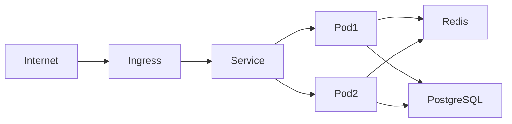
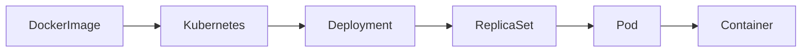
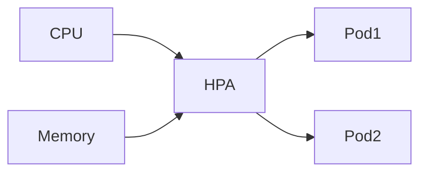
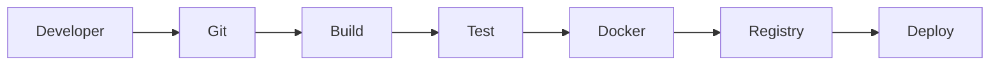

# TSD_16_DEPLOYMENT.md

> **Technical Specification Document (TSD)**  
> **Module:** Deployment Architecture  
> **Project:** Pulse Engine – Product Catalog Service  
> **Version:** 1.0  
> **Status:** Draft

---

# 1. Purpose

Dokumen ini mendefinisikan standar deployment Product Catalog Service pada environment enterprise yang berbasis container dan Kubernetes.

Deployment dirancang agar memenuhi karakteristik berikut:

- Highly Available
- Stateless
- Cloud Native
- Scalable
- Observable
- Secure
- Production Ready

Dokumen ini menjadi acuan bagi:

- DevOps Engineer
- Platform Engineer
- SRE
- Solution Architect
- Backend Engineer

---

# 2. Objectives

Deployment harus mampu:

- Mendukung Zero Downtime Deployment
- Mendukung Horizontal Scaling
- Mendukung Rolling Update
- Mendukung Health Check
- Mendukung Auto Recovery
- Mendukung Disaster Recovery
- Mendukung Observability
- Mendukung Immutable Deployment

---

# 3. Deployment Principles

Product Catalog mengikuti prinsip berikut.

- Immutable Container
- Externalized Configuration
- Stateless Service
- Twelve-Factor App
- Infrastructure as Code
- Container First
- Kubernetes Native

---

# 4. Deployment Architecture



---

# 5. Runtime Architecture



---

# 6. Technology

| Component | Technology |
| ------------ | ------------ |
| Java | 25 |
| Spring Boot | 4.0.7 |
| Maven | Wrapper |
| Docker | Latest |
| Kubernetes | 1.30+ |
| PostgreSQL | 16+ |
| Redis | 7+ |
| Prometheus | Latest |
| OpenTelemetry | Latest |

---

# 7. Deployment Topology

```text
Internet

↓

Ingress Controller

↓

Kubernetes Service

↓

Product Catalog Pods

↓

Redis

↓

PostgreSQL
```

---

# 8. Docker Strategy

Menggunakan Multi-stage Build.

Tahapan:

1. Maven Build
2. Runtime Image

Runtime image hanya berisi:

- JAR
- JRE
- Configuration

Tidak mengandung:

- Source Code
- Maven Repository
- Build Tool

---

# 9. Dockerfile

```dockerfile
FROM maven:3.9-eclipse-temurin-25 AS build

WORKDIR /workspace

COPY . .

RUN ./mvnw clean package -DskipTests

FROM eclipse-temurin:25-jre

WORKDIR /application

COPY --from=build \
target/product-catalog.jar \
application.jar

ENTRYPOINT [

"java",

"-jar",

"application.jar"

]
```

---

# 10. Docker Image Naming

```
pulse-engine

↓

product-catalog

↓

1.0.0
```

Contoh.

```
pulse-engine/product-catalog:1.0.0
```

---

# 11. Kubernetes Deployment

Menggunakan:

- Deployment
- Service
- Ingress
- ConfigMap
- Secret

---

# 12. Deployment Manifest

```yaml
apiVersion: apps/v1

kind: Deployment

metadata:

  name: product-catalog
```

---

# 13. Replica Strategy

Minimum.

```
2 Replica
```

Tujuan:

- High Availability
- Rolling Update
- Zero Downtime

---

# 14. Rolling Update

Deployment Strategy.

```yaml
strategy:

  type: RollingUpdate
```

---

# 15. Rolling Update Policy

| Property | Value |
| ------------ | -------- |
| maxUnavailable | 0 |
| maxSurge | 1 |

---

# 16. Service

Menggunakan.

```
ClusterIP
```

Karena hanya diakses melalui Ingress.

---

# 17. Ingress

Contoh.

```
api.company.com

↓

product-catalog
```

TLS wajib diaktifkan.

---

# 18. Resource Request

Rekomendasi awal.

```yaml
resources:

  requests:

    cpu: 500m

    memory: 512Mi
```

---

# 19. Resource Limit

```yaml
resources:

  limits:

    cpu: "2"

    memory: 2Gi
```

Nilai akhir harus divalidasi melalui load test.

---

# 20. Horizontal Pod Autoscaler



---

# 21. Autoscaling Policy

Contoh.

| Metric | Target |
| --------- | --------- |
| CPU | 70% |
| Memory | 75% |

Nilai final mengikuti hasil capacity planning.

---

# 22. Health Check

Menggunakan Spring Boot Actuator.

Liveness

```
/actuator/health/liveness
```

Readiness

```
/actuator/health/readiness
```

---

# 23. Startup Probe

Direkomendasikan.

Digunakan untuk startup yang membutuhkan waktu lebih lama.

---

# 24. Graceful Shutdown

```yaml
server:

  shutdown: graceful
```

Spring Boot akan menyelesaikan request aktif sebelum container dihentikan.

---

# 25. Configuration Management

Konfigurasi berasal dari:

- ConfigMap
- Secret
- Environment Variable

Tidak berasal dari Docker Image.

---

# 26. Secret Management

Credential.

- Database Password
- Redis Password
- JWT Secret

Disimpan pada Kubernetes Secret atau Secret Manager organisasi.

---

# 27. Logging

Log dikirim ke stdout.

Container tidak menyimpan file log lokal.

```text
Application

↓

stdout

↓

Fluent Bit / Vector

↓

Centralized Logging
```

---

# 28. Monitoring

Monitoring menggunakan.

- Prometheus
- Grafana
- OpenTelemetry

---

# 29. Backup Strategy

Database backup berada di luar Product Catalog Service.

Backup aplikasi tidak diperlukan karena service bersifat stateless.

---

# 30. Disaster Recovery

Product Catalog dapat dipulihkan melalui:

1. Redeploy Application
2. Restore Database
3. Restore Redis (opsional)
4. Restore Configuration

---

# 31. CI/CD Pipeline



---

# 32. Deployment Flow

```mermaid
sequenceDiagram

Developer->>Git

Git->>CI

CI->>Build

Build->>Unit Test

Unit Test->>Docker

Docker->>Registry

Registry->>Kubernetes

Kubernetes-->>Application
```

---

# 33. Deployment Validation

Sebelum deployment.

- Unit Test
- Integration Test
- Flyway Validation
- Security Scan
- Container Scan

---

# 34. Production Readiness Checklist

| Item | Status |
| ------ | -------- |
| Health Check | Required |
| Readiness Probe | Required |
| Liveness Probe | Required |
| Metrics | Required |
| Tracing | Required |
| Logging | Required |
| TLS | Required |
| Secret | Required |
| Flyway | Required |
| OpenAPI | Required |

---

# 35. High Availability

Minimal deployment.

```text
2 Pod

↓

1 Redis

↓

1 PostgreSQL
```

High Availability Redis dan PostgreSQL mengikuti standar infrastruktur organisasi.

---

# 36. Upgrade Strategy

Menggunakan.

```
Rolling Update
```

Tidak menggunakan.

```
Recreate
```

karena menyebabkan downtime.

---

# 37. Rollback Strategy

Jika deployment gagal.

```
Deployment

↓

Rollback

↓

Previous Version
```

Rollback dilakukan oleh Kubernetes Deployment.

---

# 38. Architectural Decisions

| Decision | Rationale |
| ---------- | ----------- |
| Kubernetes | Cloud Native |
| Stateless Service | Horizontal Scaling |
| Multi-stage Docker Build | Image lebih kecil dan aman |
| Rolling Update | Zero Downtime |
| ConfigMap & Secret | Externalized Configuration |
| HPA | Otomatis menyesuaikan beban |

---

# 39. Alternatives Considered

| Alternative | Decision | Reason |
| ------------ | ---------- | -------- |
| VM Deployment | Tidak dipilih | Tidak cloud-native |
| Docker Compose Production | Tidak dipilih | Tidak mendukung orchestration |
| Recreate Deployment | Tidak dipilih | Menyebabkan downtime |
| Single Replica | Tidak dipilih | Tidak memenuhi high availability |
| Embedded Configuration | Tidak dipilih | Sulit dipelihara dan tidak aman |

---

# 40. Technical Risks

| Risk | Mitigation |
| ------ | ------------ |
| Pod Crash | Kubernetes Restart Policy |
| Node Failure | Replica Deployment |
| Configuration Error | Configuration Validation |
| Secret Leakage | Kubernetes Secret |
| Image Vulnerability | Container Security Scan |
| Database Failure | Backup & Recovery Procedure |

---

# 41. Recommendations

1. Gunakan immutable Docker image untuk seluruh environment.
2. Terapkan rolling update dengan minimal dua replica pada production.
3. Jalankan Flyway migration sebagai bagian dari deployment pipeline sebelum aplikasi menerima traffic.
4. Gunakan resource request dan limit sebagai baseline, kemudian sesuaikan berdasarkan hasil load test.
5. Integrasikan deployment pipeline dengan security scanning, dependency scanning, dan container image scanning.

---

# 42. Requires Functional Clarification

| Item | Status |
| ------ | -------- |
| Container Registry yang digunakan | Requires Functional Clarification |
| CI/CD Platform (GitHub Actions, GitLab CI, Jenkins, Azure DevOps, dll.) | Requires Functional Clarification |
| Ingress Controller (NGINX, Traefik, Istio, dll.) | Requires Functional Clarification |
| Service Mesh | Requires Functional Clarification |
| Secret Management Platform | Requires Functional Clarification |
| Multi Region Deployment | Requires Functional Clarification |
| Disaster Recovery RTO/RPO | Requires Functional Clarification |

---

# 43. Traceability

| BRD | FSD | Deployment | Component | Test Case |
| ----- | ----- | ------------ | ----------- | ----------- |
| Availability | NFR | Multi Replica | Kubernetes Deployment | TC-DEP-001 |
| Configuration | TSD-15 | ConfigMap & Secret | Kubernetes | TC-DEP-002 |
| Monitoring | TSD-12 | Prometheus | Actuator | TC-DEP-003 |
| Logging | TSD-11 | stdout Logging | Logback | TC-DEP-004 |
| Database Migration | TSD-03 | Flyway | Spring Boot | TC-DEP-005 |

---

# 44. Next Document

**TSD_17_TESTING.md**

Dokumen berikut akan membahas:

- Testing Strategy
- Test Pyramid
- Unit Testing
- Integration Testing
- Repository Testing
- API Testing
- Architecture Testing
- Contract Testing
- Mutation Testing
- Performance Testing
- Security Testing
- Testcontainers
- Code Coverage Target
- CI/CD Quality Gate
- Production Verification
