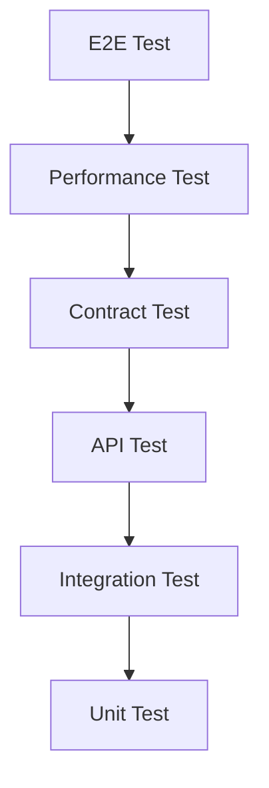
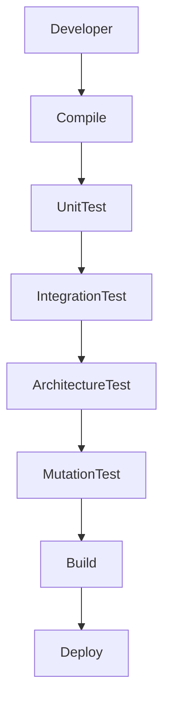

# TSD_17_TESTING.md

> **Technical Specification Document (TSD)**  
> **Module:** Testing Strategy  
> **Project:** Pulse Engine – Product Catalog Service  
> **Version:** 1.0  
> **Status:** Draft

---

# 1. Purpose

Dokumen ini mendefinisikan strategi pengujian untuk memastikan Product Catalog Service memenuhi seluruh Functional Requirement (FR), Business Rule (BR), dan Non-Functional Requirement (NFR) sebelum dipromosikan ke Production.

Dokumen ini menjadi acuan bagi:

- Backend Engineer
- QA Engineer
- Solution Architect
- DevOps Engineer
- SRE

---

# 2. Objectives

Testing bertujuan untuk memastikan:

- Business Requirement diimplementasikan dengan benar
- Business Rule tidak mengalami regresi
- API sesuai kontrak OpenAPI
- Database konsisten
- Integrasi berjalan dengan baik
- Performa memenuhi target
- Arsitektur tetap sesuai standar
- Deployment aman dilakukan

---

# 3. Testing Principles

Product Catalog mengikuti prinsip berikut:

- Shift Left Testing
- Test Automation First
- Repeatable Test
- Independent Test
- Deterministic Test
- Fast Feedback
- Production-like Environment

---

# 4. Testing Pyramid



---

# 5. Testing Scope

| Layer | Test |
|---------|------|
| Domain | Unit Test |
| Application | Unit Test |
| Repository | Repository Test |
| REST API | API Test |
| Security | Security Test |
| Database | Integration Test |
| Cache | Integration Test |
| Architecture | Architecture Test |
| Performance | Load Test |
| Deployment | Smoke Test |

---

# 6. Unit Testing

## Purpose

Memastikan business logic berjalan dengan benar.

Target:

- Aggregate
- Entity
- Domain Service
- Value Object

---

Contoh.

```java
@Test

void shouldPublishProductSuccessfully() {

}
```

---

# 7. Unit Test Coverage

Minimal mencakup:

- Business Rule
- Domain Validation
- Versioning
- State Transition
- Factory
- Mapper

---

# 8. Mocking Strategy

Gunakan:

- Mockito

Mock hanya untuk:

- Repository
- External Port
- Clock
- UUID Generator

Jangan mock Domain Object.

---

# 9. Integration Testing

Integration Test menguji:

- Spring Context
- PostgreSQL
- Redis
- Flyway
- Repository
- REST Controller

---

# 10. Testcontainers

Seluruh Integration Test menggunakan Testcontainers.

```java
@PostgreSQLContainer

@Container

static PostgreSQLContainer<?> postgres =
        new PostgreSQLContainer<>("postgres:16");
```

---

# 11. Repository Testing

Repository diuji terhadap database nyata menggunakan Testcontainers.

Yang diuji:

- CRUD
- Search
- Pagination
- Optimistic Lock
- Constraint
- Soft Delete

---

# 12. API Testing

API diuji menggunakan:

- Spring MockMvc
- WebTestClient
- RestAssured

Disesuaikan dengan standar organisasi.

---

# 13. API Test Scope

Seluruh endpoint diuji.

Contoh.

| API | Test |
|------|------|
| Create Company | ✔ |
| Update Company | ✔ |
| Publish Company | ✔ |
| Create Product | ✔ |
| Publish Product | ✔ |
| Search Product | ✔ |
| Product Detail | ✔ |
| Version History | ✔ |

---

# 14. Validation Testing

Yang diuji.

- Required Field
- Invalid Format
- Duplicate Data
- Business Validation
- Publish Validation

---

# 15. Business Rule Testing

Seluruh Business Rule pada:

```
TSD_05_BUSINESS_RULE_IMPLEMENTATION.md
```

harus memiliki minimal satu test case.

---

# 16. Security Testing

Pengujian meliputi.

- Authentication
- Authorization
- JWT Validation
- Role Validation
- Access Denied

---

# 17. Cache Testing

Yang diuji.

- Cache Hit
- Cache Miss
- Cache Eviction
- Cache Refresh

---

# 18. Optimistic Lock Testing

Scenario.

```
User A

↓

Update

↓

User B

↓

Update

↓

409 Conflict
```

---

# 19. Versioning Testing

Scenario.

- Publish Product
- Create New Version
- Historical Version
- Immutable Version

---

# 20. State Machine Testing

Yang diuji.

```
Draft

↓

Ready

↓

Published

↓

Archived
```

Invalid transition harus menghasilkan exception.

---

# 21. Contract Testing

Menggunakan:

- Spring Cloud Contract
- Pact

Status implementasi mengikuti standar organisasi.

---

# 22. Architecture Testing

Menggunakan ArchUnit.

Contoh.

```java
classes()

.should()

.resideInAPackage("..domain..");
```

---

# 23. Architecture Rules

Yang diuji.

- Domain tidak bergantung pada Infrastructure
- Adapter tidak mengakses Entity secara langsung
- Dependency mengikuti Hexagonal Architecture

---

# 24. Mutation Testing

Menggunakan PIT Mutation Testing.

Target.

```
>= 80%
```

---

# 25. Code Coverage

| Layer | Target |
|---------|--------|
| Domain | 95% |
| Application | 90% |
| Repository | 80% |
| API | 85% |
| Overall | ≥ 85% |

---

# 26. Performance Testing

Jenis.

- Load Test
- Stress Test
- Spike Test
- Endurance Test

---

# 27. Load Test Target

| API | Target |
|------|---------|
| Product Search | 500 RPS |
| Product Detail | 1000 RPS |
| Create Product | 50 RPS |
| Publish Product | 50 RPS |

Nilai harus divalidasi pada environment yang representatif.

---

# 28. Smoke Test

Dilakukan setelah deployment.

Minimal.

- Health Check
- Database Connection
- Redis Connection
- Product Search
- Product Detail

---

# 29. Regression Testing

Dilakukan setiap:

- Release
- Hotfix
- Minor Version
- Major Version

---

# 30. Test Data Management

Menggunakan:

- Flyway Baseline
- SQL Seed
- Testcontainers

Test tidak bergantung pada database bersama.

---

# 31. CI/CD Quality Gate

Pipeline gagal apabila:

- Unit Test gagal
- Integration Test gagal
- Mutation Test di bawah threshold
- Coverage di bawah target
- Sonar Quality Gate gagal

---

# 32. SonarQube Rules

Minimal.

- No Blocker Issue
- No Critical Issue
- Coverage sesuai target
- Security Rating A
- Maintainability Rating A

---

# 33. Static Analysis

Menggunakan.

- SonarQube
- SpotBugs
- Checkstyle

Sesuai standar organisasi.

---

# 34. Test Execution Flow



---

# 35. Test Environment

| Environment | Purpose |
|-------------|---------|
| Local | Developer |
| Dev | Daily Integration |
| SIT | Integration |
| UAT | Business Validation |
| Production | Smoke Test Only |

---

# 36. Test Case Traceability

Setiap test harus dapat ditelusuri.

```
BRD

↓

FSD

↓

Business Rule

↓

API

↓

Test Case
```

---

# 37. Test Naming Convention

```
TC-COMP-001

TC-PROD-001

TC-API-001

TC-SEC-001

TC-CACHE-001
```

---

# 38. Test Report

Minimal memuat.

- Total Test
- Passed
- Failed
- Skipped
- Coverage
- Mutation Score
- Execution Time

---

# 39. Architectural Decisions

| Decision | Rationale |
|----------|-----------|
| Testcontainers | Environment Konsisten |
| ArchUnit | Menjaga Arsitektur |
| PIT | Mengukur Kualitas Test |
| SonarQube | Static Quality Gate |
| MockMvc/WebTestClient | REST API Testing |
| Mockito | Isolasi Unit Test |

---

# 40. Alternatives Considered

| Alternative | Decision | Reason |
|------------|----------|--------|
| Shared Development Database | Tidak dipilih | Tidak deterministik |
| Manual Testing Only | Tidak dipilih | Tidak scalable |
| H2 Database | Tidak dipilih | Berbeda dengan PostgreSQL |
| In-Memory Redis Mock | Tidak dipilih | Tidak merepresentasikan production |
| Tanpa Mutation Testing | Tidak dipilih | Sulit mengukur efektivitas test |

---

# 41. Technical Risks

| Risk | Mitigation |
|------|------------|
| Flaky Test | Isolasi Test |
| Shared Data | Testcontainers |
| Low Coverage | Quality Gate |
| Architecture Drift | ArchUnit |
| Slow Test | Parallel Execution |
| False Positive | Stable Test Data |

---

# 42. Recommendations

1. Seluruh business rule wajib memiliki unit test.
2. Gunakan PostgreSQL dan Redis melalui Testcontainers, bukan embedded database.
3. Jalankan Architecture Test pada setiap Pull Request.
4. Jadikan SonarQube sebagai mandatory quality gate.
5. Jalankan Load Test sebelum setiap major release.

---

# 43. Requires Functional Clarification

| Item | Status |
|------|--------|
| Performance Test Tool (k6, Gatling, JMeter) | Requires Functional Clarification |
| Contract Test Framework Resmi | Requires Functional Clarification |
| SonarQube Quality Gate Organisasi | Requires Functional Clarification |
| Security Testing Tool | Requires Functional Clarification |
| Penetration Test Requirement | Requires Functional Clarification |
| UAT Acceptance Criteria | Requires Functional Clarification |

---

# 44. Traceability

| BRD | FSD | Test Type | Component | Test Case |
|-----|-----|-----------|-----------|-----------|
| Company Management | FSD-01 | API Test | Company Controller | TC-COMP-001 |
| Product Management | FSD-02 | Unit Test | Product Aggregate | TC-PROD-001 |
| Product Configuration | FSD-03 | Integration Test | Repository | TC-CONF-001 |
| Product Query | FSD-04 | Performance Test | Query API | TC-QUERY-001 |
| Versioning | FSD-05 | Unit Test | Version Aggregate | TC-VERSION-001 |
| Security | FSD-06 | Security Test | Security Filter | TC-SEC-001 |
| Integration | FSD-07 | Contract Test | REST API | TC-INT-001 |
| Validation | FSD-09 | Validation Test | Validator | TC-VAL-001 |

---

# 45. Next Document

**TSD_18_NFR_MAPPING.md**

Dokumen berikut akan membahas:

- Non-Functional Requirement Mapping
- Availability
- Reliability
- Scalability
- Maintainability
- Security
- Performance
- Observability
- Compliance
- Recoverability
- Technical Solution Mapping
- Verification Strategy
- Monitoring Strategy