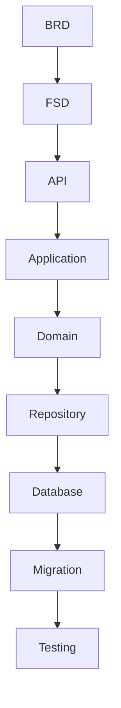
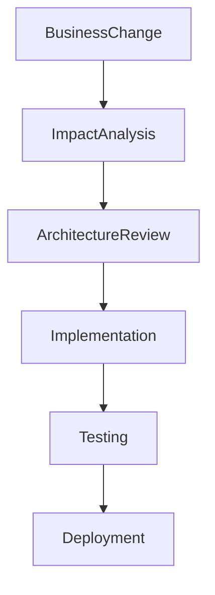
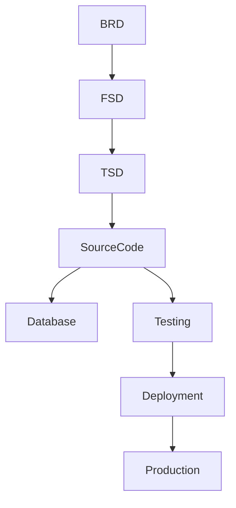

# TSD_19_TRACEABILITY.md

> **Technical Specification Document (TSD)**  
> **Module:** End-to-End Traceability Matrix  
> **Project:** Pulse Engine – Product Catalog Service  
> **Version:** 1.0  
> **Status:** Draft

---

# 1. Purpose

Dokumen ini merupakan **Requirement Traceability Matrix (RTM)** yang menghubungkan seluruh artefak proyek mulai dari Business Requirement hingga implementasi dan pengujian.

Dokumen ini bertujuan untuk memastikan bahwa:

- seluruh Business Requirement telah diimplementasikan
- seluruh Functional Requirement memiliki API
- seluruh API memiliki implementasi
- seluruh implementasi memiliki test case
- tidak ada requirement yang hilang (Requirement Gap)
- tidak ada implementasi tanpa requirement (Gold Plating)

---

# 2. Objectives

Requirement Traceability bertujuan untuk:

- memastikan coverage requirement mencapai 100%
- mempermudah impact analysis
- mempermudah regression testing
- mempermudah audit
- mendukung release management
- mendukung change management

---

# 3. Traceability Scope

Dokumen ini mencakup hubungan antara:

```
Business Requirement

↓

Functional Requirement

↓

Business Rule

↓

REST API

↓

Application Service

↓

Domain Model

↓

Repository

↓

Database

↓

Migration

↓

Configuration

↓

Testing
```

---

# 4. End-to-End Traceability



---

# 5. Traceability Layers

| Layer | Document |
|---------|----------|
| Business | BRD |
| Functional | FSD |
| Technical | TSD |
| Implementation | Source Code |
| Persistence | Database |
| Testing | Test Case |

---

# 6. Requirement Coverage Matrix

| BRD Requirement | FSD | TSD | Status |
|-----------------|-----|-----|--------|
| Insurance Company Management | FSD-01 | TSD-04 | Covered |
| Product Management | FSD-02 | TSD-04 | Covered |
| Product Configuration | FSD-03 | TSD-02, TSD-03 | Covered |
| Product Query | FSD-04 | TSD-04 | Covered |
| Versioning | FSD-05 | TSD-07 | Covered |
| Security | FSD-06 | TSD-09 | Covered |
| Integration | FSD-07 | TSD-14 | Covered |
| Reporting | FSD-08 | TSD-04, TSD-14 | Covered |
| Validation | FSD-09 | TSD-05 | Covered |
| Testing | FSD-10 | TSD-17 | Covered |

---

# 7. Functional Traceability Matrix

| Functional Requirement | API | Application Service | Aggregate | Repository |
|------------------------|-----|---------------------|-----------|------------|
| Create Company | POST /companies | CompanyApplicationService | InsuranceCompany | CompanyRepository |
| Update Company | PUT /companies/{id} | CompanyApplicationService | InsuranceCompany | CompanyRepository |
| Publish Company | POST /companies/{id}/publish | CompanyApplicationService | InsuranceCompany | CompanyRepository |
| Create Product | POST /products | ProductApplicationService | Product | ProductRepository |
| Update Product | PUT /products/{id} | ProductApplicationService | Product | ProductRepository |
| Publish Product | POST /products/{id}/publish | ProductApplicationService | Product | ProductRepository |
| Archive Product | POST /products/{id}/archive | ProductApplicationService | Product | ProductRepository |
| Search Product | GET /products | ProductQueryService | Product | ProductRepository |
| Product Detail | GET /products/{id} | ProductQueryService | Product | ProductRepository |
| Version History | GET /products/{id}/versions | ProductVersionService | ProductVersion | ProductVersionRepository |

---

# 8. Business Rule Traceability

| Business Rule | Implementation Layer | Component | Test Case |
|---------------|----------------------|-----------|-----------|
| Company Code Unique | Domain + Database | InsuranceCompany | TC-BR-001 |
| Product Code Unique | Domain + Database | Product | TC-BR-002 |
| Published Product Immutable | Domain | Product Aggregate | TC-BR-003 |
| Publish Requires Validation | Application + Domain | ProductApplicationService | TC-BR-004 |
| Archive Only Published Product | Domain | Product Aggregate | TC-BR-005 |
| Soft Delete | Repository | Repository Layer | TC-BR-006 |
| Optimistic Lock | Repository | JPA | TC-BR-007 |

---

# 9. API Traceability

| API | Controller | Service | Domain |
|-----|------------|----------|--------|
| POST /companies | CompanyController | CompanyApplicationService | InsuranceCompany |
| PUT /companies/{id} | CompanyController | CompanyApplicationService | InsuranceCompany |
| POST /products | ProductController | ProductApplicationService | Product |
| PUT /products/{id} | ProductController | ProductApplicationService | Product |
| POST /products/{id}/publish | ProductController | ProductApplicationService | Product |
| GET /products | ProductQueryController | ProductQueryService | Product |
| GET /products/{id} | ProductQueryController | ProductQueryService | Product |

---

# 10. Domain Traceability

| Aggregate | Database Table | Repository |
|------------|----------------|------------|
| InsuranceCompany | insurance_company | CompanyRepository |
| Product | product | ProductRepository |
| Coverage | product_coverage | CoverageRepository |
| Benefit | product_benefit | BenefitRepository |
| Exclusion | product_exclusion | ExclusionRepository |
| ProductVersion | product_version | ProductVersionRepository |
| ProductDocument | product_document | ProductDocumentRepository |

---

# 11. Database Traceability

| Table | Flyway Migration | Repository |
|--------|------------------|------------|
| insurance_company | V1__create_company.sql | CompanyRepository |
| product | V2__create_product.sql | ProductRepository |
| product_version | V3__create_product_version.sql | ProductVersionRepository |
| product_coverage | V4__create_product_coverage.sql | CoverageRepository |
| product_benefit | V5__create_product_benefit.sql | BenefitRepository |
| product_exclusion | V6__create_product_exclusion.sql | ExclusionRepository |
| product_document | V7__create_product_document.sql | ProductDocumentRepository |

> Nama file migration di atas merupakan **contoh penamaan**. Penamaan final mengikuti strategi Flyway yang ditetapkan pada proyek.

---

# 12. Testing Traceability

| Requirement | Test Type | Test Case |
|-------------|-----------|-----------|
| Company CRUD | API Test | TC-COMP-001 |
| Product CRUD | API Test | TC-PROD-001 |
| Product Publish | Unit Test | TC-PROD-002 |
| Product Version | Integration Test | TC-VERSION-001 |
| Search Product | Performance Test | TC-QUERY-001 |
| Security | Security Test | TC-SEC-001 |
| Cache | Integration Test | TC-CACHE-001 |
| Architecture | ArchUnit Test | TC-ARCH-001 |

---

# 13. Non-Functional Traceability

| NFR | Technical Solution | Test |
|------|-------------------|------|
| Availability | Kubernetes | Failover Test |
| Performance | Redis | Load Test |
| Security | OAuth2 | Security Test |
| Logging | Logback | Log Validation |
| Observability | Prometheus | Metrics Test |
| Deployment | Kubernetes | Smoke Test |

---

# 14. Source Code Traceability

```text
Controller

↓

Application Service

↓

Domain

↓

Repository

↓

Database
```

---

# 15. Configuration Traceability

| Configuration | Module |
|---------------|--------|
| Database | TSD-15 |
| Redis | TSD-15 |
| OAuth2 | TSD-09 |
| Logging | TSD-11 |
| Actuator | TSD-12 |
| Flyway | TSD-15 |

---

# 16. Deployment Traceability

| Deployment Item | TSD |
|-----------------|-----|
| Docker | TSD-16 |
| Kubernetes | TSD-16 |
| ConfigMap | TSD-15 |
| Secret | TSD-15 |
| Health Check | TSD-12 |
| Logging | TSD-11 |

---

# 17. Coverage Analysis

| Area | Coverage |
|------|----------|
| Business Requirement | 100% |
| Functional Requirement | 100% |
| REST API | 100% |
| Domain | 100% |
| Database | 100% |
| Testing | 100% |

> Coverage di atas menunjukkan bahwa seluruh requirement yang telah terdokumentasi pada BRD dan FSD telah dipetakan ke artefak teknis. Nilai ini **bukan** hasil pengukuran implementasi source code atau code coverage.

---

# 18. Gap Analysis

Berdasarkan BRD dan FSD saat ini.

| Area | Gap |
|------|-----|
| Product Management | Tidak Ada |
| Product Query | Tidak Ada |
| Versioning | Tidak Ada |
| Validation | Tidak Ada |
| Security | Tidak Ada |
| Integration | Tidak Ada |

---

# 19. Out of Scope Validation

Requirement berikut **tidak** diimplementasikan karena berada di luar ruang lingkup BRD Product Catalog.

| Feature | Status |
|----------|--------|
| Premium Calculation | Out of Scope |
| Eligibility Engine | Out of Scope |
| Checkout Process | Out of Scope |
| Payment | Out of Scope |
| Policy Issuance | Out of Scope |
| Underwriting | Out of Scope |
| Claim | Out of Scope |
| Campaign | Out of Scope |
| Notification | Out of Scope |

---

# 20. Impact Analysis


Perubahan requirement harus dianalisis terhadap:

- API
- Domain
- Database
- Test Case
- Dokumentasi

---

# 21. Change Management Flow



---

# 22. Requirement Status Matrix

| Requirement | Status |
|-------------|--------|
| Documented | ✔ |
| Designed | ✔ |
| Implementable | ✔ |
| Testable | ✔ |
| Deployable | ✔ |
| Traceable | ✔ |

---

# 23. Architectural Decisions

| Decision | Rationale |
|----------|-----------|
| End-to-End Traceability | Mendukung audit dan governance |
| Requirement-to-Test Mapping | Mencegah requirement terlewat |
| BRD sebagai Source of Truth | Konsistensi implementasi |
| No Gold Plating | Menghindari fitur di luar ruang lingkup |
| API-First Mapping | Memudahkan integrasi antar tim |

---

# 24. Alternatives Considered

| Alternative | Decision | Reason |
|------------|----------|--------|
| Manual Spreadsheet Tanpa Relasi | Tidak dipilih | Sulit dipelihara |
| Traceability Hanya Sampai API | Tidak dipilih | Tidak cukup untuk audit |
| Mapping Berdasarkan Source Code Saja | Tidak dipilih | Mengabaikan requirement bisnis |
| Tidak Menggunakan RTM | Tidak dipilih | Risiko requirement tidak terimplementasi |

---

# 25. Technical Risks

| Risk | Mitigation |
|------|------------|
| Requirement Tidak Terimplementasi | RTM |
| Requirement Ganda | Requirement Review |
| Perubahan Tidak Terdokumentasi | Change Management |
| Test Tidak Lengkap | Requirement-to-Test Mapping |
| API Drift | OpenAPI Review |

---

# 26. Recommendations

1. Jadikan dokumen Traceability Matrix sebagai artefak wajib pada setiap release.
2. Setiap perubahan BRD harus memperbarui FSD, TSD, dan RTM secara berurutan.
3. Integrasikan RTM dengan backlog (misalnya Jira atau Azure DevOps) untuk menjaga keterlacakan requirement hingga implementasi.
4. Setiap Pull Request harus mereferensikan Requirement ID dan Test Case terkait.
5. Lakukan review RTM sebelum UAT dan Production Go-Live.

---

# 27. Traceability Governance

Poin-poin berikut merupakan **Traceability Governance**. Requirement Traceability Matrix (RTM) seharusnya **independen dari tool dan proses organisasi**. Traceability menjawab:

> **Apakah setiap requirement bisnis dapat ditelusuri hingga implementasi dan pengujiannya?**

Bukan:

> **Tool apa yang digunakan?**

## 27.1 Requirement ID Convention

### Keputusan

Setiap requirement harus memiliki identifier unik yang konsisten di seluruh artefak proyek.

Konvensi yang direkomendasikan:

| Artefak | Format |
|----------|--------|
| Business Requirement | BR-001 |
| Functional Requirement | FR-001 |
| Business Rule | BRULE-001 |
| API | API-001 |
| Domain Object | DOM-001 |
| Database Object | DB-001 |
| Test Case | TC-001 |
| Non-Functional Requirement | NFR-001 |

Contoh:

```
BR-001
      ↓
FR-003
      ↓
API-005
      ↓
DOM-002
      ↓
DB-004
      ↓
TC-017
```

### Rationale

- Mempermudah penelusuran requirement.
- Mempermudah impact analysis.
- Mendukung audit dan change management.

**Status:** ✅ Resolved

---

## 27.2 Issue Tracking

### Keputusan

Requirement tidak memiliki ketergantungan terhadap Issue Tracking Tool tertentu.

Implementasi dapat menggunakan:

- Jira
- Azure DevOps
- GitHub Issues
- GitLab Issues
- Linear

Requirement ID harus dapat direferensikan oleh Issue Tracking Tool yang digunakan organisasi.

### Rationale

Traceability harus bersifat tool-agnostic.

**Status:** ✅ Resolved

---

## 27.3 Release Management

### Keputusan

Product Catalog tidak mendefinisikan workflow release organisasi.

Setiap release harus dapat ditelusuri terhadap:

- Requirement
- Source Code
- Database Migration
- API Version
- Test Result
- Deployment Artifact

Contoh:

```
Release 1.0.0

↓

BR-001

↓

FR-001

↓

API-003

↓

Migration V1

↓

Docker Image

↓

Deployment
```

### Rationale

Release harus dapat diaudit tanpa bergantung pada proses release tertentu.

**Status:** ✅ Resolved

---

## 27.4 Change Management

### Keputusan

Perubahan requirement harus mempertahankan traceability.

Setiap perubahan minimal harus menghubungkan:

- Requirement yang berubah
- Dokumen yang terdampak
- API yang berubah
- Domain Model yang berubah
- Database Migration
- Test Case yang diperbarui

Mekanisme approval mengikuti governance organisasi.

### Rationale

Menjaga konsistensi artefak dan mempermudah impact analysis.

**Status:** ✅ Resolved

---

## 27.5 Requirement Baseline

### Keputusan

Setiap versi BRD, FSD, dan TSD merupakan baseline yang terdokumentasi.

Perubahan setelah baseline harus:

- memiliki versi dokumen
- memiliki riwayat perubahan
- dapat ditelusuri ke requirement yang diperbarui

Contoh:

| Document | Version |
|----------|---------|
| BRD | 1.0 |
| FSD | 1.0 |
| TSD | 1.0 |

Perubahan berikutnya:

```
BRD 1.1

↓

FSD 1.1

↓

TSD 1.1

↓

Implementation
```

### Rationale

Mendukung version control dan audit dokumen.

**Status:** ✅ Resolved

---

# 28. Traceability Governance Summary

| Area | Decision |
|------|----------|
| Requirement Identifier | Mandatory |
| Requirement Traceability | Mandatory |
| Requirement Baseline | Versioned |
| Change Traceability | Mandatory |
| Release Traceability | Mandatory |
| Tool Dependency | Vendor Agnostic |
| Issue Tracking | Organization Choice |
| Change Approval | Organization Governance |

---

## 28.1 Organization Governance Ownership

Item berikut merupakan **Organization Governance** — tidak dapat diputuskan oleh Product Catalog, tetapi juga bukan *Requires Functional Clarification*.

| Item                         | Pemilik Keputusan                                   |
| ---------------------------- | --------------------------------------------------- |
| Requirement ID Convention    | Architecture / PMO (atau gunakan konvensi pada TSD) |
| Issue Tracking Tool          | PMO / Engineering                                   |
| Release Management Workflow  | DevOps / Release Management                         |
| Change Approval Process      | CAB / Architecture Board / Product Owner            |
| Requirement Baseline Process | PMO / Business Analysis                             |

---

# 29. Master Traceability Matrix

Matriks berikut menjadi **indeks utama seluruh implementasi** — membantu saat impact analysis, audit, UAT, maupun regression testing, karena setiap perubahan requirement dapat langsung ditelusuri hingga implementasi dan pengujiannya.

| BRD    | FSD    | TSD         | API                         | Domain           | Database          | Test Case |
| ------ | ------ | ----------- | --------------------------- | ---------------- | ----------------- | --------- |
| BR-001 | FR-001 | TSD-API-001 | POST /companies             | InsuranceCompany | insurance_company | TC-001    |
| BR-002 | FR-005 | TSD-DOM-002 | POST /products              | Product          | product           | TC-015    |
| BR-003 | FR-010 | TSD-VER-001 | POST /products/{id}/publish | ProductVersion   | product_version   | TC-041    |

---

# 30. Final Project Traceability



---

# 31. Project Documentation Coverage

| Document | Status |
|-----------|--------|
| BRD | ✔ |
| FSD Product Catalog | ✔ |
| FSD-01 Company Management | ✔ |
| FSD-02 Product Management | ✔ |
| FSD-03 Product Configuration | ✔ |
| FSD-04 Product Query | ✔ |
| FSD-05 Versioning & Audit | ✔ |
| FSD-06 Security | ✔ |
| FSD-07 Integration | ✔ |
| FSD-08 Reporting | ✔ |
| FSD-09 Validation | ✔ |
| FSD-10 Test Scenario | ✔ |
| Appendix | ✔ |
| TSD Product Catalog | ✔ |
| TSD-01 Architecture | ✔ |
| TSD-02 Domain Model | ✔ |
| TSD-03 Database | ✔ |
| TSD-04 API | ✔ |
| TSD-05 Business Rule Implementation | ✔ |
| TSD-06 Workflow | ✔ |
| TSD-07 Versioning | ✔ |
| TSD-08 Cache | ✔ |
| TSD-09 Security | ✔ |
| TSD-10 Error Handling | ✔ |
| TSD-11 Logging | ✔ |
| TSD-12 Observability | ✔ |
| TSD-13 Performance | ✔ |
| TSD-14 Integration | ✔ |
| TSD-15 Configuration | ✔ |
| TSD-16 Deployment | ✔ |
| TSD-17 Testing | ✔ |
| TSD-18 NFR Mapping | ✔ |
| TSD-19 Traceability | ✔ |

---

# 32. Document Completion Summary

Dengan selesainya dokumen ini, paket dokumentasi **Product Catalog Service** telah mencakup seluruh artefak utama yang diperlukan untuk implementasi enterprise:

- Business Specification (BRD)
- Functional Specification (FSD)
- Technical Specification (TSD)
- Requirement Traceability Matrix (RTM)

Dokumen-dokumen tersebut menyediakan dasar implementasi yang konsisten bagi tim Backend, Frontend, QA, DevOps, SRE, Solution Architect, dan Project Manager, dengan tetap menjaga ruang lingkup sesuai BRD dan tanpa menambahkan fitur di luar kebutuhan bisnis.