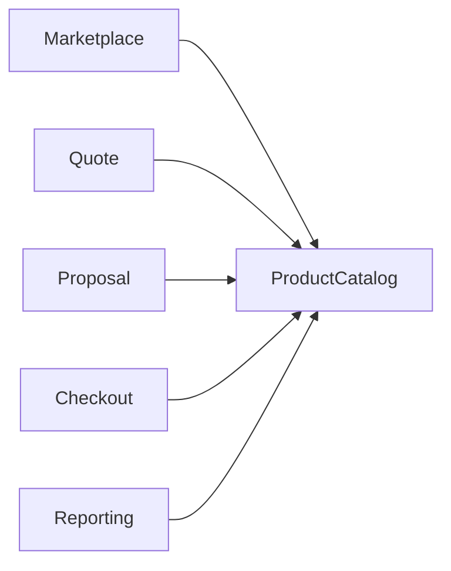

# TSD_PRODUCT_CATALOG.md

> **Technical Specification Document (TSD)**  
> **Project:** Pulse Engine  
> **Service:** Product Catalog Service  
> **Document Version:** 1.0  
> **Document Status:** Draft  
> **Technology Stack:** Java 25, Spring Boot 4.0.7, PostgreSQL, Redis, OAuth2, JWT  
> **Architecture:** Domain Driven Design (DDD), Hexagonal Architecture, Clean Architecture

---

# Document Information

| Item | Value |
| ------ | ------- |
| Project | Pulse Engine |
| Module | Product Catalog Service |
| Document Type | Technical Specification Document |
| Audience | Solution Architect, Backend Developer, Frontend Developer, QA Engineer, DevOps Engineer, Security Engineer, SRE |
| Related Documents | BRD, FSD, Architecture Decision Records (ADR) |
| Status | Draft |

---

# 1. Purpose

Dokumen ini merupakan **Technical Specification Document (TSD)** untuk Product Catalog Service.

Dokumen ini menjadi acuan implementasi teknis bagi seluruh engineering team dalam membangun Product Catalog Service secara konsisten sesuai Business Requirement Document (BRD) dan Functional Specification Document (FSD).

Dokumen ini tidak mendefinisikan kebutuhan bisnis baru maupun memperluas ruang lingkup yang telah ditetapkan pada BRD.

---

# 2. Goals

Tujuan dokumen ini adalah:

- Menjadi acuan implementasi backend.
- Menjadi referensi API bagi frontend dan consumer service.
- Menjadi referensi database engineer.
- Menjadi referensi DevOps deployment.
- Menjadi referensi QA dalam penyusunan test case.
- Menjadi referensi Security Engineer.
- Menjadi referensi Solution Architect untuk menjaga konsistensi implementasi.

---

# 3. Scope

Technical Specification ini mencakup implementasi teknis untuk:

- Insurance Company Management
- Product Management
- Product Configuration
- Product Query
- Product Versioning
- Audit Trail
- Security
- Validation
- Reporting API
- Integration API

---

# 4. Out of Scope

Dokumen ini **tidak** mencakup implementasi berikut karena berada di luar ruang lingkup Product Catalog Service.

- Premium Calculation
- Eligibility Engine
- Quote Engine
- Proposal Engine
- Checkout Process
- Payment
- Policy Issuance
- Underwriting
- Claims
- Campaign
- Notification

---

# 5. Document Reference

| Document | Description |
| ------------ | ---------------------------- |
| BRD | Business Requirement Document |
| FSD | Functional Specification Document |
| ADR | Architecture Decision Records |
| Coding Standard | Organization Technical Standard |
| Enterprise Standards | Enterprise Standards & Compliance Framework |
| Compliance Matrix | Compliance Implementation Matrix |

Prioritas referensi adalah:

```
BRD

↓

FSD

↓

ADR

↓

Enterprise Standards

↓

Technical Standard
```

Apabila terjadi konflik maka BRD menjadi referensi utama.

---

# 6. Target Technology

| Technology | Version |
| ------------ | ---------- |
| Java | 25 |
| Spring Boot | 4.0.7 |
| Spring Framework | 7 (dikelola Spring Boot 4.0.7) |
| Build Tool | Maven (Maven Wrapper) |
| PostgreSQL | 16+ (driver 42.7.11) |
| Redis | 7+ (Lettuce) |
| Flyway | 11.14.1 |
| OAuth2 | RFC 6749 |
| JWT | RFC 7519 |
| OpenAPI | 3.1 (springdoc-openapi 3.0.3) |
| Lombok | 1.18.46 |
| Testcontainers | 2.0.5 |
| Docker | Latest |
| Kubernetes | 1.30+ |
| Prometheus | Latest |
| OpenTelemetry | Latest |

---

# 7. Architecture Principles

Implementasi wajib mengikuti prinsip berikut.

- Domain Driven Design
- Hexagonal Architecture
- Clean Architecture
- SOLID
- Stateless Service
- Immutable DTO
- Constructor Injection
- Repository Pattern
- Separation of Concerns
- Single Responsibility Principle

---

# 8. Architectural Decisions

| Decision | Rationale |
| ----------- | ----------- |
| Hexagonal Architecture | Memisahkan domain dari teknologi |
| DDD | Menjaga Business Rule tetap berada pada Domain |
| REST API | Mendukung integrasi antar service |
| Spring Boot 4.0.7 | Framework aplikasi production-grade, modular, dan terkelola |
| Spring Data JPA | Persistence dengan repository pattern |
| Spring Security + OAuth2 Resource Server | Enterprise authentication & authorization |
| Spring Cache + Redis | Optimasi performa query |
| Flyway | Versioning database |
| OAuth2 + JWT | Enterprise authentication |
| Optimistic Locking | Mencegah lost update |
| Soft Delete | Menjaga histori data |
| Audit Trail | Kepatuhan terhadap audit |
| Testcontainers | Integration testing dengan container nyata |

---

# 9. High-Level Architecture

```mermaid
flowchart LR

subgraph Consumer

Marketplace

Quote Service

Proposal Service

Checkout Service

Reporting

end

Gateway

ProductCatalog

Redis

PostgreSQL

Marketplace --> Gateway

Quote Service --> Gateway

Proposal Service --> Gateway

Checkout Service --> Gateway

Reporting --> Gateway

Gateway --> ProductCatalog

ProductCatalog --> Redis

ProductCatalog --> PostgreSQL
```

---

# 10. System Responsibilities

## Product Catalog bertanggung jawab terhadap

- Insurance Company
- Product
- Coverage
- Benefit
- Exclusion
- Eligibility Configuration
- Premium Configuration
- Product Document
- Product Version
- Audit Trail

---

## Product Catalog tidak bertanggung jawab terhadap

- Premium Calculation
- Eligibility Decision
- Quote
- Proposal
- Checkout
- Payment
- Policy
- Underwriting

---

# 11. Design Principles

Seluruh implementasi mengikuti prinsip berikut.

## High Cohesion

Setiap module hanya memiliki satu tanggung jawab.

---

## Low Coupling

Tidak ada dependency langsung antar service melalui database.

---

## API First

Seluruh consumer menggunakan REST API.

---

## Domain Centric

Business Rule hanya berada pada Domain Layer.

---

## Immutable Version

Published Product tidak dapat dimodifikasi.

---

## Single Source of Truth

Seluruh metadata Product berasal dari Product Catalog.

---

# 12. System Context



---

# 13. Technical Objectives

Product Catalog harus memenuhi target berikut.

| Objective | Target |
| ------------ | -------- |
| Availability | ≥ 99.9% |
| Stateless | Yes |
| Horizontal Scaling | Yes |
| Audit | Mandatory |
| Versioning | Mandatory |
| Soft Delete | Mandatory |
| Cache | Redis |
| Authentication | OAuth2 |
| Authorization | JWT |
| Database Migration | Flyway |

---

# 14. Design Constraints

Implementasi harus memenuhi batasan berikut.

- Tidak boleh melakukan database sharing.
- Tidak boleh melakukan Premium Calculation.
- Tidak boleh melakukan Eligibility Validation.
- Tidak boleh menyimpan state pada memory aplikasi.
- Tidak boleh mengubah Published Product.
- Tidak boleh menghapus histori Product.

---

# 15. Assumptions

Dokumen ini hanya menggunakan asumsi apabila informasi tidak tersedia pada BRD maupun FSD.

Daftar asumsi akan dicatat secara eksplisit pada dokumen teknis terkait.

Apabila tidak dapat diturunkan dari BRD/FSD maka akan diberi status:

```
Requires Functional Clarification
```

---

# 16. Technical Risks

| Risk | Mitigation |
| -------- | ------------ |
| Duplicate Product | Unique Constraint |
| Concurrent Update | Optimistic Locking |
| Lost Audit | Append-only Audit Trail |
| Cache Stale | Cache Invalidation |
| Unauthorized Access | OAuth2 + JWT |
| Database Failure | PostgreSQL HA |
| High Read Traffic | Redis Cache |
| Compliance Violation | Audit Trail, Encryption, RBAC (see Section 7 below) |

---

# 17. Compliance & Security Architecture

Product Catalog Service harus memenuhi persyaratan compliance enterprise yang berlaku. Dokumen ini merujuk ke:

* [Enterprise Standards & Compliance Framework](../../../docs/16. ENTERPRISE_STANDARDS.md)
* [Compliance Implementation Matrix](../../../docs/18. COMPLIANCE_MATRIX.md)
* [Compliance Reference Guide](COMPLIANCE_REFERENCE.md)

## 17.1 Regulatory Compliance

### Indonesian Regulations

* **UU PDP No. 27/2022** - Perlindungan Data Pribadi
  * Data encryption at rest dan in transit (AES-256, TLS 1.3)
  * Audit trail untuk seluruh akses data (7 years retention)
  * Data retention policy (10 years untuk product version)
  * Consent management (jika applicable)

* **POJK No. 13/2017** - Penggunaan TI
  * Immutable audit trail untuk seluruh transaksi
  * IT risk management
  * Business continuity plan (RTO: 2h, RPO: 1h)
  * Incident management

* **POJK No. 69/2016** - Perusahaan Asuransi
  * Data security untuk informasi produk
  * Policy management standards

### International Standards

* **ISO/IEC 27001:2022** - ISMS
  * Access control (A.9)
  * Cryptography (A.10)
  * Operations security (A.12)
  * Incident management (A.16)
  * Business continuity (A.17)

* **ISO/IEC 22301:2019** - BCMS
  * Business impact analysis
  * RTO/RPO definition
  * Disaster recovery procedures

* **ISO 31000:2018** - Risk Management
  * Risk assessment
  * Risk treatment
  * Monitoring & review

## 17.2 Data Classification

| Data Type | Classification | Protection Requirements |
|-----------|---------------|-------------------------|
| Insurance Company Information | Internal | Access control, integrity checks |
| Product Information | Internal | Access control, integrity checks, backup |
| Product Configuration | Confidential | Encryption, RBAC, audit trail |
| Eligibility Configuration | Confidential | Encryption, RBAC, audit trail |
| Premium Configuration | Confidential | Encryption, RBAC, audit trail |
| Audit Trail | Restricted | End-to-end encryption, immutable storage |
| Product Version History | Confidential | Encryption, access control, backup |

## 17.3 Security Controls

### Preventive Controls

* Input validation (API Gateway + service level)
* SQL injection prevention (parameterized queries, JPA)
* XSS prevention (output encoding, CSP headers)
* CSRF prevention
* Rate limiting (API Gateway)
* OAuth 2.0 / JWT authentication
* RBAC authorization (principle of least privilege)
* Encryption: TLS 1.3 (transit), AES-256 (rest)

### Detective Controls

* Comprehensive audit logging
* Security monitoring (SIEM integration)
* Anomaly detection
* Real-time log analysis

### Corrective Controls

* Incident response procedures
* Regular backup with verified restore
* Patch management
* Automated access revocation

## 17.4 Audit Trail Requirements

### Events to be Logged

| Event Category | Events | Retention |
|----------------|--------|-----------|
| Authentication | Login, Logout, Failed login | 7 years |
| Authorization | Permission changes, Role assignments | 7 years |
| Data Access | Read, Write, Delete on Product data | 10 years |
| Business Transactions | Product Created, Updated, Published, Archived | 10 years |
| Configuration Changes | Coverage, Benefit, Exclusion, Eligibility, Premium changes | 7 years |
| System Events | Deployments, Configuration changes | 7 years |

### Audit Log Format

Setiap audit log harus mencakup:
* Timestamp dengan timezone
* Event ID (UUID)
* Event type dan severity
* Actor (user ID, service name, IP address)
* Action (operation, resource, resource ID)
* Outcome (status, message)
* Context (trace ID, correlation ID, business key)
* Compliance metadata (data classification, retention period, regulatory reference)

## 17.5 Data Protection

### Encryption Standards

* **Data at Rest:** AES-256 untuk database, HSM/KMS untuk key management
* **Data in Transit:** TLS 1.3 untuk external communication, mTLS untuk internal communication
* **Database Connection:** TLS 1.2 atau higher

### Data Retention

* Product Version History: 10 years (OJK regulation)
* Audit Trail: 7 years (UU PDP, OJK)
* Configuration History: 10 years (OJK regulation)
* Automated archival dan secure deletion procedures

## 17.6 Business Continuity

* **Availability Target:** ≥ 99.9%
* **RTO (Recovery Time Objective):** 2 hours
* **RPO (Recovery Point Objective):** 1 hour
* **Backup:** Daily automated backup dengan offsite storage
* **Disaster Recovery:** Warm site dengan asynchronous replication

## 17.7 ITIL 4 Alignment

* **Service Strategy:** Service catalog dan SLA definition
* **Service Design:** Architecture design dengan security by design
* **Service Transition:** Change management dengan CAB approval
* **Service Operation:** Event management, incident management, problem management
* **Continual Improvement:** Metrics, KPIs, improvement initiatives

---

# 17. Document Structure

Technical Specification dipecah menjadi beberapa dokumen agar lebih mudah dipelihara.

| Document | Description |
| ------------ | ---------------------------- |
| TSD_PRODUCT_CATALOG | Overview |
| TSD_01_ARCHITECTURE | Technical Architecture |
| TSD_02_DOMAIN_MODEL | Domain Model |
| TSD_03_DATABASE | Database Design |
| TSD_04_API | REST API Specification |
| TSD_05_BUSINESS_RULE_IMPLEMENTATION | Business Rule Mapping |
| TSD_06_WORKFLOW | Workflow & Sequence |
| TSD_07_VERSIONING | Versioning Strategy |
| TSD_08_CACHE | Redis Strategy |
| TSD_09_SECURITY | Security Design |
| TSD_10_ERROR_HANDLING | Exception Strategy |
| TSD_11_LOGGING | Logging Specification |
| TSD_12_OBSERVABILITY | Monitoring & Tracing |
| TSD_13_PERFORMANCE | Performance Design |
| TSD_14_INTEGRATION | Integration Design |
| TSD_15_CONFIGURATION | Configuration Management |
| TSD_16_DEPLOYMENT | Deployment Architecture |
| TSD_17_TESTING | Testing Strategy |
| TSD_18_NFR_MAPPING | NFR Implementation |
| TSD_19_TRACEABILITY | Requirement Traceability |
| APPENDIX | Reference |

---

# 18. Technical Deliverables

Dokumen Technical Specification ini akan menghasilkan artefak implementasi berikut.

- Architecture Diagram
- Component Diagram
- Deployment Diagram
- Domain Model
- ERD
- Flyway Migration
- OpenAPI Specification
- Package Structure
- Java Code Skeleton
- SQL DDL
- Sequence Diagram
- State Machine
- Security Model
- Cache Strategy
- Deployment Architecture
- Testing Strategy
- Traceability Matrix

---

# 19. Traceability Principle

Seluruh implementasi harus dapat ditelusuri hingga BRD.

```text
BRD

↓

FSD

↓

REST API

↓

Application Service

↓

Domain Model

↓

Repository

↓

Database

↓

Test Case
```

Tidak boleh ada implementasi yang tidak memiliki referensi requirement.

---

# 20. Requires Functional Clarification

Beberapa implementasi teknis memerlukan klarifikasi apabila tidak tersedia pada BRD/FSD.

Contoh:

- Retention period Audit Trail.
- API rate limit.
- Identity Provider yang digunakan.
- Backup retention policy.
- Kubernetes resource sizing.
- Timeout standar antar service.
- Secret Management platform.
- Monitoring threshold.
- Disaster Recovery Objective (RTO/RPO).

Implementasi terhadap area tersebut **tidak boleh diasumsikan** tanpa keputusan dari Business Owner atau Enterprise Architecture.

---

# 21. Compliance Documentation References

## 21.1 Enterprise Documentation

* [Enterprise Standards & Compliance Framework](../../../docs/16. ENTERPRISE_STANDARDS.md)
* [Compliance Implementation Matrix](../../../docs/18. COMPLIANCE_MATRIX.md)
* [Documentation Index](../../../docs/17. DOCUMENTATION_INDEX.md)

## 21.2 Service Documentation

* [Product Catalog BRD](../business_requirement_document.md)
* [Product Catalog FSD](FSD_PRODUCT_CATALOG/FSD_PRODUCT_CATALOG.md)
* [Compliance Reference Guide](COMPLIANCE_REFERENCE.md)

## 21.3 Regulatory References

1. UU No. 27 Tahun 2022 - Perlindungan Data Pribadi
2. POJK No. 13/2017 - Penggunaan Teknologi Informasi dan Sistem Informasi
3. POJK No. 69/2016 - Perusahaan Asuransi dan Reasuransi
4. ISO/IEC 27001:2022 - Information Security Management System
5. ISO/IEC 22301:2019 - Business Continuity Management System
6. ISO 31000:2018 - Risk Management

---

# 22. Compliance Contacts

| Role | Responsibility | Contact |
|------|---------------|---------|
| **CISO** | Security policy, incident response | security@example.com |
| **DPO** | Data protection, privacy compliance | dpo@example.com |
| **CRO** | Risk management, regulatory compliance | risk@example.com |
| **CTO** | Technology governance, BCP | cto@example.com |
| **Compliance Officer** | Regulatory reporting, audit coordination | compliance@example.com |
| **Product Catalog Team** | Product Catalog compliance implementation | product-catalog@example.com |

---

# 21. Next Documents

Dokumen berikutnya yang menjadi dasar implementasi adalah:

1. **TSD_01_ARCHITECTURE.md** — Technical Architecture, Hexagonal Architecture, Dependency Rules, Package Structure, Module Structure, Component Diagram, Deployment Diagram.
2. **TSD_02_DOMAIN_MODEL.md** — DDD Aggregate, Entity, Value Object, Domain Service, Domain Event, Aggregate Boundary, Lifecycle.
3. **TSD_03_DATABASE.md** — ERD, Physical Model, Flyway, SQL DDL, Index Strategy, Optimistic Locking, Soft Delete.

Dokumen-dokumen tersebut akan menjadi dasar implementasi seluruh source code Product Catalog Service.
