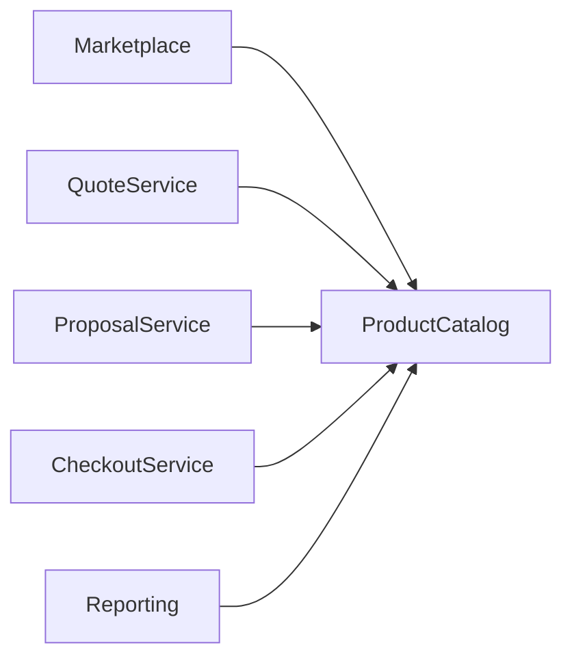

# Business Requirements Document (BRD)

# Product Catalog Service

| Document Information | Value                   |
| -------------------- | ----------------------- |
| Document             | PRODUCT_CATALOG_BRD     |
| Product              | Pulse Engine            |
| Module               | Product Catalog Service |
| Version              | 1.0                     |
| Status               | Draft                   |
| Owner                | Product Management      |
| Last Updated         | 04 August 2026          |

---

# BAB 1. Introduction

## 1.1 Purpose

Dokumen ini mendefinisikan kebutuhan bisnis untuk **Product Catalog Service** sebagai layanan master data produk pada Pulse Engine.

Product Catalog menjadi sumber informasi resmi (authoritative source) mengenai seluruh produk Personal Accident Insurance yang tersedia pada marketplace.

Dokumen ini digunakan sebagai acuan bagi Business Analyst, Product Owner, Solution Architect, Developer, QA, dan Integration Team.

---

## 1.2 Background

Marketplace Personal Accident Insurance memerlukan mekanisme pengelolaan produk yang konsisten agar seluruh proses bisnis menggunakan informasi produk yang sama.

Informasi tersebut meliputi:

* perusahaan asuransi
* produk
* coverage
* benefit
* exclusion
* eligibility configuration
* premium configuration
* product version

Product Catalog menyediakan pengelolaan data tersebut secara terpusat.

---

## 1.3 Business Problem

Tanpa Product Catalog yang terpusat akan terjadi:

* duplikasi informasi produk
* inkonsistensi data antar aplikasi
* sulit melakukan onboarding insurer baru
* sulit melakukan versioning
* sulit melakukan audit perubahan produk

---

## 1.4 Business Objectives

Product Catalog bertujuan untuk:

* menjadi sumber data resmi seluruh produk;
* menyediakan katalog produk yang konsisten;
* mendukung pengelolaan banyak perusahaan asuransi;
* mendukung versioning produk;
* menyediakan informasi produk bagi seluruh proses bisnis.

---

# BAB 2. Business Scope

## 2.1 In Scope

### Insurance Company Management

* Create Insurance Company
* Update Insurance Company
* Activate Insurance Company
* Deactivate Insurance Company

---

### Product Management

* Create Product
* Update Product
* Publish Product
* Archive Product
* Version Product

---

### Product Configuration

* Coverage
* Benefit
* Exclusion
* Eligibility Configuration
* Premium Configuration

---

### Product Search

* Product Detail
* Product List
* Product Search

---

## 2.2 Out of Scope

* Quote
* Proposal
* Checkout
* Payment
* Policy
* Notification

---

# BAB 3. Current Business Process (AS-IS)

Saat ini informasi produk berasal dari berbagai sumber yang berbeda.

Karakteristik proses saat ini:

* tidak memiliki master data terpusat;
* perubahan produk sulit ditelusuri;
* tidak terdapat versioning yang baku;
* informasi produk tidak selalu konsisten.

---

# BAB 4. Future Business Process (TO-BE)

```text id="m1gh6v"
Product Administrator

↓

Create Insurance Company

↓

Create Product

↓

Configure Product

↓

Review Product

↓

Publish Product

↓

Available for Marketplace
```

---

# BAB 5. Stakeholders

| Stakeholder           | Responsibility               |
| --------------------- | ---------------------------- |
| Product Owner         | Menentukan produk            |
| Product Administrator | Mengelola Product Catalog    |
| Insurance Partner     | Menyediakan informasi produk |
| Quote Service         | Menggunakan Product Catalog  |
| Proposal Service      | Menggunakan Product Catalog  |
| Checkout Service      | Menggunakan Product Catalog  |
| Customer Service      | Melihat informasi produk     |

---

# BAB 6. Business Requirements

## Insurance Company

### BR-001

Sistem harus dapat membuat perusahaan asuransi.

---

### BR-002

Sistem harus dapat memperbarui informasi perusahaan asuransi.

---

### BR-003

Sistem harus dapat mengaktifkan perusahaan asuransi.

---

### BR-004

Sistem harus dapat menonaktifkan perusahaan asuransi.

---

## Product

### BR-005

Sistem harus dapat membuat produk baru.

---

### BR-006

Sistem harus dapat memperbarui produk.

---

### BR-007

Sistem harus dapat melakukan publish produk.

---

### BR-008

Sistem harus dapat melakukan archive produk.

---

### BR-009

Sistem harus mendukung versioning produk.

---

## Product Configuration

### BR-010

Produk harus memiliki Coverage.

---

### BR-011

Produk harus memiliki Benefit.

---

### BR-012

Produk harus memiliki Exclusion.

---

### BR-013

Produk harus memiliki Eligibility Configuration.

---

### BR-014

Produk harus memiliki Premium Configuration.

---

## Product Search

### BR-015

Sistem harus menyediakan pencarian produk.

---

### BR-016

Sistem harus menyediakan detail produk.

---

### BR-017

Sistem harus menyediakan daftar produk berdasarkan status.

---

# BAB 7. Business Rules

| Rule ID | Business Rule                                                                           |
| ------- | --------------------------------------------------------------------------------------- |
| BR-001  | Hanya produk berstatus Published yang dapat digunakan oleh marketplace.                 |
| BR-002  | Produk Draft tidak dapat digunakan pada proses Quote.                                   |
| BR-003  | Produk Archived tidak dapat dipilih customer.                                           |
| BR-004  | Setiap perubahan produk menghasilkan Product Version baru.                              |
| BR-005  | Product Version sebelumnya tetap dapat direferensikan oleh transaksi yang telah dibuat. |
| BR-006  | Setiap produk harus memiliki minimal satu Coverage.                                     |
| BR-007  | Setiap produk harus memiliki minimal satu Benefit.                                      |
| BR-008  | Eligibility Configuration wajib tersedia sebelum Publish.                               |
| BR-009  | Premium Configuration wajib tersedia sebelum Publish.                                   |
| BR-010  | Seluruh perubahan produk harus tercatat dalam audit trail.                              |

---

# BAB 8. Business Data Requirements

## Insurance Company

* Company Code
* Company Name
* Status
* Effective Date

---

## Product

* Product Code
* Product Name
* Product Version
* Product Status
* Effective Date
* Expiry Date

---

## Coverage

* Coverage Name
* Coverage Amount
* Currency

---

## Benefit

* Benefit Name
* Benefit Description

---

## Exclusion

* Exclusion Description

---

## Eligibility Configuration

* Minimum Age
* Maximum Age
* Occupation Class
* Residency
* Nationality

---

## Premium Configuration

* Coverage Band
* Age Band
* Occupation Class
* Premium Value

---

# BAB 9. Reporting Requirements

## Operational Report

* Active Products
* Published Products
* Draft Products
* Archived Products

---

## Business Report

* Product by Insurance Company
* Product Growth
* Product Version History

---

## Audit Report

* Product Changes
* Publish History
* Product Activity

---

# BAB 10. Non Functional Requirements

| Category               | Requirement |
| ---------------------- | ----------- |
| Availability           | ≥ 99.9%     |
| Response Time          | ≤ 300 ms    |
| Audit Trail            | Mandatory   |
| Product Versioning     | Mandatory   |
| Authentication         | Required    |
| Authorization          | Required    |
| Horizontal Scalability | Required    |
| Backup                 | Daily       |
| Performance Target     | See Section 10.1 |
| Integration Pattern    | REST API    |

## 10.1 Performance Targets

| Metric | Target |
|--------|--------|
| Average Response Time | < 150 ms |
| P95 Response Time | < 300 ms |
| P99 Response Time | < 500 ms |
| Search Product | < 300 ms |
| Product Detail | < 300 ms |
| Create Product | < 500 ms |
| Publish Product | < 500 ms |
| Error Rate | < 1% |

## 10.2 Integration Architecture

Product Catalog menggunakan **REST API** sebagai standar integrasi antar service.

### Integration Principles

* **API First**: Seluruh consumer mengakses Product Catalog melalui REST API
* **Stateless**: Tidak ada session state di server
* **JSON**: Format data exchange
* **HTTPS**: Enkripsi komunikasi
* **OAuth2/JWT**: Authentication dan Authorization
* **No Database Sharing**: Consumer tidak mengakses database Product Catalog secara langsung
* **Single Source of Truth**: Product Catalog adalah satu-satunya sumber metadata produk

### Integration Pattern



### Consumer Responsibilities

Setiap consumer harus:

1. Menggunakan REST API untuk mengakses Product Catalog
2. Melakukan authentication menggunakan OAuth2/JWT
3. Menjalankan authorization sesuai RBAC
4. Menangani error response sesuai API contract
5. Tidak menyimpan cache data produk lebih dari TTL yang ditentukan
6. Tidak mengakses database Product Catalog secara langsung

---

# BAB 11. Assumptions, Constraints and Risks

## Assumptions

* Seluruh insurer telah terdaftar pada marketplace.
* Product Administrator memiliki hak pengelolaan produk.
* Product Catalog merupakan sumber data resmi untuk informasi produk.
* Semua consumer mengakses Product Catalog melalui REST API.
* Data eksisting akan dimigrasikan ke Product Catalog secara manual atau melalui batch migration.

---

## Constraints

* Product Catalog hanya melakukan master data management.
* Product Catalog tidak melakukan perhitungan premi.
* Product Catalog tidak melakukan evaluasi eligibility.
* Product Catalog tidak melakukan transaksi pembelian.
* Product Catalog tidak menyimpan data Quote, Proposal, Checkout, Payment, maupun Policy.
* Semua integrasi harus menggunakan REST API dengan HTTPS.

---

## Risks

| Risk                                        | Mitigation                                   |
| ------------------------------------------- | -------------------------------------------- |
| Perubahan produk saat transaksi berlangsung | Product Versioning                           |
| Informasi produk tidak lengkap              | Validasi sebelum Publish                     |
| Kesalahan konfigurasi produk                | Review sebelum Publish                       |
| Inkonsistensi data                          | Product Catalog sebagai authoritative source |
| Consumer tidak migrasi ke API               | API Gateway enforcement                      |
| Performance bottleneck                      | Redis Cache + Index Optimization             |

---

# BAB 12. Success Criteria

Implementasi Product Catalog dianggap berhasil apabila:

* seluruh produk dikelola melalui Product Catalog;
* seluruh consumer menggunakan Product Catalog sebagai sumber informasi produk;
* setiap perubahan produk menghasilkan versi baru;
* produk yang telah digunakan pada transaksi tetap dapat direferensikan melalui versioning;
* informasi produk konsisten pada seluruh proses bisnis Pulse Engine;
* seluruh perubahan produk dapat diaudit dan ditelusuri kembali;
* seluruh consumer mengakses Product Catalog melalui REST API (tidak ada database sharing).

---

# BAB 13. Compliance Requirements

## 13.1 Regulatory Compliance

Product Catalog harus memenuhi peraturan berikut:

* **UU PDP No. 27/2022** - Perlindungan Data Pribadi
* **POJK No. 13/2017** - Penggunaan TI dalam Penyelenggaraan Usaha Jasa Keuangan
* **POJK No. 69/2016** - Perusahaan Asuransi dan Reasuransi

## 13.2 International Standards

Product Catalog harus memenuhi standar internasional:

* **ISO/IEC 27001:2022** - Information Security Management System
* **ISO/IEC 22301:2019** - Business Continuity Management System
* **ISO 31000:2018** - Risk Management

## 13.3 Audit Requirements

* Seluruh perubahan data harus tercatat dalam audit trail
* Audit trail bersifat immutable
* Retention period mengikuti regulasi OJK dan UU PDP
* Semua akses data harus dapat ditelusuri

Lihat [Enterprise Standards & Compliance Framework](../../../docs/16. ENTERPRISE_STANDARDS.md) untuk detail lengkap.